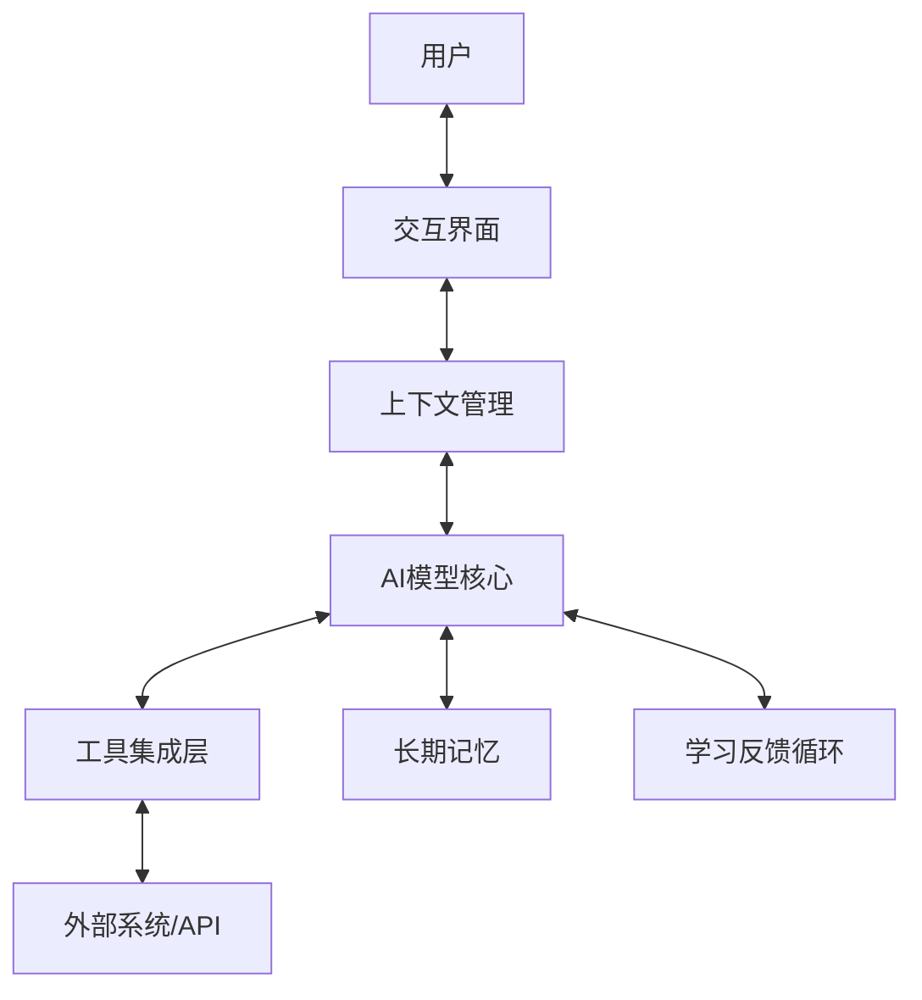
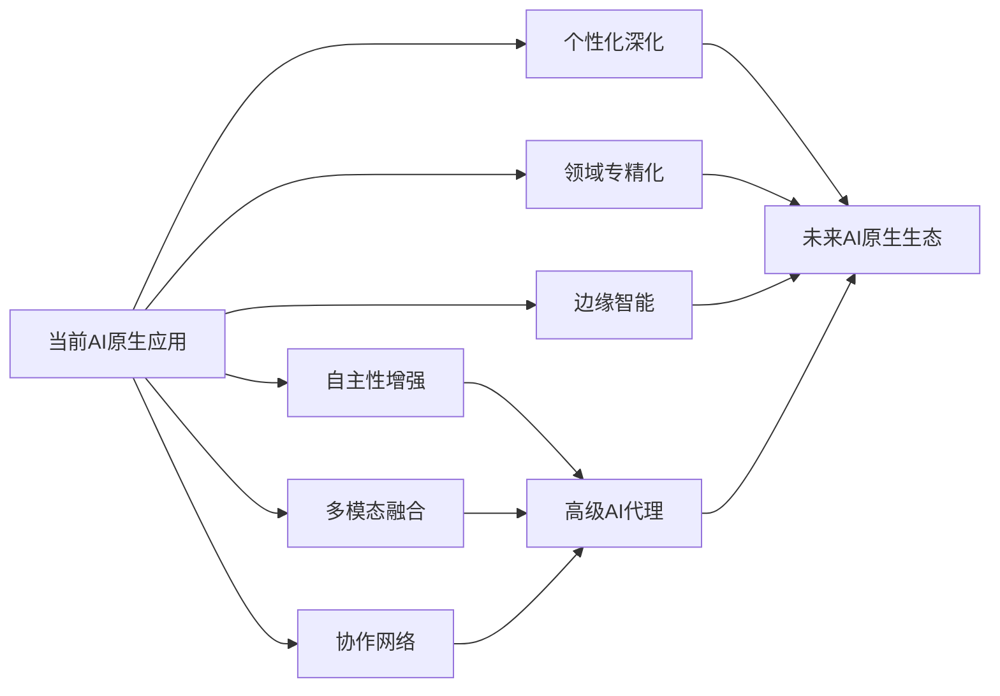
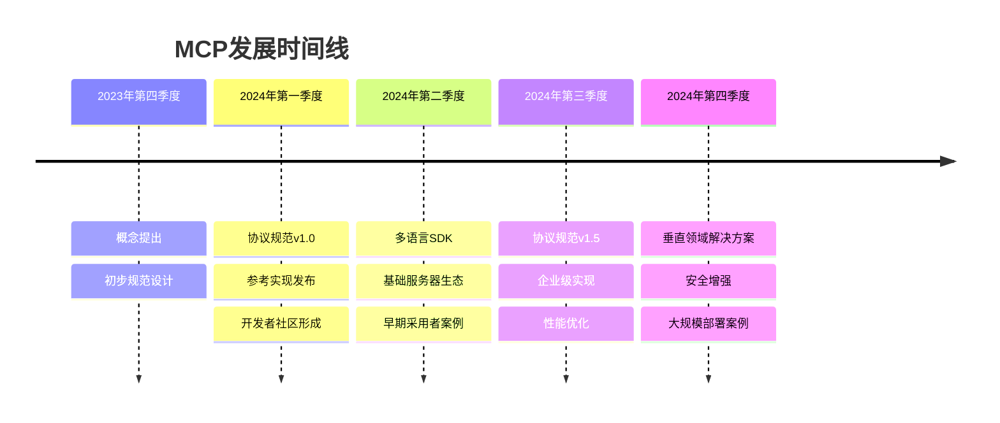
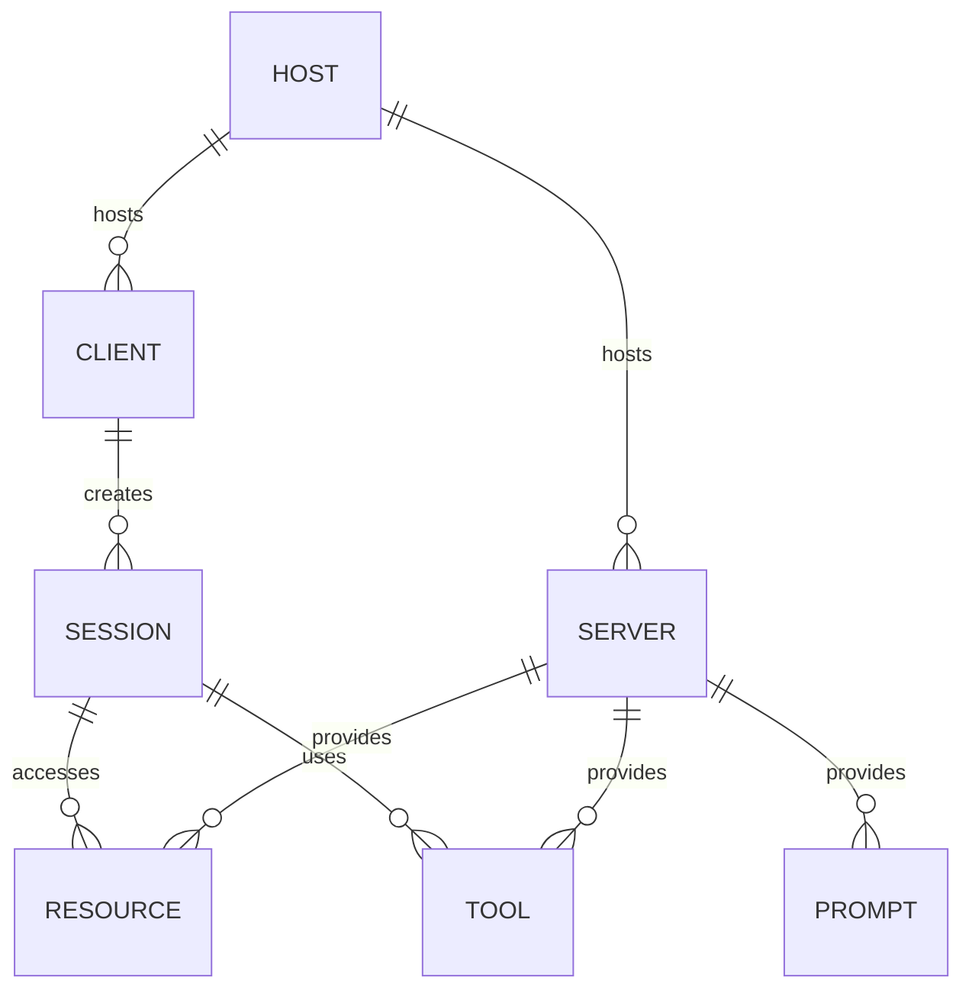
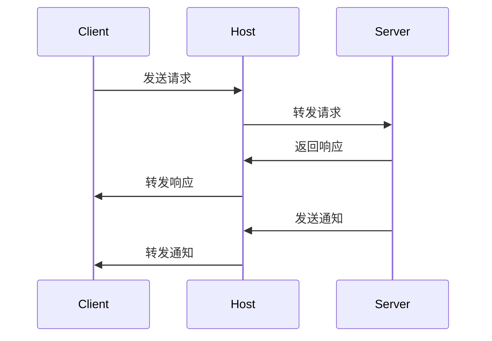
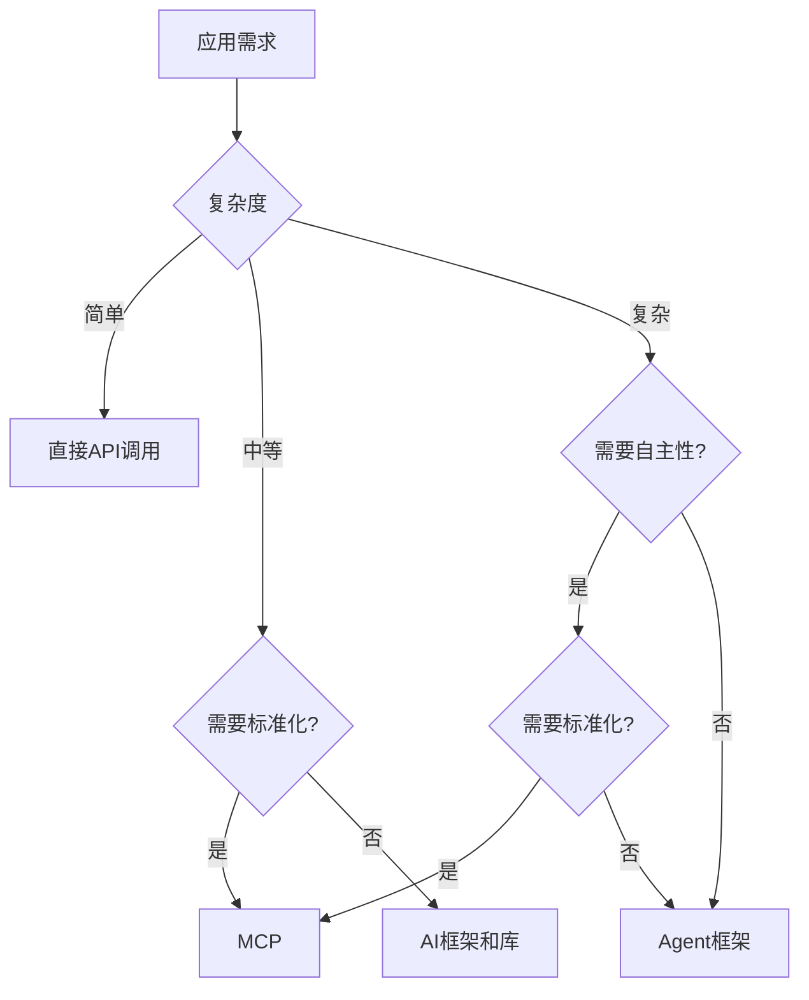
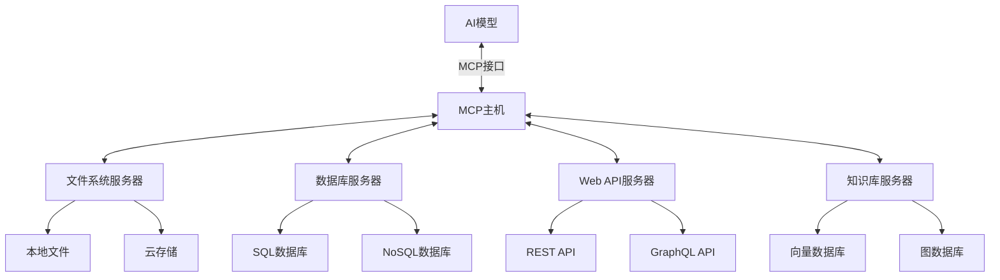
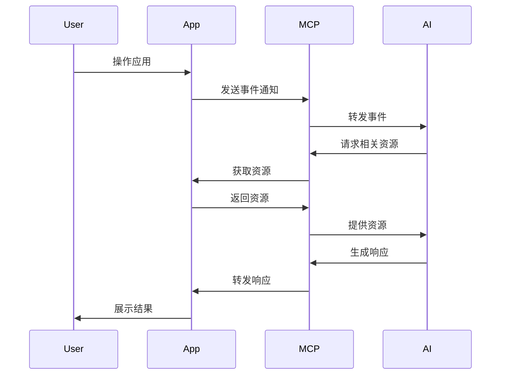
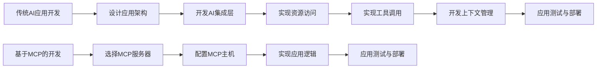
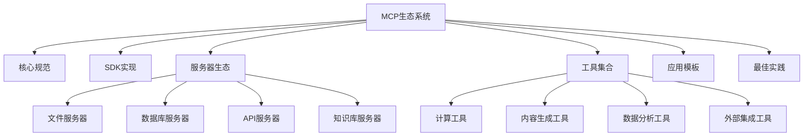

# 第一部分：MCP基础与架构

本部分将深入探讨模型上下文协议(MCP)的基础理论和架构设计。我们将从AI原生应用的发展历程入手，介绍MCP的核心概念、设计原则和架构模式，以及MCP如何解决AI与外部世界交互的关键问题。同时，我们还将探讨MCP的安全与隐私保护机制，为读者构建起对MCP的全面认识，奠定后续实践应用的理论基础。

# 第1章：MCP概述与AI原生应用

本章将介绍AI原生应用的发展历程、定义特性及面临的挑战与机遇，深入解析MCP的起源、核心理念与设计原则，并将MCP与其他AI集成方案进行对比。同时，我们将探讨MCP在AI原生应用中的关键角色，包括如何作为AI与外部世界的桥梁、解决上下文管理问题，以及对AI原生应用开发的重要意义。

## 1.1 AI原生应用发展历程

人工智能技术的发展正在深刻改变软件应用的设计、开发和使用方式。从传统应用到AI增强应用，再到如今的AI原生应用，这一演进过程不仅体现了技术的进步，更代表了应用设计理念的根本性转变。本节将梳理这一发展历程，探讨AI原生应用的定义、特性以及面临的挑战与机遇。

### 1.1.1 从传统应用到AI增强应用

传统软件应用的设计理念基于确定性逻辑和预定义规则，开发者需要明确定义每一个功能和流程。这种应用模式在处理结构化任务时表现出色，但在面对复杂、模糊或开放性问题时往往力不从心。

#### 传统应用的特点

1. **确定性逻辑**：基于"if-then-else"等条件语句构建，行为可预测且固定
2. **静态功能**：功能在开发阶段确定，后续变更需要重新编码和部署
3. **有限的适应性**：难以应对未预见的场景和需求变化
4. **专注于流程自动化**：主要目标是自动化已知的业务流程
5. **用户界面驱动**：通过预定义的界面元素与用户交互

传统应用的开发模式可以用以下数学模型表示：

$$A(i) = F(i)$$

其中，$A$ 表示应用，$i$ 表示输入，$F$ 表示预定义的函数或规则集。对于给定的输入 $i$，应用 $A$ 总是产生确定的输出 $F(i)$。

#### AI增强应用的兴起

随着机器学习技术的发展，特别是深度学习的突破，AI增强应用开始出现。这类应用在传统软件架构的基础上，集成了AI组件来处理特定任务，如图像识别、自然语言处理、推荐系统等。

AI增强应用的特点：

1. **混合架构**：传统代码与AI模型并存
2. **功能增强**：AI作为特定功能的增强组件
3. **有限的AI集成**：AI能力通常局限于特定领域或功能
4. **人工设计的AI接口**：需要专门设计接口来集成AI功能
5. **数据驱动的部分功能**：部分功能开始依赖于数据和模型，而非硬编码规则

AI增强应用的数学模型可表示为：

$$A(i) = F(i) + M(D, i')$$

其中，$F(i)$ 仍然代表传统的确定性功能，$M$ 表示AI模型，$D$ 是训练数据，$i'$ 是输入的子集，用于AI处理。

#### AI增强应用的发展阶段

AI增强应用的发展大致经历了以下几个阶段：

1. **早期探索阶段（2000-2010）**：
   - 简单的机器学习算法被应用于特定问题
   - 规则引擎与基础统计模型的结合
   - 代表性应用：基于协同过滤的推荐系统、垃圾邮件过滤器

2. **专业AI组件阶段（2010-2016）**：
   - 深度学习技术开始应用于商业软件
   - 专业AI组件处理特定任务（如图像识别、语音转文本）
   - 代表性应用：智能相册、语音助手初代产品

3. **多功能AI集成阶段（2016-2020）**：
   - 多个AI能力在同一应用中集成
   - API驱动的AI服务生态系统形成
   - 代表性应用：智能客服系统、内容创作辅助工具

4. **大型语言模型前集成阶段（2020-2022）**：
   - 预训练模型在应用中的广泛应用
   - AI能力从辅助功能向核心功能转变
   - 代表性应用：智能编辑器、高级虚拟助手

下表总结了传统应用与AI增强应用的主要区别：

| 特性 | 传统应用 | AI增强应用 |
|------|----------|------------|
| 核心逻辑 | 确定性规则 | 规则+模型混合 |
| 适应能力 | 有限，需重新编程 | 中等，模型可更新 |
| 数据依赖 | 低，主要用于存储 | 中高，需要训练数据 |
| 开发模式 | 瀑布式/敏捷开发 | 敏捷+MLOps |
| 用户交互 | 结构化，预定义 | 半结构化，部分自适应 |
| 更新方式 | 版本发布 | 版本发布+模型更新 |
| 可解释性 | 高，逻辑透明 | 中，部分黑盒 |

AI增强应用虽然在功能和适应性上有所提升，但仍然面临着一系列挑战：

1. **集成复杂性**：AI组件与传统代码的集成需要专门设计和维护
2. **能力孤岛**：不同AI功能之间难以协同工作
3. **上下文局限**：AI组件通常只能访问有限的应用上下文
4. **开发割裂**：AI模型开发与应用开发往往是分离的流程
5. **扩展困难**：难以灵活地扩展AI能力到新的应用场景

这些挑战为AI原生应用的出现奠定了背景，推动了应用架构的进一步演进。

### 1.1.2 AI原生应用的定义与特性

随着大型语言模型（LLM）等基础模型的突破性进展，一种全新的应用范式开始出现——AI原生应用。这种应用不再将AI视为附加组件，而是将AI能力作为核心基础设施，从根本上重新思考应用的设计、开发和使用方式。

#### AI原生应用的定义

AI原生应用是指**以AI模型为核心驱动力，将智能能力作为基础设施而非附加功能，能够理解、学习和适应用户需求及环境变化的新一代应用程序**。

这一定义包含几个关键要素：

1. **AI模型为核心**：AI不再是应用的一个组件，而是整个应用的中枢神经系统
2. **智能作为基础设施**：智能能力被视为基础设施，就像数据库或网络一样
3. **理解与学习**：能够理解用户意图并从交互中学习
4. **适应性**：能够适应不同场景和需求变化

#### AI原生应用的特性

AI原生应用具有以下核心特性：

1. **以意图为中心的交互**

   传统应用要求用户学习特定的操作流程，而AI原生应用则能够理解用户的高层意图，自动完成相应任务。用户可以用自然语言表达需求，应用负责理解并执行。

   ```
   传统应用：点击"文件"→点击"导出"→选择"PDF"→设置参数→点击"确定"
   AI原生应用："将这份报告导出为PDF并发送给市场团队"
   ```

2. **上下文感知与记忆能力**

   AI原生应用能够维护对话和操作的上下文，记住之前的交互历史，并在此基础上理解新的指令。这种能力使得交互更加自然和连贯。

   数学表示：
   $$R_t = f(I_t, C_t)$$
   
   其中，$R_t$ 是时间 $t$ 的响应，$I_t$ 是当前输入，$C_t$ 是累积的上下文信息。

3. **多模态理解与生成**

   AI原生应用能够理解和生成多种形式的内容，包括文本、图像、音频和视频等，并能在不同模态之间进行转换和融合。

4. **工具使用与环境交互**

   AI原生应用能够主动调用各种工具和API，与外部环境和系统进行交互，扩展自身的能力边界。

```python
# 示例：AI原生应用调用天气API的伪代码
def handle_weather_query(location, date):
    weather_data = weather_api.get_forecast(location, date)
    return analyze_and_summarize(weather_data, user_preferences)
```

5. **持续学习与适应**

   AI原生应用能够从用户交互和反馈中学习，不断改进自身的能力和表现，适应用户的个性化需求。

   $$M_{t+1} = M_t + \Delta(F_t)$$
   
   其中，$M_t$ 是时间 $t$ 的模型状态，$F_t$ 是用户反馈，$\Delta$ 是学习函数。

6. **自主决策与规划**

   高级AI原生应用能够进行自主决策和任务规划，将复杂目标分解为可执行的步骤，并根据情况调整计划。

   ```mermaid
   graph TD
       A[接收用户目标] --> B[分析目标]
       B --> C[制定执行计划]
       C --> D[执行步骤1]
       D --> E[评估结果]
       E -->|需要调整| C
       E -->|继续执行| F[执行步骤2]
       F --> G[完成目标]
   ```

7. **透明解释与可控性**

   AI原生应用能够解释自己的决策和行为，让用户理解并控制应用的智能行为。

8. **生成式用户界面**

   AI原生应用可能不再依赖预定义的用户界面元素，而是能够根据用户需求和上下文动态生成适当的交互界面。

AI原生应用的数学模型可以表示为：

$$A(i, c, f) = M(i, c, f, D, T)$$

其中，$A$ 表示应用，$i$ 是当前输入，$c$ 是上下文，$f$ 是反馈历史，$M$ 是AI模型，$D$ 是训练数据，$T$ 是可用工具集。

#### AI原生应用的架构模式

AI原生应用通常采用以下架构模式：

1. **模型中心架构**：以AI模型为中心，其他组件围绕模型提供支持和扩展
2. **上下文管理层**：专门负责维护和管理交互上下文
3. **工具集成层**：提供标准化的工具调用接口
4. **多模态处理管道**：处理不同类型的输入和输出
5. **反馈学习循环**：收集用户反馈并用于改进模型表现



#### AI原生应用与传统应用的对比

下表详细对比了AI原生应用与传统应用和AI增强应用的区别：

| 特性 | 传统应用 | AI增强应用 | AI原生应用 |
|------|----------|------------|------------|
| 核心驱动力 | 确定性代码 | 代码+有限AI | AI模型 |
| 交互模式 | 命令式 | 混合式 | 意图式 |
| 适应能力 | 低 | 中 | 高 |
| 上下文管理 | 有限/会话级 | 部分/功能级 | 全面/应用级 |
| 工具使用 | 预编程 | 有限集成 | 动态调用 |
| 学习能力 | 无 | 有限/离线 | 持续/在线 |
| 开发模式 | 功能开发 | 功能+模型 | 能力设计 |
| 更新方式 | 版本发布 | 混合更新 | 持续进化 |
| 可扩展性 | 需重编码 | 部分可扩展 | 高度可扩展 |
| 用户界面 | 静态预定义 | 部分动态 | 高度动态/生成式 |

### 1.1.3 AI原生应用的挑战与机遇

AI原生应用代表了软件开发的新范式，带来了巨大的机遇，同时也面临着一系列挑战。理解这些挑战与机遇对于成功开发和部署AI原生应用至关重要。

#### 技术挑战

1. **上下文管理复杂性**

   AI原生应用需要管理丰富的上下文信息，包括对话历史、用户偏好、环境状态等。随着交互的深入，上下文信息会不断积累，如何高效地存储、更新和检索这些信息是一个重要挑战。

```python
# 上下文管理的复杂性示例
class ContextManager:
    def __init__(self):
        self.conversation_history = []
        self.user_preferences = {}
        self.environment_state = {}
        self.active_tools = {}
        self.memory = LongTermMemory()
    
    def update_context(self, new_input, system_response, tool_results):
        # 更新各种上下文信息
        # 处理上下文长度限制
        # 决定哪些信息需要保留或丢弃
        pass
```

2. **工具调用标准化**

   AI原生应用需要调用各种工具和API来扩展其能力。如何定义统一的工具调用接口，处理参数验证、错误处理和结果解析，是一个需要标准化解决的问题。

3. **资源访问控制**

   AI模型需要访问各种资源（文件、数据库、API等），如何在保证安全的前提下提供灵活的资源访问机制，是AI原生应用面临的重要挑战。

   ```mermaid
   graph TD
       A[AI模型] -->|请求访问| B[访问控制层]
       B -->|验证权限| C{权限检查}
       C -->|允许| D[资源访问]
       C -->|拒绝| E[访问拒绝]
       D --> F[资源使用]
       F --> G[结果返回]
       G --> A
   ```

4. **性能与延迟**

   AI模型的推理通常需要大量计算资源，如何在保证响应速度的同时提供高质量的AI能力，是AI原生应用需要解决的技术挑战。

   $$T_{response} = T_{model} + T_{context} + T_{tools} + T_{processing}$$

   其中，$T_{response}$ 是总响应时间，$T_{model}$ 是模型推理时间，$T_{context}$ 是上下文处理时间，$T_{tools}$ 是工具调用时间，$T_{processing}$ 是结果处理时间。

5. **多模态融合**

   处理和融合文本、图像、音频等多种模态的信息，需要复杂的技术架构和处理流程。

6. **可解释性与透明度**

   AI原生应用的决策过程往往不如传统应用透明，如何提供足够的可解释性，让用户理解和信任应用的行为，是一个重要挑战。

#### 开发挑战

1. **开发范式转变**

   AI原生应用的开发需要全新的思维方式和开发流程，从编写确定性代码转变为设计智能能力和交互模式。

   ```
   传统开发：设计功能 → 编写代码 → 测试功能 → 部署应用
   AI原生开发：定义能力 → 设计提示 → 集成工具 → 优化交互 → 持续学习
   ```

2. **测试与质量保障**

   AI原生应用的行为具有一定的不确定性，难以用传统的测试方法进行全面验证。如何设计有效的测试策略和质量保障机制，是开发者面临的挑战。

3. **开发工具不成熟**

   支持AI原生应用开发的工具和框架还不够成熟，缺乏标准化的开发环境和最佳实践。

4. **跨学科知识要求**

   开发AI原生应用需要同时具备软件工程、机器学习、人机交互等多领域的知识和技能。

#### 商业与伦理挑战

1. **商业模式创新**

   AI原生应用可能需要新的定价和商业模式，传统的一次性购买或订阅模式可能需要调整。

2. **成本控制**

   AI模型的训练和推理成本较高，如何在提供高质量服务的同时控制成本，是商业化面临的挑战。

3. **隐私保护**

   AI原生应用需要处理大量用户数据，如何在提供个性化服务的同时保护用户隐私，是一个重要的伦理和法律挑战。

4. **责任与问责**

   当AI原生应用做出错误决策或产生有害内容时，如何确定责任归属和问责机制，是需要解决的社会问题。

5. **公平性与偏见**

   确保AI原生应用对不同用户群体提供公平的服务，避免放大现有的社会偏见，是一个重要的伦理挑战。

#### 机遇

尽管面临诸多挑战，AI原生应用也带来了前所未有的机遇：

1. **用户体验革新**

   AI原生应用能够提供更自然、更个性化的用户体验，大幅降低使用门槛，扩大应用的受众范围。

2. **生产力提升**

   通过自动化复杂任务和提供智能辅助，AI原生应用能够显著提升用户的工作效率和创造力。

3. **新市场开拓**

   AI原生应用能够满足传统应用难以满足的需求，开创全新的市场空间和商业机会。

4. **个性化服务深化**

   基于对用户需求和偏好的深入理解，AI原生应用能够提供高度个性化的服务和体验。

5. **创新能力扩展**

   AI原生应用能够帮助用户突破认知限制，激发新的创意和解决方案。

6. **跨领域融合**

   AI原生应用能够打破不同领域之间的壁垒，促进知识和能力的跨领域融合。

#### 未来发展趋势

AI原生应用的发展趋势可以概括为以下几个方向：

1. **自主性增强**：从辅助工具向自主代理演进
2. **多模态深度融合**：文本、图像、音频、视频等多模态能力的无缝集成
3. **协作网络形成**：多个AI原生应用之间形成协作网络，共同解决复杂问题
4. **个性化深化**：基于深度学习的高度个性化体验
5. **领域专精化**：针对特定领域的专业AI原生应用
6. **边缘智能普及**：AI能力向边缘设备扩展，减少对云端的依赖



#### 成功案例分析

以下是几个AI原生应用的成功案例，展示了这一新范式的潜力：

1. **GitHub Copilot**
   - 核心价值：将AI能力深度集成到开发环境中，提供上下文感知的代码建议
   - 成功因素：理解编程上下文，学习用户编码风格，提供实时辅助

2. **Notion AI**
   - 核心价值：将AI写作和内容生成能力融入知识管理平台
   - 成功因素：上下文感知的内容生成，与现有工作流的无缝集成

3. **Midjourney**
   - 核心价值：通过自然语言描述生成高质量图像
   - 成功因素：强大的多模态理解能力，迭代反馈机制

这些案例展示了AI原生应用的核心特性和价值主张，为未来的发展提供了有益的参考。

## 1.2 MCP（模型上下文协议）简介

随着AI原生应用的兴起，如何有效地管理AI模型与外部世界的交互成为一个关键挑战。模型上下文协议(Model Context Protocol, MCP)应运而生，旨在提供一个标准化的框架，使AI模型能够以一致、安全、高效的方式与各种资源和工具进行交互。本节将介绍MCP的起源与发展、核心理念与设计原则，以及与其他AI集成方案的对比。

### 1.2.1 MCP的起源与发展

#### MCP的起源背景

MCP的出现源于对解决AI原生应用开发中几个核心问题的需求：

1. **上下文管理混乱**：不同应用使用不同的方式管理AI模型的上下文，导致开发复杂性增加
2. **工具调用不统一**：缺乏标准化的工具调用接口，使得AI模型难以一致地使用外部工具
3. **资源访问缺乏规范**：AI模型访问外部资源（如文件、数据库）的方式各不相同，难以管理和控制
4. **安全边界模糊**：模型与外部系统的交互缺乏明确的安全边界，增加了安全风险

在这一背景下，开发者社区开始探索一种标准化的协议，以解决这些问题并简化AI原生应用的开发。

#### MCP的早期探索

MCP的概念最初源于大型语言模型(LLM)工具调用能力的标准化尝试。早期的探索主要集中在以下几个方面：

1. **函数调用规范**：定义LLM如何描述和调用外部函数的标准格式
2. **工具使用框架**：如LangChain、AutoGPT等框架对工具使用的抽象
3. **Agent协议**：定义AI代理与环境交互的协议尝试

这些早期探索为MCP的形成奠定了基础，但它们通常只解决了部分问题，缺乏全面的架构视角。

#### MCP的正式提出

MCP作为一个完整的协议框架于2023年底正式提出，其初始设计借鉴了以下几个领域的经验：

1. **Web API设计**：RESTful API和GraphQL等Web API设计理念
2. **微服务架构**：服务发现、API网关等微服务设计模式
3. **插件系统**：浏览器插件、IDE插件等可扩展系统的架构
4. **安全沙箱**：容器技术、浏览器沙箱等隔离机制

MCP的初始版本定义了基本的通信模型、资源抽象和工具调用接口，为AI原生应用提供了一个统一的交互框架。

#### MCP的演进历程

MCP从提出到成熟经历了几个关键阶段：

1. **概念阶段（2023年底）**：
   - 核心概念和基本架构的提出
   - 初步的协议规范草案
   - 小规模的概念验证实现

2. **标准化阶段（2024年初）**：
   - 协议规范的正式发布
   - 核心组件的参考实现
   - 开发者社区的初步形成

3. **生态发展阶段（2024年中）**：
   - 多语言SDK的出现
   - 各类MCP服务器的开发
   - 与主流AI框架的集成

4. **企业采用阶段（2024年底）**：
   - 企业级MCP实现和最佳实践
   - 安全和性能优化
   - 垂直领域解决方案

MCP的发展时间线可以用下图表示：



#### MCP的关键里程碑

MCP发展过程中的几个关键里程碑：

1. **MCP规范v1.0**：定义了基本的通信模型、资源抽象和工具调用接口
2. **Python MCP SDK**：第一个完整的MCP客户端和服务器SDK
3. **文件系统MCP服务器**：第一个广泛使用的标准MCP服务器实现
4. **MCP安全框架**：定义了MCP的安全模型和最佳实践，解决了权限控制和资源隔离问题
5. **MCP规范v1.5**：增加了事件通知、会话管理和多服务器协作等高级功能
6. **企业MCP平台**：首个面向企业的完整MCP实现，包括管理、监控和治理功能

#### MCP的标准化组织

为了确保MCP的开放性和可持续发展，2024年初成立了MCP标准工作组，负责协议规范的制定和演进。该工作组由以下几类成员组成：

1. **技术公司代表**：主要AI平台和工具提供商
2. **开源社区代表**：开源AI框架和工具的维护者
3. **学术界代表**：人工智能和软件工程领域的研究者
4. **行业用户代表**：采用MCP的企业和组织

工作组采用开放治理模式，所有规范和决策过程对社区透明，确保MCP能够广泛代表各方利益并获得广泛采用。

### 1.2.2 MCP的核心理念与设计原则

MCP的设计基于一系列核心理念和原则，这些原则指导了协议的架构和实现，确保其能够有效解决AI原生应用开发中的关键挑战。

#### 核心理念

1. **模型与环境分离**

   MCP的核心理念是将AI模型与其运行环境明确分离，通过标准化的接口进行交互。这种分离使得模型可以专注于理解和生成，而环境负责提供资源访问和工具能力。

   ```mermaid
   graph LR
       A[AI模型] <-->|MCP接口| B[运行环境]
       B --> C[资源]
       B --> D[工具]
       B --> E[外部系统]
   ```

2. **上下文即资源**

   MCP将上下文视为一种资源，可以被创建、读取、更新和删除。这种资源化的视角使得上下文管理变得更加结构化和可控。

3. **能力即服务**

   MCP将各种能力（如文件操作、数据查询、API调用等）视为服务，通过服务发现和注册机制，使模型能够动态发现和使用这些能力。

4. **安全优先设计**

   MCP从设计之初就将安全性作为核心考量，通过明确的权限模型和隔离机制，确保AI模型的行为在可控范围内。

#### 设计原则

1. **简单性原则**

   MCP追求设计上的简单性，避免不必要的复杂性。协议的核心部分保持精简，只包含必要的概念和机制。

```python
# MCP简单性原则的体现：简洁的资源操作接口
# 创建资源
resource_id = mcp.create_resource("file", {"path": "/path/to/file"})

# 读取资源
content = mcp.read_resource(resource_id)

# 更新资源
mcp.update_resource(resource_id, new_content)

# 删除资源
mcp.delete_resource(resource_id)
```

2. **可扩展性原则**

   MCP设计为可扩展的协议，能够适应不断发展的AI能力和应用需求。协议定义了扩展点和版本控制机制，使其能够平滑演进。

3. **互操作性原则**

   MCP强调不同实现之间的互操作性，确保基于MCP的应用和组件能够无缝协作，避免生态系统碎片化。

4. **最小权限原则**

   MCP遵循最小权限原则，模型只能访问完成任务所需的最小资源集合，减少潜在的安全风险。

   ```python
   # 最小权限原则示例：明确指定权限范围
   session = mcp.create_session(
       permissions=[
           {"resource": "file", "path": "/data", "operations": ["read"]},
           {"resource": "api", "endpoint": "weather", "operations": ["call"]}
       ]
   )
   ```

5. **可审计性原则**

   MCP设计支持全面的审计和监控，所有关键操作都可以被记录和检查，增强系统的透明度和可信度。

6. **渐进式采用原则**

   MCP支持渐进式采用，开发者可以从小规模集成开始，逐步扩展到更复杂的场景，降低采用门槛。

#### MCP的核心概念模型

MCP定义了以下核心概念，构成了协议的基础：

1. **主机(Host)**：提供MCP运行环境的系统，负责协调客户端和服务器之间的通信
2. **客户端(Client)**：通常是AI模型或应用，通过MCP接口请求资源和工具
3. **服务器(Server)**：提供特定资源或工具能力的组件，响应客户端的请求
4. **资源(Resource)**：可被访问和操作的实体，如文件、数据库记录、API等
5. **工具(Tool)**：可被调用执行特定功能的组件，如计算、转换、生成等
6. **会话(Session)**：客户端与服务器之间的交互上下文，包含权限和状态信息
7. **提示(Prompt)**：结构化的模板，用于指导模型生成特定格式或内容的输出

这些概念之间的关系可以用以下实体关系图表示：



#### MCP的通信模型

MCP采用基于JSON-RPC 2.0的通信协议，支持请求-响应和通知两种模式：

1. **请求-响应模式**：客户端发送请求，服务器处理后返回响应
2. **通知模式**：服务器主动向客户端发送事件通知，无需客户端请求

MCP的通信流程可以用以下时序图表示：



MCP支持多种传输层实现，包括：

1. **标准输入/输出(stdio)**：适用于本地进程间通信
2. **HTTP/WebSocket**：适用于网络通信
3. **Server-Sent Events(SSE)**：适用于服务器推送事件

#### MCP的资源模型

MCP将各种外部实体抽象为资源，定义了统一的资源操作接口：

1. **资源创建(create)**：创建新的资源实例
2. **资源读取(read)**：获取资源的内容或状态
3. **资源更新(update)**：修改资源的内容或状态
4. **资源删除(delete)**：移除资源实例
5. **资源列表(list)**：获取可用资源的列表
6. **资源搜索(search)**：根据条件查找资源

资源由唯一标识符(URI)标识，并具有类型、元数据和内容等属性。

```json
// 资源表示示例
{
  "id": "file:///data/document.txt",
  "type": "file",
  "metadata": {
    "size": 1024,
    "created": "2024-04-01T10:30:00Z",
    "modified": "2024-04-02T15:45:00Z",
    "mime_type": "text/plain"
  },
  "content": "文件内容..."
}
```

#### MCP的工具模型

MCP将功能性操作抽象为工具，定义了工具调用的标准接口：

1. **工具发现(discover)**：获取可用工具的列表和描述
2. **工具调用(invoke)**：执行工具功能并获取结果
3. **工具状态查询(status)**：查询异步工具执行的状态
4. **工具执行取消(cancel)**：取消正在执行的工具调用

工具定义包括名称、描述、参数模式和返回值模式等信息。

```json
// 工具定义示例
{
  "name": "weather.forecast",
  "description": "获取指定位置的天气预报",
  "parameters": {
    "type": "object",
    "properties": {
      "location": {
        "type": "string",
        "description": "位置名称或坐标"
      },
      "days": {
        "type": "integer",
        "description": "预报天数",
        "default": 3
      }
    },
    "required": ["location"]
  },
  "returns": {
    "type": "object",
    "properties": {
      "forecast": {
        "type": "array",
        "items": {
          "type": "object",
          "properties": {
            "date": { "type": "string" },
            "temperature": { "type": "number" },
            "condition": { "type": "string" }
          }
        }
      }
    }
  }
}
```

#### MCP的提示模型

MCP定义了结构化的提示模板，用于指导模型生成特定格式或内容的输出：

1. **提示获取(get)**：获取特定场景的提示模板
2. **提示渲染(render)**：使用参数渲染提示模板
3. **提示版本(versions)**：获取提示模板的版本信息

提示模板包括模板文本、参数定义和元数据等信息。

```json
// 提示模板示例
{
  "id": "email.reply",
  "version": "1.0",
  "description": "生成电子邮件回复",
  "template": "你需要回复以下电子邮件：\n\n{{email_content}}\n\n请以专业的语气撰写回复，考虑以下要点：{{reply_points}}",
  "parameters": {
    "type": "object",
    "properties": {
      "email_content": {
        "type": "string",
        "description": "原始电子邮件内容"
      },
      "reply_points": {
        "type": "array",
        "description": "回复中需要包含的要点",
        "items": { "type": "string" }
      }
    },
    "required": ["email_content"]
  }
}
```

### 1.2.3 MCP与其他AI集成方案的对比

随着AI技术的发展，出现了多种将AI能力集成到应用中的方案。本节将MCP与其他主要的AI集成方案进行对比，分析各自的优势、局限性和适用场景。

#### 主要AI集成方案概述

1. **直接API调用**

   最基本的集成方式是直接调用AI模型提供商的API，如OpenAI API、Anthropic API等。

   ```python
   # 直接API调用示例
   import openai
   
   response = openai.ChatCompletion.create(
       model="gpt-4",
       messages=[
           {"role": "system", "content": "You are a helpful assistant."},
           {"role": "user", "content": "Tell me about MCP."}
       ]
   )
   ```

2. **AI框架和库**

   各种AI框架和库提供了更高级的抽象，如LangChain、LlamaIndex等，简化了AI能力的集成。

   ```python
   # LangChain示例
   from langchain.llms import OpenAI
   from langchain.agents import load_tools, initialize_agent
   
   llm = OpenAI(temperature=0)
   tools = load_tools(["serpapi", "llm-math"], llm=llm)
   agent = initialize_agent(tools, llm, agent="zero-shot-react-description")
   
   agent.run("What was the high temperature in SF yesterday?")
   ```

3. **插件系统**

   一些AI平台提供了插件系统，允许第三方开发者扩展AI模型的能力，如ChatGPT插件、Claude Artifacts等。

4. **函数调用API**

   模型提供商开始提供函数调用API，允许模型以结构化方式调用预定义的函数，如OpenAI Function Calling、Anthropic Tools等。

   ```python
   # OpenAI函数调用示例
   response = openai.ChatCompletion.create(
       model="gpt-4",
       messages=[
           {"role": "user", "content": "What's the weather like in Boston?"}
       ],
       functions=[
           {
               "name": "get_weather",
               "description": "Get the current weather in a given location",
               "parameters": {
                   "type": "object",
                   "properties": {
                       "location": {
                           "type": "string",
                           "description": "The city and state, e.g. San Francisco, CA"
                       }
                   },
                   "required": ["location"]
               }
           }
       ]
   )
   ```

5. **Agent框架**

   专注于构建自主AI代理的框架，如AutoGPT、BabyAGI等，提供了任务规划和执行的能力。

#### 各方案的比较分析

下表对比了MCP与其他AI集成方案的主要特性：

| 特性 | 直接API调用 | AI框架和库 | 插件系统 | 函数调用API | Agent框架 | MCP |
|------|------------|-----------|---------|------------|-----------|-----|
| 标准化程度 | 低 | 中 | 中 | 中 | 低 | 高 |
| 上下文管理 | 手动 | 部分自动 | 有限 | 有限 | 部分自动 | 全面自动 |
| 资源抽象 | 无 | 部分 | 有限 | 无 | 部分 | 完整 |
| 工具调用 | 手动集成 | 框架特定 | 平台特定 | 结构化 | 框架特定 | 标准化 |
| 安全控制 | 有限 | 有限 | 平台控制 | 有限 | 有限 | 完整模型 |
| 可扩展性 | 低 | 中 | 中 | 中 | 中 | 高 |
| 互操作性 | 低 | 低 | 低 | 中 | 低 | 高 |
| 开发复杂度 | 高 | 中 | 中 | 中 | 高 | 低 |
| 供应商锁定 | 高 | 中 | 高 | 高 | 中 | 低 |
| 部署灵活性 | 低 | 中 | 低 | 低 | 中 | 高 |

#### 各方案的优势与局限性

1. **直接API调用**
   - 优势：简单直接，控制粒度细
   - 局限性：缺乏抽象，上下文管理复杂，与特定供应商绑定

2. **AI框架和库**
   - 优势：提供更高级抽象，简化常见任务
   - 局限性：框架特定的抽象，互操作性差，学习曲线陡峭

3. **插件系统**
   - 优势：易于分发，平台提供安全保障
   - 局限性：平台特定，开发者控制有限，依赖平台策略

4. **函数调用API**
   - 优势：结构化工具调用，与模型深度集成
   - 局限性：供应商特定，资源访问有限，缺乏标准化

5. **Agent框架**
   - 优势：支持自主任务规划和执行
   - 局限性：架构复杂，安全控制有限，互操作性差

6. **MCP**
   - 优势：标准化接口，完整的资源和工具抽象，强安全模型，高互操作性
   - 局限性：相对新兴，生态系统仍在发展，初始学习成本

#### 适用场景分析

不同的AI集成方案适合不同的应用场景：

1. **直接API调用**：适合简单的AI集成需求，如基本的文本生成、分类等
2. **AI框架和库**：适合中等复杂度的AI应用，需要一定程度的抽象但不需要高度定制
3. **插件系统**：适合希望快速分发到特定平台的扩展功能
4. **函数调用API**：适合需要结构化工具调用但不需要复杂资源访问的场景
5. **Agent框架**：适合需要自主任务规划和执行的复杂代理系统
6. **MCP**：适合企业级AI原生应用，需要标准化、安全、可扩展的AI集成架构

#### MCP的差异化优势

MCP相比其他方案的核心差异化优势包括：

1. **统一的资源抽象**：MCP提供了统一的资源抽象层，使AI模型能够以一致的方式访问各种外部资源
2. **标准化的工具接口**：MCP定义了标准化的工具发现和调用接口，简化了工具集成
3. **完整的安全模型**：MCP内置了完整的安全模型，包括权限控制、资源隔离和审计机制
4. **供应商中立**：MCP是开放标准，不绑定特定的AI模型或平台提供商
5. **可组合性**：MCP服务器可以自由组合，构建复杂的能力网络
6. **生命周期管理**：MCP提供了完整的会话生命周期管理，简化了状态维护



#### 案例对比：文档问答系统

为了具体说明各方案的差异，以下是使用不同方案实现文档问答系统的对比：

1. **直接API调用**：
   - 需要手动加载文档、分割文本、构建上下文
   - 需要自行管理文档存储和检索
   - 每次查询都需要重新构建上下文

2. **使用LangChain**：
   - 使用内置的文档加载器和文本分割器
   - 使用向量存储进行相似性搜索
   - 使用链式结构组合文档检索和问答

3. **使用MCP**：
   - 使用标准化的文档资源服务器
   - 使用统一的资源搜索接口
   - 会话维护文档上下文
   - 可以无缝切换不同的存储后端

```python
# MCP实现文档问答的示例代码
import mcp

# 创建MCP会话
session = mcp.create_session()

# 连接文档服务器
doc_server = session.connect_server("document-server")

# 加载文档集合
collection_id = doc_server.create_resource("collection", {
    "name": "技术文档",
    "description": "产品技术文档集合"
})

# 上传文档
doc_server.create_resource("document", {
    "collection_id": collection_id,
    "name": "用户手册.pdf",
    "content": file_content
})

# 搜索相关文档
results = doc_server.search_resource("document", {
    "collection_id": collection_id,
    "query": "如何配置网络设置",
    "limit": 5
})

# 使用文档上下文回答问题
answer = session.generate_text(
    "基于以下文档片段回答问题：\n" +
    "\n".join([r["content"] for r in results]) +
    "\n\n问题：如何配置网络设置？"
)
```

这个例子展示了MCP如何通过标准化的资源抽象和接口，简化文档问答系统的实现。

## 1.3 MCP在AI原生应用中的角色

MCP作为连接AI模型与外部世界的桥梁，在AI原生应用中扮演着核心角色。本节将探讨MCP如何作为AI与外部世界的桥梁、如何解决上下文管理问题，以及对AI原生应用开发的重要意义。

### 1.3.1 MCP作为AI与外部世界的桥梁

AI模型，特别是大型语言模型(LLM)，本质上是封闭的系统，无法直接感知或交互外部世界。MCP的核心价值在于为AI模型提供了一个标准化的接口，使其能够与外部世界进行有效交互。

#### 连接AI与外部资源

AI模型需要访问各种外部资源来完成任务，包括：

1. **文件系统**：读写文档、图像、音频等文件
2. **数据库**：查询和操作结构化数据
3. **Web API**：调用外部服务和获取实时信息
4. **知识库**：访问专业领域知识和参考资料

MCP通过资源抽象层，为AI模型提供了统一的资源访问接口，屏蔽了底层实现的差异。



#### 扩展AI的工具能力

AI模型需要各种工具来扩展其能力边界，包括：

1. **计算工具**：执行数学计算、数据分析等
2. **转换工具**：格式转换、语言翻译等
3. **生成工具**：图像生成、代码生成等
4. **交互工具**：发送邮件、日历管理等

MCP提供了标准化的工具调用接口，使AI模型能够发现和使用各种工具，而无需了解其具体实现。

```python
# MCP工具调用示例
import mcp

# 创建MCP会话
session = mcp.create_session()

# 连接工具服务器
tool_server = session.connect_server("tool-server")

# 发现可用工具
tools = tool_server.discover_tools()
print(f"可用工具: {[t['name'] for t in tools]}")

# 调用天气预报工具
result = tool_server.invoke_tool("weather.forecast", {
    "location": "北京",
    "days": 3
})

# 使用结果
print(f"天气预报结果: {result}")
```

#### 提供环境感知能力

AI模型需要感知其运行环境和上下文，包括：

1. **用户信息**：用户偏好、历史交互等
2. **系统状态**：当前时间、地理位置等
3. **应用状态**：当前视图、选中内容等

MCP通过上下文资源，为AI模型提供了环境感知能力，使其能够做出更加相关和个性化的响应。

```json
// MCP上下文资源示例
{
  "id": "context://system",
  "type": "context",
  "content": {
    "timestamp": "2024-04-10T09:48:51Z",
    "timezone": "Asia/Shanghai",
    "locale": "zh-CN",
    "device": {
      "type": "desktop",
      "os": "Windows 11"
    },
    "user": {
      "id": "user123",
      "preferences": {
        "language": "zh-CN",
        "theme": "dark"
      }
    },
    "application": {
      "current_view": "document_editor",
      "selected_text": "这是选中的文本"
    }
  }
}
```

#### 实现双向交互

MCP不仅支持AI模型主动请求资源和工具，还支持外部系统向AI模型推送事件和通知，实现真正的双向交互。



这种双向交互模式使AI能够更加主动地参与应用流程，提供更加及时和相关的支持。

#### 跨平台统一接口

MCP提供了跨平台的统一接口，使AI模型能够在不同环境中以一致的方式访问资源和工具，包括：

1. **桌面应用**：访问本地文件和系统功能
2. **Web应用**：访问浏览器API和Web资源
3. **移动应用**：访问移动设备功能和传感器
4. **服务器应用**：访问服务器资源和后端系统

这种统一接口大大简化了AI原生应用的跨平台开发，提高了代码的可复用性。

### 1.3.2 MCP如何解决上下文管理问题

上下文管理是AI原生应用开发中的核心挑战之一。MCP通过一系列机制和抽象，提供了全面的上下文管理解决方案。

#### 上下文管理的挑战

在AI原生应用中，上下文管理面临以下挑战：

1. **上下文长度限制**：AI模型能处理的上下文长度有限，需要有效管理
2. **上下文结构复杂**：上下文包含多种类型的信息，需要结构化组织
3. **上下文持久化**：需要在会话之间保持上下文连续性
4. **上下文安全性**：上下文可能包含敏感信息，需要安全处理
5. **上下文相关性**：需要根据当前任务提供最相关的上下文

#### MCP的上下文管理方案

MCP通过以下机制解决上下文管理问题：

1. **上下文资源化**

   MCP将上下文视为一种资源，可以被创建、读取、更新和删除。这种资源化的视角使得上下文管理变得更加结构化和可控。

```python
# 上下文资源化示例
import mcp

session = mcp.create_session()
```python
   # 创建对话历史上下文
   context_id = session.create_resource("context", {
       "type": "conversation_history",
       "content": []
   })
   
   # 更新上下文
   session.update_resource(context_id, {
       "content": [
           {"role": "user", "message": "你好，我想了解MCP。"},
           {"role": "assistant", "message": "MCP是模型上下文协议的缩写..."}
       ]
   })
   
   # 读取上下文
   context = session.read_resource(context_id)
   ```

2. **上下文分层管理**

   MCP将上下文分为多个层次，包括全局上下文、会话上下文和请求上下文，使得上下文管理更加灵活和高效。

   ```mermaid
   graph TD
       A[上下文管理] --> B[全局上下文]
       A --> C[会话上下文]
       A --> D[请求上下文]
       
       B --> B1[系统信息]
       B --> B2[用户配置]
       
       C --> C1[对话历史]
       C --> C2[会话状态]
       
       D --> D1[当前输入]
       D --> D2[临时资源]
   ```

3. **上下文选择性传递**

   MCP允许应用根据需要选择性地传递上下文，而不是盲目地传递所有历史信息，有效解决上下文长度限制问题。

   ```python
   # 上下文选择性传递示例
   def get_relevant_context(query, history, max_items=5):
       # 计算查询与历史消息的相关性
       relevance_scores = [compute_relevance(query, msg) for msg in history]
       
       # 选择最相关的消息
       sorted_indices = sorted(range(len(relevance_scores)), 
                              key=lambda i: relevance_scores[i], 
                              reverse=True)
       
       # 返回最相关的消息，同时保持时间顺序
       selected_indices = sorted(sorted_indices[:max_items])
       return [history[i] for i in selected_indices]
   ```

4. **上下文压缩与摘要**

   MCP支持上下文压缩和摘要机制，将长对话历史压缩为简洁的摘要，减少上下文长度。

   ```python
   # 上下文压缩示例
   def compress_context(context):
       if len(context) <= MAX_CONTEXT_LENGTH:
           return context
       
       # 保留最近的几条消息
       recent_messages = context[-RECENT_MESSAGES_COUNT:]
       
       # 为较早的消息生成摘要
       earlier_messages = context[:-RECENT_MESSAGES_COUNT]
       summary = generate_summary(earlier_messages)
       
       # 组合摘要和最近消息
       compressed_context = [{"role": "system", "content": f"对话摘要: {summary}"}] + recent_messages
       return compressed_context
   ```

5. **外部上下文存储**

   MCP允许将大型上下文存储在外部系统中，AI模型可以根据需要查询和检索相关信息，而不必将所有上下文加载到模型输入中。

   ```mermaid
   sequenceDiagram
       participant AI
       participant MCP
       participant ContextStore
       
       AI->>MCP: 请求相关上下文
       MCP->>ContextStore: 查询上下文
       ContextStore->>MCP: 返回相关上下文
       MCP->>AI: 提供上下文
       AI->>MCP: 生成响应
       MCP->>ContextStore: 更新上下文
   ```

6. **上下文安全机制**

   MCP提供了上下文安全机制，包括访问控制、数据脱敏和加密存储，确保敏感信息的安全。

   ```python
   # 上下文安全处理示例
   def secure_context(context, user_permissions):
       secured_context = []
       for item in context:
           # 检查访问权限
           if not has_permission(user_permissions, item):
               continue
           
           # 敏感信息脱敏
           sanitized_item = sanitize_sensitive_info(item)
           secured_context.append(sanitized_item)
       
       return secured_context
   ```

#### 上下文管理的数学模型

MCP的上下文管理可以用以下数学模型表示：

$$C_t = f(G, S_t, R_t, H_t)$$

其中：
- $C_t$ 是时间 $t$ 的完整上下文
- $G$ 是全局上下文（系统信息、用户配置等）
- $S_t$ 是时间 $t$ 的会话状态
- $R_t$ 是当前请求的上下文
- $H_t$ 是时间 $t$ 的历史信息，可以表示为 $H_t = g(H_{t-1}, I_{t-1}, O_{t-1})$
  - $H_{t-1}$ 是之前的历史信息
  - $I_{t-1}$ 是上一次的输入
  - $O_{t-1}$ 是上一次的输出
- $f$ 和 $g$ 是上下文组合和更新函数

上下文选择函数可以表示为：

$$S(C_t, q_t, k) = \text{top-k}(C_t, \text{sim}(q_t, c_i))$$

其中：
- $q_t$ 是当前查询
- $\text{sim}(q_t, c_i)$ 是查询与上下文项 $c_i$ 的相似度函数
- $\text{top-k}$ 返回相似度最高的 $k$ 个上下文项

### 1.3.3 MCP对AI原生应用开发的意义

MCP作为连接AI模型与外部世界的标准化协议，对AI原生应用开发具有深远的意义。本节将探讨MCP如何改变AI原生应用的开发方式，以及它带来的价值和影响。

#### 简化开发流程

MCP通过提供标准化的接口和抽象，大大简化了AI原生应用的开发流程：

1. **统一的集成模式**：无论集成什么资源或工具，都遵循相同的模式和接口
2. **减少样板代码**：标准化的接口减少了重复的样板代码
3. **快速原型开发**：开发者可以快速组合现有MCP服务器构建原型



上图对比了传统AI应用开发与基于MCP的开发流程，可以看出MCP显著简化了开发过程。

#### 提高代码可复用性

MCP促进了代码和组件的可复用性：

1. **服务器复用**：一次开发的MCP服务器可以在多个应用中复用
2. **跨平台复用**：同一套MCP接口可以在不同平台上使用
3. **能力模块化**：将能力封装为MCP服务器，实现模块化开发

```python
# MCP服务器复用示例
import mcp

# 在桌面应用中使用文件服务器
def desktop_app():
    session = mcp.create_session()
    file_server = session.connect_server("file-server")
    # 使用文件服务器...

# 在Web应用中使用相同的文件服务器
def web_app():
    session = mcp.create_session()
    file_server = session.connect_server("file-server")
    # 使用文件服务器...

# 在移动应用中使用相同的文件服务器
def mobile_app():
    session = mcp.create_session()
    file_server = session.connect_server("file-server")
    # 使用文件服务器...
```

#### 增强安全性

MCP内置了完整的安全模型，增强了AI原生应用的安全性：

1. **权限控制**：精细的资源和工具访问权限控制
2. **隔离机制**：服务器之间的隔离，减少安全风险
3. **审计跟踪**：完整的操作日志和审计机制
4. **最小权限原则**：默认实施最小权限原则

```python
# MCP安全模型示例
import mcp

# 创建具有有限权限的会话
session = mcp.create_session(
    permissions=[
        {
            "server": "file-server",
            "resources": [
                {
                    "type": "file",
                    "path": "/data",
                    "operations": ["read"]
                }
            ]
        },
        {
            "server": "tool-server",
            "tools": [
                {
                    "name": "weather.forecast",
                    "operations": ["invoke"]
                }
            ]
        }
    ]
)
```

#### 促进生态系统发展

MCP为AI原生应用创建了开放的生态系统：

1. **服务器市场**：开发者可以开发和分享MCP服务器
2. **工具生态**：丰富的工具集可以被不同应用复用
3. **最佳实践**：社区积累的最佳实践和设计模式
4. **开源实现**：开源的MCP实现和组件



#### 提升应用质量

MCP有助于提升AI原生应用的整体质量：

1. **一致性**：标准化接口确保行为一致性
2. **可靠性**：成熟的组件和最佳实践提高可靠性
3. **可维护性**：模块化架构提高代码可维护性
4. **可测试性**：标准化接口便于单元测试和集成测试

```python
# MCP应用测试示例
import unittest
import mcp
from unittest.mock import MagicMock

class TestDocumentApp(unittest.TestCase):
    def setUp(self):
        self.session = mcp.create_session()
        # 使用模拟服务器进行测试
        self.doc_server = MagicMock()
        self.session.connect_server = MagicMock(return_value=self.doc_server)
    
    def test_document_search(self):
        # 设置模拟返回值
        self.doc_server.search_resource.return_value = [
            {"id": "doc1", "title": "测试文档", "content": "这是测试内容"}
        ]
        
        # 测试应用功能
        app = DocumentApp(self.session)
        results = app.search_documents("测试")
        
        # 验证结果
        self.assertEqual(len(results), 1)
        self.assertEqual(results[0]["title"], "测试文档")
        
        # 验证调用
        self.doc_server.search_resource.assert_called_once_with(
            "document", {"query": "测试", "limit": 10}
        )
```

#### 加速创新

MCP通过降低开发门槛和提高开发效率，加速了AI原生应用的创新：

1. **快速实验**：开发者可以快速尝试新想法
2. **能力组合**：轻松组合不同能力创造新应用
3. **专注核心**：开发者可以专注于核心创新，而不是底层集成

#### 降低供应商锁定风险

MCP作为开放标准，降低了AI原生应用的供应商锁定风险：

1. **模型可替换**：可以轻松切换不同的AI模型提供商
2. **服务器可替换**：可以替换特定MCP服务器的实现
3. **多供应商策略**：可以同时使用多个供应商的服务

```python
# 模型可替换示例
import mcp

# 使用OpenAI模型
def use_openai():
    session = mcp.create_session(model="openai/gpt-4")
    # 使用会话...

# 切换到Anthropic模型
def use_anthropic():
    session = mcp.create_session(model="anthropic/claude-3")
    # 使用会话...

# 切换到开源模型
def use_opensource():
    session = mcp.create_session(model="local/llama-3")
    # 使用会话...
```

#### 实际案例分析

以下是几个基于MCP的AI原生应用案例，展示了MCP的实际价值：

1. **智能文档助手**
   - 使用MCP文件服务器访问文档
   - 使用MCP知识库服务器进行语义搜索
   - 使用MCP工具服务器进行内容生成和格式转换
   - 价值：开发时间从3个月减少到3周，代码量减少60%

2. **企业知识管理平台**
   - 使用MCP数据库服务器访问结构化数据
   - 使用MCP API服务器集成内部系统
   - 使用MCP安全框架实现精细权限控制
   - 价值：安全审计通过率提高90%，系统可扩展性显著提升

3. **多模态创意助手**
   - 使用MCP多模态服务器处理图像和文本
   - 使用MCP工具服务器进行内容生成
   - 使用MCP上下文管理维护创意项目状态
   - 价值：用户满意度提升40%，功能迭代速度提高3倍

#### 未来展望

MCP对AI原生应用开发的影响将继续深化：

1. **标准化深化**：MCP标准将进一步完善和扩展
2. **工具生态繁荣**：更多专业工具和服务器加入生态系统
3. **跨模态扩展**：MCP将扩展到更多模态和能力领域
4. **企业级采用**：更多企业将采用MCP作为AI集成标准
5. **教育与培训**：MCP将成为AI开发教育的重要组成部分

## 本章小结

本章全面介绍了MCP（模型上下文协议）的基础概念及其在AI原生应用中的核心角色。我们首先梳理了AI原生应用的发展历程，从传统应用到AI增强应用，再到如今的AI原生应用，展示了应用设计理念的根本性转变。我们详细探讨了AI原生应用的定义、特性以及面临的挑战与机遇，为理解MCP的价值奠定了背景。

接着，我们深入介绍了MCP的起源与发展、核心理念与设计原则，以及与其他AI集成方案的对比。MCP作为一种标准化的协议框架，旨在解决AI原生应用开发中的上下文管理混乱、工具调用不统一、资源访问缺乏规范等关键问题。MCP的核心理念包括模型与环境分离、上下文即资源、能力即服务和安全优先设计，这些理念指导了MCP的架构和实现。

最后，我们探讨了MCP在AI原生应用中的关键角色。作为AI与外部世界的桥梁，MCP连接AI模型与各种外部资源和工具，提供环境感知能力，实现双向交互，并提供跨平台统一接口。在上下文管理方面，MCP通过上下文资源化、分层管理、选择性传递、压缩与摘要、外部存储和安全机制等方案，全面解决了上下文管理的挑战。MCP对AI原生应用开发的意义体现在简化开发流程、提高代码可复用性、增强安全性、促进生态系统发展、提升应用质量、加速创新和降低供应商锁定风险等方面。

通过本章的学习，读者应该已经对MCP的基本概念、价值和应用场景有了全面的理解，为后续深入学习MCP的架构、开发和实践奠定了基础。在下一章中，我们将深入探讨MCP的架构细节，包括基础架构、核心组件、核心能力以及生命周期与交互流程。
