# 第2章：MCP架构详解

本章将深入探讨MCP的架构设计和核心组件，为读者提供全面的技术理解。我们将首先介绍MCP的基础架构，包括客户端-主机-服务器模型、JSON-RPC 2.0通信规范和传输层实现。然后详细解析MCP的核心组件，包括主机、客户端和服务器的功能与职责。接着探讨MCP的核心能力，包括资源管理、工具集成和提示模板。最后，我们将分析MCP的生命周期和交互流程，从初始化到运行再到关闭的全过程。通过本章学习，读者将掌握MCP架构的技术细节，为后续开发实践打下坚实基础。

## 2.1 MCP基础架构

MCP的基础架构是整个协议的骨架，决定了系统各组件如何组织和交互。本节将详细介绍MCP采用的客户端-主机-服务器模型、JSON-RPC 2.0通信规范以及各种传输层实现方式。

### 2.1.1 客户端-主机-服务器模型

MCP采用了三层架构模型：客户端(Client)、主机(Host)和服务器(Server)。这种架构设计旨在实现关注点分离、灵活组合和安全隔离，为AI原生应用提供坚实的基础架构。

#### 三层架构概述

MCP的三层架构可以用以下图表示：

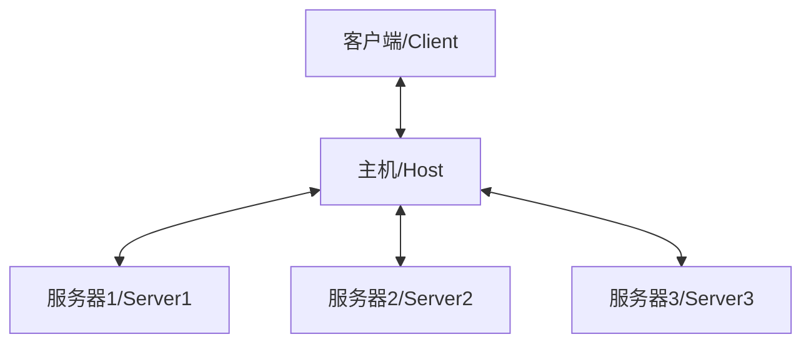

这三层的核心职责如下：

1. **客户端(Client)**：通常是AI模型或应用程序，负责发起请求并处理响应
2. **主机(Host)**：作为中间协调层，负责连接客户端和服务器，管理会话和权限
3. **服务器(Server)**：提供特定的资源或功能，如文件访问、数据查询、工具调用等

#### 架构设计原理

MCP三层架构的设计基于以下核心原理：

1. **关注点分离**

   每一层都有明确的职责边界，客户端专注于业务逻辑，主机负责协调和安全，服务器提供具体功能。这种分离使得系统更加模块化，易于开发和维护。

2. **松耦合设计**

   三层之间通过标准化接口通信，内部实现细节对其他层透明。这种松耦合设计使得各层可以独立演进，只要保持接口兼容。

3. **可组合性**

   一个主机可以连接多个服务器，一个客户端可以通过主机访问多种能力。这种可组合性使得系统能够灵活扩展，满足不同应用场景的需求。

4. **安全隔离**

   主机作为中间层，实施权限控制和资源隔离，确保客户端只能在授权范围内访问服务器资源。这种隔离机制增强了系统的安全性。

#### 客户端-主机-服务器交互模型

MCP的三层架构遵循以下交互模型：

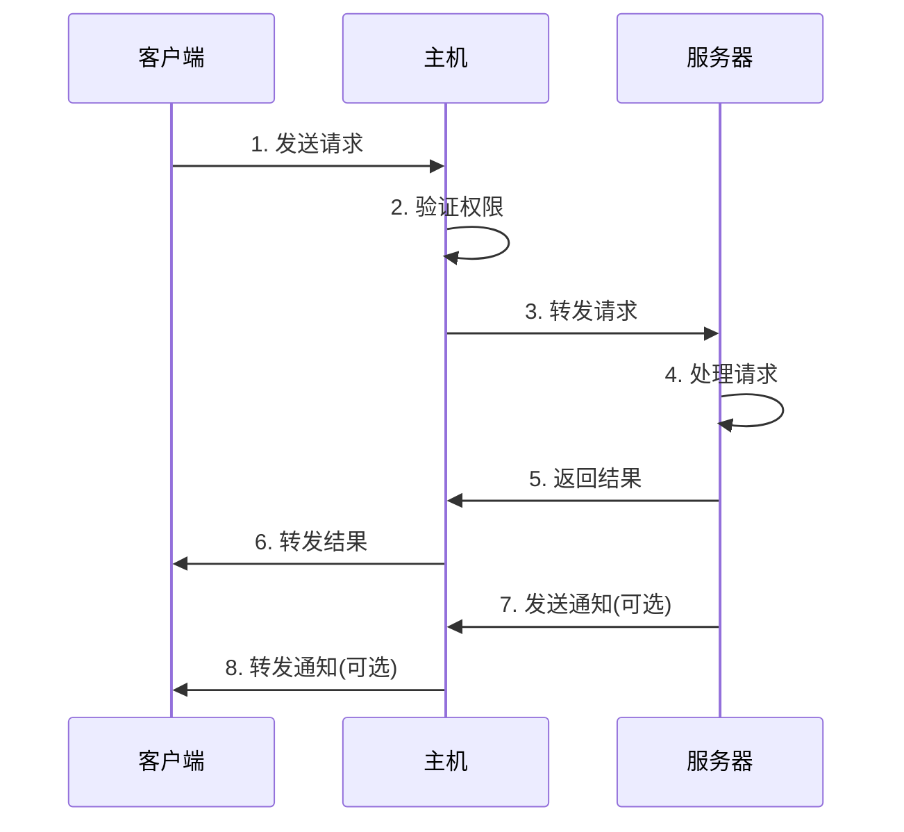

这个交互流程包括以下步骤：

1. 客户端向主机发送请求，如资源访问、工具调用等
2. 主机验证客户端的权限，确保请求在授权范围内
3. 主机将合法请求转发给相应的服务器
4. 服务器处理请求，执行相应的操作
5. 服务器将处理结果返回给主机
6. 主机将结果转发给客户端
7. 服务器可以主动向主机发送通知（如资源变更、事件触发等）
8. 主机将通知转发给客户端

#### 与传统架构的对比

MCP的三层架构与传统的客户端-服务器架构和微服务架构有一些关键区别：

| 特性 | 传统客户端-服务器 | 微服务架构 | MCP三层架构 |
|------|-----------------|-----------|------------|
| 中间层 | 无 | API网关 | 主机(Host) |
| 组件关系 | 紧耦合 | 松耦合 | 松耦合 |
| 安全控制 | 服务端实现 | 分散或集中 | 主机集中控制 |
| 服务发现 | 静态配置 | 服务注册表 | 主机动态发现 |
| 通信模式 | 同步请求-响应 | 同步/异步混合 | 请求-响应和通知 |
| 扩展方式 | 修改服务端 | 添加新服务 | 添加新服务器 |
| 客户端感知 | 直接感知服务 | 部分隔离 | 完全隔离 |

#### 实现示例

以下是MCP三层架构的简化实现示例：

```python
# 客户端示例
class MCPClient:
    def __init__(self, host_connection):
        self.host = host_connection
    
    def request_resource(self, resource_type, resource_id):
        # 向主机发送资源请求
        return self.host.send_request("read_resource", {
            "type": resource_type,
            "id": resource_id
        })
    
    def invoke_tool(self, tool_name, parameters):
        # 向主机发送工具调用请求
        return self.host.send_request("invoke_tool", {
            "name": tool_name,
            "parameters": parameters
        })
    
    def handle_notification(self, notification):
        # 处理来自主机的通知
        print(f"Received notification: {notification}")

# 主机示例
class MCPHost:
    def __init__(self):
        self.servers = {}
        self.permissions = {}
    
    def register_server(self, server_id, server_connection):
        # 注册服务器
        self.servers[server_id] = server_connection
    
    def set_permissions(self, client_id, permissions):
        # 设置客户端权限
        self.permissions[client_id] = permissions
    
    def send_request(self, client_id, method, params):
        # 验证权限
        if not self.check_permission(client_id, method, params):
            return {"error": "Permission denied"}
        
        # 确定目标服务器
        server_id = self.route_request(method, params)
        if server_id not in self.servers:
            return {"error": "Server not found"}
        
        # 转发请求到服务器
        return self.servers[server_id].handle_request(method, params)
    
    def forward_notification(self, server_id, notification, target_clients):
        # 将服务器通知转发给目标客户端
        for client_id in target_clients:
            # 实际实现中会有异步通知机制
            pass

# 服务器示例
class MCPServer:
    def __init__(self, server_id, host_connection):
        self.server_id = server_id
        self.host = host_connection
        self.resources = {}
        self.tools = {}
    
    def handle_request(self, method, params):
        # 处理来自主机的请求
        if method == "read_resource":
            return self.read_resource(params["type"], params["id"])
        elif method == "invoke_tool":
            return self.invoke_tool(params["name"], params["parameters"])
        else:
            return {"error": "Method not supported"}
    
    def send_notification(self, notification, target_clients):
        # 向主机发送通知，由主机转发给客户端
        self.host.forward_notification(self.server_id, notification, target_clients)
```

#### 架构优势与挑战

MCP三层架构的主要优势包括：

1. **灵活性**：可以根据需求组合不同的服务器
2. **可扩展性**：可以轻松添加新的服务器和功能
3. **安全性**：集中的权限控制和资源隔离
4. **标准化**：统一的接口和通信协议
5. **可复用性**：服务器可以被多个应用共享

同时，这种架构也面临一些挑战：

1. **性能开销**：多层转发可能带来一定的性能开销
2. **复杂性**：相比直接集成，架构更加复杂
3. **状态管理**：分布式环境下的状态管理挑战
4. **错误处理**：跨层错误传播和处理的复杂性

### 2.1.2 JSON-RPC 2.0通信规范

MCP采用JSON-RPC 2.0作为其通信协议，这是一种轻量级的远程过程调用(RPC)协议，使用JSON作为数据格式。本节将详细介绍MCP如何基于JSON-RPC 2.0实现组件间的通信。

#### JSON-RPC 2.0概述

JSON-RPC 2.0是一种无状态、轻量级的远程过程调用协议，具有以下特点：

1. **简单性**：协议简单易于实现和理解
2. **轻量级**：使用JSON作为数据格式，减少传输开销
3. **语言无关**：可以在任何支持JSON的编程语言中实现
4. **支持通知**：除了请求-响应模式，还支持单向通知
5. **批处理**：支持在单个请求中发送多个调用

JSON-RPC 2.0定义了三种类型的消息：

1. **请求(Request)**：客户端向服务端发送的调用请求
2. **响应(Response)**：服务端对请求的回复
3. **通知(Notification)**：不需要响应的单向消息

#### MCP中的JSON-RPC 2.0实现

MCP对JSON-RPC 2.0进行了一些扩展和定制，以满足AI原生应用的特殊需求：

1. **三层转发**：支持客户端-主机-服务器的多层转发
2. **会话管理**：添加会话标识和上下文管理
3. **权限控制**：集成权限验证机制
4. **资源标识**：统一的资源标识和引用机制
5. **流式响应**：支持大型响应的流式传输

#### 请求格式

MCP中的JSON-RPC请求格式如下：

```json
{
  "jsonrpc": "2.0",
  "id": "request-123",
  "method": "method_name",
  "params": {
    "param1": "value1",
    "param2": "value2"
  },
  "session": "session-456",  // MCP扩展：会话标识
  "target": "server-789"     // MCP扩展：目标服务器
}
```

主要字段说明：

- `jsonrpc`：固定为"2.0"，表示使用JSON-RPC 2.0协议
- `id`：请求标识符，用于匹配响应
- `method`：要调用的方法名
- `params`：方法参数，可以是对象或数组
- `session`：MCP扩展字段，表示会话标识
- `target`：MCP扩展字段，表示目标服务器

#### 响应格式

MCP中的JSON-RPC响应格式如下：

```json
{
  "jsonrpc": "2.0",
  "id": "request-123",
  "result": {
    "data": "response data"
  },
  "session": "session-456",  // MCP扩展：会话标识
  "source": "server-789"     // MCP扩展：源服务器
}
```

或者在出错时：

```json
{
  "jsonrpc": "2.0",
  "id": "request-123",
  "error": {
    "code": -32000,
    "message": "Error message",
    "data": {
      "details": "Additional error details"
    }
  },
  "session": "session-456",  // MCP扩展：会话标识
  "source": "server-789"     // MCP扩展：源服务器
}
```

主要字段说明：

- `jsonrpc`：固定为"2.0"
- `id`：与请求中的id相同
- `result`：调用成功时的结果
- `error`：调用失败时的错误信息
  - `code`：错误代码
  - `message`：错误消息
  - `data`：错误详情
- `session`：MCP扩展字段，表示会话标识
- `source`：MCP扩展字段，表示源服务器

#### 通知格式

MCP中的JSON-RPC通知格式如下：

```json
{
  "jsonrpc": "2.0",
  "method": "notification_name",
  "params": {
    "event": "resource_changed",
    "resource_id": "file:///data/document.txt"
  },
  "session": "session-456",  // MCP扩展：会话标识
  "source": "server-789"     // MCP扩展：源服务器
}
```

通知与请求的主要区别是没有`id`字段，表示不需要响应。

#### 错误代码

MCP定义了一系列标准错误代码，扩展了JSON-RPC 2.0的基本错误代码：

| 代码范围 | 类别 | 说明 |
|---------|------|------|
| -32700 | 解析错误 | 无效的JSON |
| -32600 | 无效请求 | 请求对象无效 |
| -32601 | 方法未找到 | 请求的方法不存在 |
| -32602 | 无效参数 | 参数无效 |
| -32603 | 内部错误 | 内部JSON-RPC错误 |
| -32000 to -32099 | 服务器错误 | 预留给实现定义的服务器错误 |
| -32100 to -32199 | MCP通用错误 | MCP定义的通用错误 |
| -32200 to -32299 | 资源错误 | 资源操作相关错误 |
| -32300 to -32399 | 工具错误 | 工具调用相关错误 |
| -32400 to -32499 | 权限错误 | 权限和安全相关错误 |
| -32500 to -32599 | 会话错误 | 会话管理相关错误 |

具体错误代码示例：

```
-32101: 不支持的MCP版本
-32201: 资源不存在
-32202: 资源类型不支持
-32301: 工具不存在
-32302: 工具参数无效
-32401: 权限不足
-32402: 访问被拒绝
-32501: 会话已过期
-32502: 会话创建失败
```

#### 批处理请求

MCP支持JSON-RPC 2.0的批处理功能，允许在单个请求中发送多个调用：

```json
[
  {
    "jsonrpc": "2.0",
    "id": "request-1",
    "method": "read_resource",
    "params": {"id": "resource-1"},
    "session": "session-456"
  },
  {
    "jsonrpc": "2.0",
    "id": "request-2",
    "method": "read_resource",
    "params": {"id": "resource-2"},
    "session": "session-456"
  }
]
```

批处理响应：

```json
[
  {
    "jsonrpc": "2.0",
    "id": "request-1",
    "result": {"content": "resource 1 content"},
    "session": "session-456"
  },
  {
    "jsonrpc": "2.0",
    "id": "request-2",
    "result": {"content": "resource 2 content"},
    "session": "session-456"
  }
]
```

#### 流式响应

对于大型响应，MCP扩展了JSON-RPC 2.0以支持流式传输。流式响应使用一系列部分响应消息，每个消息包含一部分数据：

```json
{
  "jsonrpc": "2.0",
  "id": "request-123",
  "partial": true,
  "sequence": 1,
  "result": {"chunk": "第一部分数据..."},
  "session": "session-456"
}
```

```json
{
  "jsonrpc": "2.0",
  "id": "request-123",
  "partial": true,
  "sequence": 2,
  "result": {"chunk": "第二部分数据..."},
  "session": "session-456"
}
```

```json
{
  "jsonrpc": "2.0",
  "id": "request-123",
  "partial": false,
  "sequence": 3,
  "result": {"chunk": "最后部分数据..."},
  "session": "session-456"
}
```

流式响应的关键字段：

- `partial`：表示这是部分响应
- `sequence`：序列号，用于排序部分响应
- `result.chunk`：当前部分的数据

#### 实现示例

以下是MCP中JSON-RPC 2.0实现的简化示例：

```python
import json
import uuid

class JsonRpcClient:
    def __init__(self, transport):
        self.transport = transport
        self.pending_requests = {}
    
    def call(self, method, params, session=None, target=None):
        # 创建请求ID
        request_id = str(uuid.uuid4())
        
        # 构建请求
        request = {
            "jsonrpc": "2.0",
            "id": request_id,
            "method": method,
            "params": params
        }
        
        # 添加MCP扩展字段
        if session:
            request["session"] = session
        if target:
            request["target"] = target
        
        # 发送请求
        self.transport.send(json.dumps(request))
        
        # 等待响应
        response_data = self.transport.receive()
        response = json.loads(response_data)
        
        # 验证响应
        if response.get("jsonrpc") != "2.0" or response.get("id") != request_id:
            raise ValueError("Invalid response")
        
        # 处理错误
        if "error" in response:
            error = response["error"]
            raise Exception(f"RPC error: {error['message']} (code: {error['code']})")
        
        # 返回结果
        return response.get("result")
    
    def notify(self, method, params, session=None, target=None):
        # 构建通知
        notification = {
            "jsonrpc": "2.0",
            "method": method,
            "params": params
        }
        
        # 添加MCP扩展字段
        if session:
            notification["session"] = session
        if target:
            notification["target"] = target
        
        # 发送通知
        self.transport.send(json.dumps(notification))

class JsonRpcServer:
    def __init__(self, transport, handlers):
        self.transport = transport
        self.handlers = handlers
    
    def listen(self):
        while True:
            # 接收请求
            request_data = self.transport.receive()
            if not request_data:
                continue
            
            # 解析请求
            try:
                request = json.loads(request_data)
            except json.JSONDecodeError:
                self._send_error(None, -32700, "Parse error")
                continue
            
            # 处理批处理请求
            if isinstance(request, list):
                for single_request in request:
                    self._handle_request(single_request)
            else:
                self._handle_request(request)
    
    def _handle_request(self, request):
        # 验证请求
        if request.get("jsonrpc") != "2.0":
            self._send_error(request.get("id"), -32600, "Invalid Request")
            return
        
        # 获取方法和参数
        method = request.get("method")
        params = request.get("params", {})
        
        # 检查是否为通知
        is_notification = "id" not in request
        
        # 查找处理程序
        if method not in self.handlers:
            if not is_notification:
                self._send_error(request.get("id"), -32601, "Method not found")
            return
        
        # 调用处理程序
        try:
            result = self.handlers[method](params)
            
            # 如果是通知，不发送响应
            if is_notification:
                return
            
            # 发送成功响应
            response = {
                "jsonrpc": "2.0",
                "id": request.get("id"),
                "result": result
            }
            
            # 添加MCP扩展字段
            if "session" in request:
                response["session"] = request["session"]
            
            self.transport.send(json.dumps(response))
        except Exception as e:
            # 如果是通知，不发送错误响应
            if is_notification:
                return
            
            # 发送错误响应
            self._send_error(request.get("id"), -32000, str(e))
    
    def _send_error(self, id, code, message, data=None):
        error = {
            "code": code,
            "message": message
        }
        if data:
            error["data"] = data
        
        response = {
            "jsonrpc": "2.0",
            "id": id,
            "error": error
        }
        
        self.transport.send(json.dumps(response))
```

### 2.1.3 传输层实现（stdio、HTTP/SSE）

MCP协议的一个重要特点是支持多种传输层实现，使其能够适应不同的部署环境和使用场景。本节将详细介绍MCP支持的主要传输层实现，包括标准输入/输出(stdio)、HTTP/WebSocket和Server-Sent Events(SSE)。

#### 传输层抽象

MCP定义了传输层抽象，将通信协议与具体传输机制分离。这种抽象使得MCP可以在不同环境中使用相同的协议，只需切换传输层实现。

传输层抽象的核心接口包括：

```python
class MCPTransport:
    def connect(self):
        """建立连接"""
        pass
    
    def disconnect(self):
        """断开连接"""
        pass
    
    def send(self, message):
        """发送消息"""
        pass
    
    def receive(self):
        """接收消息"""
        pass
    
    def is_connected(self):
        """检查连接状态"""
        pass
```

#### 标准输入/输出(stdio)传输

标准输入/输出(stdio)传输是最简单的MCP传输实现，适用于本地进程间通信，特别是在命令行环境中。

##### 工作原理

stdio传输使用进程的标准输入和标准输出流进行通信：

1. 客户端通过标准输出发送消息
2. 服务器从标准输入读取消息
3. 服务器通过标准输出发送响应
4. 客户端从标准输入读取响应

这种方式特别适合AI模型作为子进程运行的场景，如命令行工具或本地应用。

##### 消息格式

为了在流式传输中区分不同消息，stdio传输通常使用特殊的分隔符或长度前缀：

1. **分隔符方式**：使用特殊字符序列（如`\n\n`）分隔消息
2. **长度前缀方式**：在每条消息前添加长度信息

长度前缀方式的示例格式：

```
Content-Length: 123\r\n
\r\n
{"jsonrpc":"2.0","id":"request-123","method":"read_resource","params":{"id":"resource-1"}}
```

##### 实现示例

以下是stdio传输的简化实现示例：

```python
import sys
import json
import threading

class StdioTransport(MCPTransport):
    def __init__(self):
        self.connected = False
        self.receive_queue = Queue()
        self.receive_thread = None
    
    def connect(self):
        if self.connected:
            return
        
        self.connected = True
        self.receive_thread = threading.Thread(target=self._receive_loop)
        self.receive_thread.daemon = True
        self.receive_thread.start()
    
    def disconnect(self):
        self.connected = False
        if self.receive_thread:
            self.receive_thread.join(timeout=1.0)
            self.receive_thread = None
    
    def send(self, message):
        if not self.connected:
            raise ConnectionError("Not connected")
        
        # 添加长度前缀
        content = message.encode('utf-8')
        header = f"Content-Length: {len(content)}\r\n\r\n".encode('utf-8')
        
        # 写入标准输出
        sys.stdout.buffer.write(header + content)
        sys.stdout.buffer.flush()
    
    def receive(self):
        if not self.connected:
            raise ConnectionError("Not connected")
        
        # 从队列获取消息
        try:
            return self.receive_queue.get(timeout=1.0)
        except Empty:
            return None
    
    def is_connected(self):
        return self.connected
    
    def _receive_loop(self):
        """后台线程，从标准输入读取消息"""
        buffer = b''
        content_length = None
        
        while self.connected:
            # 读取数据
            try:
                chunk = sys.stdin.buffer.read1(1024)
                if not chunk:
                    # 输入流关闭
                    self.connected = False
                    break
                
                buffer += chunk
            except Exception as e:
                self.connected = False
                break
            
            # 处理完整消息
            while True:
                # 如果还没有解析头部，尝试解析
                if content_length is None:
                    header_end = buffer.find(b'\r\n\r\n')
                    if header_end == -1:
                        # 头部不完整，等待更多数据
                        break
                    
                    # 解析Content-Length
                    header = buffer[:header_end].decode('ascii')
                    for line in header.split('\r\n'):
                        if line.startswith('Content-Length: '):
                            content_length = int(line[16:])
                    
                    # 移除头部
                    buffer = buffer[header_end + 4:]
                
                # 检查消息体是否完整
                if content_length is not None and len(buffer) >= content_length:
                    # 提取消息
                    content = buffer[:content_length].decode('utf-8')
                    buffer = buffer[content_length:]
                    content_length = None
                    
                    # 将消息放入队列
                    self.receive_queue.put(content)
                else:
                    # 消息不完整，等待更多数据
                    break
```

##### 优势与局限性

stdio传输的主要优势：

1. **简单性**：实现简单，无需网络配置
2. **本地安全**：通信限于本地进程，减少安全风险
3. **低延迟**：进程间通信通常具有低延迟
4. **跨平台**：在所有主要操作系统上都可用

局限性：

1. **仅限本地**：只能用于同一机器上的进程通信
2. **可靠性**：进程崩溃会导致通信中断
3. **扩展性**：不适合分布式部署
4. **调试困难**：流式通信调试相对困难

#### HTTP/WebSocket传输

HTTP和WebSocket传输是MCP最常用的网络传输实现，适用于分布式环境和Web应用集成。

##### HTTP传输

HTTP传输使用标准的HTTP请求-响应模式实现MCP通信：

1. **请求方式**：通常使用POST方法发送JSON-RPC请求
2. **内容类型**：使用`application/json`作为Content-Type
3. **端点设计**：通常使用单一端点（如`/mcp`）处理所有请求
4. **会话管理**：使用HTTP头或Cookie维护会话

HTTP传输的基本流程：

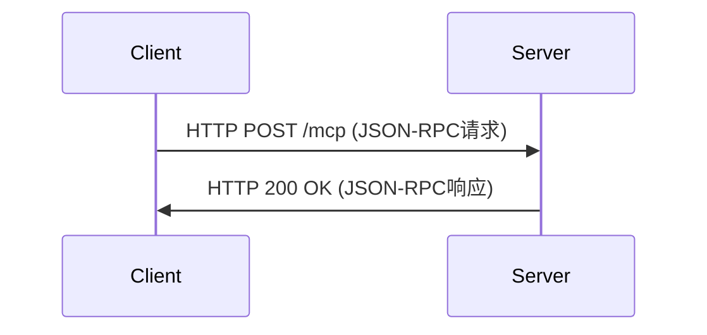

HTTP传输实现示例：

```python
import requests
import json

class HttpTransport(MCPTransport):
    def __init__(self, url, headers=None):
        self.url = url
        self.headers = headers or {}
        self.headers.update({
            'Content-Type': 'application/json',
            'Accept': 'application/json'
        })
        self.session = None
    
    def connect(self):
        if self.session is None:
            self.session = requests.Session()
    
    def disconnect(self):
        if self.session:
            self.session.close()
            self.session = None
    
    def send(self, message):
        if not self.session:
            self.connect()
        
        response = self.session.post(
            self.url,
            data=message,
            headers=self.headers
        )
        
        # 检查HTTP状态码
        response.raise_for_status()
        
        return response.text
    
    def receive(self):
        # HTTP是同步的，receive在send中已经处理
        pass
    
    def is_connected(self):
        return self.session is not None
```

HTTP传输的优势：

1. **广泛支持**：几乎所有平台都支持HTTP
2. **防火墙友好**：通常不会被防火墙阻止
3. **负载均衡**：可以利用现有的HTTP负载均衡
4. **安全选项**：可以使用HTTPS、认证等安全机制

局限性：

1. **无状态**：HTTP本身是无状态的，需要额外机制维护会话
2. **开销**：每个请求都有HTTP头部开销
3. **单向通信**：服务器不能主动推送消息
4. **长轮询问题**：不适合需要实时通知的场景

##### WebSocket传输

WebSocket提供了全双工通信通道，非常适合需要双向通信的MCP应用：

1. **持久连接**：建立一次连接后可以双向通信
2. **低延迟**：比HTTP有更低的通信延迟
3. **实时通知**：支持服务器主动推送消息
4. **二进制支持**：可以传输文本或二进制数据

WebSocket传输的基本流程：

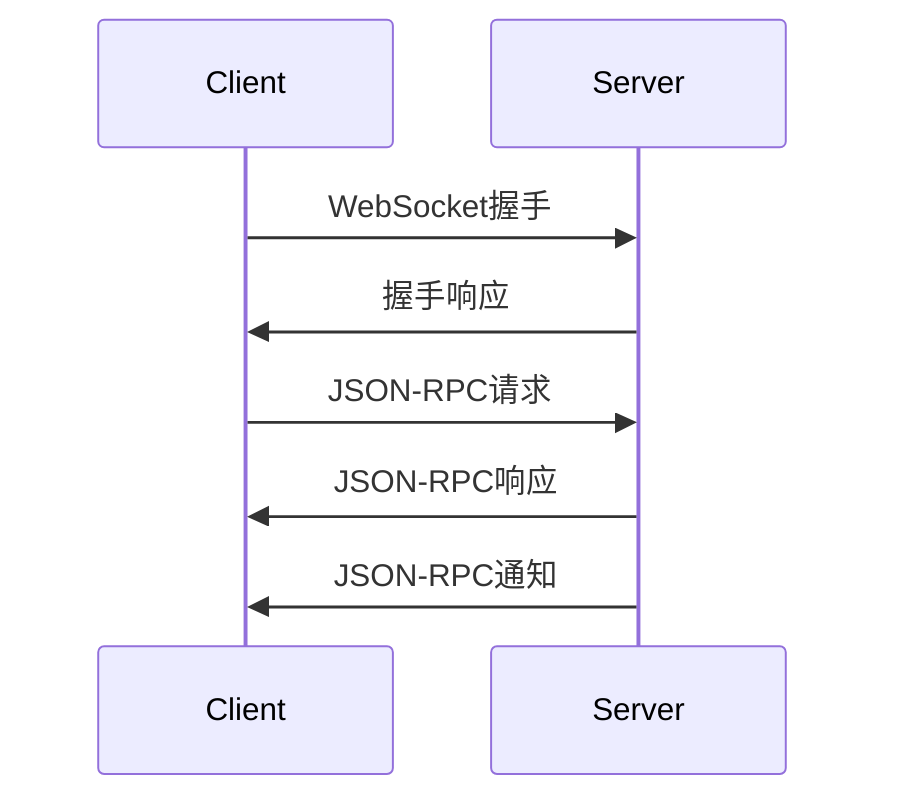

WebSocket传输实现示例：

```python
import websocket
import json
import threading
from queue import Queue, Empty

class WebSocketTransport(MCPTransport):
    def __init__(self, url):
        self.url = url
        self.ws = None
        self.connected = False
        self.receive_queue = Queue()
        self.receive_thread = None
    
    def connect(self):
        if self.connected:
            return
        
        # 创建WebSocket连接
        self.ws = websocket.WebSocketApp(
            self.url,
            on_message=self._on_message,
            on_error=self._on_error,
            on_close=self._on_close,
            on_open=self._on_open
        )
        
        # 启动WebSocket线程
        self.receive_thread = threading.Thread(target=self.ws.run_forever)
        self.receive_thread.daemon = True
        self.receive_thread.start()
        
        # 等待连接建立
        for _ in range(30):  # 最多等待3秒
            if self.connected:
                break
            time.sleep(0.1)
        
        if not self.connected:
            raise ConnectionError("Failed to connect to WebSocket server")
    
    def disconnect(self):
        if self.ws:
            self.ws.close()
            self.ws = None
        
        self.connected = False
        
        if self.receive_thread:
            self.receive_thread.join(timeout=1.0)
            self.receive_thread = None
    
    def send(self, message):
        if not self.connected or not self.ws:
            raise ConnectionError("Not connected")
        
        self.ws.send(message)
    
    def receive(self):
        if not self.connected:
            raise ConnectionError("Not connected")
        
        try:
            return self.receive_queue.get(timeout=1.0)
        except Empty:
            return None
    
    def is_connected(self):
        return self.connected
    
    def _on_message(self, ws, message):
        self.receive_queue.put(message)
    
    def _on_error(self, ws, error):
        print(f"WebSocket error: {error}")
    
    def _on_close(self, ws, close_status_code, close_msg):
        self.connected = False
    
    def _on_open(self, ws):
        self.connected = True
```

WebSocket传输的优势：

1. **实时通信**：支持双向实时通信
2. **低延迟**：比HTTP有更低的通信开销
3. **持久连接**：避免频繁建立连接的开销
4. **通知支持**：非常适合服务器推送通知

局限性：

1. **复杂性**：比HTTP实现更复杂
2. **代理问题**：某些网络环境可能阻止WebSocket
3. **状态维护**：需要处理连接断开和重连
4. **扩展性挑战**：长连接在大规模部署时需要特殊考虑

#### Server-Sent Events (SSE)传输

Server-Sent Events (SSE)是一种单向通信技术，允许服务器向客户端推送更新。在MCP中，SSE通常与HTTP结合使用，形成一种混合传输模式。

##### 工作原理

SSE传输的基本工作模式：

1. 客户端通过HTTP发送请求
2. 服务器通过HTTP返回响应
3. 客户端通过SSE连接接收服务器推送的通知
4. 对于需要响应的请求，客户端仍使用HTTP

这种混合模式结合了HTTP的普遍兼容性和SSE的推送能力。

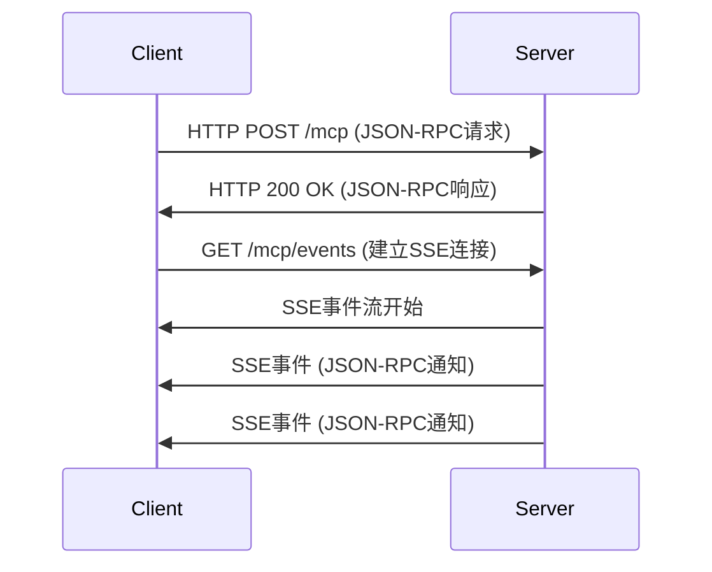

##### SSE格式

SSE使用简单的文本格式，每个事件由一个或多个以`\n`或`\r\n`结尾的行组成：

```
event: notification
data: {"jsonrpc":"2.0","method":"resource_changed","params":{"id":"resource-1"}}

```

主要字段：

- `event`：事件类型（可选）
- `data`：事件数据，可以是多行
- `id`：事件ID，用于恢复连接（可选）
- `retry`：重连间隔（毫秒）（可选）

##### 实现示例

SSE传输的客户端实现示例：

```python
import requests
import json
import threading
import sseclient

class SseTransport(MCPTransport):
    def __init__(self, request_url, events_url):
        self.request_url = request_url
        self.events_url = events_url
        self.session = None
        self.sse_client = None
        self.sse_thread = None
        self.connected = False
        self.notification_handlers = []
    
    def connect(self):
        if self.connected:
            return
        
        # 创建HTTP会话
        self.session = requests.Session()
        
        # 建立SSE连接
        headers = {'Accept': 'text/event-stream'}
        response = self.session.get(self.events_url, stream=True, headers=headers)
        response.raise_for_status()
        
        self.sse_client = sseclient.SSEClient(response)
        
        # 启动SSE监听线程
        self.sse_thread = threading.Thread(target=self._sse_listener)
        self.sse_thread.daemon = True
        self.sse_thread.start()
        
        self.connected = True
    
    def disconnect(self):
        self.connected = False
        
        if self.session:
            self.session.close()
            self.session = None
        
        if self.sse_thread:
            self.sse_thread.join(timeout=1.0)
            self.sse_thread = None
    
    def send(self, message):
        if not self.connected or not self.session:
            raise ConnectionError("Not connected")
        
        headers = {'Content-Type': 'application/json'}
        response = self.session.post(
            self.request_url,
            data=message,
            headers=headers
        )
        
        response.raise_for_status()
        return response.text
    
    def receive(self):
        # 同步请求在send中已处理
        # 通知通过回调处理
        pass
    
    def is_connected(self):
        return self.connected
    
    def add_notification_handler(self, handler):
        self.notification_handlers.append(handler)
    
    def _sse_listener(self):
        try:
            for event in self.sse_client.events():
                if not self.connected:
                    break
                
                if event.event == 'notification':
                    try:
                        notification = json.loads(event.data)
                        for handler in self.notification_handlers:
                            handler(notification)
                    except json.JSONDecodeError:
                        print(f"Invalid JSON in SSE event: {event.data}")
        except Exception as e:
            print(f"SSE connection error: {e}")
            self.connected = False
```

SSE传输的服务器端实现示例（使用Flask）：

```python
from flask import Flask, Response, request, jsonify
import json
import queue

app = Flask(__name__)

# 客户端SSE连接队列
sse_clients = []

@app.route('/mcp', methods=['POST'])
def handle_request():
    # 处理JSON-RPC请求
    request_data = request.get_json()
    
    # 处理请求并生成响应
    response = process_jsonrpc_request(request_data)
    
    return jsonify(response)

@app.route('/mcp/events')
def sse_stream():
    def event_stream():
        client_queue = queue.Queue()
        sse_clients.append(client_queue)
        
        try:
            while True:
                # 等待通知
                notification = client_queue.get()
                
                # 发送SSE事件
                event_data = f"event: notification\ndata: {json.dumps(notification)}\n\n"
                yield event_data
        finally:
            sse_clients.remove(client_queue)
    
    return Response(event_stream(), content_type='text/event-stream')

def send_notification(notification):
    # 向所有连接的客户端发送通知
    for client_queue in sse_clients:
        client_queue.put(notification)
```

##### 优势与局限性

SSE传输的主要优势：

1. **简单性**：比WebSocket实现更简单
2. **HTTP兼容**：基于HTTP，兼容性好
3. **自动重连**：内置重连机制
4. **过滤能力**：支持事件类型过滤

局限性：

1. **单向通信**：只支持服务器到客户端的推送
2. **连接限制**：浏览器对同一域名的连接数有限制
3. **IE不支持**：Internet Explorer不支持SSE
4. **头部限制**：某些代理可能缓冲SSE响应

#### 传输层选择指南

不同的传输层适合不同的使用场景，以下是选择指南：

| 传输层 | 最适合的场景 | 不适合的场景 |
|-------|------------|-------------|
| stdio | 本地命令行工具<br>嵌入式AI应用<br>单机部署 | 分布式系统<br>Web应用<br>需要高可用性 |
| HTTP | Web应用集成<br>RESTful架构<br>无状态服务 | 需要实时通知<br>高频交互<br>长时间操作 |
| WebSocket | 实时协作应用<br>需要双向通信<br>低延迟要求 | 简单集成<br>防火墙限制环境<br>资源受限设备 |
| SSE | 需要服务器推送<br>与现有HTTP系统集成<br>浏览器环境 | 需要客户端推送<br>二进制数据传输<br>非常低的延迟要求 |

选择传输层的决策流程：

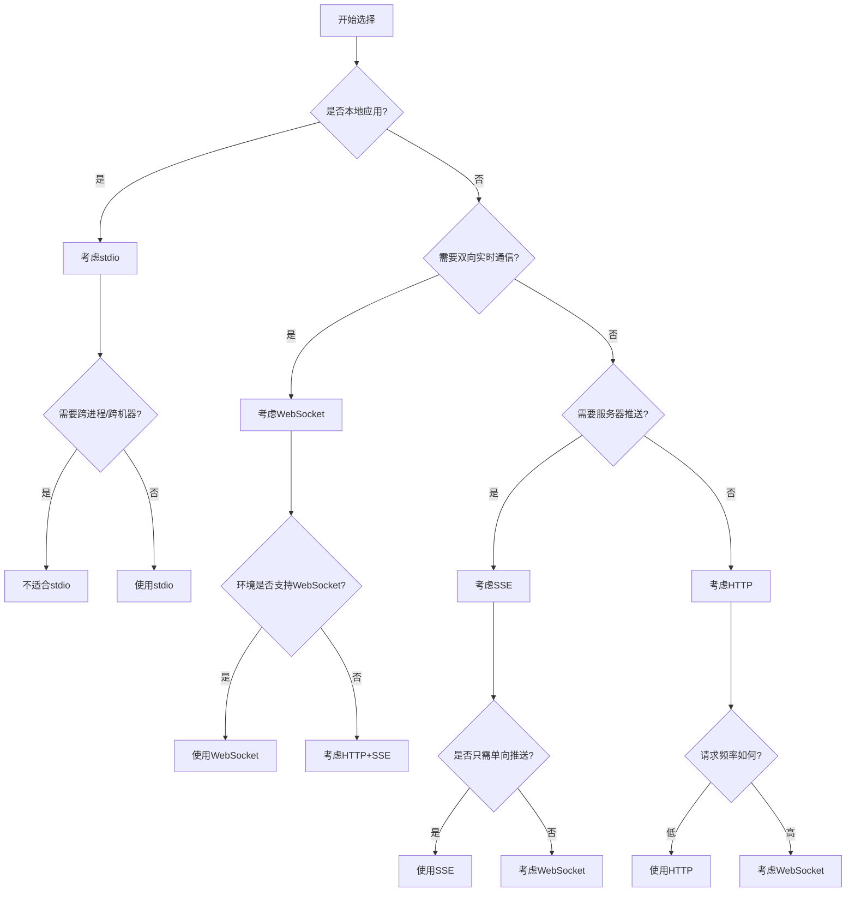

#### 多传输层支持

MCP的一个强大特性是能够支持多种传输层，甚至在同一应用中混合使用不同的传输层。例如：

1. **本地组件使用stdio**：与本地AI模型通信
2. **远程服务使用WebSocket**：与云端服务器通信
3. **Web集成使用HTTP/SSE**：与Web前端集成

这种灵活性使MCP能够适应各种部署环境和使用场景。

## 2.2 MCP核心组件

MCP架构由三个核心组件组成：主机(Host)、客户端(Client)和服务器(Server)。这些组件共同构成了MCP的基础架构，各自承担不同的职责。本节将详细介绍这三个核心组件的设计、功能和实现。

### 2.2.1 MCP主机（Host）详解

MCP主机是整个架构的中心枢纽，负责协调客户端和服务器之间的通信，管理会话和权限，以及提供各种核心服务。

#### 主机的核心职责

MCP主机具有以下核心职责：

1. **通信协调**：转发客户端和服务器之间的请求、响应和通知
2. **会话管理**：创建、维护和终止会话，管理会话状态
3. **权限控制**：验证和执行访问控制策略，确保安全边界
4. **服务发现**：帮助客户端发现可用的服务器和能力
5. **资源分配**：管理和分配系统资源，如内存、存储等
6. **生命周期管理**：管理客户端和服务器的生命周期
7. **错误处理**：处理和转发错误，提供统一的错误报告机制

#### 主机架构

MCP主机的内部架构通常包括以下核心组件：

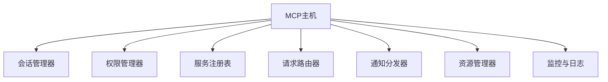

1. **会话管理器**：负责创建和维护会话，跟踪会话状态
2. **权限管理器**：实施访问控制策略，验证请求权限
3. **服务注册表**：维护已注册服务器的信息和能力
4. **请求路由器**：将客户端请求路由到适当的服务器
5. **通知分发器**：将服务器通知分发给相关客户端
6. **资源管理器**：管理系统资源的分配和释放
7. **监控与日志**：记录系统活动和性能指标

#### 主机接口

MCP主机提供以下主要接口：

1. **客户端接口**：供客户端连接和交互
   - 会话创建与管理
   - 请求发送与接收
   - 通知接收
   - 服务发现

2. **服务器接口**：供服务器注册和交互
   - 服务器注册与注销
   - 请求接收与响应
   - 通知发送
   - 能力声明

3. **管理接口**：供系统管理员使用
   - 配置管理
   - 监控与诊断
   - 日志访问
   - 安全策略管理

#### 会话管理

会话是MCP主机的核心概念，代表客户端与主机之间的交互上下文。会话管理包括：

1. **会话创建**：客户端连接时创建新会话
2. **会话标识**：为每个会话分配唯一标识符
3. **会话状态**：维护会话的状态信息
4. **会话权限**：定义会话的访问权限
5. **会话超时**：处理会话超时和自动清理
6. **会话恢复**：支持断线重连时的会话恢复

会话的生命周期：

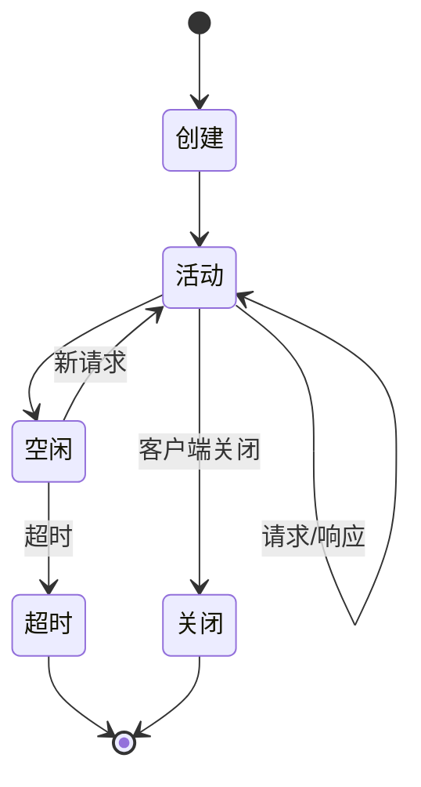

#### 权限控制

MCP主机实施细粒度的权限控制，确保客户端只能访问授权的资源和功能：

1. **权限模型**：基于资源和操作的权限模型
2. **权限验证**：验证每个请求的权限
3. **权限策略**：支持灵活的权限策略定义
4. **权限继承**：支持权限的层次结构和继承
5. **动态权限**：支持运行时权限调整

权限定义示例：

```json
{
  "session_id": "session-123",
  "permissions": [
    {
      "server": "file-server",
      "resources": [
        {
          "type": "file",
          "path": "/data",
          "operations": ["read", "list"]
        },
        {
          "type": "file",
          "path": "/tmp",
          "operations": ["read", "write", "delete"]
        }
      ]
    },
    {
      "server": "tool-server",
      "tools": [
        {
          "name": "calculator",
          "operations": ["invoke"]
        },
        {
          "name": "weather.forecast",
          "operations": ["invoke"]
        }
      ]
    }
  ]
}
```

#### 服务发现

MCP主机提供服务发现机制，帮助客户端找到所需的服务器和能力：

1. **服务器注册**：服务器向主机注册其身份和能力
2. **能力声明**：服务器声明其提供的资源类型和工具
3. **服务查询**：客户端查询可用的服务器和能力
4. **服务匹配**：主机根据客户端需求匹配合适的服务器

服务发现流程：

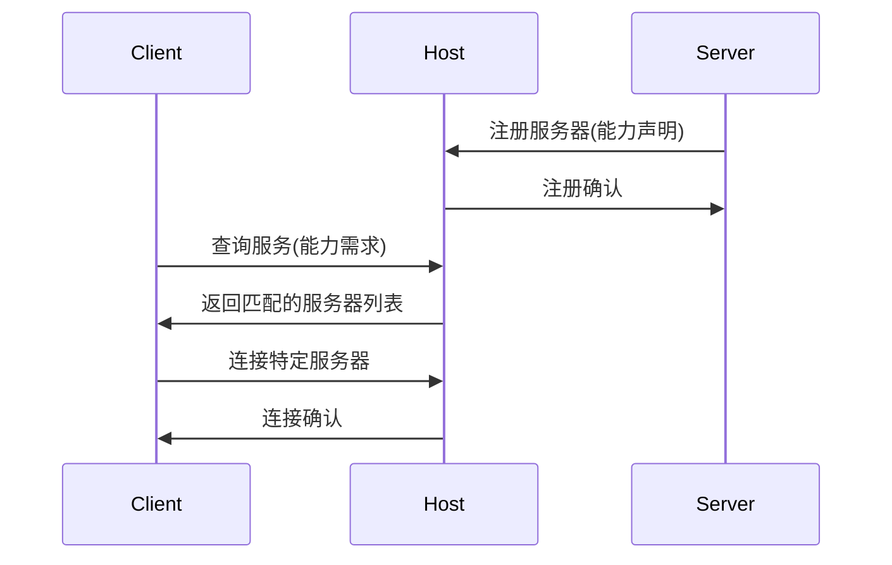

#### 请求路由

MCP主机负责将客户端请求路由到适当的服务器：

1. **目标确定**：确定请求的目标服务器
2. **请求转发**：将请求转发给目标服务器
3. **响应返回**：将服务器响应返回给客户端
4. **错误处理**：处理路由过程中的错误

请求路由算法：

```python
def route_request(request):
    # 提取目标服务器信息
    target_server = request.get("target")
    
    # 如果未指定目标，根据方法和参数推断
    if not target_server:
        target_server = infer_target_server(request["method"], request["params"])
    
    # 检查服务器是否存在
    if target_server not in registered_servers:
        return error_response("Unknown server")
    
    # 检查权限
    session_id = request.get("session")
    if not check_permission(session_id, target_server, request["method"], request["params"]):
        return error_response("Permission denied")
    
    # 转发请求
    return forward_to_server(target_server, request)
```

#### 通知分发

MCP主机负责将服务器发出的通知分发给相关客户端：

1. **目标确定**：确定通知的目标客户端
2. **通知过滤**：根据客户端订阅过滤通知
3. **通知转发**：将通知转发给目标客户端
4. **可靠传递**：确保通知可靠传递

通知分发模式：

1. **点对点通知**：发送给特定客户端
2. **广播通知**：发送给所有客户端
3. **多播通知**：发送给符合特定条件的客户端
4. **订阅通知**：发送给订阅特定主题的客户端

#### 资源管理

MCP主机管理系统资源的分配和使用：

1. **内存管理**：控制内存使用，防止过度消耗
2. **连接管理**：管理客户端和服务器连接
3. **并发控制**：控制并发请求数量
4. **负载均衡**：在多个服务器实例之间分配负载
5. **资源限制**：实施资源使用限制和配额

资源限制策略示例：

```json
{
  "session_id": "session-123",
  "resource_limits": {
    "max_connections": 10,
    "max_requests_per_minute": 100,
    "max_memory_mb": 256,
    "max_storage_mb": 1024,
    "max_cpu_time_seconds": 30
  }
}
```

#### 监控与日志

MCP主机提供全面的监控和日志功能：

1. **活动日志**：记录所有请求、响应和通知
2. **性能指标**：收集和报告性能指标
3. **错误跟踪**：记录和分析错误
4. **审计日志**：记录安全相关事件
5. **健康检查**：监控系统健康状态

日志记录示例：

```json
{
  "timestamp": "2024-04-10T10:15:30Z",
  "level": "info",
  "event": "request_processed",
  "session_id": "session-123",
  "client_id": "client-456",
  "server_id": "file-server",
  "method": "read_resource",
  "params": {"id": "file:///data/document.txt"},
  "status": "success",
  "duration_ms": 45
}
```

#### 主机实现示例

以下是MCP主机的简化实现示例：

```python
class MCPHost:
    def __init__(self, config=None):
        self.config = config or {}
        self.servers = {}  # 注册的服务器
        self.clients = {}  # 连接的客户端
        self.sessions = {}  # 活动会话
        self.permissions = {}  # 会话权限
        self.request_handlers = {
            "create_session": self.handle_create_session,
            "close_session": self.handle_close_session,
            "discover_servers": self.handle_discover_servers,
            "connect_server": self.handle_connect_server
        }
    
    def register_server(self, server_id, server_info, connection):
        """注册服务器"""
        self.servers[server_id] = {
            "info": server_info,
            "connection": connection,
            "capabilities": server_info.get("capabilities", {})
        }
        return {"status": "registered"}
    
    def unregister_server(self, server_id):
        """注销服务器"""
        if server_id in self.servers:
            del self.servers[server_id]
            return {"status": "unregistered"}
        return {"error": "Server not found"}
    
    def register_client(self, client_id, client_info, connection):
        """注册客户端"""
        self.clients[client_id] = {
            "info": client_info,
            "connection": connection
        }
        return {"status": "registered"}
    
    def unregister_client(self, client_id):
        """注销客户端"""
        if client_id in self.clients:
            # 关闭客户端的所有会话
            sessions_to_close = [
                session_id for session_id, session in self.sessions.items()
                if session["client_id"] == client_id
            ]
            for session_id in sessions_to_close:
                self.close_session(session_id)
            
            del self.clients[client_id]
            return {"status": "unregistered"}
        return {"error": "Client not found"}
    
    def handle_client_request(self, client_id, request):
        """处理客户端请求"""
        method = request.get("method")
        
        # 检查是否是主机方法
        if method in self.request_handlers:
            return self.request_handlers[method](client_id, request)
        
        # 转发到服务器的请求
        session_id = request.get("session")
        if not session_id or session_id not in self.sessions:
            return {"error": "Invalid session"}
        
        # 确定目标服务器
        target_server = request.get("target")
        if not target_server:
            target_server = self.infer_target_server(method, request.get("params", {}))
        
        if not target_server or target_server not in self.servers:
            return {"error": "Invalid target server"}
        
        # 检查权限
        if not self.check_permission(session_id, target_server, method, request.get("params", {})):
            return {"error": "Permission denied"}
        
        # 转发请求到服务器
        server_connection = self.servers[target_server]["connection"]
        return server_connection.send_request(request)
    
    def handle_server_notification(self, server_id, notification):
        """处理服务器通知"""
        # 确定目标客户端
        target_sessions = notification.get("target_sessions", [])
        if not target_sessions:
            # 如果未指定目标会话，发送给所有有权限的会话
            target_sessions = self.find_eligible_sessions(server_id, notification)
        
        # 转发通知给目标客户端
        for session_id in target_sessions:
            if session_id in self.sessions:
                client_id = self.sessions[session_id]["client_id"]
                if client_id in self.clients:
                    client_connection = self.clients[client_id]["connection"]
                    client_connection.send_notification({
                        **notification,
                        "session": session_id,
                        "source": server_id
                    })
    
    def handle_create_session(self, client_id, request):
        """处理创建会话请求"""
        params = request.get("params", {})
        
        # 生成会话ID
        session_id = f"session-{uuid.uuid4()}"
        
        # 创建会话
        self.sessions[session_id] = {
            "client_id": client_id,
            "created_at": time.time(),
            "last_activity": time.time(),
            "state": "active"
        }
        
        # 设置权限
        permissions = params.get("permissions", {})
        self.permissions[session_id] = self.validate_permissions(permissions)
        
        return {
            "id": request.get("id"),
            "result": {
                "session_id": session_id,
                "expires_at": time.time() + self.config.get("session_timeout", 3600)
            }
        }
    
    def handle_close_session(self, client_id, request):
        """处理关闭会话请求"""
        params = request.get("params", {})
        session_id = params.get("session_id")
        
        if not session_id or session_id not in self.sessions:
            return {"error": "Invalid session"}
        
        # 验证客户端是否有权关闭此会话
        if self.sessions[session_id]["client_id"] != client_id:
            return {"error": "Permission denied"}
        
        # 关闭会话
        self.close_session(session_id)
        
        return {
            "id": request.get("id"),
            "result": {"status": "closed"}
        }
    
    def close_session(self, session_id):
        """关闭会话并清理资源"""
        if session_id in self.sessions:
            # 通知相关服务器会话关闭
            for server_id, server in self.servers.items():
                try:
                    server["connection"].send_notification({
                        "method": "session_closed",
                        "params": {"session_id": session_id}
                    })
                except Exception as e:
                    print(f"Error notifying server {server_id} of session closure: {e}")
            
            # 删除会话和权限
            del self.sessions[session_id]
            if session_id in self.permissions:
                del self.permissions[session_id]
    
    def handle_discover_servers(self, client_id, request):
        """处理发现服务器请求"""
        params = request.get("params", {})
        capabilities = params.get("capabilities", [])
        
        # 查找匹配的服务器
        matching_servers = {}
        for server_id, server in self.servers.items():
            if not capabilities or self.server_matches_capabilities(server, capabilities):
                matching_servers[server_id] = {
                    "id": server_id,
                    "name": server["info"].get("name", server_id),
                    "description": server["info"].get("description", ""),
                    "capabilities": server["capabilities"]
                }
        
        return {
            "id": request.get("id"),
            "result": {"servers": matching_servers}
        }
    
    def handle_connect_server(self, client_id, request):
        """处理连接服务器请求"""
        params = request.get("params", {})
        session_id = request.get("session")
        server_id = params.get("server_id")
        
        if not session_id or session_id not in self.sessions:
            return {"error": "Invalid session"}
        
        if not server_id or server_id not in self.servers:
            return {"error": "Invalid server"}
        
        # 更新会话状态，记录连接的服务器
        if "connected_servers" not in self.sessions[session_id]:
            self.sessions[session_id]["connected_servers"] = []
        
        if server_id not in self.sessions[session_id]["connected_servers"]:
            self.sessions[session_id]["connected_servers"].append(server_id)
        
        # 通知服务器有新会话连接
        server_connection = self.servers[server_id]["connection"]
        server_connection.send_notification({
            "method": "session_connected",
            "params": {
                "session_id": session_id,
                "client_id": client_id
            }
        })
        
        return {
            "id": request.get("id"),
            "result": {
                "status": "connected",
                "server_info": {
                    "id": server_id,
                    "name": self.servers[server_id]["info"].get("name", server_id),
                    "capabilities": self.servers[server_id]["capabilities"]
                }
            }
        }
    
    def infer_target_server(self, method, params):
        """根据方法和参数推断目标服务器"""
        # 根据方法前缀推断
        method_parts = method.split(".")
        if len(method_parts) > 1:
            server_prefix = method_parts[0]
            for server_id in self.servers:
                if server_id.startswith(server_prefix):
                    return server_id
        
        # 根据资源类型推断
        if "resource_type" in params:
            resource_type = params["resource_type"]
            for server_id, server in self.servers.items():
                if "resource_types" in server["capabilities"]:
                    if resource_type in server["capabilities"]["resource_types"]:
                        return server_id
        
        # 根据工具名称推断
        if "tool_name" in params:
            tool_name = params["tool_name"]
            for server_id, server in self.servers.items():
                if "tools" in server["capabilities"]:
                    if tool_name in server["capabilities"]["tools"]:
                        return server_id
        
        return None
    
    def check_permission(self, session_id, server_id, method, params):
        """检查会话是否有权限执行请求"""
        if session_id not in self.permissions:
            return False
        
        session_permissions = self.permissions[session_id]
        
        # 检查服务器权限
        if "servers" in session_permissions:
            server_permissions = None
            for sp in session_permissions["servers"]:
                if sp["id"] == server_id:
                    server_permissions = sp
                    break
            
            if not server_permissions:
                return False
            
            # 检查方法权限
            if "methods" in server_permissions:
                if method not in server_permissions["methods"]:
                    return False
            
            # 检查资源权限
            if "resource" in params:
                resource = params["resource"]
                if "resources" in server_permissions:
                    resource_allowed = False
                    for rp in server_permissions["resources"]:
                        if self.resource_matches_pattern(resource, rp["pattern"]):
                            if "operations" not in rp or method in rp["operations"]:
                                resource_allowed = True
                                break
                    
                    if not resource_allowed:
                        return False
            
            # 检查工具权限
            if "tool" in params:
                tool = params["tool"]
                if "tools" in server_permissions:
                    tool_allowed = False
                    for tp in server_permissions["tools"]:
                        if tp["name"] == tool:
                            if "operations" not in tp or method in tp["operations"]:
                                tool_allowed = True
                                break
                    
                    if not tool_allowed:
                        return False
        
        return True
    
    def validate_permissions(self, permissions):
        """验证和规范化权限配置"""
        # 实际实现中会有更复杂的验证逻辑
        return permissions
    
    def server_matches_capabilities(self, server, capabilities):
        """检查服务器是否匹配所需能力"""
        server_capabilities = server["capabilities"]
        for cap in capabilities:
            if cap not in server_capabilities:
                return False
        return True
    
    def resource_matches_pattern(self, resource, pattern):
        """检查资源是否匹配模式"""
        # 支持通配符匹配等
        if pattern.endswith("*"):
            return resource.startswith(pattern[:-1])
        return resource == pattern
    
    def find_eligible_sessions(self, server_id, notification):
        """查找有资格接收通知的会话"""
        eligible_sessions = []
        
        for session_id, session in self.sessions.items():
            # 检查会话是否连接了该服务器
            if "connected_servers" in session and server_id in session["connected_servers"]:
                # 检查会话是否有权限接收该通知
                if self.check_notification_permission(session_id, server_id, notification):
                    eligible_sessions.append(session_id)
        
        return eligible_sessions
    
    def check_notification_permission(self, session_id, server_id, notification):
        """检查会话是否有权限接收通知"""
        # 简化实现，实际可能需要更复杂的权限检查
        return True
```

### 2.2.2 MCP客户端（Client）详解

MCP客户端是发起请求并处理响应的组件，通常集成在应用程序或AI模型中。客户端通过MCP主机与各种服务器交互，访问资源和工具。

#### 客户端的核心职责

MCP客户端具有以下核心职责：

1. **发起请求**：向主机发送资源访问、工具调用等请求
2. **处理响应**：接收和处理主机返回的响应
3. **接收通知**：处理来自服务器的通知和事件
4. **会话管理**：创建和维护与主机的会话
5. **错误处理**：处理通信和业务逻辑错误
6. **资源缓存**：可选地缓存资源以提高性能

#### 客户端架构

MCP客户端的内部架构通常包括以下组件：

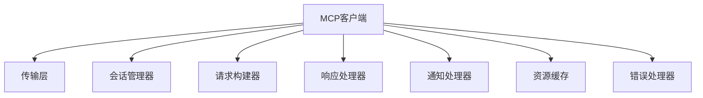

1. **传输层**：负责与主机的通信
2. **会话管理器**：管理与主机的会话
3. **请求构建器**：构建符合MCP规范的请求
4. **响应处理器**：处理主机返回的响应
5. **通知处理器**：处理来自服务器的通知
6. **资源缓存**：缓存频繁访问的资源
7. **错误处理器**：处理各种错误情况

#### 客户端接口

MCP客户端通常提供以下主要接口：

1. **会话管理接口**
   - `create_session()`: 创建新会话
   - `close_session()`: 关闭会话
   - `get_session_info()`: 获取会话信息

2. **服务器交互接口**
   - `discover_servers()`: 发现可用服务器
   - `connect_server()`: 连接到特定服务器
   - `disconnect_server()`: 断开与服务器的连接

3. **资源操作接口**
   - `create_resource()`: 创建资源
   - `read_resource()`: 读取资源
   - `update_resource()`: 更新资源
   - `delete_resource()`: 删除资源
   - `list_resources()`: 列出资源
   - `search_resources()`: 搜索资源

4. **工具调用接口**
   - `discover_tools()`: 发现可用工具
   - `invoke_tool()`: 调用工具
   - `get_tool_status()`: 获取工具执行状态
   - `cancel_tool()`: 取消工具执行

5. **通知处理接口**
   - `add_notification_handler()`: 添加通知处理器
   - `remove_notification_handler()`: 移除通知处理器

#### 会话管理

MCP客户端负责创建和管理与主机的会话：

1. **会话创建**：连接主机并创建新会话
2. **会话配置**：设置会话参数和权限
3. **会话维护**：保持会话活跃，处理会话超时
4. **会话关闭**：主动关闭不再需要的会话

会话创建示例：

```python
def create_session(self, permissions=None):
    """创建新会话"""
    # 构建请求
    request = {
        "jsonrpc": "2.0",
        "id": str(uuid.uuid4()),
        "method": "create_session",
        "params": {}
    }
    
    # 添加权限配置
    if permissions:
        request["params"]["permissions"] = permissions
    
    # 发送请求
    response = self.transport.send(json.dumps(request))
    response_obj = json.loads(response)
    
    # 检查错误
    if "error" in response_obj:
        raise Exception(f"Failed to create session: {response_obj['error']}")
    
    # 保存会话信息
    session_id = response_obj["result"]["session_id"]
    self.session = {
        "id": session_id,
        "created_at": time.time(),
        "expires_at": response_obj["result"]["expires_at"]
    }
    
    return session_id
```

#### 服务器发现与连接

客户端通过主机发现和连接可用的服务器：

1. **服务器发现**：查询主机获取可用服务器列表
2. **能力匹配**：根据需要的能力选择合适的服务器
3. **服务器连接**：建立与选定服务器的连接
4. **连接管理**：维护与多个服务器的连接

服务器发现和连接示例：

```python
def discover_servers(self, capabilities=None):
    """发现可用服务器"""
    # 构建请求
    request = {
        "jsonrpc": "2.0",
        "id": str(uuid.uuid4()),
        "method": "discover_servers",
        "params": {},
        "session": self.session["id"]
    }
    
    # 添加能力需求
    if capabilities:
        request["params"]["capabilities"] = capabilities
    
    # 发送请求
    response = self.transport.send(json.dumps(request))
    response_obj = json.loads(response)
    
    # 检查错误
    if "error" in response_obj:
        raise Exception(f"Failed to discover servers: {response_obj['error']}")
    
    # 返回服务器列表
    return response_obj["result"]["servers"]

def connect_server(self, server_id):
    """连接到特定服务器"""
    # 构建请求
    request = {
        "jsonrpc": "2.0",
        "id": str(uuid.uuid4()),
        "method": "connect_server",
        "params": {
            "server_id": server_id
        },
        "session": self.session["id"]
    }
    
    # 发送请求
    response = self.transport.send(json.dumps(request))
    response_obj = json.loads(response)
    
    # 检查错误
    if "error" in response_obj:
        raise Exception(f"Failed to connect to server: {response_obj['error']}")
    
    # 保存服务器连接信息
    server_info = response_obj["result"]["server_info"]
    self.connected_servers[server_id] = server_info
    
    return server_info
```

#### 资源操作

MCP客户端提供统一的资源操作接口，用于访问和管理各种资源：

1. **资源创建**：创建新的资源实例
2. **资源读取**：获取资源的内容或状态
3. **资源更新**：修改资源的内容或状态
4. **资源删除**：移除资源实例
5. **资源列表**：获取可用资源的列表
6. **资源搜索**：根据条件查找资源

资源操作示例：

```python
def create_resource(self, server_id, resource_type, content):
    """创建资源"""
    # 构建请求
    request = {
        "jsonrpc": "2.0",
        "id": str(uuid.uuid4()),
        "method": "create_resource",
        "params": {
            "type": resource_type,
            "content": content
        },
        "session": self.session["id"],
        "target": server_id
    }
    
    # 发送请求
    response = self.transport.send(json.dumps(request))
    response_obj = json.loads(response)
    
    # 检查错误
    if "error" in response_obj:
        raise Exception(f"Failed to create resource: {response_obj['error']}")
    
    # 返回资源ID
    return response_obj["result"]["id"]

def read_resource(self, server_id, resource_id):
    """读取资源"""
    # 检查缓存
    cache_key = f"{server_id}:{resource_id}"
    if cache_key in self.resource_cache:
        cached = self.resource_cache[cache_key]
        if time.time() < cached["expires_at"]:
            return cached["content"]
    
    # 构建请求
    request = {
        "jsonrpc": "2.0",
        "id": str(uuid.uuid4()),
        "method": "read_resource",
        "params": {
            "id": resource_id
        },
        "session": self.session["id"],
        "target": server_id
    }
    
    # 发送请求
    response = self.transport.send(json.dumps(request))
    response_obj = json.loads(response)
    
    # 检查错误
    if "error" in response_obj:
        raise Exception(f"Failed to read resource: {response_obj['error']}")
    
    # 更新缓存
    content = response_obj["result"]["content"]
    self.resource_cache[cache_key] = {
        "content": content,
        "expires_at": time.time() + self.cache_ttl
    }
    
    return content
```

#### 工具调用

MCP客户端提供工具调用接口，用于发现和使用各种工具：

1. **工具发现**：获取可用工具的列表和描述
2. **工具调用**：执行工具功能并获取结果
3. **状态查询**：查询异步工具执行的状态
4. **执行取消**：取消正在执行的工具调用

工具调用示例：

```python
def discover_tools(self, server_id, category=None):
    """发现可用工具"""
    # 构建请求
    request = {
        "jsonrpc": "2.0",
        "id": str(uuid.uuid4()),
        "method": "discover_tools",
        "params": {},
        "session": self.session["id"],
        "target": server_id
    }
    
    # 添加分类过滤
    if category:
        request["params"]["category"] = category
    
    # 发送请求
    response = self.transport.send(json.dumps(request))
    response_obj = json.loads(response)
    
    # 检查错误
    if "error" in response_obj:
        raise Exception(f"Failed to discover tools: {response_obj['error']}")
    
    # 返回工具列表
    return response_obj["result"]["tools"]

def invoke_tool(self, server_id, tool_name, parameters, async_mode=False):
    """调用工具"""
    # 构建请求
    request = {
        "jsonrpc": "2.0",
        "id": str(uuid.uuid4()),
        "method": "invoke_tool",
        "params": {
            "name": tool_name,
            "parameters": parameters,
            "async": async_mode
        },
        "session": self.session["id"],
        "target": server_id
    }
    
    # 发送请求
    response = self.transport.send(json.dumps(request))
    response_obj = json.loads(response)
    
    # 检查错误
    if "error" in response_obj:
        raise Exception(f"Failed to invoke tool: {response_obj['error']}")
    
    # 处理异步调用
    if async_mode:
        return response_obj["result"]["task_id"]
    
    # 返回结果
    return response_obj["result"]["output"]
```

#### 通知处理

MCP客户端需要处理来自服务器的通知和事件：

1. **通知接收**：接收来自主机的通知
2. **通知分发**：将通知分发给相应的处理器
3. **通知过滤**：根据通知类型和内容过滤通知
4. **通知处理**：执行通知相关的业务逻辑

通知处理示例：

```python
def add_notification_handler(self, event_type, handler):
    """添加通知处理器"""
    if event_type not in self.notification_handlers:
        self.notification_handlers[event_type] = []
    
    self.notification_handlers[event_type].append(handler)

def remove_notification_handler(self, event_type, handler):
    """移除通知处理器"""
    if event_type in self.notification_handlers:
        if handler in self.notification_handlers[event_type]:
            self.notification_handlers[event_type].remove(handler)

def handle_notification(self, notification):
    """处理接收到的通知"""
    # 提取通知类型
    method = notification.get("method", "")
    
    # 查找处理器
    handlers = []
    if method in self.notification_handlers:
        handlers.extend(self.notification_handlers[method])
    if "*" in self.notification_handlers:
        handlers.extend(self.notification_handlers["*"])
    
    # 调用处理器
    for handler in handlers:
        try:
            handler(notification)
        except Exception as e:
            print(f"Error in notification handler: {e}")
```

#### 错误处理

MCP客户端需要处理各种错误情况：

1. **通信错误**：网络问题、连接中断等
2. **协议错误**：无效请求、格式错误等
3. **业务错误**：权限不足、资源不存在等
4. **会话错误**：会话过期、无效会话等
5. **系统错误**：服务器内部错误等

错误处理策略：

1. **错误分类**：将错误分为不同类别，采用不同处理策略
2. **重试机制**：对于临时性错误，实施自动重试
3. **降级策略**：在关键功能不可用时，提供降级方案
4. **错误报告**：记录详细错误信息，便于诊断和修复
5. **用户反馈**：向用户提供有意义的错误信息

错误处理示例：

```python
def send_request(self, method, params, server_id=None, retry_count=3):
    """发送请求并处理错误"""
    request = {
        "jsonrpc": "2.0",
        "id": str(uuid.uuid4()),
        "method": method,
        "params": params
    }
    
    # 添加会话ID
    if self.session:
        request["session"] = self.session["id"]
    
    # 添加目标服务器
    if server_id:
        request["target"] = server_id
    
    # 重试逻辑
    for attempt in range(retry_count):
        try:
            # 发送请求
            response = self.transport.send(json.dumps(request))
            response_obj = json.loads(response)
            
            # 检查错误
            if "error" in response_obj:
                error = response_obj["error"]
                error_code = error.get("code", 0)
                
                # 处理会话过期
                if error_code == -32501:  # 会话过期
                    if attempt < retry_count - 1:
                        print("Session expired, recreating...")
                        self.create_session()
                        continue
                
                # 处理其他错误
                raise MCPError(error.get("message", "Unknown error"), error_code, error.get("data"))
            
            # 返回结果
            return response_obj.get("result")
        
        except ConnectionError as e:
            # 连接错误，尝试重连
            if attempt < retry_count - 1:
                print(f"Connection error: {e}, retrying...")
                time.sleep(0.5 * (attempt + 1))  # 指数退避
                continue
            raise
        
        except json.JSONDecodeError as e:
            # JSON解析错误
            raise MCPError(f"Invalid JSON response: {e}", -32700)
        
        except Exception as e:
            # 其他错误
            if attempt < retry_count - 1:
                print(f"Error: {e}, retrying...")
                time.sleep(0.5 * (attempt + 1))
                continue
            raise
```

#### 客户端实现示例

以下是MCP客户端的完整实现示例：

```python
class MCPClient:
    def __init__(self, transport, cache_ttl=300):
        self.transport = transport
        self.session = None
        self.connected_servers = {}
        self.resource_cache = {}
        self.cache_ttl = cache_ttl
        self.notification_handlers = {}
        
        # 启动通知监听
        self.start_notification_listener()
    
    def start_notification_listener(self):
        """启动通知监听线程"""
        def listener_thread():
            while True:
                try:
                    notification = self.transport.receive()
                    if notification:
                        notification_obj = json.loads(notification)
                        # 检查是否是通知（没有id字段）
                        if "id" not in notification_obj:
                            self.handle_notification(notification_obj)
                except Exception as e:
                    print(f"Error in notification listener: {e}")
                    time.sleep(1)  # 避免CPU占用过高
        
        thread = threading.Thread(target=listener_thread)
        thread.daemon = True
        thread.start()
    
    def create_session(self, permissions=None):
        """创建新会话"""
        request = {
            "jsonrpc": "2.0",
            "id": str(uuid.uuid4()),
            "method": "create_session",
            "params": {}
        }
        
        if permissions:
            request["params"]["permissions"] = permissions
        
        response_obj = self.send_request_raw(request)
        
        session_id = response_obj["result"]["session_id"]
        self.session = {
            "id": session_id,
            "created_at": time.time(),
            "expires_at": response_obj["result"]["expires_at"]
        }
        
        return session_id
    
    def close_session(self):
        """关闭当前会话"""
        if not self.session:
            return
        
        request = {
            "jsonrpc": "2.0",
            "id": str(uuid.uuid4()),
            "method": "close_session",
            "params": {
                "session_id": self.session["id"]
            },
            "session": self.session["id"]
        }
        
        try:
            self.send_request_raw(request)
        finally:
            self.session = None
            self.connected_servers = {}
            self.resource_cache = {}
    
    def discover_servers(self, capabilities=None):
        """发现可用服务器"""
        params = {}
        if capabilities:
            params["capabilities"] = capabilities
        
        return self.send_request("discover_servers", params)
    
    def connect_server(self, server_id):
        """连接到特定服务器"""
        result = self.send_request("connect_server", {"server_id": server_id})
        
        server_info = result["server_info"]
        self.connected_servers[server_id] = server_info
        
        return server_info
    
    def disconnect_server(self, server_id):
        """断开与服务器的连接"""
        if server_id not in self.connected_servers:
            return
        
        self.send_request("disconnect_server", {"server_id": server_id})
        
        if server_id in self.connected_servers:
            del self.connected_servers[server_id]
    
    def create_resource(self, server_id, resource_type, content):
        """创建资源"""
        return self.send_request("create_resource", {
            "type": resource_type,
            "content": content
        }, server_id)["id"]
    
    def read_resource(self, server_id, resource_id):
        """读取资源"""
        # 检查缓存
        cache_key = f"{server_id}:{resource_id}"
        if cache_key in self.resource_cache:
            cached = self.resource_cache[cache_key]
            if time.time() < cached["expires_at"]:
                return cached["content"]
        
        # 发送请求
        result = self.send_request("read_resource", {"id": resource_id}, server_id)
        
        # 更新缓存
        content = result["content"]
        self.resource_cache[cache_key] = {
            "content": content,
            "expires_at": time.time() + self.cache_ttl
        }
        
        return content
    
    def update_resource(self, server_id, resource_id, content):
        """更新资源"""
        result = self.send_request("update_resource", {
            "id": resource_id,
            "content": content
        }, server_id)
        
        # 更新缓存
        cache_key = f"{server_id}:{resource_id}"
        if cache_key in self.resource_cache:
            self.resource_cache[cache_key] = {
                "content": content,
                "expires_at": time.time() + self.cache_ttl
            }
        
        return result["status"]
    
    def delete_resource(self, server_id, resource_id):
        """删除资源"""
        result = self.send_request("delete_resource", {"id": resource_id}, server_id)
        
        # 清除缓存
        cache_key = f"{server_id}:{resource_id}"
        if cache_key in self.resource_cache:
            del self.resource_cache[cache_key]
        
        return result["status"]
    
    def list_resources(self, server_id, resource_type=None, path=None):
        """列出资源"""
        params = {}
        if resource_type:
            params["type"] = resource_type
        if path:
            params["path"] = path
        
        return self.send_request("list_resources", params, server_id)["resources"]
    
    def search_resources(self, server_id, query, resource_type=None, limit=10):
        """搜索资源"""
        params = {
            "query": query,
            "limit": limit
        }
        if resource_type:
            params["type"] = resource_type
        
        return self.send_request("search_resources", params, server_id)["results"]
    
    def discover_tools(self, server_id, category=None):
        """发现可用工具"""
        params = {}
        if category:
            params["category"] = category
        
        return self.send_request("discover_tools", params, server_id)["tools"]
    
    def invoke_tool(self, server_id, tool_name, parameters, async_mode=False):
        """调用工具"""
        params = {
            "name": tool_name,
            "parameters": parameters,
            "async": async_mode
        }
        
        result = self.send_request("invoke_tool", params, server_id)
        
        if async_mode:
            return result["task_id"]
        return result["output"]
    
    def get_tool_status(self, server_id, task_id):
        """获取工具执行状态"""
        return self.send_request("get_tool_status", {"task_id": task_id}, server_id)
    
    def cancel_tool(self, server_id, task_id):
        """取消工具执行"""
        return self.send_request("cancel_tool", {"task_id": task_id}, server_id)["status"]
    
    def add_notification_handler(self, event_type, handler):
        """添加通知处理器"""
        if event_type not in self.notification_handlers:
            self.notification_handlers[event_type] = []
        
        self.notification_handlers[event_type].append(handler)
    
    def remove_notification_handler(self, event_type, handler):
        """移除通知处理器"""
        if event_type in self.notification_handlers:
            if handler in self.notification_handlers[event_type]:
                self.notification_handlers[event_type].remove(handler)
    
    def handle_notification(self, notification):
        """处理接收到的通知"""
        method = notification.get("method", "")
        
        handlers = []
        if method in self.notification_handlers:
            handlers.extend(self.notification_handlers[method])
        if "*" in self.notification_handlers:
            handlers.extend(self.notification_handlers["*"])
        
        for handler in handlers:
            try:
                handler(notification)
            except Exception as e:
                print(f"Error in notification handler: {e}")
    
    def send_request(self, method, params, server_id=None, retry_count=3):
        """发送请求并处理错误"""
        if not self.session:
            self.create_session()
        
        request = {
            "jsonrpc": "2.0",
            "id": str(uuid.uuid4()),
            "method": method,
            "params": params,
            "session": self.session["id"]
        }
        
        if server_id:
            request["target"] = server_id
        
        for attempt in range(retry_count):
            try:
                return self.send_request_raw(request)["result"]
            except MCPError as e:
                # 处理会话过期
                if e.code == -32501 and attempt < retry_count - 1:  # 会话过期
                    print("Session expired, recreating...")
                    self.create_session()
                    request["session"] = self.session["id"]
                    continue
                raise
            except (ConnectionError, TimeoutError) as e:
                # 连接错误，尝试重连
                if attempt < retry_count - 1:
                    print(f"Connection error: {e}, retrying...")
                    time.sleep(0.5 * (attempt + 1))  # 指数退避
                    continue
                raise
    
    def send_request_raw(self, request):
        """发送原始请求并返回完整响应"""
        response = self.transport.send(json.dumps(request))
        response_obj = json.loads(response)
        
        if "error" in response_obj:
            error = response_obj["error"]
            raise MCPError(
                error.get("message", "Unknown error"),
                error.get("code", 0),
                error.get("data")
            )
        
        return response_obj
```

### 2.2.3 MCP服务器（Server）详解

MCP服务器是提供特定资源或功能的组件，负责处理客户端通过主机发送的请求，并可能主动发送通知。服务器是MCP架构中的核心功能提供者。

#### 服务器的核心职责

MCP服务器具有以下核心职责：

1. **资源管理**：提供资源的创建、读取、更新和删除功能
2. **工具提供**：提供各种工具功能供客户端调用
3. **提示模板**：提供结构化的提示模板
4. **请求处理**：处理来自主机转发的客户端请求
5. **通知发送**：向客户端发送事件和状态变更通知
6. **能力声明**：向主机声明自身提供的能力
7. **安全控制**：实施细粒度的访问控制和安全措施

#### 服务器架构

MCP服务器的内部架构通常包括以下组件：

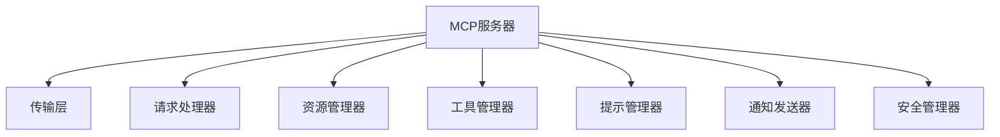

1. **传输层**：负责与主机的通信
2. **请求处理器**：解析和处理客户端请求
3. **资源管理器**：管理服务器提供的资源
4. **工具管理器**：管理服务器提供的工具
5. **提示管理器**：管理服务器提供的提示模板
6. **通知发送器**：向客户端发送通知
7. **安全管理器**：实施访问控制和安全措施

#### 服务器类型

MCP服务器根据提供的功能可以分为几种主要类型：

1. **资源型服务器**：主要提供资源访问功能
   - 文件服务器：提供文件系统访问
   - 数据库服务器：提供数据库访问
   - API服务器：提供外部API访问
   - 知识库服务器：提供知识库访问

2. **工具型服务器**：主要提供工具调用功能
   - 计算服务器：提供数学计算工具
   - 转换服务器：提供格式转换工具
   - 生成服务器：提供内容生成工具
   - 分析服务器：提供数据分析工具

3. **提示型服务器**：主要提供提示模板
   - 领域提示服务器：提供特定领域的提示
   - 任务提示服务器：提供特定任务的提示
   - 风格提示服务器：提供特定风格的提示

4. **混合型服务器**：提供多种类型的功能
   - 全能服务器：提供资源、工具和提示
   - 领域服务器：提供特定领域的综合功能

#### 服务器接口

MCP服务器通常提供以下主要接口：

1. **注册接口**
   - `register()`: 向主机注册服务器
   - `unregister()`: 从主机注销服务器
   - `declare_capabilities()`: 声明服务器能力

2. **资源接口**
   - `create_resource()`: 创建资源
   - `read_resource()`: 读取资源
   - `update_resource()`: 更新资源
   - `delete_resource()`: 删除资源
   - `list_resources()`: 列出资源
   - `search_resources()`: 搜索资源

3. **工具接口**
   - `discover_tools()`: 发现可用工具
   - `invoke_tool()`: 调用工具
   - `get_tool_status()`: 获取工具执行状态
   - `cancel_tool()`: 取消工具执行

4. **提示接口**
   - `get_prompt()`: 获取提示模板
   - `render_prompt()`: 渲染提示模板
   - `list_prompts()`: 列出可用提示模板

5. **通知接口**
   - `send_notification()`: 发送通知给客户端

#### 服务器注册与能力声明

MCP服务器需要向主机注册自身并声明提供的能力：

1. **服务器注册**：连接主机并注册服务器身份
2. **能力声明**：声明服务器提供的资源类型、工具和提示
3. **元数据提供**：提供服务器的名称、描述、版本等信息
4. **健康报告**：定期向主机报告健康状态

服务器注册示例：

```python
def register(self):
    """向主机注册服务器"""
    # 构建注册请求
    request = {
        "jsonrpc": "2.0",
        "id": str(uuid.uuid4()),
        "method": "register_server",
        "params": {
            "id": self.server_id,
            "name": self.name,
            "description": self.description,
            "version": self.version,
            "capabilities": self.get_capabilities()
        }
    }
    
    # 发送请求
    response = self.transport.send(json.dumps(request))
    response_obj = json.loads(response)
    
    # 检查错误
    if "error" in response_obj:
        raise Exception(f"Failed to register server: {response_obj['error']}")
    
    # 保存注册状态
    self.registered = True
    
    return response_obj["result"]

def get_capabilities(self):
    """获取服务器能力声明"""
    capabilities = {
        "resource_types": [],
        "tools": [],
        "prompts": []
    }
    
    # 添加资源类型
    for resource_type in self.resource_handlers:
        capabilities["resource_types"].append({
            "type": resource_type,
            "operations": self.resource_handlers[resource_type]["operations"],
            "description": self.resource_handlers[resource_type]["description"]
        })
    
    # 添加工具
    for tool_name in self.tool_handlers:
        capabilities["tools"].append({
            "name": tool_name,
            "description": self.tool_handlers[tool_name]["description"],
            "parameters": self.tool_handlers[tool_name]["parameters"],
            "returns": self.tool_handlers[tool_name]["returns"]
        })
    
    # 添加提示
    for prompt_id in self.prompt_templates:
        capabilities["prompts"].append({
            "id": prompt_id,
            "description": self.prompt_templates[prompt_id]["description"],
            "parameters": self.prompt_templates[prompt_id]["parameters"]
        })
    
    return capabilities
```

#### 资源管理

MCP服务器需要管理各种资源，提供统一的资源操作接口：

1. **资源抽象**：将不同类型的实体抽象为资源
2. **资源标识**：为每个资源分配唯一标识符
3. **资源操作**：提供标准的CRUD操作
4. **资源元数据**：管理资源的元数据信息
5. **资源权限**：控制资源的访问权限

资源管理示例：

```python
def register_resource_handler(self, resource_type, handler, operations, description=""):
    """注册资源处理器"""
    self.resource_handlers[resource_type] = {
        "handler": handler,
        "operations": operations,
        "description": description
    }

def handle_resource_request(self, method, params, session_id):
    """处理资源请求"""
    # 提取资源类型
    resource_type = params.get("type")
    
    # 检查资源类型是否支持
    if not resource_type or resource_type not in self.resource_handlers:
        return {"error": {"code": -32202, "message": "Resource type not supported"}}
    
    # 检查操作是否支持
    operation = method.split("_")[0]  # create, read, update, delete, list, search
    if operation not in self.resource_handlers[resource_type]["operations"]:
        return {"error": {"code": -32203, "message": "Operation not supported for this resource type"}}
    
    # 调用处理器
    handler = self.resource_handlers[resource_type]["handler"]
    try:
        result = handler(operation, params, session_id)
        return {"result": result}
    except Exception as e:
        return {"error": {"code": -32000, "message": str(e)}}
```

#### 工具管理

MCP服务器需要管理各种工具，提供工具发现和调用接口：

1. **工具注册**：注册可用的工具
2. **参数验证**：验证工具调用参数
3. **工具执行**：执行工具功能
4. **结果返回**：返回工具执行结果
5. **异步执行**：支持长时间运行的异步工具

工具管理示例：

```python
def register_tool(self, name, handler, description, parameters, returns):
    """注册工具"""
    self.tool_handlers[name] = {
        "handler": handler,
        "description": description,
        "parameters": parameters,
        "returns": returns
    }

def handle_tool_request(self, method, params, session_id):
    """处理工具请求"""
    if method == "discover_tools":
        # 处理工具发现请求
        category = params.get("category")
        tools = []
        
        for name, tool in self.tool_handlers.items():
            if not category or tool.get("category") == category:
                tools.append({
                    "name": name,
                    "description": tool["description"],
                    "parameters": tool["parameters"],
                    "returns": tool["returns"]
                })
        
        return {"result": {"tools": tools}}
    
    elif method == "invoke_tool":
        # 处理工具调用请求
        tool_name = params.get("name")
        tool_params = params.get("parameters", {})
        async_mode = params.get("async", False)
        
        # 检查工具是否存在
        if not tool_name or tool_name not in self.tool_handlers:
            return {"error": {"code": -32301, "message": "Tool not found"}}
        
        # 验证参数
        tool = self.tool_handlers[tool_name]
        try:
            self.validate_parameters(tool_params, tool["parameters"])
        except ValueError as e:
            return {"error": {"code": -32302, "message": f"Invalid parameters: {e}"}}
        
        # 执行工具
        try:
            if async_mode:
                # 异步执行
                task_id = str(uuid.uuid4())
                self.async_tasks[task_id] = {
                    "status": "running",
                    "tool": tool_name,
                    "parameters": tool_params,
                    "session_id": session_id,
                    "started_at": time.time()
                }
                
                # 启动异步任务
                threading.Thread(
                    target=self.run_async_tool,
                    args=(task_id, tool["handler"], tool_params, session_id)
                ).start()
                
                return {"result": {"task_id": task_id}}
            else:
                # 同步执行
                output = tool["handler"](tool_params, session_id)
                return {"result": {"output": output}}
        except Exception as e:
            return {"error": {"code": -32000, "message": f"Tool execution error: {e}"}}
    
    elif method == "get_tool_status":
        # 处理工具状态查询请求
        task_id = params.get("task_id")
        
        if not task_id or task_id not in self.async_tasks:
            return {"error": {"code": -32303, "message": "Task not found"}}
        
        task = self.async_tasks[task_id]
        
        # 检查会话权限
        if task["session_id"] != session_id:
            return {"error": {"code": -32401, "message": "Permission denied"}}
        
        return {"result": {
            "status": task["status"],
            "progress": task.get("progress", 0),
            "output": task.get("output"),
            "error": task.get("error")
        }}
    
    elif method == "cancel_tool":
        # 处理工具取消请求
        task_id = params.get("task_id")
        
        if not task_id or task_id not in self.async_tasks:
            return {"error": {"code": -32303, "message": "Task not found"}}
        
        task = self.async_tasks[task_id]
        
        # 检查会话权限
        if task["session_id"] != session_id:
            return {"error": {"code": -32401, "message": "Permission denied"}}
        
        # 标记任务为取消
        task["status"] = "cancelled"
        
        return {"result": {"status": "cancelled"}}
    
    return {"error": {"code": -32601, "message": "Method not found"}}

def run_async_tool(self, task_id, handler, parameters, session_id):
    """异步执行工具"""
    try:
        # 执行工具
        output = handler(parameters, session_id)
        
        # 更新任务状态
        self.async_tasks[task_id].update({
            "status": "completed",
            "output": output,
            "completed_at": time.time()
        })
        
        # 发送完成通知
        self.send_notification({
            "method": "tool_completed",
            "params": {
                "task_id": task_id,
                "output": output
            }
        }, [session_id])
    except Exception as e:
        # 更新任务状态为错误
        self.async_tasks[task_id].update({
            "status": "error",
            "error": str(e),
            "completed_at": time.time()
        })
        
        # 发送错误通知
        self.send_notification({
            "method": "tool_error",
            "params": {
                "task_id": task_id,
                "error": str(e)
            }
        }, [session_id])
```

#### 提示管理

MCP服务器可以提供提示模板管理功能：

1. **模板注册**：注册提示模板
2. **模板获取**：获取提示模板
3. **模板渲染**：使用参数渲染模板
4. **模板版本**：管理模板的不同版本

提示管理示例：

```python
def register_prompt_template(self, prompt_id, template, description, parameters, version="1.0"):
    """注册提示模板"""
    self.prompt_templates[prompt_id] = {
        "template": template,
        "description": description,
        "parameters": parameters,
        "version": version
    }

def handle_prompt_request(self, method, params, session_id):
    """处理提示请求"""
    if method == "get_prompt":
        # 处理获取提示模板请求
        prompt_id = params.get("id")
        version = params.get("version")
        
        # 检查提示是否存在
        if not prompt_id or prompt_id not in self.prompt_templates:
            return {"error": {"code": -32401, "message": "Prompt not found"}}
        
        prompt = self.prompt_templates[prompt_id]
        
        # 检查版本
        if version and prompt["version"] != version:
            return {"error": {"code": -32402, "message": "Prompt version not found"}}
        
        return {"result": {
            "id": prompt_id,
            "template": prompt["template"],
            "description": prompt["description"],
            "parameters": prompt["parameters"],
            "version": prompt["version"]
        }}
    
    elif method == "render_prompt":
        # 处理渲染提示模板请求
        prompt_id = params.get("id")
        template_params = params.get("parameters", {})
        
        # 检查提示是否存在
        if not prompt_id or prompt_id not in self.prompt_templates:
            return {"error": {"code": -32401, "message": "Prompt not found"}}
        
        prompt = self.prompt_templates[prompt_id]
        
        # 验证参数
        try:
            self.validate_parameters(template_params, prompt["parameters"])
        except ValueError as e:
            return {"error": {"code": -32402, "message": f"Invalid parameters: {e}"}}
        
        # 渲染模板
        try:
            rendered = self.render_template(prompt["template"], template_params)
            return {"result": {"rendered": rendered}}
        except Exception as e:
            return {"error": {"code": -32000, "message": f"Template rendering error: {e}"}}
    
    elif method == "list_prompts":
        # 处理列出提示模板请求
        category = params.get("category")
        prompts = []
        
        for prompt_id, prompt in self.prompt_templates.items():
            if not category or prompt.get("category") == category:
                prompts.append({
                    "id": prompt_id,
                    "description": prompt["description"],
                    "version": prompt["version"]
                })
        
        return {"result": {"prompts": prompts}}
    
    return {"error": {"code": -32601, "message": "Method not found"}}

def render_template(self, template, parameters):
    """渲染模板"""
    # 简单的模板渲染实现
    rendered = template
    for key, value in parameters.items():
        placeholder = f"{{{{{key}}}}}"
        rendered = rendered.replace(placeholder, str(value))
    return rendered
```

#### 通知发送

MCP服务器可以主动向客户端发送通知：

1. **事件通知**：资源变更、状态更新等事件
2. **进度通知**：长时间运行任务的进度更新
3. **警报通知**：重要事件或错误的警报
4. **系统通知**：系统状态或配置变更通知

通知发送示例：

```python
def send_notification(self, notification, target_sessions=None):
    """发送通知给客户端"""
    # 构建通知
    notification_obj = {
        "jsonrpc": "2.0",
        "method": notification["method"],
        "params": notification["params"],
        "source": self.server_id
    }
    
    # 添加目标会话
    if target_sessions:
        notification_obj["target_sessions"] = target_sessions
    
    # 发送通知
    try:
        self.transport.send_notification(json.dumps(notification_obj))
        return True
    except Exception as e:
        print(f"Failed to send notification: {e}")
        return False

def notify_resource_changed(self, resource_type, resource_id, operation, session_id=None):
    """通知资源变更"""
    notification = {
        "method": "resource_changed",
        "params": {
            "type": resource_type,
            "id": resource_id,
            "operation": operation,
            "timestamp": time.time()
        }
    }
    
    # 如果指定了会话，只通知该会话
    target_sessions = [session_id] if session_id else None
    
    return self.send_notification(notification, target_sessions)

def update_tool_progress(self, task_id, progress, status="running", message=None):
    """更新工具执行进度"""
    if task_id not in self.async_tasks:
        return False
    
    task = self.async_tasks[task_id]
    session_id = task["session_id"]
    
    # 更新任务状态
    task["progress"] = progress
    task["status"] = status
    if message:
        task["message"] = message
    
    # 发送进度通知
    notification = {
        "method": "tool_progress",
        "params": {
            "task_id": task_id,
            "progress": progress,
            "status": status,
            "message": message
        }
    }
    
    return self.send_notification(notification, [session_id])
```

#### 安全控制

MCP服务器需要实施安全控制，保护资源和功能：

1. **权限验证**：验证客户端的访问权限
2. **资源隔离**：隔离不同会话的资源
3. **输入验证**：验证和清理客户端输入
4. **限流控制**：限制请求频率和资源使用
5. **审计日志**：记录关键操作的审计日志

安全控制示例：

```python
def check_permission(self, session_id, resource_type, resource_id, operation):
    """检查会话是否有权限访问资源"""
    # 获取会话信息
    session_info = self.get_session_info(session_id)
    if not session_info:
        return False
    
    # 检查资源权限
    permissions = session_info.get("permissions", {})
    
    # 检查资源类型权限
    if "resources" in permissions:
        for resource_perm in permissions["resources"]:
            if resource_perm["type"] == resource_type:
                # 检查操作权限
                if "operations" in resource_perm and operation not in resource_perm["operations"]:
                    continue
                
                # 检查资源ID匹配
                if "patterns" in resource_perm:
                    for pattern in resource_perm["patterns"]:
                        if self.match_resource_pattern(resource_id, pattern):
                            return True
                else:
                    # 如果没有指定模式，允许访问该类型的所有资源
                    return True
    
    return False

def validate_parameters(self, params, schema):
    """验证参数是否符合模式"""
    # 检查必需参数
    if "required" in schema:
        for param in schema["required"]:
            if param not in params:
                raise ValueError(f"Missing required parameter: {param}")
    
    # 检查参数类型和值
    if "properties" in schema:
        for param, param_schema in schema["properties"].items():
            if param in params:
                value = params[param]
                
                # 检查类型
                if "type" in param_schema:
                    if param_schema["type"] == "string" and not isinstance(value, str):
                        raise ValueError(f"Parameter {param} must be a string")
                    elif param_schema["type"] == "number" and not isinstance(value, (int, float)):
                        raise ValueError(f"Parameter {param} must be a number")
                    elif param_schema["type"] == "integer" and not isinstance(value, int):
                        raise ValueError(f"Parameter {param} must be an integer")
                    elif param_schema["type"] == "boolean" and not isinstance(value, bool):
                        raise ValueError(f"Parameter {param} must be a boolean")
                    elif param_schema["type"] == "array" and not isinstance(value, list):
                        raise ValueError(f"Parameter {param} must be an array")
                    elif param_schema["type"] == "object" and not isinstance(value, dict):
                        raise ValueError(f"Parameter {param} must be an object")
                
                # 检查范围
                if "minimum" in param_schema and value < param_schema["minimum"]:
                    raise ValueError(f"Parameter {param} must be at least {param_schema['minimum']}")
                if "maximum" in param_schema and value > param_schema["maximum"]:
                    raise ValueError(f"Parameter {param} must be at most {param_schema['maximum']}")
                
                # 检查长度
                if "minLength" in param_schema and len(value) < param_schema["minLength"]:
                    raise ValueError(f"Parameter {param} must have at least {param_schema['minLength']} characters")
                if "maxLength" in param_schema and len(value) > param_schema["maxLength"]:
                    raise ValueError(f"Parameter {param} must have at most {param_schema['maxLength']} characters")
                
                # 检查枚举值
                if "enum" in param_schema and value not in param_schema["enum"]:
                    raise ValueError(f"Parameter {param} must be one of: {', '.join(map(str, param_schema['enum']))}")
    
    return True

def rate_limit_check(self, session_id, operation):
    """检查请求是否超过速率限制"""
    current_time = time.time()
    
    # 初始化会话的速率限制记录
    if session_id not in self.rate_limits:
        self.rate_limits[session_id] = {
            "operations": {},
            "last_reset": current_time
        }
    
    session_limits = self.rate_limits[session_id]
    
    # 每分钟重置计数
    if current_time - session_limits["last_reset"] > 60:
        session_limits["operations"] = {}
        session_limits["last_reset"] = current_time
    
    # 初始化操作计数
    if operation not in session_limits["operations"]:
        session_limits["operations"][operation] = 0
    
    # 增加计数
    session_limits["operations"][operation] += 1
    
    # 检查是否超过限制
    limit = self.get_rate_limit(session_id, operation)
    return session_limits["operations"][operation] <= limit

def get_rate_limit(self, session_id, operation):
    """获取会话和操作的速率限制"""
    # 默认限制
    default_limits = {
        "read_resource": 100,
        "create_resource": 20,
        "update_resource": 20,
        "delete_resource": 10,
        "invoke_tool": 50
    }
    
    # 获取会话特定的限制
    session_info = self.get_session_info(session_id)
    if session_info and "rate_limits" in session_info:
        session_limits = session_info["rate_limits"]
        if operation in session_limits:
            return session_limits[operation]
    
    # 返回默认限制
    return default_limits.get(operation, 10)

def log_audit_event(self, session_id, operation, resource_type=None, resource_id=None, details=None):
    """记录审计事件"""
    event = {
        "timestamp": time.time(),
        "session_id": session_id,
        "operation": operation,
        "server_id": self.server_id
    }
    
    if resource_type:
        event["resource_type"] = resource_type
    
    if resource_id:
        event["resource_id"] = resource_id
    
    if details:
        event["details"] = details
    
    # 记录审计事件
    self.audit_log.append(event)
    
    # 如果审计日志太长，删除旧条目
    if len(self.audit_log) > self.max_audit_log_size:
        self.audit_log = self.audit_log[-self.max_audit_log_size:]
    
    # 可以选择将审计日志写入外部存储
    if self.audit_log_handler:
        self.audit_log_handler(event)
```

#### 服务器实现示例

以下是MCP服务器的完整实现示例：

```python
class MCPServer:
    def __init__(self, server_id, name, description="", version="1.0", transport=None):
        self.server_id = server_id
        self.name = name
        self.description = description
        self.version = version
        self.transport = transport
        
        self.registered = False
        self.resource_handlers = {}
        self.tool_handlers = {}
        self.prompt_templates = {}
        self.async_tasks = {}
        self.sessions = {}
        self.rate_limits = {}
        self.audit_log = []
        self.max_audit_log_size = 1000
        self.audit_log_handler = None
        
        # 请求处理映射
        self.request_handlers = {
            "create_resource": self.handle_resource_request,
            "read_resource": self.handle_resource_request,
            "update_resource": self.handle_resource_request,
            "delete_resource": self.handle_resource_request,
            "list_resources": self.handle_resource_request,
            "search_resources": self.handle_resource_request,
            
            "discover_tools": self.handle_tool_request,
            "invoke_tool": self.handle_tool_request,
            "get_tool_status": self.handle_tool_request,
            "cancel_tool": self.handle_tool_request,
            
            "get_prompt": self.handle_prompt_request,
            "render_prompt": self.handle_prompt_request,
            "list_prompts": self.handle_prompt_request
        }
    
    def start(self):
        """启动服务器"""
        if not self.transport:
            raise ValueError("Transport not configured")
        
        # 连接到主机
        self.transport.connect()
        
        # 注册服务器
        self.register()
        
        # 启动请求处理循环
        self.handle_requests()
    
    def stop(self):
        """停止服务器"""
        if self.registered:
            try:
                self.unregister()
            except:
                pass
        
        if self.transport:
            self.transport.disconnect()
    
    def register(self):
        """向主机注册服务器"""
        request = {
            "jsonrpc": "2.0",
            "id": str(uuid.uuid4()),
            "method": "register_server",
            "params": {
                "id": self.server_id,
                "name": self.name,
                "description": self.description,
                "version": self.version,
                "capabilities": self.get_capabilities()
            }
        }
        
        response = self.transport.send(json.dumps(request))
        response_obj = json.loads(response)
        
        if "error" in response_obj:
            raise Exception(f"Failed to register server: {response_obj['error']}")
        
        self.registered = True
        return response_obj["result"]
    
    def unregister(self):
        """从主机注销服务器"""
        request = {
            "jsonrpc": "2.0",
            "id": str(uuid.uuid4()),
            "method": "unregister_server",
            "params": {
                "id": self.server_id
            }
        }
        
        response = self.transport.send(json.dumps(request))
        response_obj = json.loads(response)
        
        if "error" in response_obj:
            raise Exception(f"Failed to unregister server: {response_obj['error']}")
        
        self.registered = False
        return response_obj["result"]
    
    def get_capabilities(self):
        """获取服务器能力声明"""
        capabilities = {
            "resource_types": [],
            "tools": [],
            "prompts": []
        }
        
        # 添加资源类型
        for resource_type, handler_info in self.resource_handlers.items():
            capabilities["resource_types"].append({
                "type": resource_type,
                "operations": handler_info["operations"],
                "description": handler_info["description"]
            })
        
        # 添加工具
        for tool_name, tool_info in self.tool_handlers.items():
            capabilities["tools"].append({
                "name": tool_name,
                "description": tool_info["description"],
                "parameters": tool_info["parameters"],
                "returns": tool_info["returns"]
            })
        
        # 添加提示
        for prompt_id, prompt_info in self.prompt_templates.items():
            capabilities["prompts"].append({
                "id": prompt_id,
                "description": prompt_info["description"],
                "parameters": prompt_info["parameters"],
                "version": prompt_info["version"]
            })
        
        return capabilities
    
    def handle_requests(self):
        """处理来自主机的请求"""
        while self.registered:
            try:
                # 接收请求
                request_data = self.transport.receive()
                if not request_data:
                    time.sleep(0.01)  # 避免CPU占用过高
                    continue
                
                # 解析请求
                request = json.loads(request_data)
                
                # 检查是否是通知
                if "id" not in request:
                    self.handle_notification(request)
                    continue
                
                # 处理请求
                response = self.process_request(request)
                
                # 发送响应
                self.transport.send(json.dumps(response))
            except Exception as e:
                print(f"Error handling request: {e}")
    
    def process_request(self, request):
        """处理请求并生成响应"""
        # 基本验证
        if "jsonrpc" not in request or request["jsonrpc"] != "2.0":
            return {
                "jsonrpc": "2.0",
                "id": request.get("id"),
                "error": {"code": -32600, "message": "Invalid Request"}
            }
        
        method = request.get("method")
        params = request.get("params", {})
        session_id = request.get("session")
        
        # 检查方法是否支持
        if not method or method not in self.request_handlers:
            return {
                "jsonrpc": "2.0",
                "id": request["id"],
                "error": {"code": -32601, "message": "Method not found"}
            }
        
        # 检查会话
        if not session_id:
            return {
                "jsonrpc": "2.0",
                "id": request["id"],
                "error": {"code": -32501, "message": "Session required"}
            }
        
        # 检查速率限制
        if not self.rate_limit_check(session_id, method):
            return {
                "jsonrpc": "2.0",
                "id": request["id"],
                "error": {"code": -32429, "message": "Too Many Requests"}
            }
        
        # 记录审计事件
        self.log_audit_event(session_id, method, 
                            params.get("type"), params.get("id"))
        
        # 调用处理器
        try:
            handler = self.request_handlers[method]
            result = handler(method, params, session_id)
            
            # 构建响应
            response = {
                "jsonrpc": "2.0",
                "id": request["id"]
            }
            
            # 添加结果或错误
            if "error" in result:
                response["error"] = result["error"]
            else:
                response["result"] = result["result"]
            
            return response
        except Exception as e:
            # 处理未捕获的异常
            return {
                "jsonrpc": "2.0",
                "id": request["id"],
                "error": {"code": -32000, "message": f"Server error: {str(e)}"}
            }
    
    def handle_notification(self, notification):
        """处理来自主机的通知"""
        method = notification.get("method")
        params = notification.get("params", {})
        
        if method == "session_connected":
            # 处理会话连接通知
            session_id = params.get("session_id")
            client_id = params.get("client_id")
            
            if session_id:
                self.sessions[session_id] = {
                    "client_id": client_id,
                    "connected_at": time.time(),
                    "last_activity": time.time()
                }
        
        elif method == "session_closed":
            # 处理会话关闭通知
            session_id = params.get("session_id")
            
            if session_id and session_id in self.sessions:
                # 清理会话资源
                self.cleanup_session(session_id)
                
                # 删除会话记录
                del self.sessions[session_id]
    
    def cleanup_session(self, session_id):
        """清理会话相关资源"""
        # 取消会话的异步任务
        tasks_to_cancel = []
        for task_id, task in self.async_tasks.items():
            if task["session_id"] == session_id and task["status"] == "running":
                tasks_to_cancel.append(task_id)
        
        for task_id in tasks_to_cancel:
            self.async_tasks[task_id]["status"] = "cancelled"
        
        # 清理会话的速率限制记录
        if session_id in self.rate_limits:
            del self.rate_limits[session_id]
    
    def register_resource_handler(self, resource_type, handler, operations, description=""):
        """注册资源处理器"""
        self.resource_handlers[resource_type] = {
            "handler": handler,
            "operations": operations,
            "description": description
        }
    
    def register_tool(self, name, handler, description, parameters, returns):
        """注册工具"""
        self.tool_handlers[name] = {
            "handler": handler,
            "description": description,
            "parameters": parameters,
            "returns": returns
        }
    
    def register_prompt_template(self, prompt_id, template, description, parameters, version="1.0"):
        """注册提示模板"""
        self.prompt_templates[prompt_id] = {
            "template": template,
            "description": description,
            "parameters": parameters,
            "version": version
        }
    
    def set_audit_log_handler(self, handler):
        """设置审计日志处理器"""
        self.audit_log_handler = handler
    
    def get_session_info(self, session_id):
        """获取会话信息"""
        if session_id in self.sessions:
            # 更新最后活动时间
            self.sessions[session_id]["last_activity"] = time.time()
            return self.sessions[session_id]
        return None
    
    def match_resource_pattern(self, resource_id, pattern):
        """检查资源ID是否匹配模式"""
        if pattern.endswith("*"):
            return resource_id.startswith(pattern[:-1])
        return resource_id == pattern
```

## 2.3 MCP核心能力

MCP的核心能力包括资源管理、工具集成和提示模板，这些能力共同构成了MCP的功能基础。本节将详细介绍这三种核心能力的设计、实现和应用。

### 2.3.1 资源（Resources）管理

资源是MCP中的核心概念，代表可被访问和操作的实体，如文件、数据库记录、API等。MCP提供了统一的资源抽象和操作接口，简化了AI模型与外部世界的交互。

#### 资源模型

MCP的资源模型基于以下核心概念：

1. **资源标识符(URI)**：唯一标识资源的字符串
2. **资源类型**：定义资源的性质和行为
3. **资源内容**：资源的实际数据
4. **资源元数据**：描述资源的附加信息
5. **资源操作**：可对资源执行的操作

资源的基本结构可以表示为：

```json
{
  "id": "resource-uri",
  "type": "resource-type",
  "metadata": {
    "created": "2024-04-10T10:00:00Z",
    "modified": "2024-04-10T11:30:00Z",
    "size": 1024,
    "owner": "user-123",
    "permissions": "rw-r--r--",
    ...
  },
  "content": "资源内容或引用"
}
```

#### 资源标识符(URI)

MCP使用统一资源标识符(URI)来唯一标识资源。URI的格式通常为：

```
scheme://authority/path?query#fragment
```

其中：
- `scheme`：资源类型或协议，如`file`、`db`、`api`等
- `authority`：资源提供者或位置
- `path`：资源路径
- `query`：可选的查询参数
- `fragment`：可选的片段标识

示例URI：
- `file:///data/documents/report.pdf`：本地文件
- `db://postgres/users/123`：数据库记录
- `api://weather/forecast?city=beijing`：API资源
- `kb://company/products?q=laptop`：知识库资源

#### 资源类型

MCP定义了多种资源类型，每种类型有特定的行为和操作：

1. **文件资源(file)**：文件系统中的文件和目录
2. **数据库资源(db)**：数据库中的记录和集合
3. **API资源(api)**：外部API提供的数据和服务
4. **知识库资源(kb)**：结构化或非结构化知识
5. **上下文资源(context)**：会话和环境上下文
6. **媒体资源(media)**：图像、音频、视频等媒体
7. **用户资源(user)**：用户信息和偏好
8. **系统资源(system)**：系统状态和配置

每种资源类型都有特定的属性和操作，但通过MCP的抽象，它们可以用统一的接口进行访问和操作。

#### 资源操作

MCP定义了一组标准的资源操作：

1. **创建(create)**：创建新的资源实例
2. **读取(read)**：获取资源的内容或状态
3. **更新(update)**：修改资源的内容或状态
4. **删除(delete)**：移除资源实例
5. **列表(list)**：获取可用资源的列表
6. **搜索(search)**：根据条件查找资源
7. **监视(watch)**：监视资源的变化
8. **权限(permissions)**：管理资源的访问权限

这些操作构成了MCP资源管理的基本接口，不同类型的资源可以根据自身特性实现这些接口。

#### 资源创建

资源创建操作用于创建新的资源实例：

```python
def create_resource(resource_type, content, metadata=None):
    """创建资源"""
    # 生成资源ID
    resource_id = generate_resource_id(resource_type)
    
    # 创建资源
    resource = {
        "id": resource_id,
        "type": resource_type,
        "content": content,
        "metadata": metadata or {
            "created": time.time(),
            "modified": time.time()
        }
    }
    
    # 存储资源
    store_resource(resource)
    
    return resource_id
```

创建资源的请求示例：

```json
{
  "jsonrpc": "2.0",
  "id": "request-123",
  "method": "create_resource",
  "params": {
    "type": "file",
    "content": "文件内容...",
    "metadata": {
      "name": "document.txt",
      "mime_type": "text/plain"
    }
  },
  "session": "session-456"
}
```

响应示例：

```json
{
  "jsonrpc": "2.0",
  "id": "request-123",
  "result": {
    "id": "file:///data/document.txt",
    "type": "file",
    "metadata": {
      "name": "document.txt",
      "mime_type": "text/plain",
      "created": "2024-04-10T10:15:30Z",
      "modified": "2024-04-10T10:15:30Z",
      "size": 12
    }
  }
}
```

#### 资源读取

资源读取操作用于获取资源的内容或状态：

```python
def read_resource(resource_id, include_content=True):
    """读取资源"""
    # 获取资源
    resource = get_resource(resource_id)
    if not resource:
        raise ResourceNotFoundError(f"Resource not found: {resource_id}")
    
    # 构建结果
    result = {
        "id": resource["id"],
        "type": resource["type"],
        "metadata": resource["metadata"]
    }
    
    # 包含内容
    if include_content:
        result["content"] = resource["content"]
    
    return result
```

读取资源的请求示例：

```json
{
  "jsonrpc": "2.0",
  "id": "request-124",
  "method": "read_resource",
  "params": {
    "id": "file:///data/document.txt",
    "include_content": true
  },
  "session": "session-456"
}
```

响应示例：

```json
{
  "jsonrpc": "2.0",
  "id": "request-124",
  "result": {
    "id": "file:///data/document.txt",
    "type": "file",
    "metadata": {
      "name": "document.txt",
      "mime_type": "text/plain",
      "created": "2024-04-10T10:15:30Z",
      "modified": "2024-04-10T10:15:30Z",
      "size": 12
    },
    "content": "文件内容..."
  }
}
```

#### 资源更新

资源更新操作用于修改资源的内容或状态：

```python
def update_resource(resource_id, content=None, metadata=None):
    """更新资源"""
    # 获取资源
    resource = get_resource(resource_id)
    if not resource:
        raise ResourceNotFoundError(f"Resource not found: {resource_id}")
    
    # 更新内容
    if content is not None:
        resource["content"] = content
    
    # 更新元数据
    if metadata:
        resource["metadata"].update(metadata)
    
    # 更新修改时间
    resource["metadata"]["modified"] = time.time()
    
    # 存储更新后的资源
    store_resource(resource)
    
    return {
        "id": resource["id"],
        "type": resource["type"],
        "metadata": resource["metadata"]
    }
```

更新资源的请求示例：

```json
{
  "jsonrpc": "2.0",
  "id": "request-125",
  "method": "update_resource",
  "params": {
    "id": "file:///data/document.txt",
    "content": "更新后的内容...",
    "metadata": {
      "version": 2
    }
  },
  "session": "session-456"
}
```

响应示例：

```json
{
  "jsonrpc": "2.0",
  "id": "request-125",
  "result": {
    "id": "file:///data/document.txt",
    "type": "file",
    "metadata": {
      "name": "document.txt",
      "mime_type": "text/plain",
      "created": "2024-04-10T10:15:30Z",
      "modified": "2024-04-10T10:20:45Z",
      "size": 18,
      "version": 2
    }
  }
}
```

#### 资源删除

资源删除操作用于移除资源实例：

```python
def delete_resource(resource_id):
    """删除资源"""
    # 获取资源
    resource = get_resource(resource_id)
    if not resource:
        raise ResourceNotFoundError(f"Resource not found: {resource_id}")
    
    # 删除资源
    remove_resource(resource_id)
    
    return {
        "id": resource_id,
        "status": "deleted"
    }
```

删除资源的请求示例：

```json
{
  "jsonrpc": "2.0",
  "id": "request-126",
  "method": "delete_resource",
  "params": {
    "id": "file:///data/document.txt"
  },
  "session": "session-456"
}
```

响应示例：

```json
{
  "jsonrpc": "2.0",
  "id": "request-126",
  "result": {
    "id": "file:///data/document.txt",
    "status": "deleted"
  }
}
```

#### 资源列表

资源列表操作用于获取可用资源的列表：

```python
def list_resources(resource_type=None, path=None, limit=100, offset=0):
    """列出资源"""
    # 构建查询条件
    query = {}
    if resource_type:
        query["type"] = resource_type
    if path:
        query["path"] = path
    
    # 查询资源
    resources = query_resources(query, limit, offset)
    
    # 构建结果
    result = {
        "resources": [],
        "total": count_resources(query),
        "limit": limit,
        "offset": offset
    }
    
    # 添加资源信息
    for resource in resources:
        result["resources"].append({
            "id": resource["id"],
            "type": resource["type"],
            "metadata": resource["metadata"]
        })
    
    return result
```

列出资源的请求示例：

```json
{
  "jsonrpc": "2.0",
  "id": "request-127",
  "method": "list_resources",
  "params": {
    "type": "file",
    "path": "/data",
    "limit": 10,
    "offset": 0
  },
  "session": "session-456"
}
```

响应示例：

```json
{
  "jsonrpc": "2.0",
  "id": "request-127",
  "result": {
    "resources": [
      {
        "id": "file:///data/report.pdf",
        "type": "file",
        "metadata": {
          "name": "report.pdf",
          "mime_type": "application/pdf",
          "created": "2024-04-09T14:30:00Z",
          "modified": "2024-04-09T14:30:00Z",
          "size": 1024000
        }
      },
      {
        "id": "file:///data/image.jpg",
        "type": "file",
        "metadata": {
          "name": "image.jpg",
          "mime_type": "image/jpeg",
          "created": "2024-04-10T09:45:00Z",
          "modified": "2024-04-10T09:45:00Z",
          "size": 512000
        }
      }
    ],
    "total": 2,
    "limit": 10,
    "offset": 0
  }
}
```

#### 资源搜索

资源搜索操作用于根据条件查找资源：

```python
def search_resources(query, resource_type=None, limit=10, offset=0):
    """搜索资源"""
    # 构建搜索条件
    search_params = {
        "query": query,
        "limit": limit,
        "offset": offset
    }
    if resource_type:
        search_params["type"] = resource_type
    
    # 执行搜索
    search_results = search_engine.search(search_params)
    
    # 构建结果
    result = {
        "results": [],
        "total": search_results["total"],
        "limit": limit,
        "offset": offset
    }
    
    # 添加搜索结果
    for item in search_results["items"]:
        result["results"].append({
            "id": item["id"],
            "type": item["type"],
            "metadata": item["metadata"],
            "relevance": item["score"],
            "highlight": item.get("highlight")
        })
    
    return result
```

搜索资源的请求示例：

```json
{
  "jsonrpc": "2.0",
  "id": "request-128",
  "method": "search_resources",
  "params": {
    "query": "annual report",
    "type": "file",
    "limit": 5
  },
  "session": "session-456"
}
```

响应示例：

```json
{
  "jsonrpc": "2.0",
  "id": "request-128",
  "result": {
    "results": [
      {
        "id": "file:///data/annual_report_2023.pdf",
        "type": "file",
        "metadata": {
          "name": "annual_report_2023.pdf",
          "mime_type": "application/pdf",
          "created": "2024-01-15T10:00:00Z",
          "modified": "2024-01-15T10:00:00Z",
          "size": 2048000
        },
        "relevance": 0.95,
        "highlight": {
          "content": ["Company <em>Annual</em> <em>Report</em> for fiscal year 2023..."]
        }
      },
      {
        "id": "file:///data/quarterly_report_q4.pdf",
        "type": "file",
        "metadata": {
          "name": "quarterly_report_q4.pdf",
          "mime_type": "application/pdf",
          "created": "2023-12-31T16:30:00Z",
          "modified": "2023-12-31T16:30:00Z",
          "size": 1024000
        },
        "relevance": 0.75,
        "highlight": {
          "content": ["Quarterly <em>report</em> preceding the <em>annual</em> summary..."]
        }
      }
    ],
    "total": 2,
    "limit": 5,
    "offset": 0
  }
}
```

#### 资源监视

资源监视操作用于监视资源的变化：

```python
def watch_resources(resource_type=None, resource_id=None, events=None):
    """监视资源变化"""
    # 构建监视条件
    watch_params = {}
    if resource_type:
        watch_params["type"] = resource_type
    if resource_id:
        watch_params["id"] = resource_id
    if events:
        watch_params["events"] = events
    
    # 创建监视器
    watcher_id = create_watcher(watch_params)
    
    return {
        "watcher_id": watcher_id,
        "params": watch_params
    }
```

监视资源的请求示例：

```json
{
  "jsonrpc": "2.0",
  "id": "request-129",
  "method": "watch_resources",
  "params": {
    "type": "file",
    "path": "/data",
    "events": ["created", "updated", "deleted"]
  },
  "session": "session-456"
}
```

响应示例：

```json
{
  "jsonrpc": "2.0",
  "id": "request-129",
  "result": {
    "watcher_id": "watcher-789",
    "params": {
      "type": "file",
      "path": "/data",
      "events": ["created", "updated", "deleted"]
    }
  }
}
```

当监视的资源发生变化时，服务器会发送通知：

```json
{
  "jsonrpc": "2.0",
  "method": "resource_changed",
  "params": {
    "watcher_id": "watcher-789",
    "event": "updated",
    "resource": {
      "id": "file:///data/document.txt",
      "type": "file",
      "metadata": {
        "name": "document.txt",
        "modified": "2024-04-10T11:05:22Z"
      }
    }
  },
  "session": "session-456"
}
```

#### 资源权限

资源权限操作用于管理资源的访问权限：

```python
def get_resource_permissions(resource_id):
    """获取资源权限"""
    # 获取资源
    resource = get_resource(resource_id)
    if not resource:
        raise ResourceNotFoundError(f"Resource not found: {resource_id}")
    
    # 获取权限
    permissions = get_permissions(resource_id)
    
    return {
        "id": resource_id,
        "permissions": permissions
    }

def set_resource_permissions(resource_id, permissions):
    """设置资源权限"""
    # 获取资源
    resource = get_resource(resource_id)
    if not resource:
        raise ResourceNotFoundError(f"Resource not found: {resource_id}")
    
    # 设置权限
    set_permissions(resource_id, permissions)
    
    return {
        "id": resource_id,
        "permissions": permissions
    }
```

获取资源权限的请求示例：

```json
{
  "jsonrpc": "2.0",
  "id": "request-130",
  "method": "get_resource_permissions",
  "params": {
    "id": "file:///data/document.txt"
  },
  "session": "session-456"
}
```

响应示例：

```json
{
  "jsonrpc": "2.0",
  "id": "request-130",
  "result": {
    "id": "file:///data/document.txt",
    "permissions": {
      "owner": "user-123",
      "group": "team-456",
      "mode": "rw-r--r--",
      "acl": [
        {"principal": "user-789", "permissions": ["read", "write"]},
        {"principal": "group-101", "permissions": ["read"]}
      ]
    }
  }
}
```

设置资源权限的请求示例：

```json
{
  "jsonrpc": "2.0",
  "id": "request-131",
  "method": "set_resource_permissions",
  "params": {
    "id": "file:///data/document.txt",
    "permissions": {
      "mode": "rw-rw-r--",
      "acl": [
        {"principal": "user-789", "permissions": ["read", "write", "delete"]},
        {"principal": "group-101", "permissions": ["read", "write"]}
      ]
    }
  },
  "session": "session-456"
}
```

响应示例：

```json
{
  "jsonrpc": "2.0",
  "id": "request-131",
  "result": {
    "id": "file:///data/document.txt",
    "permissions": {
      "owner": "user-123",
      "group": "team-456",
      "mode": "rw-rw-r--",
      "acl": [
        {"principal": "user-789", "permissions": ["read", "write", "delete"]},
        {"principal": "group-101", "permissions": ["read", "write"]}
      ]
    }
  }
}
```

#### 资源类型实现

不同类型的资源有特定的实现方式，以下是几种常见资源类型的实现示例：

##### 文件资源

文件资源代表文件系统中的文件和目录：

```python
class FileResource:
    def __init__(self, base_path):
        self.base_path = base_path
    
    def create(self, params):
        """创建文件"""
        path = params.get("path")
        content = params.get("content", "")
        
        # 验证路径
        full_path = self._validate_path(path)
        
        # 确保目录存在
        os.makedirs(os.path.dirname(full_path), exist_ok=True)
        
        # 写入文件
        with open(full_path, "wb") as f:
            if isinstance(content, str):
                f.write(content.encode("utf-8"))
            else:
                f.write(content)
        
        # 获取文件信息
        stat = os.stat(full_path)
        
        return {
            "id": f"file://{path}",
            "type": "file",
            "metadata": {
                "name": os.path.basename(path),
                "path": path,
                "size": stat.st_size,
                "created": datetime.fromtimestamp(stat.st_ctime).isoformat(),
                "modified": datetime.fromtimestamp(stat.st_mtime).isoformat(),
                "mime_type": self._guess_mime_type(path)
            }
        }
    
    def read(self, params):
        """读取文件"""
        path = params.get("id").replace("file://", "")
        include_content = params.get("include_content", True)
        
        # 验证路径
        full_path = self._validate_path(path)
        
        # 检查文件是否存在
        if not os.path.exists(full_path):
            raise ResourceNotFoundError(f"File not found: {path}")
        
        # 获取文件信息
        stat = os.stat(full_path)
        
        result = {
            "id": f"file://{path}",
            "type": "file",
            "metadata": {
                "name": os.path.basename(path),
                "path": path,
                "size": stat.st_size,
                "created": datetime.fromtimestamp(stat.st_ctime).isoformat(),
                "modified": datetime.fromtimestamp(stat.st_mtime).isoformat(),
                "mime_type": self._guess_mime_type(path)
            }
        }
        
        # 读取文件内容
        if include_content:
            with open(full_path, "rb") as f:
                content = f.read()
                
                # 尝试解码为文本
                mime_type = result["metadata"]["mime_type"]
                if mime_type.startswith("text/") or mime_type in ["application/json", "application/xml"]:
                    try:
                        content = content.decode("utf-8")
                    except UnicodeDecodeError:
                        # 如果解码失败，保持为二进制
                        content = base64.b64encode(content).decode("ascii")
                        result["metadata"]["encoding"] = "base64"
                else:
                    content = base64.b64encode(content).decode("ascii")
                    result["metadata"]["encoding"] = "base64"
                
                result["content"] = content
        
        return result
    
    def update(self, params):
        """更新文件"""
        path = params.get("id").replace("file://", "")
        content = params.get("content")
        
        # 验证路径
        full_path = self._validate_path(path)
        
        # 检查文件是否存在
        if not os.path.exists(full_path):
            raise ResourceNotFoundError(f"File not found: {path}")
        
        # 写入文件
        if content is not None:
            with open(full_path, "wb") as f:
                if isinstance(content, str):
                    f.write(content.encode("utf-8"))
                else:
                    f.write(content)
        
        # 获取更新后的文件信息
        stat = os.stat(full_path)
        
        return {
            "id": f"file://{path}",
            "type": "file",
            "metadata": {
                "name": os.path.basename(path),
                "path": path,
                "size": stat.st_size,
                "created": datetime.fromtimestamp(stat.st_ctime).isoformat(),
                "modified": datetime.fromtimestamp(stat.st_mtime).isoformat(),
                "mime_type": self._guess_mime_type(path)
            }
        }
    
    def delete(self, params):
        """删除文件"""
        path = params.get("id").replace("file://", "")
        
        # 验证路径
        full_path = self._validate_path(path)
        
        # 检查文件是否存在
        if not os.path.exists(full_path):
            raise ResourceNotFoundError(f"File not found: {path}")
        
        # 删除文件
        os.remove(full_path)
        
        return {
            "id": f"file://{path}",
            "status": "deleted"
        }
    
    def list(self, params):
        """列出文件"""
        path = params.get("path", "")
        limit = params.get("limit", 100)
        offset = params.get("offset", 0)
        
        # 验证路径
        full_path = self._validate_path(path)
        
        # 检查目录是否存在
        if not os.path.exists(full_path) or not os.path.isdir(full_path):
            raise ResourceNotFoundError(f"Directory not found: {path}")
        
        # 列出文件
        entries = os.listdir(full_path)
        total = len(entries)
        entries = entries[offset:offset+limit]
        
        resources = []
        for entry in entries:
            entry_path = os.path.join(path, entry)
            full_entry_path = os.path.join(full_path, entry)
            
            # 获取文件信息
            stat = os.stat(full_entry_path)
            
            resource = {
                "id": f"file://{entry_path}",
                "type": "file",
                "metadata": {
                    "name": entry,
                    "path": entry_path,
                    "size": stat.st_size,
                    "created": datetime.fromtimestamp(stat.st_ctime).isoformat(),
                    "modified": datetime.fromtimestamp(stat.st_mtime).isoformat(),
                    "is_directory": os.path.isdir(full_entry_path)
                }
            }
            
            if not os.path.isdir(full_entry_path):
                resource["metadata"]["mime_type"] = self._guess_mime_type(entry)
            
            resources.append(resource)
        
        return {
            "resources": resources,
            "total": total,
            "limit": limit,
            "offset": offset
        }
    
    def search(self, params):
        """搜索文件"""
        query = params.get("query", "")
        path = params.get("path", "")
        limit = params.get("limit", 10)
        offset = params.get("offset", 0)
        
        # 验证路径
        full_path = self._validate_path(path)
        
        # 检查目录是否存在
        if not os.path.exists(full_path) or not os.path.isdir(full_path):
            raise ResourceNotFoundError(f"Directory not found: {path}")
        
        # 搜索文件
        results = []
        for root, dirs, files in os.walk(full_path):
            for file in files:
                if query.lower() in file.lower():
                    file_path = os.path.join(root, file)
                    rel_path = os.path.relpath(file_path, self.base_path)
                    
                    # 获取文件信息
                    stat = os.stat(file_path)
                    
                    results.append({
                        "id": f"file://{rel_path}",
                        "type": "file",
                        "metadata": {
                            "name": file,
                            "path": rel_path,
                            "size": stat.st_size,
                            "created": datetime.fromtimestamp(stat.st_ctime).isoformat(),
                            "modified": datetime.fromtimestamp(stat.st_mtime).isoformat(),
                            "mime_type": self._guess_mime_type(file)
                        },
                        "relevance": 1.0 if query.lower() == file.lower() else 0.5
                    })
        
        # 排序结果
        results.sort(key=lambda x: x["relevance"], reverse=True)
        
        # 分页
        total = len(results)
        results = results[offset:offset+limit]
        
        return {
            "results": results,
            "total": total,
            "limit": limit,
            "offset": offset
        }
    
    def _validate_path(self, path):
        """验证并规范化路径"""
        # 移除前导斜杠
        if path.startswith("/"):
            path = path[1:]
        
        # 构建完整路径
        full_path = os.path.normpath(os.path.join(self.base_path, path))
        
        # 确保路径在基础目录内
        if not full_path.startswith(self.base_path):
            raise SecurityError(f"Path traversal attempt: {path}")
        
        return full_path
    
    def _guess_mime_type(self, path):
        """猜测文件的MIME类型"""
        mime_type, _ = mimetypes.guess_type(path)
        return mime_type or "application/octet-stream"
```

##### 数据库资源

数据库资源代表数据库中的记录和集合：

```python
class DatabaseResource:
    def __init__(self, db_connection):
        self.db = db_connection
    
    def create(self, params):
        """创建数据库记录"""
        collection = params.get("collection")
        data = params.get("data", {})
        
        # 验证集合名称
        if not collection or not self._is_valid_collection(collection):
            raise ValueError(f"Invalid collection name: {collection}")
        
        # 插入记录
        record_id = self.db[collection].insert_one(data).inserted_id
        
        # 获取插入的记录
        record = self.db[collection].find_one({"_id": record_id})
        
        return {
            "id": f"db://{collection}/{str(record_id)}",
            "type": "db",
            "metadata": {
                "collection": collection,
                "created": datetime.now().isoformat(),
                "modified": datetime.now().isoformat()
            },
            "content": self._serialize_record(record)
        }
    
    def read(self, params):
        """读取数据库记录"""
        resource_id = params.get("id")
        include_content = params.get("include_content", True)
        
        # 解析资源ID
        parts = resource_id.replace("db://", "").split("/")
        if len(parts) != 2:
            raise ValueError(f"Invalid resource ID: {resource_id}")
        
        collection, record_id = parts
        
        # 验证集合名称
        if not self._is_valid_collection(collection):
            raise ValueError(f"Invalid collection name: {collection}")
        
        # 查询记录
        record = self.db[collection].find_one({"_id": self._parse_id(record_id)})
        if not record:
            raise ResourceNotFoundError(f"Record not found: {resource_id}")
        
        result = {
            "id": resource_id,
            "type": "db",
            "metadata": {
                "collection": collection,
                "created": record.get("created_at", datetime.now().isoformat()),
                "modified": record.get("updated_at", datetime.now().isoformat())
            }
        }
        
        if include_content:
            result["content"] = self._serialize_record(record)
        
        return result
    
    def update(self, params):
        """更新数据库记录"""
        resource_id = params.get("id")
        data = params.get("data", {})
        
        # 解析资源ID
        parts = resource_id.replace("db://", "").split("/")
        if len(parts) != 2:
            raise ValueError(f"Invalid resource ID: {resource_id}")
        
        collection, record_id = parts
        
        # 验证集合名称
        if not self._is_valid_collection(collection):
            raise ValueError(f"Invalid collection name: {collection}")
        
        # 更新记录
        parsed_id = self._parse_id(record_id)
        data["updated_at"] = datetime.now()
        
        result = self.db[collection].update_one(
            {"_id": parsed_id},
            {"$set": data}
        )
        
        if result.matched_count == 0:
            raise ResourceNotFoundError(f"Record not found: {resource_id}")
        
        # 获取更新后的记录
        record = self.db[collection].find_one({"_id": parsed_id})
        
        return {
            "id": resource_id,
            "type": "db",
            "metadata": {
                "collection": collection,
                "created": record.get("created_at", datetime.now().isoformat()),
                "modified": record.get("updated_at", datetime.now().isoformat())
            },
            "content": self._serialize_record(record)
        }
    
    def delete(self, params):
        """删除数据库记录"""
        resource_id = params.get("id")
        
        # 解析资源ID
        parts = resource_id.replace("db://", "").split("/")
        if len(parts) != 2:
            raise ValueError(f"Invalid resource ID: {resource_id}")
        
        collection, record_id = parts
        
        # 验证集合名称
        if not self._is_valid_collection(collection):
            raise ValueError(f"Invalid collection name: {collection}")
        
        # 删除记录
        result = self.db[collection].delete_one({"_id": self._parse_id(record_id)})
        
        if result.deleted_count == 0:
            raise ResourceNotFoundError(f"Record not found: {resource_id}")
        
        return {
            "id": resource_id,
            "status": "deleted"
        }
    
    def list(self, params):
        """列出数据库记录"""
        collection = params.get("collection")
        query = params.get("query", {})
        limit = params.get("limit", 100)
        offset = params.get("offset", 0)
        
        # 验证集合名称
        if not collection or not self._is_valid_collection(collection):
            raise ValueError(f"Invalid collection name: {collection}")
        
        # 查询记录
        total = self.db[collection].count_documents(query)
        records = self.db[collection].find(query).skip(offset).limit(limit)
        
        resources = []
        for record in records:
            resources.append({
                "id": f"db://{collection}/{str(record['_id'])}",
                "type": "db",
                "metadata": {
                    "collection": collection,
                    "created": record.get("created_at", datetime.now().isoformat()),
                    "modified": record.get("updated_at", datetime.now().isoformat())
                }
            })
        
        return {
            "resources": resources,
            "total": total,
            "limit": limit,
            "offset": offset
        }
    
    def search(self, params):
        """搜索数据库记录"""
        collection = params.get("collection")
        query = params.get("query", "")
        fields = params.get("fields", [])
        limit = params.get("limit", 10)
        offset = params.get("offset", 0)
        
        # 验证集合名称
        if not collection or not self._is_valid_collection(collection):
            raise ValueError(f"Invalid collection name: {collection}")
        
        # 构建搜索条件
        search_query = {}
        if query:
            if fields:
                search_query["$or"] = [{field: {"$regex": query, "$options": "i"}} for field in fields]
            else:
                # 如果没有指定字段，尝试在所有字符串字段中搜索
                search_query["$text"] = {"$search": query}
        
        # 查询记录
        total = self.db[collection].count_documents(search_query)
        records = self.db[collection].find(search_query).skip(offset).limit(limit)
        
        results = []
        for record in records:
            results.append({
                "id": f"db://{collection}/{str(record['_id'])}",
                "type": "db",
                "metadata": {
                    "collection": collection,
                    "created": record.get("created_at", datetime.now().isoformat()),
                    "modified": record.get("updated_at", datetime.now().isoformat())
                },
                "content": self._serialize_record(record),
                "relevance": 1.0  # 简化实现，实际可能基于相关性评分
            })
        
        return {
            "results": results,
            "total": total,
            "limit": limit,
            "offset": offset
        }
    
    def _is_valid_collection(self, collection):
        """验证集合名称是否有效"""
        return bool(re.match(r'^[a-zA-Z0-9_]+$', collection))
    
    def _parse_id(self, id_str):
        """解析记录ID"""
        try:
            from bson.objectid import ObjectId
            return ObjectId(id_str)
        except:
            return id_str
    
    def _serialize_record(self, record):
        """序列化记录"""
        if record is None:
            return None
        
        # 处理MongoDB特殊类型
        result = {}
        for key, value in record.items():
            if key == "_id":
                result["id"] = str(value)
            else:
                if isinstance(value, (datetime, date)):
                    result[key] = value.isoformat()
                elif hasattr(value, "to_json"):
                    result[key] = value.to_json()
                else:
                    result[key] = value
        
        return result
```

##### API资源

API资源代表外部API提供的数据和服务：

```python
class ApiResource:
    def __init__(self, api_config):
        self.api_config = api_config
        self.session = requests.Session()
    
    def create(self, params):
        """创建API资源（通常是POST请求）"""
        endpoint = params.get("endpoint")
        data = params.get("data", {})
        headers = params.get("headers", {})
        
        # 验证端点
        if not endpoint or not self._is_valid_endpoint(endpoint):
            raise ValueError(f"Invalid API endpoint: {endpoint}")
        
        # 获取API配置
        api_endpoint = self._get_api_endpoint(endpoint)
        
        # 发送POST请求
        response = self.session.post(
            api_endpoint["url"],
            json=data,
            headers={**api_endpoint.get("headers", {}), **headers}
        )
        
        # 检查响应
        response.raise_for_status()
        
        # 解析响应
        result = response.json()
        
        # 提取资源ID
        resource_id = self._extract_resource_id(result, api_endpoint)
        
        return {
            "id": f"api://{endpoint}/{resource_id}",
            "type": "api",
            "metadata": {
                "endpoint": endpoint,
                "created": datetime.now().isoformat(),
                "status_code": response.status_code,
                "headers": dict(response.headers)
            },
            "content": result
        }
    
    def read(self, params):
        """读取API资源（通常是GET请求）"""
        resource_id = params.get("id")
        include_content = params.get("include_content", True)
        headers = params.get("headers", {})
        
        # 解析资源ID
        parts = resource_id.replace("api://", "").split("/")
        if len(parts) < 2:
            raise ValueError(f"Invalid resource ID: {resource_id}")
        
        endpoint = parts[0]
        resource_path = "/".join(parts[1:])
        
        # 验证端点
        if not self._is_valid_endpoint(endpoint):
            raise ValueError(f"Invalid API endpoint: {endpoint}")
        
        # 获取API配置
        api_endpoint = self._get_api_endpoint(endpoint)
        
        # 构建URL
        url = f"{api_endpoint['url']}/{resource_path}"
        
        # 发送GET请求
        response = self.session.get(
            url,
            headers={**api_endpoint.get("headers", {}), **headers}
        )
        
        # 检查响应
        response.raise_for_status()
        
        # 解析响应
        result = {
            "id": resource_id,
            "type": "api",
            "metadata": {
                "endpoint": endpoint,
                "path": resource_path,
                "status_code": response.status_code,
                "headers": dict(response.headers)
            }
        }
        
        if include_content:
            if "application/json" in response.headers.get("Content-Type", ""):
                result["content"] = response.json()
            else:
                result["content"] = response.text
        
        return result
    
    def update(self, params):
        """更新API资源（通常是PUT或PATCH请求）"""
        resource_id = params.get("id")
        data = params.get("data", {})
        method = params.get("method", "PUT").upper()
        headers = params.get("headers", {})
        
        # 验证方法
        if method not in ["PUT", "PATCH"]:
            raise ValueError(f"Invalid method for update: {method}")
        
        # 解析资源ID
        parts = resource_id.replace("api://", "").split("/")
        if len(parts) < 2:
            raise ValueError(f"Invalid resource ID: {resource_id}")
        
        endpoint = parts[0]
        resource_path = "/".join(parts[1:])
        
        # 验证端点
        if not self._is_valid_endpoint(endpoint):
            raise ValueError(f"Invalid API endpoint: {endpoint}")
        
        # 获取API配置
        api_endpoint = self._get_api_endpoint(endpoint)
        
        # 构建URL
        url = f"{api_endpoint['url']}/{resource_path}"
        
        # 发送请求
        if method == "PUT":
            response = self.session.put(
                url,
                json=data,
                headers={**api_endpoint.get("headers", {}), **headers}
            )
        else:  # PATCH
            response = self.session.patch(
                url,
                json=data,
                headers={**api_endpoint.get("headers", {}), **headers}
            )
        
        # 检查响应
        response.raise_for_status()
        
        # 解析响应
        if "application/json" in response.headers.get("Content-Type", ""):
            content = response.json()
        else:
            content = response.text
        
        return {
            "id": resource_id,
            "type": "api",
            "metadata": {
                "endpoint": endpoint,
                "path": resource_path,
                "status_code": response.status_code,
                "headers": dict(response.headers),
                "modified": datetime.now().isoformat()
            },
            "content": content
        }
    
    def delete(self, params):
        """删除API资源（通常是DELETE请求）"""
        resource_id = params.get("id")
        headers = params.get("headers", {})
        
        # 解析资源ID
        parts = resource_id.replace("api://", "").split("/")
        if len(parts) < 2:
            raise ValueError(f"Invalid resource ID: {resource_id}")
        
        endpoint = parts[0]
        resource_path = "/".join(parts[1:])
        
        # 验证端点
        if not self._is_valid_endpoint(endpoint):
            raise ValueError(f"Invalid API endpoint: {endpoint}")
        
        # 获取API配置
        api_endpoint = self._get_api_endpoint(endpoint)
        
        # 构建URL
        url = f"{api_endpoint['url']}/{resource_path}"
        
        # 发送DELETE请求
        response = self.session.delete(
            url,
            headers={**api_endpoint.get("headers", {}), **headers}
        )
        
        # 检查响应
        response.raise_for_status()
        
        return {
            "id": resource_id,
            "status": "deleted",
            "metadata": {
                "status_code": response.status_code
            }
        }
    
    def list(self, params):
        """列出API资源"""
        endpoint = params.get("endpoint")
        query_params = params.get("params", {})
        headers = params.get("headers", {})
        
        # 验证端点
        if not endpoint or not self._is_valid_endpoint(endpoint):
            raise ValueError(f"Invalid API endpoint: {endpoint}")
        
        # 获取API配置
        api_endpoint = self._get_api_endpoint(endpoint)
        
        # 发送GET请求
        response = self.session.get(
            api_endpoint["url"],
            params=query_params,
            headers={**api_endpoint.get("headers", {}), **headers}
        )
        
        # 检查响应
        response.raise_for_status()
        
        # 解析响应
        if "application/json" in response.headers.get("Content-Type", ""):
            content = response.json()
        else:
            content = response.text
            return {
                "resources": [],
                "total": 0,
                "limit": 0,
                "offset": 0,
                "error": "Non-JSON response"
            }
        
        # 提取资源列表
        resources = []
        items = self._extract_items(content, api_endpoint)
        
        for item in items:
            item_id = self._extract_item_id(item, api_endpoint)
            resources.append({
                "id": f"api://{endpoint}/{item_id}",
                "type": "api",
                "metadata": {
                    "endpoint": endpoint,
                    "created": item.get("created_at", datetime.now().isoformat()),
                    "modified": item.get("updated_at", datetime.now().isoformat())
                }
            })
        
        return {
            "resources": resources,
            "total": len(items),
            "limit": query_params.get("limit", len(items)),
            "offset": query_params.get("offset", 0)
        }
    
    def search(self, params):
        """搜索API资源"""
        endpoint = params.get("endpoint")
        query = params.get("query", "")
        query_params = params.get("params", {})
        headers = params.get("headers", {})
        
        # 验证端点
        if not endpoint or not self._is_valid_endpoint(endpoint):
            raise ValueError(f"Invalid API endpoint: {endpoint}")
        
        # 获取API配置
        api_endpoint = self._get_api_endpoint(endpoint)
        
        # 添加搜索参数
        search_params = {**query_params}
        search_field = api_endpoint.get("search_field", "q")
        search_params[search_field] = query
        
        # 发送GET请求
        response = self.session.get(
            api_endpoint["url"],
            params=search_params,
            headers={**api_endpoint.get("headers", {}), **headers}
        )
        
        # 检查响应
        response.raise_for_status()
        
        # 解析响应
        if "application/json" in response.headers.get("Content-Type", ""):
            content = response.json()
        else:
            content = response.text
            return {
                "results": [],
                "total": 0,
                "limit": 0,
                "offset": 0,
                "error": "Non-JSON response"
            }
        
        # 提取搜索结果
        results = []
        items = self._extract_items(content, api_endpoint)
        
        for item in items:
            item_id = self._extract_item_id(item, api_endpoint)
            results.append({
                "id": f"api://{endpoint}/{item_id}",
                "type": "api",
                "metadata": {
                    "endpoint": endpoint,
                    "created": item.get("created_at", datetime.now().isoformat()),
                    "modified": item.get("updated_at", datetime.now().isoformat())
                },
                "content": item,
                "relevance": item.get("score", 1.0)
            })
        
        return {
            "results": results,
            "total": len(items),
            "limit": search_params.get("limit", len(items)),
            "offset": search_params.get("offset", 0)
        }
    
    def _is_valid_endpoint(self, endpoint):
        """验证端点是否有效"""
        return endpoint in self.api_config
    
    def _get_api_endpoint(self, endpoint):
        """获取API端点配置"""
        if endpoint not in self.api_config:
            raise ValueError(f"Unknown API endpoint: {endpoint}")
        return self.api_config[endpoint]
    
    def _extract_resource_id(self, result, api_endpoint):
        """从API响应中提取资源ID"""
        id_field = api_endpoint.get("id_field", "id")
        if id_field in result:
            return str(result[id_field])
        return str(uuid.uuid4())
    
    def _extract_items(self, content, api_endpoint):
        """从API响应中提取项目列表"""
        items_path = api_endpoint.get("items_path", "")
        
        if not items_path:
            # 如果没有指定路径，假设响应本身是列表
            if isinstance(content, list):
                return content
            # 或者响应中有一个明显的列表字段
            for key, value in content.items():
                if isinstance(value, list) and key in ["items", "data", "results", "content"]:
                    return value
            # 否则返回空列表
            return []
        
        # 按路径提取
        parts = items_path.split(".")
        current = content
        for part in parts:
            if isinstance(current, dict) and part in current:
                current = current[part]
            else:
                return []
        
        if isinstance(current, list):
            return current
        return []
    
    def _extract_item_id(self, item, api_endpoint):
        """从项目中提取ID"""
        id_field = api_endpoint.get("id_field", "id")
        if isinstance(item, dict) and id_field in item:
            return str(item[id_field])
        return str(uuid.uuid4())
```

### 2.3.2 工具（Tools）集成

工具是MCP中的另一个核心概念，代表可被调用执行特定功能的组件，如计算、转换、生成等。MCP提供了标准化的工具发现和调用接口，使AI模型能够轻松使用各种工具扩展其能力。

#### 工具模型

MCP的工具模型基于以下核心概念：

1. **工具名称**：唯一标识工具的字符串
2. **工具描述**：描述工具功能和用途
3. **参数模式**：定义工具接受的参数
4. **返回值模式**：定义工具返回的结果
5. **执行模式**：同步或异步执行

工具的基本结构可以表示为：

```json
{
  "name": "tool-name",
  "description": "Tool description",
  "parameters": {
    "type": "object",
    "properties": {
      "param1": {
        "type": "string",
        "description": "Parameter 1 description"
      },
      "param2": {
        "type": "number",
        "description": "Parameter 2 description"
      }
    },
    "required": ["param1"]
  },
  "returns": {
    "type": "object",
    "properties": {
      "result": {
        "type": "string",
        "description": "Result description"
      }
    }
  }
}
```

#### 工具类型

MCP支持多种类型的工具，包括：

1. **计算工具**：执行数学计算、统计分析等
2. **转换工具**：格式转换、语言翻译等
3. **生成工具**：文本生成、图像生成等
4. **查询工具**：搜索、数据查询等
5. **交互工具**：发送邮件、日历管理等
6. **分析工具**：数据分析、情感分析等
7. **集成工具**：与外部系统集成

每种类型的工具都有特定的用途和行为，但通过MCP的抽象，它们可以用统一的接口进行发现和调用。

#### 工具发现

工具发现操作用于获取可用工具的列表和描述：

```python
def discover_tools(category=None, query=None):
    """发现可用工具"""
    # 构建查询条件
    filter_params = {}
    if category:
        filter_params["category"] = category
    
    # 查询工具
    tools = []
    for tool_name, tool in registered_tools.items():
        # 应用过滤条件
        if category and tool.get("category") != category:
            continue
        
        # 应用搜索查询
        if query:
            if query.lower() not in tool_name.lower() and query.lower() not in tool.get("description", "").lower():
                continue
        
        # 添加工具信息
        tools.append({
            "name": tool_name,
            "description": tool.get("description", ""),
            "category": tool.get("category", ""),
            "parameters": tool.get("parameters", {}),
            "returns": tool.get("returns", {})
        })
    
    return {
        "tools": tools,
        "total": len(tools)
    }
```

发现工具的请求示例：

```json
{
  "jsonrpc": "2.0",
  "id": "request-201",
  "method": "discover_tools",
  "params": {
    "category": "math",
    "query": "calculator"
  },
  "session": "session-456"
}
```

响应示例：

```json
{
  "jsonrpc": "2.0",
  "id": "request-201",
  "result": {
    "tools": [
      {
        "name": "math.calculator",
        "description": "Performs basic mathematical calculations",
        "category": "math",
        "parameters": {
          "type": "object",
          "properties": {
            "expression": {
              "type": "string",
              "description": "Mathematical expression to evaluate"
            }
          },
          "required": ["expression"]
        },
        "returns": {
          "type": "object",
          "properties": {
            "result": {
              "type": "number",
              "description": "Calculation result"
            }
          }
        }
      },
      {
        "name": "math.scientific_calculator",
        "description": "Performs advanced scientific calculations",
        "category": "math",
        "parameters": {
          "type": "object",
          "properties": {
            "expression": {
              "type": "string",
              "description": "Mathematical expression to evaluate"
            },
            "precision": {
              "type": "integer",
              "description": "Number of decimal places",
              "default": 10
            }
          },
          "required": ["expression"]
        },
        "returns": {
          "type": "object",
          "properties": {
            "result": {
              "type": "number",
              "description": "Calculation result"
            },
            "steps": {
              "type": "array",
              "description": "Calculation steps",
              "items": {
                "type": "string"
              }
            }
          }
        }
      }
    ],
    "total": 2
  }
}
```

#### 工具调用

工具调用操作用于执行工具功能并获取结果：

```python
def invoke_tool(tool_name, parameters, async_mode=False):
    """调用工具"""
    # 检查工具是否存在
    if tool_name not in registered_tools:
        raise ToolNotFoundError(f"Tool not found: {tool_name}")
    
    tool = registered_tools[tool_name]
    
    # 验证参数
    validate_parameters(parameters, tool["parameters"])
    
    # 执行工具
    if async_mode:
        # 异步执行
        task_id = str(uuid.uuid4())
        
        def run_async():
            try:
                result = tool["handler"](parameters)
                # 存储结果
                async_results[task_id] = {
                    "status": "completed",
                    "result": result,
                    "completed_at": time.time()
                }
            except Exception as e:
                # 存储错误
                async_results[task_id] = {
                    "status": "error",
                    "error": str(e),
                    "completed_at": time.time()
                }
        
        # 初始化任务状态
        async_results[task_id] = {
            "status": "running",
            "started_at": time.time()
        }
        
        # 启动异步任务
        threading.Thread(target=run_async).start()
        
        return {
            "task_id": task_id,
            "status": "running"
        }
    else:
        # 同步执行
        result = tool["handler"](parameters)
        return {
            "output": result
        }
```

调用工具的请求示例：

```json
{
  "jsonrpc": "2.0",
  "id": "request-202",
  "method": "invoke_tool",
  "params": {
    "name": "math.calculator",
    "parameters": {
      "expression": "2 + 2 * 3"
    },
    "async": false
  },
  "session": "session-456"
}
```

响应示例：

```json
{
  "jsonrpc": "2.0",
  "id": "request-202",
  "result": {
    "output": {
      "result": 8
    }
  }
}
```

异步调用示例：

```json
{
  "jsonrpc": "2.0",
  "id": "request-203",
  "method": "invoke_tool",
  "params": {
    "name": "image.generate",
    "parameters": {
      "prompt": "A beautiful sunset over mountains",
      "size": "1024x1024"
    },
    "async": true
  },
  "session": "session-456"
}
```

异步响应示例：

```json
{
  "jsonrpc": "2.0",
  "id": "request-203",
  "result": {
    "task_id": "task-789",
    "status": "running"
  }
}
```

#### 工具状态查询

工具状态查询操作用于获取异步工具执行的状态：

```python
def get_tool_status(task_id):
    """获取工具执行状态"""
    # 检查任务是否存在
    if task_id not in async_results:
        raise TaskNotFoundError(f"Task not found: {task_id}")
    
    task = async_results[task_id]
    
    # 构建状态响应
    status = {
        "task_id": task_id,
        "status": task["status"],
        "started_at": task.get("started_at")
    }
    
    # 添加完成时间
    if "completed_at" in task:
        status["completed_at"] = task["completed_at"]
    
    # 添加进度
    if "progress" in task:
        status["progress"] = task["progress"]
    
    # 添加结果或错误
    if task["status"] == "completed":
        status["result"] = task["result"]
    elif task["status"] == "error":
        status["error"] = task["error"]
    
    return status
```

查询工具状态的请求示例：

```json
{
  "jsonrpc": "2.0",
  "id": "request-204",
  "method": "get_tool_status",
  "params": {
    "task_id": "task-789"
  },
  "session": "session-456"
}
```

响应示例：

```json
{
  "jsonrpc": "2.0",
  "id": "request-204",
  "result": {
    "task_id": "task-789",
    "status": "running",
    "started_at": "2024-04-10T11:30:00Z",
    "progress": 0.6
  }
}
```

完成状态响应示例：

```json
{
  "jsonrpc": "2.0",
  "id": "request-205",
  "result": {
    "task_id": "task-789",
    "status": "completed",
    "started_at": "2024-04-10T11:30:00Z",
    "completed_at": "2024-04-10T11:31:30Z",
    "result": {
      "image_url": "https://example.com/images/sunset.jpg",
      "width": 1024,
      "height": 1024
    }
  }
}
```

错误状态响应示例：

```json
{
  "jsonrpc": "2.0",
  "id": "request-206",
  "result": {
    "task_id": "task-789",
    "status": "error",
    "started_at": "2024-04-10T11:30:00Z",
    "completed_at": "2024-04-10T11:30:15Z",
    "error": "Failed to generate image: Invalid prompt"
  }
}
```

#### 工具执行取消

工具执行取消操作用于取消正在执行的异步工具：

```python
def cancel_tool(task_id):
    """取消工具执行"""
    # 检查任务是否存在
    if task_id not in async_results:
        raise TaskNotFoundError(f"Task not found: {task_id}")
    
    task = async_results[task_id]
    
    # 检查任务是否可取消
    if task["status"] not in ["running", "pending"]:
        return {
            "task_id": task_id,
            "status": task["status"],
            "message": "Task already completed or failed"
        }
    
    # 标记任务为取消
    task["status"] = "cancelled"
    task["completed_at"] = time.time()
    
    return {
        "task_id": task_id,
        "status": "cancelled"
    }
```

取消工具执行的请求示例：

```json
{
  "jsonrpc": "2.0",
  "id": "request-207",
  "method": "cancel_tool",
  "params": {
    "task_id": "task-789"
  },
  "session": "session-456"
}
```

响应示例：

```json
{
  "jsonrpc": "2.0",
  "id": "request-207",
  "result": {
    "task_id": "task-789",
    "status": "cancelled"
  }
}
```

#### 工具进度通知

对于长时间运行的异步工具，服务器可以发送进度通知：

```json
{
  "jsonrpc": "2.0",
  "method": "tool_progress",
  "params": {
    "task_id": "task-789",
    "status": "running",
    "progress": 0.3,
    "message": "Generating image..."
  },
  "session": "session-456"
}
```

完成通知示例：

```json
{
  "jsonrpc": "2.0",
  "method": "tool_completed",
  "params": {
    "task_id": "task-789",
    "result": {
      "image_url": "https://example.com/images/sunset.jpg",
      "width": 1024,
      "height": 1024
    }
  },
  "session": "session-456"
}
```

错误通知示例：

```json
{
  "jsonrpc": "2.0",
  "method": "tool_error",
  "params": {
    "task_id": "task-789",
    "error": "Failed to generate image: Invalid prompt"
  },
  "session": "session-456"
}
```

#### 工具实现示例

以下是几种常见工具的实现示例：

##### 计算器工具

```python
def calculator_tool(parameters):
    """基本计算器工具"""
    expression = parameters.get("expression", "")
    
    # 安全地评估表达式
    try:
        # 使用更安全的方法评估表达式
        import ast
        import operator
        
        # 支持的操作符
        operators = {
            ast.Add: operator.add,
            ast.Sub: operator.sub,
            ast.Mult: operator.mul,
            ast.Div: operator.truediv,
            ast.Pow: operator.pow,
            ast.BitXor: operator.xor,
            ast.USub: operator.neg
        }
        
        def eval_expr(expr):
            return eval_(ast.parse(expr, mode='eval').body)
        
        def eval_(node):
            if isinstance(node, ast.Num):
                return node.n
            elif isinstance(node, ast.BinOp):
                return operators[type(node.op)](eval_(node.left), eval_(node.right))
            elif isinstance(node, ast.UnaryOp):
                return operators[type(node.op)](eval_(node.operand))
            else:
                raise TypeError(f"Unsupported operation: {node}")
        
        result = eval_expr(expression)
        
        return {
            "result": result
        }
    except Exception as e:
        raise ValueError(f"Invalid expression: {str(e)}")

# 注册计算器工具
register_tool(
    name="math.calculator",
    handler=calculator_tool,
    description="Performs basic mathematical calculations",
    category="math",
    parameters={
        "type": "object",
        "properties": {
            "expression": {
                "type": "string",
                "description": "Mathematical expression to evaluate"
            }
        },
        "required": ["expression"]
    },
    returns={
        "type": "object",
        "properties": {
            "result": {
                "type": "number",
                "description": "Calculation result"
            }
        }
    }
)
```

##### 天气查询工具

```python
def weather_tool(parameters):
    """天气查询工具"""
    location = parameters.get("location", "")
    days = parameters.get("days", 1)
    
    if not location:
        raise ValueError("Location is required")
    
    if days < 1 or days > 10:
        raise ValueError("Days must be between 1 and 10")
    
    # 调用天气API
    try:
        api_key = os.environ.get("WEATHER_API_KEY")
        if not api_key:
            raise ValueError("Weather API key not configured")
        
        url = f"https://api.weatherapi.com/v1/forecast.json?key={api_key}&q={location}&days={days}&aqi=no&alerts=no"
        response = requests.get(url)
        response.raise_for_status()
        
        data = response.json()
        
        # 提取天气信息
        current = data["current"]
        forecast = data["forecast"]["forecastday"]
        
        # 构建结果
        result = {
            "location": {
                "name": data["location"]["name"],
                "region": data["location"]["region"],
                "country": data["location"]["country"],
                "lat": data["location"]["lat"],
                "lon": data["location"]["lon"],
                "localtime": data["location"]["localtime"]
            },
            "current": {
                "temp_c": current["temp_c"],
                "temp_f": current["temp_f"],
                "condition": current["condition"]["text"],
                "wind_kph": current["wind_kph"],
                "humidity": current["humidity"],
                "feelslike_c": current["feelslike_c"]
            },
            "forecast": []
        }
        
        # 添加预报信息
        for day in forecast:
            result["forecast"].append({
                "date": day["date"],
                "max_temp_c": day["day"]["maxtemp_c"],
                "min_temp_c": day["day"]["mintemp_c"],
                "condition": day["day"]["condition"]["text"],
                "chance_of_rain": day["day"]["daily_chance_of_rain"]
            })
        
        return result
    except requests.RequestException as e:
        raise ValueError(f"Failed to fetch weather data: {str(e)}")

# 注册天气工具
register_tool(
    name="weather.forecast",
    handler=weather_tool,
    description="Gets weather forecast for a location",
    category="weather",
    parameters={
        "type": "object",
        "properties": {
            "location": {
                "type": "string",
                "description": "Location name or coordinates"
            },
            "days": {
                "type": "integer",
                "description": "Number of days to forecast",
                "default": 1,
                "minimum": 1,
                "maximum": 10
            }
        },
        "required": ["location"]
    },
    returns={
        "type": "object",
        "properties": {
            "location": {
                "type": "object",
                "description": "Location information"
            },
            "current": {
                "type": "object",
                "description": "Current weather conditions"
            },
            "forecast": {
                "type": "array",
                "description": "Weather forecast for requested days"
            }
        }
    }
)
```

##### 文本翻译工具

```python
def translate_tool(parameters):
    """文本翻译工具"""
    text = parameters.get("text", "")
    source_language = parameters.get("source_language", "auto")
    target_language = parameters.get("target_language", "en")
    
    if not text:
        raise ValueError("Text is required")
    
    # 调用翻译API
    try:
        api_key = os.environ.get("TRANSLATE_API_KEY")
        if not api_key:
            raise ValueError("Translation API key not configured")
        
        url = "https://translation.googleapis.com/language/translate/v2"
        params = {
            "key": api_key,
            "q": text,
            "target": target_language
        }
        
        if source_language != "auto":
            params["source"] = source_language
        
        response = requests.post(url, params=params)
        response.raise_for_status()
        
        data = response.json()
        
        # 提取翻译结果
        translation = data["data"]["translations"][0]["translatedText"]
        detected_source = data["data"]["translations"][0].get("detectedSourceLanguage")
        
        return {
            "translated_text": translation,
            "source_language": source_language if source_language != "auto" else detected_source,
            "target_language": target_language
        }
    except requests.RequestException as e:
        raise ValueError(f"Failed to translate text: {str(e)}")

# 注册翻译工具
register_tool(
    name="text.translate",
    handler=translate_tool,
    description="Translates text between languages",
    category="text",
    parameters={
        "type": "object",
        "properties": {
            "text": {
                "type": "string",
                "description": "Text to translate"
            },
            "source_language": {
                "type": "string",
                "description": "Source language code (ISO 639-1) or 'auto' for automatic detection",
                "default": "auto"
            },
            "target_language": {
                "type": "string",
                "description": "Target language code (ISO 639-1)",
                "default": "en"
            }
        },
        "required": ["text"]
    },
    returns={
        "type": "object",
        "properties": {
            "translated_text": {
                "type": "string",
                "description": "Translated text"
            },
            "source_language": {
                "type": "string",
                "description": "Source language code"
            },
            "target_language": {
                "type": "string",
                "description": "Target language code"
            }
        }
    }
)
```

##### 图像生成工具

```python
def image_generation_tool(parameters):
    """图像生成工具"""
    prompt = parameters.get("prompt", "")
    size = parameters.get("size", "1024x1024")
    style = parameters.get("style", "natural")
    
    if not prompt:
        raise ValueError("Prompt is required")
    
    # 验证尺寸
    valid_sizes = ["256x256", "512x512", "1024x1024", "1024x1792", "1792x1024"]
    if size not in valid_sizes:
        raise ValueError(f"Invalid size. Must be one of: {', '.join(valid_sizes)}")
    
    # 调用图像生成API
    try:
        api_key = os.environ.get("IMAGE_API_KEY")
        if not api_key:
            raise ValueError("Image API key not configured")
        
        url = "https://api.openai.com/v1/images/generations"
        headers = {
            "Content-Type": "application/json",
            "Authorization": f"Bearer {api_key}"
        }
        
        data = {
            "prompt": prompt,
            "size": size,
            "n": 1,
            "response_format": "url",
            "style": style
        }
        
        response = requests.post(url, headers=headers, json=data)
        response.raise_for_status()
        
        result = response.json()
        
        # 提取图像URL
        image_url = result["data"][0]["url"]
        
        # 解析尺寸
        width, height = map(int, size.split("x"))
        
        return {
            "image_url": image_url,
            "width": width,
            "height": height,
            "prompt": prompt,
            "style": style
        }
    except requests.RequestException as e:
        raise ValueError(f"Failed to generate image: {str(e)}")

# 注册图像生成工具
register_tool(
    name="image.generate",
    handler=image_generation_tool,
    description="Generates images from text descriptions",
    category="image",
    parameters={
        "type": "object",
        "properties": {
            "prompt": {
                "type": "string",
                "description": "Text description of the desired image"
            },
            "size": {
                "type": "string",
                "description": "Image size in pixels (width x height)",
                "enum": ["256x256", "512x512", "1024x1024", "1024x1792", "1792x1024"],
                "default": "1024x1024"
            },
            "style": {
                "type": "string",
                "description": "Image style",
                "enum": ["natural", "vivid"],
                "default": "natural"
            }
        },
        "required": ["prompt"]
    },
    returns={
        "type": "object",
        "properties": {
            "image_url": {
                "type": "string",
                "description": "URL of the generated image"
            },
            "width": {
                "type": "integer",
                "description": "Image width in pixels"
            },
            "height": {
                "type": "integer",
                "description": "Image height in pixels"
            },
            "prompt": {
                "type": "string",
                "description": "Original prompt used to generate the image"
            },
            "style": {
                "type": "string",
                "description": "Style used for generation"
            }
        }
    }
)
```

##### 搜索工具

```python
def web_search_tool(parameters):
    """网络搜索工具"""
    query = parameters.get("query", "")
    num_results = parameters.get("num_results", 5)
    
    if not query:
        raise ValueError("Search query is required")
    
    if num_results < 1 or num_results > 20:
        raise ValueError("Number of results must be between 1 and 20")
    
    # 调用搜索API
    try:
        api_key = os.environ.get("SEARCH_API_KEY")
        search_engine_id = os.environ.get("SEARCH_ENGINE_ID")
        
        if not api_key or not search_engine_id:
            raise ValueError("Search API configuration is missing")
        
        url = f"https://www.googleapis.com/customsearch/v1"
        params = {
            "key": api_key,
            "cx": search_engine_id,
            "q": query,
            "num": num_results
        }
        
        response = requests.get(url, params=params)
        response.raise_for_status()
        
        data = response.json()
        
        # 提取搜索结果
        results = []
        if "items" in data:
            for item in data["items"]:
                results.append({
                    "title": item.get("title", ""),
                    "link": item.get("link", ""),
                    "snippet": item.get("snippet", ""),
                    "display_link": item.get("displayLink", "")
                })
        
        return {
            "query": query,
            "results": results,
            "total_results": data.get("searchInformation", {}).get("totalResults", "0")
        }
    except requests.RequestException as e:
        raise ValueError(f"Failed to perform search: {str(e)}")

# 注册搜索工具
register_tool(
    name="web.search",
    handler=web_search_tool,
    description="Searches the web for information",
    category="web",
    parameters={
        "type": "object",
        "properties": {
            "query": {
                "type": "string",
                "description": "Search query"
            },
            "num_results": {
                "type": "integer",
                "description": "Number of results to return",
                "default": 5,
                "minimum": 1,
                "maximum": 20
            }
        },
        "required": ["query"]
    },
    returns={
        "type": "object",
        "properties": {
            "query": {
                "type": "string",
                "description": "Original search query"
            },
            "results": {
                "type": "array",
                "description": "Search results",
                "items": {
                    "type": "object",
                    "properties": {
                        "title": {"type": "string"},
                        "link": {"type": "string"},
                        "snippet": {"type": "string"},
                        "display_link": {"type": "string"}
                    }
                }
            },
            "total_results": {
                "type": "string",
                "description": "Estimated total number of results"
            }
        }
    }
)
```

##### 电子邮件发送工具

```python
def email_send_tool(parameters):
    """电子邮件发送工具"""
    to = parameters.get("to", "")
    subject = parameters.get("subject", "")
    body = parameters.get("body", "")
    cc = parameters.get("cc", [])
    bcc = parameters.get("bcc", [])
    
    # 验证参数
    if not to:
        raise ValueError("Recipient (to) is required")
    
    if not subject:
        raise ValueError("Subject is required")
    
    if not body:
        raise ValueError("Email body is required")
    
    # 发送邮件
    try:
        # 获取SMTP配置
        smtp_server = os.environ.get("SMTP_SERVER")
        smtp_port = int(os.environ.get("SMTP_PORT", "587"))
        smtp_user = os.environ.get("SMTP_USER")
        smtp_password = os.environ.get("SMTP_PASSWORD")
        sender_email = os.environ.get("SENDER_EMAIL")
        
        if not all([smtp_server, smtp_user, smtp_password, sender_email]):
            raise ValueError("Email configuration is incomplete")
        
        # 创建邮件
        from email.mime.text import MIMEText
        from email.mime.multipart import MIMEMultipart
        
        message = MIMEMultipart()
        message["From"] = sender_email
        message["To"] = to if isinstance(to, str) else ", ".join(to)
        message["Subject"] = subject
        
        if cc:
            message["Cc"] = cc if isinstance(cc, str) else ", ".join(cc)
        
        if bcc:
            message["Bcc"] = bcc if isinstance(bcc, str) else ", ".join(bcc)
        
        # 添加正文
        message.attach(MIMEText(body, "plain"))
        
        # 连接到SMTP服务器
        import smtplib
        server = smtplib.SMTP(smtp_server, smtp_port)
        server.starttls()
        server.login(smtp_user, smtp_password)
        
        # 发送邮件
        recipients = []
        if isinstance(to, list):
            recipients.extend(to)
        else:
            recipients.append(to)
        
        if cc:
            if isinstance(cc, list):
                recipients.extend(cc)
            else:
                recipients.append(cc)
        
        if bcc:
            if isinstance(bcc, list):
                recipients.extend(bcc)
            else:
                recipients.append(bcc)
        
        server.sendmail(sender_email, recipients, message.as_string())
        server.quit()
        
        return {
            "status": "sent",
            "to": to,
            "subject": subject,
            "timestamp": datetime.now().isoformat()
        }
    except Exception as e:
        raise ValueError(f"Failed to send email: {str(e)}")

# 注册邮件发送工具
register_tool(
    name="email.send",
    handler=email_send_tool,
    description="Sends an email",
    category="communication",
    parameters={
        "type": "object",
        "properties": {
            "to": {
                "type": ["string", "array"],
                "description": "Email recipient(s)",
                "items": {"type": "string"}
            },
            "subject": {
                "type": "string",
                "description": "Email subject"
            },
            "body": {
                "type": "string",
                "description": "Email body content"
            },
            "cc": {
                "type": ["string", "array"],
                "description": "Carbon copy recipient(s)",
                "items": {"type": "string"}
            },
            "bcc": {
                "type": ["string", "array"],
                "description": "Blind carbon copy recipient(s)",
                "items": {"type": "string"}
            }
        },
        "required": ["to", "subject", "body"]
    },
    returns={
        "type": "object",
        "properties": {
            "status": {
                "type": "string",
                "description": "Email sending status"
            },
            "to": {
                "type": ["string", "array"],
                "description": "Email recipient(s)"
            },
            "subject": {
                "type": "string",
                "description": "Email subject"
            },
            "timestamp": {
                "type": "string",
                "description": "Timestamp when the email was sent"
            }
        }
    }
)
```

### 2.3.3 提示（Prompts）模板

提示模板是MCP中的第三个核心能力，提供结构化的模板，用于指导模型生成特定格式或内容的输出。MCP定义了提示模板的获取、渲染和版本管理接口，使应用能够一致地使用高质量提示。

#### 提示模板模型

MCP的提示模板模型基于以下核心概念：

1. **模板ID**：唯一标识提示模板的字符串
2. **模板文本**：包含占位符的提示模板文本
3. **参数定义**：定义模板接受的参数
4. **版本信息**：模板的版本号和更新历史
5. **元数据**：描述模板用途和使用场景的附加信息

提示模板的基本结构可以表示为：

```json
{
  "id": "template-id",
  "version": "1.0",
  "description": "Template description",
  "template": "Template text with {{parameter}} placeholders",
  "parameters": {
    "type": "object",
    "properties": {
      "parameter": {
        "type": "string",
        "description": "Parameter description"
      }
    },
    "required": ["parameter"]
  },
  "metadata": {
    "category": "template-category",
    "tags": ["tag1", "tag2"],
    "author": "Template author",
    "created": "2024-04-01T10:00:00Z",
    "updated": "2024-04-05T15:30:00Z"
  }
}
```

#### 提示模板类型

MCP支持多种类型的提示模板，包括：

1. **任务模板**：针对特定任务的提示，如摘要生成、问答等
2. **领域模板**：针对特定领域的提示，如医疗、法律、金融等
3. **风格模板**：定义特定写作风格的提示，如正式、友好、技术等
4. **格式模板**：定义特定输出格式的提示，如JSON、Markdown、表格等
5. **角色模板**：定义特定角色的提示，如客服、教师、顾问等

每种类型的模板都有特定的用途和结构，但通过MCP的抽象，它们可以用统一的接口进行获取和渲染。

#### 提示模板获取

提示模板获取操作用于获取特定提示模板：

```python
def get_prompt(prompt_id, version=None):
    """获取提示模板"""
    # 检查提示模板是否存在
    if prompt_id not in prompt_templates:
        raise PromptNotFoundError(f"Prompt template not found: {prompt_id}")
    
    # 获取模板
    template = prompt_templates[prompt_id]
    
    # 检查版本
    if version and template["version"] != version:
        # 查找特定版本
        for v in template.get("versions", []):
            if v["version"] == version:
                return v
        raise VersionNotFoundError(f"Prompt template version not found: {version}")
    
    return template
```

获取提示模板的请求示例：

```json
{
  "jsonrpc": "2.0",
  "id": "request-301",
  "method": "get_prompt",
  "params": {
    "id": "email.reply",
    "version": "1.0"
  },
  "session": "session-456"
}
```

响应示例：

```json
{
  "jsonrpc": "2.0",
  "id": "request-301",
  "result": {
    "id": "email.reply",
    "version": "1.0",
    "description": "Generates a professional email reply",
    "template": "You need to reply to the following email:\n\n{{email_content}}\n\nWrite a professional reply that addresses the following points:\n{{#each reply_points}}\n- {{this}}\n{{/each}}\n\nSign the email as {{signature}}.",
    "parameters": {
      "type": "object",
      "properties": {
        "email_content": {
          "type": "string",
          "description": "The original email content to reply to"
        },
        "reply_points": {
          "type": "array",
          "description": "List of points to address in the reply",
          "items": {
            "type": "string"
          }
        },
        "signature": {
          "type": "string",
          "description": "Name to sign the email with",
          "default": "AI Assistant"
        }
      },
      "required": ["email_content", "reply_points"]
    },
    "metadata": {
      "category": "communication",
      "tags": ["email", "professional", "reply"],
      "author": "MCP Team",
      "created": "2024-03-15T09:00:00Z",
      "updated": "2024-03-15T09:00:00Z"
    }
  }
}
```

#### 提示模板渲染

提示模板渲染操作用于使用参数渲染提示模板：

```python
def render_prompt(prompt_id, parameters, version=None):
    """渲染提示模板"""
    # 获取提示模板
    template = get_prompt(prompt_id, version)
    
    # 验证参数
    validate_parameters(parameters, template["parameters"])
    
    # 渲染模板
    rendered = render_template(template["template"], parameters)
    
    return {
        "id": prompt_id,
        "version": template["version"],
        "rendered": rendered
    }

def render_template(template_text, parameters):
    """渲染模板文本"""
    # 简单的模板渲染实现
    import re
    import json
    
    # 处理简单的变量替换 {{variable}}
    def replace_variable(match):
        var_name = match.group(1).strip()
        if var_name in parameters:
            value = parameters[var_name]
            if isinstance(value, (dict, list)):
                return json.dumps(value, ensure_ascii=False)
            return str(value)
        return match.group(0)
    
    result = re.sub(r'{{([^#/][^}]*)}}', replace_variable, template_text)
    
    # 处理条件块 {{#if condition}}...{{/if}}
    def replace_if_block(match):
        condition = match.group(1).strip()
        content = match.group(2)
        else_content = match.group(4) if match.group(4) else ""
        
        # 评估条件
        if condition in parameters and parameters[condition]:
            return content
        else:
            return else_content
    
    result = re.sub(r'{{#if ([^}]*)}}(.*?)(?:{{else}}(.*?))?{{/if}}', replace_if_block, result, flags=re.DOTALL)
    
    # 处理循环块 {{#each items}}...{{/each}}
    def replace_each_block(match):
        array_name = match.group(1).strip()
        content_template = match.group(2)
        
        if array_name not in parameters or not isinstance(parameters[array_name], list):
            return ""
        
        items = parameters[array_name]
        result_parts = []
        
        for item in items:
            # 替换 {{this}} 为当前项
            item_content = content_template.replace("{{this}}", str(item))
            result_parts.append(item_content)
        
        return "".join(result_parts)
    
    result = re.sub(r'{{#each ([^}]*)}}(.*?){{/each}}', replace_each_block, result, flags=re.DOTALL)
    
    return result
```

渲染提示模板的请求示例：

```json
{
  "jsonrpc": "2.0",
  "id": "request-302",
  "method": "render_prompt",
  "params": {
    "id": "email.reply",
    "parameters": {
      "email_content": "Hello,\n\nI'm interested in your AI services. Could you please provide more information about your pricing and available features?\n\nThanks,\nJohn",
      "reply_points": [
        "Thank them for their interest",
        "Provide overview of our AI services",
        "Explain pricing tiers",
        "Offer to schedule a demo"
      ],
      "signature": "Sarah, Customer Success Manager"
    }
  },
  "session": "session-456"
}
```

响应示例：

```json
{
  "jsonrpc": "2.0",
  "id": "request-302",
  "result": {
    "id": "email.reply",
    "version": "1.0",
    "rendered": "You need to reply to the following email:\n\nHello,\n\nI'm interested in your AI services. Could you please provide more information about your pricing and available features?\n\nThanks,\nJohn\n\nWrite a professional reply that addresses the following points:\n- Thank them for their interest\n- Provide overview of our AI services\n- Explain pricing tiers\n- Offer to schedule a demo\n\nSign the email as Sarah, Customer Success Manager."
  }
}
```

#### 提示模板列表

提示模板列表操作用于获取可用提示模板的列表：

```python
def list_prompts(category=None, tags=None):
    """列出提示模板"""
    # 构建过滤条件
    filters = {}
    if category:
        filters["category"] = category
    if tags:
        filters["tags"] = tags if isinstance(tags, list) else [tags]
    
    # 过滤模板
    results = []
    for prompt_id, template in prompt_templates.items():
        # 应用过滤条件
        if category and template.get("metadata", {}).get("category") != category:
            continue
        
        if tags:
            template_tags = template.get("metadata", {}).get("tags", [])
            if not all(tag in template_tags for tag in filters["tags"]):
                continue
        
        # 添加模板信息
        results.append({
            "id": prompt_id,
            "version": template["version"],
            "description": template.get("description", ""),
            "metadata": template.get("metadata", {})
        })
    
    return {
        "prompts": results,
        "total": len(results)
    }
```

列出提示模板的请求示例：

```json
{
  "jsonrpc": "2.0",
  "id": "request-303",
  "method": "list_prompts",
  "params": {
    "category": "communication",
    "tags": ["email"]
  },
  "session": "session-456"
}
```

响应示例：

```json
{
  "jsonrpc": "2.0",
  "id": "request-303",
  "result": {
    "prompts": [
      {
        "id": "email.reply",
        "version": "1.0",
        "description": "Generates a professional email reply",
        "metadata": {
          "category": "communication",
          "tags": ["email", "professional", "reply"],
          "author": "MCP Team",
          "created": "2024-03-15T09:00:00Z",
          "updated": "2024-03-15T09:00:00Z"
        }
      },
      {
        "id": "email.cold_outreach",
        "version": "1.2",
        "description": "Generates a cold outreach email",
        "metadata": {
          "category": "communication",
          "tags": ["email", "sales", "outreach"],
          "author": "MCP Team",
          "created": "2024-02-10T14:30:00Z",
          "updated": "2024-03-20T11:15:00Z"
        }
      }
    ],
    "total": 2
  }
}
```

#### 提示模板版本

提示模板版本操作用于获取提示模板的版本历史：

```python
def get_prompt_versions(prompt_id):
    """获取提示模板的版本历史"""
    # 检查提示模板是否存在
    if prompt_id not in prompt_templates:
        raise PromptNotFoundError(f"Prompt template not found: {prompt_id}")
    
    # 获取模板
    template = prompt_templates[prompt_id]
    
    # 获取版本历史
    versions = template.get("versions", [])
    
    # 添加当前版本
    current_version = {
        "version": template["version"],
        "description": template.get("description", ""),
        "updated": template.get("metadata", {}).get("updated")
    }
    
    return {
        "id": prompt_id,
        "current_version": current_version,
        "versions": versions
    }
```

获取提示模板版本的请求示例：

```json
{
  "jsonrpc": "2.0",
  "id": "request-304",
  "method": "get_prompt_versions",
  "params": {
    "id": "email.cold_outreach"
  },
  "session": "session-456"
}
```

响应示例：

```json
{
  "jsonrpc": "2.0",
  "id": "request-304",
  "result": {
    "id": "email.cold_outreach",
    "current_version": {
      "version": "1.2",
      "description": "Generates a cold outreach email",
      "updated": "2024-03-20T11:15:00Z"
    },
    "versions": [
      {
        "version": "1.0",
        "description": "Initial version",
        "updated": "2024-02-10T14:30:00Z"
      },
      {
        "version": "1.1",
        "description": "Improved personalization",
        "updated": "2024-03-05T09:45:00Z"
      },
      {
        "version": "1.2",
        "description": "Added industry-specific variations",
        "updated": "2024-03-20T11:15:00Z"
      }
    ]
  }
}
```

#### 提示模板实现示例

以下是几种常见提示模板的实现示例：

##### 电子邮件回复模板

```python
# 注册电子邮件回复模板
register_prompt_template(
    prompt_id="email.reply",
    version="1.0",
    description="Generates a professional email reply",
    template="""You need to reply to the following email:

{{email_content}}

Write a professional reply that addresses the following points:
{{#each reply_points}}
- {{this}}
{{/each}}

Sign the email as {{signature}}.
""",
    parameters={
        "type": "object",
        "properties": {
            "email_content": {
                "type": "string",
                "description": "The original email content to reply to"
            },
            "reply_points": {
                "type": "array",
                "description": "List of points to address in the reply",
                "items": {
                    "type": "string"
                }
            },
            "signature": {
                "type": "string",
                "description": "Name to sign the email with",
                "default": "AI Assistant"
            }
        },
        "required": ["email_content", "reply_points"]
    },
    metadata={
        "category": "communication",
        "tags": ["email", "professional", "reply"],
        "author": "MCP Team",
        "created": "2024-03-15T09:00:00Z",
        "updated": "2024-03-15T09:00:00Z"
    }
)
```

##### 产品描述模板

```python
# 注册产品描述模板
register_prompt_template(
    prompt_id="product.description",
    version="2.1",
    description="Generates a compelling product description",
    template="""Create a compelling product description for the following product:

Product Name: {{product_name}}
Category: {{category}}
Key Features:
{{#each features}}
- {{this}}
{{/each}}
Target Audience: {{target_audience}}
{{#if technical_specs}}
Technical Specifications:
{{#each technical_specs}}
- {{@key}}: {{this}}
{{/each}}
{{/if}}

The description should be {{tone}} in tone and approximately {{length}} words. 
{{#if seo_keywords}}
Naturally incorporate the following SEO keywords: {{seo_keywords}}.
{{/if}}
""",
    parameters={
        "type": "object",
        "properties": {
            "product_name": {
                "type": "string",
                "description": "Name of the product"
            },
            "category": {
                "type": "string",
                "description": "Product category"
            },
            "features": {
                "type": "array",
                "description": "List of key product features",
                "items": {
                    "type": "string"
                }
            },
            "target_audience": {
                "type": "string",
                "description": "Description of the target audience"
            },
            "technical_specs": {
                "type": "object",
                "description": "Technical specifications as key-value pairs"
            },
            "tone": {
                "type": "string",
                "description": "Desired tone of the description",
                "enum": ["professional", "casual", "enthusiastic", "technical", "luxurious"],
                "default": "professional"
            },
            "length": {
                "type": "integer",
                "description": "Approximate word count",
                "default": 200,
                "minimum": 50,
                "maximum": 500
            },
            "seo_keywords": {
                "type": "string",
                "description": "SEO keywords to include"
            }
        },
        "required": ["product_name", "category", "features", "target_audience"]
    },
    metadata={
        "category": "marketing",
        "tags": ["product", "description", "marketing"],
        "author": "MCP Team",
        "created": "2024-01-20T13:45:00Z",
        "updated": "2024-03-10T16:30:00Z"
    }
)
```

##### 数据分析报告模板

```python
# 注册数据分析报告模板
register_prompt_template(
    prompt_id="data.analysis_report",
    version="1.3",
    description="Generates a data analysis report",
    template="""# Data Analysis Report: {{report_title}}

## Executive Summary
Create a concise executive summary of the data analysis, highlighting the most important findings and their implications.

## Introduction
Provide context for this analysis:
- Data source: {{data_source}}
- Time period: {{time_period}}
- Analysis objectives: {{analysis_objectives}}

## Methodology
Describe the analytical approach used:
{{#each methodology}}
- {{this}}
{{/each}}

## Key Findings
Analyze the following data points:

{{data_points}}

Present the key findings from the data, including:
{{#each required_analyses}}
- {{this}}
{{/each}}

{{#if comparison_points}}
## Comparative Analysis
Compare the data across these dimensions:
{{#each comparison_points}}
- {{this}}
{{/each}}
{{/if}}

## Visualizations
Describe {{visualization_count}} key visualizations that would effectively represent this data, including:
- What type of chart/graph would be most appropriate
- What data would be displayed
- What insights the visualization would highlight

## Conclusions
Summarize the main conclusions from the analysis.

## Recommendations
Provide {{recommendation_count}} actionable recommendations based on the findings.

{{#if appendix}}
## Appendix
Include additional technical details or supplementary analyses:
{{appendix}}
{{/if}}
""",
    parameters={
        "type": "object",
        "properties": {
            "report_title": {
                "type": "string",
                "description": "Title of the analysis report"
            },
            "data_source": {
                "type": "string",
                "description": "Source of the data being analyzed"
            },
            "time_period": {
                "type": "string",
                "description": "Time period covered by the data"
            },
            "analysis_objectives": {
                "type": "string",
                "description": "Objectives of the analysis"
            },
            "methodology": {
                "type": "array",
                "description": "List of methodologies used",
                "items": {
                    "type": "string"
                }
            },
            "data_points": {
                "type": "string",
                "description": "JSON representation of the data points to analyze"
            },
            "required_analyses": {
                "type": "array",
                "description": "List of specific analyses to perform",
                "items": {
                    "type": "string"
                }
            },
            "comparison_points": {
                "type": "array",
                "description": "Dimensions for comparative analysis",
                "items": {
                    "type": "string"
                }
            },
            "visualization_count": {
                "type": "integer",
                "description": "Number of visualizations to describe",
                "default": 3,
                "minimum": 1,
                "maximum": 10
            },
            "recommendation_count": {
                "type": "integer",
                "description": "Number of recommendations to provide",
                "default": 3,
                "minimum": 1,
                "maximum": 10
            },
            "appendix": {
                "type": "string",
                "description": "Additional technical details or analyses"
            }
        },
        "required": ["report_title", "data_source", "time_period", "analysis_objectives", "methodology", "data_points", "required_analyses"]
    },
    metadata={
        "category": "data_analysis",
        "tags": ["report", "data", "analysis", "business_intelligence"],
        "author": "MCP Team",
        "created": "2024-02-05T10:15:00Z",
        "updated": "2024-04-01T14:20:00Z"
    }
)
```

##### 代码生成模板

```python
# 注册代码生成模板
register_prompt_template(
    prompt_id="code.function",
    version="1.5",
    description="Generates a function in a specified programming language",
    template="""Write a {{language}} function that accomplishes the following task:

Task: {{task_description}}

{{#if input_parameters}}
Input Parameters:
{{#each input_parameters}}
- {{name}}: {{type}} - {{description}}
{{/each}}
{{/if}}

{{#if output}}
Output: {{output.type}} - {{output.description}}
{{/if}}

{{#if constraints}}
Constraints:
{{#each constraints}}
- {{this}}
{{/each}}
{{/if}}

{{#if examples}}
Examples:
{{#each examples}}
Input: {{input}}
Expected Output: {{output}}
{{/each}}
{{/if}}

{{#if edge_cases}}
Edge Cases to Handle:
{{#each edge_cases}}
- {{this}}
{{/each}}
{{/if}}

{{#if performance_requirements}}
Performance Requirements:
{{#each performance_requirements}}
- {{this}}
{{/each}}
{{/if}}

Please provide:
1. A clear, well-documented {{language}} function
2. Brief explanation of your approach
3. Time and space complexity analysis
{{#if unit_tests}}
4. Unit tests to verify the function works correctly
{{/if}}
""",
    parameters={
        "type": "object",
        "properties": {
            "language": {
                "type": "string",
                "description": "Programming language to use",
                "enum": ["Python", "JavaScript", "Java", "C++", "Go", "Rust", "TypeScript", "C#", "PHP", "Ruby"],
                "default": "Python"
            },
            "task_description": {
                "type": "string",
                "description": "Description of what the function should do"
            },
            "input_parameters": {
                "type": "array",
                "description": "List of input parameters",
                "items": {
                    "type": "object",
                    "properties": {
                        "name": {"type": "string"},
                        "type": {"type": "string"},
                        "description": {"type": "string"}
                    },
                    "required": ["name", "type", "description"]
                }
            },
            "output": {
                "type": "object",
                "description": "Function output details",
                "properties": {
                    "type": {"type": "string"},
                    "description": {"type": "string"}
                },
                "required": ["type", "description"]
            },
            "constraints": {
                "type": "array",
                "description": "List of constraints or requirements",
                "items": {"type": "string"}
            },
            "examples": {
                "type": "array",
                "description": "Example inputs and outputs",
                "items": {
                    "type": "object",
                    "properties": {
                        "input": {"type": "string"},
                        "output": {"type": "string"}
                    },
                    "required": ["input", "output"]
                }
            },
            "edge_cases": {
                "type": "array",
                "description": "Edge cases to handle",
                "items": {"type": "string"}
            },
            "performance_requirements": {
                "type": "array",
                "description": "Performance requirements",
                "items": {"type": "string"}
            },
            "unit_tests": {
                "type": "boolean",
                "description": "Whether to include unit tests",
                "default": false
            }
        },
        "required": ["task_description"]
    },
    metadata={
        "category": "development",
        "tags": ["code", "function", "programming"],
        "author": "MCP Team",
        "created": "2024-01-10T08:30:00Z",
        "updated": "2024-04-05T11:45:00Z"
    }
)
```

## 2.4 MCP生命周期与交互流程

MCP的生命周期和交互流程定义了系统各组件如何初始化、运行和关闭，以及它们之间如何交互。本节将详细介绍MCP的生命周期各阶段和交互流程。

### 2.4.1 初始化阶段

初始化阶段是MCP系统启动的第一步，包括组件初始化、连接建立和能力声明等过程。

#### 组件初始化

MCP系统的初始化通常按以下顺序进行：

1. **主机初始化**：首先初始化MCP主机，加载配置和准备资源
2. **服务器初始化**：然后初始化各个MCP服务器，准备提供服务
3. **客户端初始化**：最后初始化MCP客户端，准备发起请求

每个组件的初始化过程包括：

1. **配置加载**：加载组件配置，如连接参数、安全设置等
2. **资源分配**：分配必要的系统资源，如内存、线程等
3. **日志初始化**：设置日志系统，用于记录运行信息
4. **错误处理**：设置错误处理机制，用于处理异常情况

主机初始化示例：

```python
def initialize_host(config_path):
    """初始化MCP主机"""
    # 加载配置
    with open(config_path, 'r') as f:
        config = json.load(f)
    
    # 创建主机实例
    host = MCPHost(config)
    
    # 初始化日志系统
    logging.basicConfig(
        level=config.get("log_level", "INFO"),
        format='%(asctime)s - %(name)s - %(levelname)s - %(message)s',
        filename=config.get("log_file")
    )
    
    # 初始化安全管理器
    host.security_manager = SecurityManager(config.get("security", {}))
    
    # 初始化会话管理器
    host.session_manager = SessionManager(config.get("sessions", {}))
    
    # 初始化服务注册表
    host.service_registry = ServiceRegistry()
    
    # 初始化传输层
    transport_config = config.get("transport", {})
    transport_type = transport_config.get("type", "stdio")
    
    if transport_type == "stdio":
        host.transport = StdioTransport()
    elif transport_type == "http":
        host.transport = HttpTransport(transport_config.get("port", 8080))
    elif transport_type == "websocket":
        host.transport = WebSocketTransport(transport_config.get("port", 8081))
    else:
        raise ValueError(f"Unsupported transport type: {transport_type}")
    
    return host
```

服务器初始化示例：

```python
def initialize_server(server_type, config_path):
    """初始化MCP服务器"""
    # 加载配置
    with open(config_path, 'r') as f:
        config = json.load(f)
    
    # 创建服务器实例
    if server_type == "file":
        server = FileServer(config)
    elif server_type == "database":
        server = DatabaseServer(config)
    elif server_type == "api":
        server = ApiServer(config)
    elif server_type == "tool":
        server = ToolServer(config)
    else:
        raise ValueError(f"Unsupported server type: {server_type}")
    
    # 初始化日志系统
    logging.basicConfig(
        level=config.get("log_level", "INFO"),
        format='%(asctime)s - %(name)s - %(levelname)s - %(message)s',
        filename=config.get("log_file")
    )
    
    # 初始化传输层
    transport_config = config.get("transport", {})
    host_address = transport_config.get("host_address", "localhost")
    
    if transport_config.get("type") == "stdio":
        server.transport = StdioTransport()
    elif transport_config.get("type") == "http":
        server.transport = HttpTransport(host_address)
    elif transport_config.get("type") == "websocket":
        server.transport = WebSocketTransport(host_address)
    else:
        raise ValueError(f"Unsupported transport type: {transport_config.get('type')}")
    
    return server
```

客户端初始化示例：

```python
def initialize_client(config_path):
    """初始化MCP客户端"""
    # 加载配置
    with open(config_path, 'r') as f:
        config = json.load(f)
    
    # 初始化传输层
    transport_config = config.get("transport", {})
    host_address = transport_config.get("host_address", "localhost")
    
    if transport_config.get("type") == "stdio":
        transport = StdioTransport()
    elif transport_config.get("type") == "http":
        transport = HttpTransport(host_address)
    elif transport_config.get("type") == "websocket":
        transport = WebSocketTransport(host_address)
    else:
        raise ValueError(f"Unsupported transport type: {transport_config.get('type')}")
    
    # 创建客户端实例
    client = MCPClient(transport)
    
    # 设置客户端参数
    client.cache_ttl = config.get("cache_ttl", 300)
    client.retry_count = config.get("retry_count", 3)
    client.timeout = config.get("timeout", 30)
    
    return client
```

#### 连接建立

初始化后，MCP组件需要建立连接：

1. **服务器连接主机**：服务器首先连接到主机并注册自己
2. **客户端连接主机**：客户端连接到主机并创建会话
3. **客户端连接服务器**：客户端通过主机连接到所需的服务器

连接建立的流程如下：

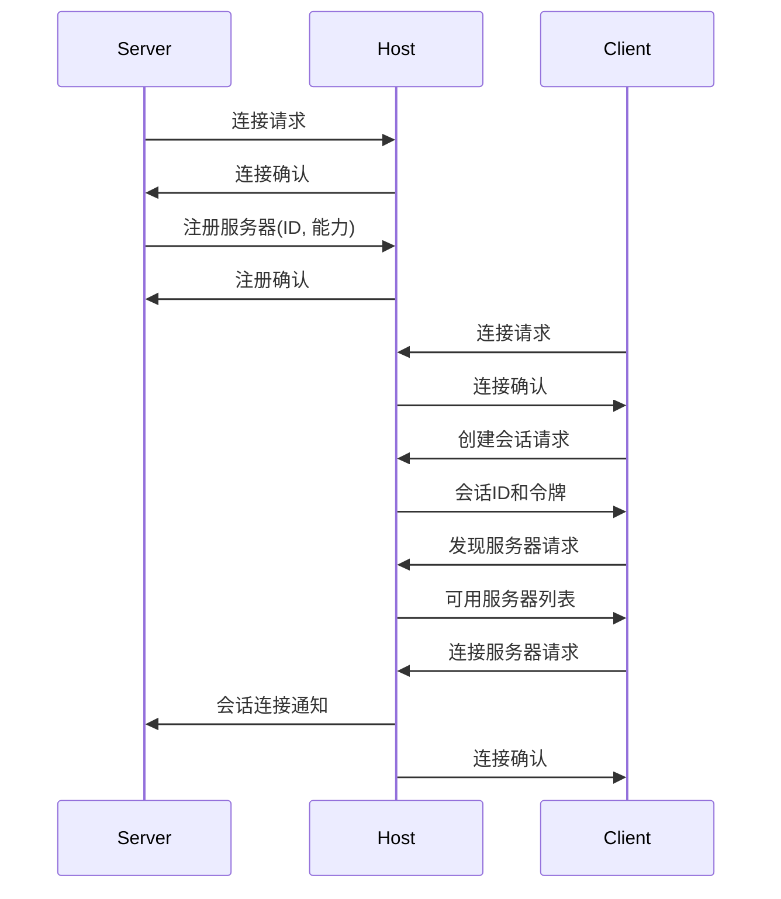

服务器连接和注册示例：

```python
def connect_and_register_server(server):
    """连接并注册服务器"""
    try:
        # 连接到主机
        server.transport.connect()
        
        # 注册服务器
        registration_request = {
            "jsonrpc": "2.0",
            "id": str(uuid.uuid4()),
            "method": "register_server",
            "params": {
                "id": server.id,
                "name": server.name,
                "description": server.description,
                "version": server.version,
                "capabilities": server.get_capabilities()
            }
        }
        
        response_data = server.transport.send(json.dumps(registration_request))
        response = json.loads(response_data)
        
        if "error" in response:
            raise Exception(f"Failed to register server: {response['error']}")
        
        server.registered = True
        logging.info(f"Server {server.id} registered successfully")
        
        return True
    except Exception as e:
        logging.error(f"Failed to connect and register server: {e}")
        return False
```

客户端连接和会话创建示例：

```python
def connect_and_create_session(client, permissions=None):
    """连接并创建会话"""
    try:
        # 连接到主机
        client.transport.connect()
        
        # 创建会话
        session_request = {
            "jsonrpc": "2.0",
            "id": str(uuid.uuid4()),
            "method": "create_session",
            "params": {}
        }
        
        if permissions:
            session_request["params"]["permissions"] = permissions
        
        response_data = client.transport.send(json.dumps(session_request))
        response = json.loads(response_data)
        
        if "error" in response:
            raise Exception(f"Failed to create session: {response['error']}")
        
        session_id = response["result"]["session_id"]
        client.session = {
            "id": session_id,
            "created_at": time.time(),
            "expires_at": response["result"]["expires_at"]
        }
        
        logging.info(f"Session {session_id} created successfully")
        
        return session_id
    except Exception as e:
        logging.error(f"Failed to connect and create session: {e}")
        return None
```

客户端连接服务器示例：

```python
def connect_to_server(client, server_id):
    """连接到服务器"""
    try:
        # 检查会话
        if not client.session:
            raise Exception("No active session")
        
        # 发送连接请求
        connect_request = {
            "jsonrpc": "2.0",
            "id": str(uuid.uuid4()),
            "method": "connect_server",
            "params": {
                "server_id": server_id
            },
            "session": client.session["id"]
        }
        
        response_data = client.transport.send(json.dumps(connect_request))
        response = json.loads(response_data)
        
        if "error" in response:
            raise Exception(f"Failed to connect to server: {response['error']}")
        
        server_info = response["result"]["server_info"]
        client.connected_servers[server_id] = server_info
        
        logging.info(f"Connected to server {server_id}")
        
        return server_info
    except Exception as e:
        logging.error(f"Failed to connect to server {server_id}: {e}")
        return None
```

#### 能力声明

服务器在注册过程中需要声明自己提供的能力，包括：

1. **资源类型**：服务器支持的资源类型及操作
2. **工具**：服务器提供的工具及参数
3. **提示模板**：服务器提供的提示模板

能力声明示例：

```python
def get_server_capabilities(server):
    """获取服务器能力声明"""
    capabilities = {
        "resource_types": [],
        "tools": [],
        "prompts": []
    }
    
    # 添加资源类型
    for resource_type, handler_info in server.resource_handlers.items():
        capabilities["resource_types"].append({
            "type": resource_type,
            "operations": handler_info["operations"],
            "description": handler_info["description"]
        })
    
    # 添加工具
    for tool_name, tool_info in server.tool_handlers.items():
        capabilities["tools"].append({
            "name": tool_name,
            "description": tool_info["description"],
            "parameters": tool_info["parameters"],
            "returns": tool_info["returns"]
        })
    
    # 添加提示模板
    for prompt_id, prompt_info in server.prompt_templates.items():
        capabilities["prompts"].append({
            "id": prompt_id,
            "description": prompt_info["description"],
            "parameters": prompt_info["parameters"],
            "version": prompt_info["version"]
        })
    
    return capabilities
```

主机处理服务器注册示例：

```python
def handle_server_registration(host, request):
    """处理服务器注册请求"""
    params = request.get("params", {})
    
    server_id = params.get("id")
    if not server_id:
        return {
            "jsonrpc": "2.0",
            "id": request.get("id"),
            "error": {
                "code": -32602,
                "message": "Missing server ID"
            }
        }
    
    # 检查服务器ID是否已注册
    if server_id in host.servers:
        return {
            "jsonrpc": "2.0",
            "id": request.get("id"),
            "error": {
                "code": -32602,
                "message": f"Server ID already registered: {server_id}"
            }
        }
    
    # 注册服务器
    host.servers[server_id] = {
        "info": {
            "name": params.get("name", server_id),
            "description": params.get("description", ""),
            "version": params.get("version", "1.0")
        },
        "capabilities": params.get("capabilities", {}),
        "connection": request["connection"],
        "registered_at": time.time()
    }
    
    # 更新服务注册表
    host.service_registry.register_server(server_id, params.get("capabilities", {}))
    
    logging.info(f"Server {server_id} registered with capabilities: {params.get('capabilities', {})}")
    
    return {
        "jsonrpc": "2.0",
        "id": request.get("id"),
        "result": {
            "status": "registered",
            "server_id": server_id
        }
    }
```

#### 权限设置

在初始化阶段，还需要设置权限，确定客户端可以访问哪些资源和工具：

1. **默认权限**：系统定义的默认权限策略
2. **会话权限**：创建会话时指定的权限
3. **动态权限**：运行时根据需要调整的权限

权限设置示例：

```python
def set_session_permissions(host, session_id, permissions):
    """设置会话权限"""
    if session_id not in host.sessions:
        raise ValueError(f"Session not found: {session_id}")
    
    # 验证权限格式
    validated_permissions = validate_permissions(permissions)
    
    # 应用默认权限策略
    effective_permissions = apply_default_permissions(validated_permissions)
    
    # 存储权限
    host.permissions[session_id] = effective_permissions
    
    logging.info(f"Set permissions for session {session_id}")
    
    return effective_permissions

def validate_permissions(permissions):
    """验证权限格式"""
    # 简化实现，实际应该有更复杂的验证逻辑
    validated = {}
    
    if "servers" in permissions:
        validated["servers"] = []
        for server in permissions["servers"]:
            if "id" not in server:
                continue
            
            validated_server = {"id": server["id"]}
            
            if "resources" in server:
                validated_server["resources"] = server["resources"]
            
            if "tools" in server:
                validated_server["tools"] = server["tools"]
            
            if "methods" in server:
                validated_server["methods"] = server["methods"]
            
            validated["servers"].append(validated_server)
    
    return validated

def apply_default_permissions(permissions):
    """应用默认权限策略"""
    # 合并默认权限和指定权限
    effective_permissions = copy.deepcopy(DEFAULT_PERMISSIONS)
    
    # 如果指定了服务器权限，覆盖默认权限
    if "servers" in permissions:
        for server in permissions["servers"]:
            server_id = server["id"]
            
            # 查找默认权限中是否有该服务器
            default_server = None
            for s in effective_permissions.get("servers", []):
                if s["id"] == server_id:
                    default_server = s
                    break
            
            if default_server:
                # 更新现有服务器权限
                if "resources" in server:
                    default_server["resources"] = server["resources"]
                
                if "tools" in server:
                    default_server["tools"] = server["tools"]
                
                if "methods" in server:
                    default_server["methods"] = server["methods"]
            else:
                # 添加新服务器权限
                effective_permissions.setdefault("servers", []).append(server)
    
    return effective_permissions
```

### 2.4.2 运行阶段

运行阶段是MCP系统的主要工作阶段，包括请求处理、资源访问、工具调用和通知处理等过程。

#### 请求-响应流程

MCP的核心交互模式是请求-响应流程，客户端发送请求，服务器处理后返回响应：

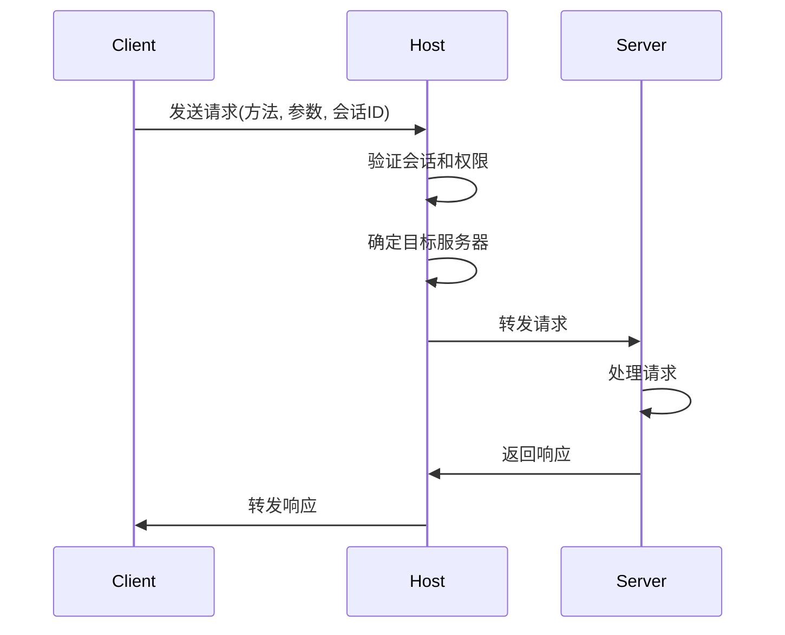

请求处理流程示例：

```python
def process_client_request(host, request, connection):
    """处理客户端请求"""
    # 基本验证
    if "jsonrpc" not in request or request["jsonrpc"] != "2.0":
        return {
            "jsonrpc": "2.0",
            "id": request.get("id"),
            "error": {"code": -32600, "message": "Invalid Request"}
        }
    
    method = request.get("method")
    params = request.get("params", {})
    session_id = request.get("session")
    
    # 检查是否是主机方法
    if method in host.request_handlers:
        return host.request_handlers[method](request, connection)
    
    # 检查会话
    if not session_id or session_id not in host.sessions:
        return {
            "jsonrpc": "2.0",
            "id": request.get("id"),
            "error": {"code": -32501, "message": "Invalid session"}
        }
    
    # 更新会话活动时间
    host.sessions[session_id]["last_activity"] = time.time()
    
    # 确定目标服务器
    target_server = request.get("target")
    if not target_server:
        target_server = host.infer_target_server(method, params)
    
    if not target_server or target_server not in host.servers:
        return {
            "jsonrpc": "2.0",
            "id": request.get("id"),
            "error": {"code": -32602, "message": "Invalid target server"}
        }
    
    # 检查权限
    if not host.check_permission(session_id, target_server, method, params):
        return {
            "jsonrpc": "2.0",
            "id": request.get("id"),
            "error": {"code": -32401, "message": "Permission denied"}
        }
    
    # 转发请求到服务器
    server = host.servers[target_server]
    
    # 添加会话信息到请求
    forwarded_request = copy.deepcopy(request)
    
    # 发送请求到服务器
    try:
        response_data = server["connection"].send(json.dumps(forwarded_request))
        response = json.loads(response_data)
        
        # 添加源服务器信息
        if "result" in response:
            response["source"] = target_server
        
        return response
    except Exception as e:
        logging.error(f"Error forwarding request to server {target_server}: {e}")
        return {
            "jsonrpc": "2.0",
            "id": request.get("id"),
            "error": {"code": -32000, "message": f"Server error: {str(e)}"}
        }
```

服务器处理请求示例：

```python
def handle_server_request(server, request):
    """处理服务器收到的请求"""
    # 基本验证
    if "jsonrpc" not in request or request["jsonrpc"] != "2.0":
        return {
            "jsonrpc": "2.0",
            "id": request.get("id"),
            "error": {"code": -32600, "message": "Invalid Request"}
        }
    
    method = request.get("method")
    params = request.get("params", {})
    session_id = request.get("session")
    
    # 检查会话
    if not session_id:
        return {
            "jsonrpc": "2.0",
            "id": request.get("id"),
            "error": {"code": -32501, "message": "Session required"}
        }
    
    # 检查方法
    if method.startswith("create_"):
        operation = "create"
        resource_type = params.get("type")
    elif method.startswith("read_"):
        operation = "read"
        resource_id = params.get("id")
        if resource_id:
            parts = resource_id.split("://")
            if len(parts) > 1:
                resource_type = parts[0]
            else:
                resource_type = None
        else:
            resource_type = None
    elif method.startswith("update_"):
        operation = "update"
        resource_id = params.get("id")
        if resource_id:
            parts = resource_id.split("://")
            if len(parts) > 1:
                resource_type = parts[0]
            else:
                resource_type = None
        else:
            resource_type = None
    elif method.startswith("delete_"):
        operation = "delete"
        resource_id = params.get("id")
        if resource_id:
            parts = resource_id.split("://")
            if len(parts) > 1:
                resource_type = parts[0]
            else:
                resource_type = None
        else:
            resource_type = None
    elif method.startswith("list_"):
        operation = "list"
        resource_type = params.get("type")
    elif method.startswith("search_"):
        operation = "search"
        resource_type = params.get("type")
    elif method == "discover_tools":
        return handle_discover_tools(server, params, session_id)
    elif method == "invoke_tool":
        return handle_invoke_tool(server, params, session_id)
    elif method == "get_tool_status":
        return handle_get_tool_status(server, params, session_id)
    elif method == "cancel_tool":
        return handle_cancel_tool(server, params, session_id)
    elif method == "get_prompt":
        return handle_get_prompt(server, params, session_id)
    elif method == "render_prompt":
        return handle_render_prompt(server, params, session_id)
    elif method == "list_prompts":
        return handle_list_prompts(server, params, session_id)
    else:
        return {
            "jsonrpc": "2.0",
            "id": request.get("id"),
            "error": {"code": -32601, "message": "Method not found"}
        }
    
    # 处理资源操作
    if operation in ["create", "read", "update", "delete", "list", "search"]:
        if not resource_type or resource_type not in server.resource_handlers:
            return {
                "jsonrpc": "2.0",
                "id": request.get("id"),
                "error": {"code": -32602, "message": f"Resource type not supported: {resource_type}"}
            }
        
        handler_info = server.resource_handlers[resource_type]
        
        if operation not in handler_info["operations"]:
            return {
                "jsonrpc": "2.0",
                "id": request.get("id"),
                "error": {"code": -32602, "message": f"Operation not supported for resource type: {operation}"}
            }
        
        try:
            result = handler_info["handler"](operation, params, session_id)
            return {
                "jsonrpc": "2.0",
                "id": request.get("id"),
                "result": result
            }
        except Exception as e:
            logging.error(f"Error handling resource operation: {e}")
            return {
                "jsonrpc": "2.0",
                "id": request.get("id"),
                "error": {"code": -32000, "message": f"Server error: {str(e)}"}
            }
    
    # 不应该到达这里
    return {
        "jsonrpc": "2.0",
        "id": request.get("id"),
        "error": {"code": -32603, "message": "Internal error"}
    }
```

#### 资源访问流程

资源访问是MCP的核心功能之一，客户端通过统一的接口访问各种资源：

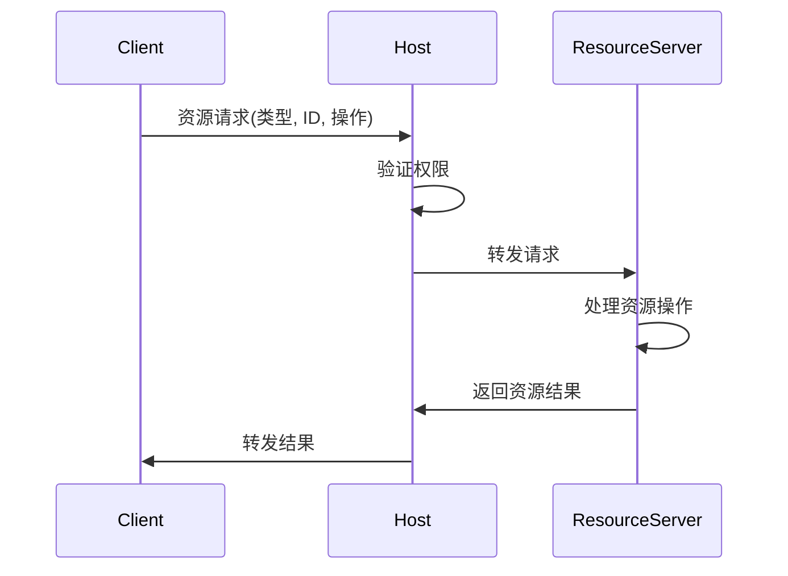

资源访问示例：

```python
def read_resource(client, resource_id):
    """读取资源"""
    # 解析资源ID，确定服务器
    parts = resource_id.split("://")
    if len(parts) < 2:
        raise ValueError(f"Invalid resource ID format: {resource_id}")
    
    resource_type = parts[0]
    
    # 查找合适的服务器
    server_id = None
    for sid, server_info in client.connected_servers.items():
        capabilities = server_info.get("capabilities", {})
        resource_types = capabilities.get("resource_types", [])
        
        for rt in resource_types:
            if rt["type"] == resource_type and "read" in rt.get("operations", []):
                server_id = sid
                break
        
        if server_id:
            break
    
    if not server_id:
        raise ValueError(f"No server available for resource type: {resource_type}")
    
    # 发送读取请求
    request = {
        "jsonrpc": "2.0",
        "id": str(uuid.uuid4()),
        "method": "read_resource",
        "params": {
            "id": resource_id
        },
        "session": client.session["id"],
        "target": server_id
    }
    
    response_data = client.transport.send(json.dumps(request))
    response = json.loads(response_data)
    
    if "error" in response:
        raise ResourceError(response["error"].get("message", "Unknown error"), response["error"].get("code", 0))
    
    return response["result"]
```

#### 工具调用流程

工具调用是MCP的另一个核心功能，客户端可以调用各种工具扩展其能力：

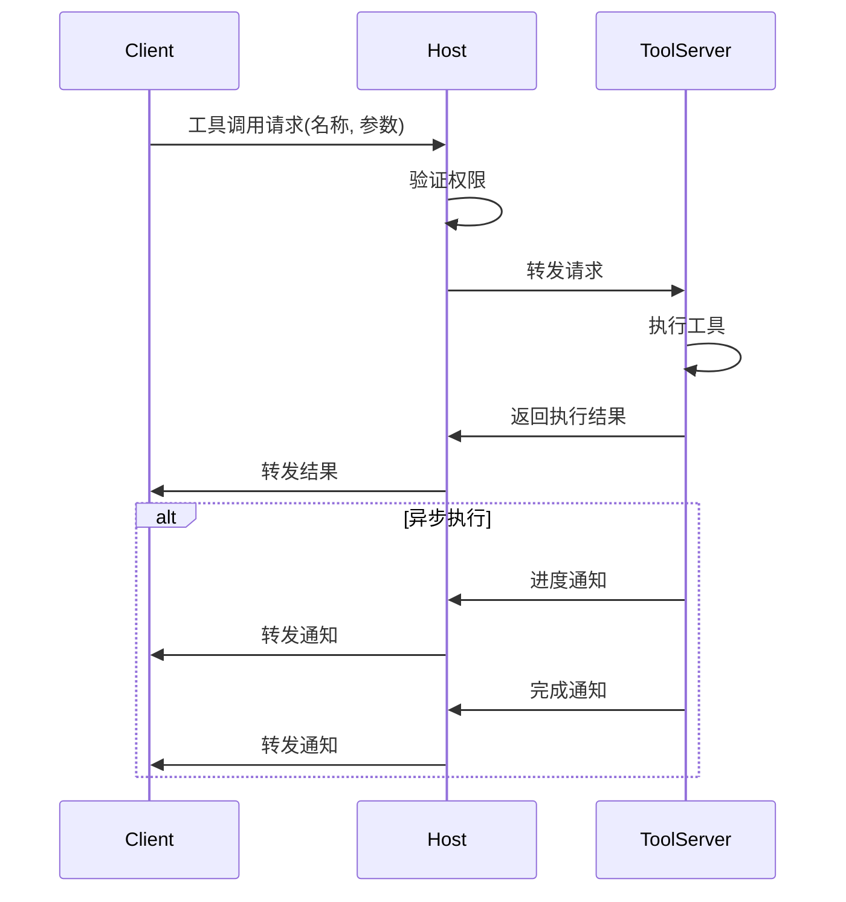

工具调用示例：

```python
def invoke_tool(client, tool_name, parameters, async_mode=False):
    """调用工具"""
    # 查找提供该工具的服务器
    server_id = None
    for sid, server_info in client.connected_servers.items():
        capabilities = server_info.get("capabilities", {})
        tools = capabilities.get("tools", [])
        
        for tool in tools:
            if tool["name"] == tool_name:
                server_id = sid
                break
        
        if server_id:
            break
    
    if not server_id:
        raise ToolError(f"No server available for tool: {tool_name}")
    
    # 发送工具调用请求
    request = {
        "jsonrpc": "2.0",
        "id": str(uuid.uuid4()),
        "method": "invoke_tool",
        "params": {
            "name": tool_name,
            "parameters": parameters,
            "async": async_mode
        },
        "session": client.session["id"],
        "target": server_id
    }
    
    response_data = client.transport.send(json.dumps(request))
    response = json.loads(response_data)
    
    if "error" in response:
        raise ToolError(response["error"].get("message", "Unknown error"), response["error"].get("code", 0))
    
    if async_mode:
        # 返回任务ID，客户端可以稍后查询状态
        return response["result"]["task_id"]
    else:
        # 返回同步执行结果
        return response["result"]["output"]
```

异步工具状态查询示例：

```python
def get_tool_status(client, task_id):
    """获取工具执行状态"""
    # 查找任务所属的服务器
    # 实际实现中可能需要存储任务与服务器的映射
    server_id = client.task_server_map.get(task_id)
    if not server_id:
        # 如果没有找到映射，尝试查询所有连接的服务器
        for sid in client.connected_servers:
            try:
                status = query_task_status(client, sid, task_id)
                # 如果成功获取状态，记录映射关系
                client.task_server_map[task_id] = sid
                return status
            except:
                continue
        
        raise TaskNotFoundError(f"Task not found: {task_id}")
    
    return query_task_status(client, server_id, task_id)

def query_task_status(client, server_id, task_id):
    """向特定服务器查询任务状态"""
    request = {
        "jsonrpc": "2.0",
        "id": str(uuid.uuid4()),
        "method": "get_tool_status",
        "params": {
            "task_id": task_id
        },
        "session": client.session["id"],
        "target": server_id
    }
    
    response_data = client.transport.send(json.dumps(request))
    response = json.loads(response_data)
    
    if "error" in response:
        raise ToolError(response["error"].get("message", "Unknown error"), response["error"].get("code", 0))
    
    return response["result"]
```

#### 通知处理流程

MCP支持服务器向客户端发送通知，用于事件推送和状态更新：

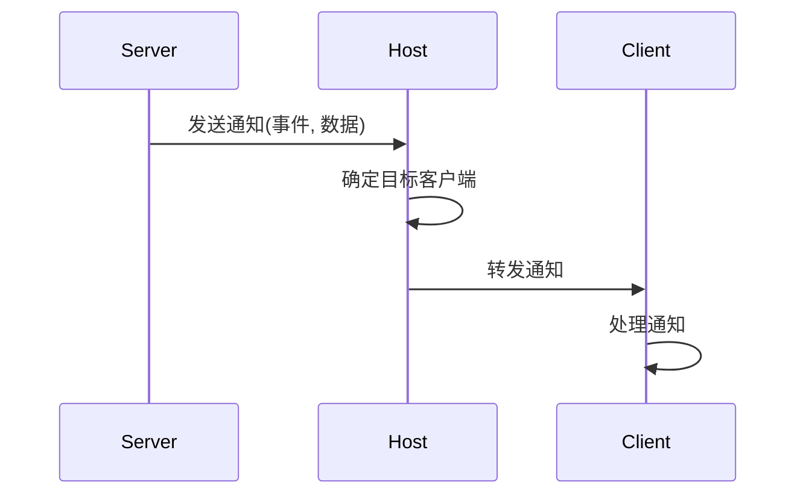

通知发送示例：

```python
def send_notification(server, notification, target_sessions=None):
    """发送通知给客户端"""
    # 构建通知
    notification_obj = {
        "jsonrpc": "2.0",
        "method": notification["method"],
        "params": notification["params"],
        "source": server.id
    }
    
    # 添加目标会话
    if target_sessions:
        notification_obj["target_sessions"] = target_sessions
    
    # 发送通知
    try:
        server.transport.send_notification(json.dumps(notification_obj))
        return True
    except Exception as e:
        logging.error(f"Failed to send notification: {e}")
        return False
```

主机处理通知示例：

```python
def handle_server_notification(host, notification, server_id):
    """处理服务器发送的通知"""
    # 确定目标会话
    target_sessions = notification.get("target_sessions", [])
    
    if not target_sessions:
        # 如果未指定目标会话，发送给所有连接了该服务器的会话
        for session_id, session in host.sessions.items():
            if "connected_servers" in session and server_id in session["connected_servers"]:
                target_sessions.append(session_id)
    
    # 转发通知给目标会话
    for session_id in target_sessions:
        if session_id in host.sessions:
            client_id = host.sessions[session_id]["client_id"]
            if client_id in host.clients:
                client_connection = host.clients[client_id]["connection"]
                
                # 添加会话ID
                notification_with_session = copy.deepcopy(notification)
                notification_with_session["session"] = session_id
                
                try:
                    client_connection.send_notification(json.dumps(notification_with_session))
                except Exception as e:
                    logging.error(f"Failed to forward notification to client {client_id}: {e}")
```

客户端处理通知示例：

```python
def handle_notification(client, notification_data):
    """处理接收到的通知"""
    try:
        notification = json.loads(notification_data)
        
        # 检查基本格式
        if "jsonrpc" not in notification or notification["jsonrpc"] != "2.0" or "method" not in notification:
            logging.warning(f"Received invalid notification: {notification_data}")
            return
        
        method = notification["method"]
        params = notification.get("params", {})
        session_id = notification.get("session")
        source = notification.get("source")
        
        # 检查会话
        if session_id != client.session["id"]:
            logging.warning(f"Received notification for different session: {session_id}")
            return
        
        # 调用相应的处理器
        handlers = []
        
        # 方法特定处理器
        if method in client.notification_handlers:
            handlers.extend(client.notification_handlers[method])
        
        # 源服务器特定处理器
        if source and f"source:{source}" in client.notification_handlers:
            handlers.extend(client.notification_handlers[f"source:{source}"])
        
        # 通用处理器
        if "*" in client.notification_handlers:
            handlers.extend(client.notification_handlers["*"])
        
        # 调用处理器
        for handler in handlers:
            try:
                handler(notification)
            except Exception as e:
                logging.error(f"Error in notification handler: {e}")
    except Exception as e:
        logging.error(f"Failed to handle notification: {e}")
```

#### 会话管理

在运行阶段，MCP需要管理会话的生命周期，包括会话创建、维护和关闭：

```python
def create_session(host, client_id, permissions=None):
    """创建新会话"""
    # 生成会话ID
    session_id = f"session-{uuid.uuid4()}"
    
    # 创建会话
    host.sessions[session_id] = {
        "client_id": client_id,
        "created_at": time.time(),
        "last_activity": time.time(),
        "state": "active",
        "connected_servers": []
    }
    
    # 设置权限
    if permissions:
        host.set_session_permissions(session_id, permissions)
    else:
        host.set_session_permissions(session_id, DEFAULT_PERMISSIONS)
    
    # 设置会话超时
    session_timeout = host.config.get("session_timeout", 3600)  # 默认1小时
    expires_at = time.time() + session_timeout
    
    logging.info(f"Created session {session_id} for client {client_id}")
    
    return {
        "session_id": session_id,
        "expires_at": expires_at
    }

def maintain_sessions(host):
    """维护会话（清理过期会话）"""
    current_time = time.time()
    session_timeout = host.config.get("session_timeout", 3600)
    
    sessions_to_close = []
    for session_id, session in host.sessions.items():
        # 检查会话是否过期
        if current_time - session["last_activity"] > session_timeout:
            sessions_to_close.append(session_id)
    
    # 关闭过期会话
    for session_id in sessions_to_close:
        close_session(host, session_id)
    
    if sessions_to_close:
        logging.info(f"Closed {len(sessions_to_close)} expired sessions")

def close_session(host, session_id):
    """关闭会话"""
    if session_id not in host.sessions:
        logging.warning(f"Attempt to close non-existent session: {session_id}")
        return False
    
    session = host.sessions[session_id]
    client_id = session["client_id"]
    
    # 通知连接的服务器
    for server_id in session.get("connected_servers", []):
        if server_id in host.servers:
            server = host.servers[server_id]
            try:
                notification = {
                    "jsonrpc": "2.0",
                    "method": "session_closed",
                    "params": {
                        "session_id": session_id,
                        "client_id": client_id
                    }
                }
                server["connection"].send_notification(json.dumps(notification))
            except Exception as e:
                logging.error(f"Failed to notify server {server_id} about session closure: {e}")
    
    # 删除会话和权限
    del host.sessions[session_id]
    if session_id in host.permissions:
        del host.permissions[session_id]
    
    logging.info(f"Closed session {session_id} for client {client_id}")
    
    return True
```

#### 错误处理

MCP系统在运行阶段需要处理各种错误情况，包括通信错误、权限错误、资源错误等：

```python
def handle_error(error, context=None):
    """处理错误"""
    if isinstance(error, ConnectionError):
        # 处理连接错误
        logging.error(f"Connection error: {error}")
        if context and "retry_count" in context:
            if context["retry_count"] < MAX_RETRIES:
                logging.info(f"Retrying connection ({context['retry_count'] + 1}/{MAX_RETRIES})...")
                context["retry_count"] += 1
                time.sleep(RETRY_DELAY * (2 ** context["retry_count"]))  # 指数退避
                return "retry"
        return "abort"
    
    elif isinstance(error, TimeoutError):
        # 处理超时错误
        logging.error(f"Timeout error: {error}")
        if context and "retry_count" in context:
            if context["retry_count"] < MAX_RETRIES:
                logging.info(f"Retrying after timeout ({context['retry_count'] + 1}/{MAX_RETRIES})...")
                context["retry_count"] += 1
                return "retry"
        return "abort"
    
    elif isinstance(error, PermissionError):
        # 处理权限错误
        logging.error(f"Permission error: {error}")
        return "abort"
    
    elif isinstance(error, ResourceError):
        # 处理资源错误
        logging.error(f"Resource error: {error}")
        return "abort"
    
    elif isinstance(error, ToolError):
        # 处理工具错误
        logging.error(f"Tool error: {error}")
        return "abort"
    
    else:
        # 处理其他错误
        logging.error(f"Unexpected error: {error}")
        return "abort"
```

### 2.4.3 关闭阶段

关闭阶段是MCP系统终止运行的过程，包括资源释放、连接关闭和状态保存等操作。

#### 客户端关闭

客户端关闭过程包括关闭会话和断开连接：

```python
def close_client(client):
    """关闭客户端"""
    try:
        # 关闭会话
        if client.session:
            close_session_request = {
                "jsonrpc": "2.0",
                "id": str(uuid.uuid4()),
                "method": "close_session",
                "params": {},
                "session": client.session["id"]
            }
            
            try:
                client.transport.send(json.dumps(close_session_request))
            except Exception as e:
                logging.warning(f"Failed to send close session request: {e}")
            
            client.session = None
        
        # 清理资源
        client.connected_servers = {}
        client.resource_cache = {}
        client.notification_handlers = {}
        
        # 断开连接
        client.transport.disconnect()
        
        logging.info("Client closed successfully")
        return True
    except Exception as e:
        logging.error(f"Error closing client: {e}")
        return False
```

#### 服务器关闭

服务器关闭过程包括注销服务器和断开连接：

```python
def close_server(server):
    """关闭服务器"""
    try:
        # 注销服务器
        if server.registered:
            unregister_request = {
                "jsonrpc": "2.0",
                "id": str(uuid.uuid4()),
                "method": "unregister_server",
                "params": {
                    "id": server.id
                }
            }
            
            try:
                server.transport.send(json.dumps(unregister_request))
            except Exception as e:
                logging.warning(f"Failed to send unregister request: {e}")
            
            server.registered = False
        
        # 清理资源
        for task_id, task in list(server.async_tasks.items()):
            if task["status"] in ["running", "pending"]:
                task["status"] = "cancelled"
                task["completed_at"] = time.time()
        
        # 断开连接
        server.transport.disconnect()
        
        logging.info(f"Server {server.id} closed successfully")
        return True
    except Exception as e:
        logging.error(f"Error closing server: {e}")
        return False
```

#### 主机关闭

主机关闭过程包括关闭所有会话、断开所有连接和保存状态：

```python
def close_host(host):
    """关闭主机"""
    try:
        # 关闭所有会话
        for session_id in list(host.sessions.keys()):
            close_session(host, session_id)
        
        # 通知所有服务器主机关闭
        for server_id, server in host.servers.items():
            try:
                notification = {
                    "jsonrpc": "2.0",
                    "method": "host_shutdown",
                    "params": {
                        "reason": "normal_shutdown",
                        "timestamp": time.time()
                    }
                }
                server["connection"].send_notification(json.dumps(notification))
            except Exception as e:
                logging.warning(f"Failed to notify server {server_id} about shutdown: {e}")
        
        # 通知所有客户端主机关闭
        for client_id, client in host.clients.items():
            try:
                notification = {
                    "jsonrpc": "2.0",
                    "method": "host_shutdown",
                    "params": {
                        "reason": "normal_shutdown",
                        "timestamp": time.time()
                    }
                }
                client["connection"].send_notification(json.dumps(notification))
            except Exception as e:
                logging.warning(f"Failed to notify client {client_id} about shutdown: {e}")
        
        # 保存状态（如果需要）
        if host.config.get("save_state", False):
            save_host_state(host)
        
        # 断开连接
        host.transport.disconnect()
        
        logging.info("Host closed successfully")
        return True
    except Exception as e:
        logging.error(f"Error closing host: {e}")
        return False

def save_host_state(host):
    """保存主机状态"""
    state_file = host.config.get("state_file", "host_state.json")
    
    state = {
        "timestamp": time.time(),
        "servers": {},
        "sessions": {},
        "permissions": {}
    }
    
    # 保存服务器信息
    for server_id, server in host.servers.items():
        state["servers"][server_id] = {
            "info": server["info"],
            "capabilities": server["capabilities"],
            "registered_at": server["registered_at"]
        }
    
    # 保存会话信息
    for session_id, session in host.sessions.items():
        state["sessions"][session_id] = {
            "client_id": session["client_id"],
            "created_at": session["created_at"],
            "last_activity": session["last_activity"],
            "state": session["state"],
            "connected_servers": session.get("connected_servers", [])
        }
    
    # 保存权限信息
    for session_id, permissions in host.permissions.items():
        state["permissions"][session_id] = permissions
    
    # 写入文件
    try:
        with open(state_file, 'w') as f:
            json.dump(state, f, indent=2)
        logging.info(f"Host state saved to {state_file}")
    except Exception as e:
        logging.error(f"Failed to save host state: {e}")
```

#### 优雅关闭

MCP系统支持优雅关闭，确保所有正在进行的操作能够完成或被适当取消：

```python
def graceful_shutdown(host, timeout=30):
    """优雅关闭主机"""
    logging.info(f"Initiating graceful shutdown with timeout {timeout}s")
    
    # 设置关闭标志
    host.shutting_down = True
    
    # 停止接受新连接
    host.transport.stop_accepting()
    
    # 通知所有连接的组件
    for server_id, server in host.servers.items():
        try:
            notification = {
                "jsonrpc": "2.0",
                "method": "prepare_shutdown",
                "params": {
                    "timeout": timeout,
                    "timestamp": time.time()
                }
            }
            server["connection"].send_notification(json.dumps(notification))
        except Exception as e:
            logging.warning(f"Failed to notify server {server_id} about shutdown preparation: {e}")
    
    for client_id, client in host.clients.items():
        try:
            notification = {
                "jsonrpc": "2.0",
                "method": "prepare_shutdown",
                "params": {
                    "timeout": timeout,
                    "timestamp": time.time()
                }
            }
            client["connection"].send_notification(json.dumps(notification))
        except Exception as e:
            logging.warning(f"Failed to notify client {client_id} about shutdown preparation: {e}")
    
    # 等待正在进行的操作完成
    start_time = time.time()
    while time.time() - start_time < timeout:
        # 检查是否还有活跃的操作
        active_operations = host.get_active_operations_count()
        if active_operations == 0:
            logging.info("All operations completed, proceeding with shutdown")
            break
        
        logging.info(f"Waiting for {active_operations} active operations to complete")
        time.sleep(1)
    
    # 关闭主机
    close_host(host)
```

## 本章小结

本章深入探讨了MCP的架构设计和核心组件，为读者提供了全面的技术理解。我们首先介绍了MCP的基础架构，包括客户端-主机-服务器模型、JSON-RPC 2.0通信规范和多种传输层实现。这种三层架构设计实现了关注点分离、松耦合设计、可组合性和安全隔离，为AI原生应用提供了坚实的基础架构。

接着，我们详细解析了MCP的三个核心组件：主机、客户端和服务器。主机作为中心枢纽，负责协调客户端和服务器之间的通信，管理会话和权限，以及提供各种核心服务。客户端负责发起请求并处理响应，通过MCP主机与各种服务器交互，访问资源和工具。服务器则提供特定的资源或功能，处理客户端请求，并可能主动发送通知。

然后，我们探讨了MCP的三种核心能力：资源管理、工具集成和提示模板。资源管理提供了统一的资源抽象和操作接口，简化了AI模型与外部世界的交互。工具集成提供了标准化的工具发现和调用接口，使AI模型能够轻松使用各种工具扩展其能力。提示模板提供了结构化的模板，用于指导模型生成特定格式或内容的输出。

最后，我们分析了MCP的生命周期和交互流程，从初始化到运行再到关闭的全过程。初始化阶段包括组件初始化、连接建立、能力声明和权限设置。运行阶段是系统的主要工作阶段，包括请求处理、资源访问、工具调用和通知处理等过程。关闭阶段则包括资源释放、连接关闭和状态保存等操作，确保系统能够优雅地终止运行。

通过本章的学习，读者应该已经对MCP的架构设计和核心组件有了全面的理解，为后续开发实践打下了坚实的基础。在下一章中，我们将深入探讨MCP的安全与隐私保护机制，包括安全架构、数据隐私保护策略以及审计与合规措施。
        
        
    