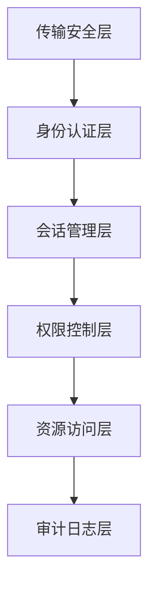

# 第3章：MCP安全与隐私保护

本章将深入探讨MCP的安全架构和隐私保护机制，这是构建可信AI原生应用的关键基础。我们将首先介绍MCP的安全架构设计，包括安全模型、权限边界和服务器隔离原则；然后详细讨论数据隐私保护策略，包括最小权限原则实现、数据脱敏技术和敏感信息处理最佳实践；最后探讨MCP的审计与合规机制，包括操作日志、审计跟踪和隐私保护与透明度的平衡。通过本章学习，读者将掌握如何构建安全可靠的MCP应用，保护用户隐私并满足合规要求。

## 3.1 MCP安全架构

MCP的安全架构是整个系统安全性的基础，它定义了如何保护资源、控制访问和隔离组件。本节将详细介绍MCP的安全模型设计、权限边界与访问控制以及服务器隔离原则。

### 3.1.1 MCP安全模型设计

MCP的安全模型基于深度防御策略，通过多层次的安全机制保护系统和数据。这种设计确保即使一层防御被突破，其他层次仍能提供保护。

#### 安全模型核心原则

MCP安全模型遵循以下核心原则：

1. **最小权限原则**：每个组件只被授予完成其任务所需的最小权限
2. **职责分离**：将关键功能分配给不同组件，避免单点故障
3. **深度防御**：实施多层次的安全控制，提供重叠保护
4. **默认安全**：系统默认配置应当是安全的，需要显式授权才能访问敏感资源
5. **透明性**：安全机制应当对用户和开发者透明，便于理解和审计

#### 安全层次结构

MCP的安全模型包含以下层次：



1. **传输安全层**：保护数据在传输过程中的安全
2. **身份认证层**：验证通信实体的身份
3. **会话管理层**：维护和保护用户会话
4. **权限控制层**：控制对资源和功能的访问
5. **资源访问层**：实施资源级别的安全控制
6. **审计日志层**：记录和监控系统活动

#### 传输安全

MCP的传输安全机制确保数据在客户端、主机和服务器之间传输时的机密性和完整性：

1. **加密通信**：使用TLS/SSL加密所有网络通信
2. **证书验证**：验证服务器证书，防止中间人攻击
3. **安全密钥交换**：使用安全的密钥交换协议
4. **消息完整性检查**：使用消息认证码(MAC)确保消息完整性

传输安全配置示例：

```python
def configure_transport_security(transport_config):
    """配置传输安全"""
    security_config = {
        "tls_enabled": True,
        "tls_version": "TLSv1.3",
        "cert_file": transport_config.get("cert_file"),
        "key_file": transport_config.get("key_file"),
        "ca_file": transport_config.get("ca_file"),
        "verify_peer": transport_config.get("verify_peer", True),
        "cipher_suites": [
            "TLS_AES_256_GCM_SHA384",
            "TLS_CHACHA20_POLY1305_SHA256",
            "TLS_AES_128_GCM_SHA256"
        ]
    }
    
    return security_config
```

#### 身份认证

MCP的身份认证机制验证通信实体的身份，确保只有授权实体能够访问系统：

1. **客户端认证**：验证客户端身份，可使用API密钥、OAuth令牌等
2. **服务器认证**：验证服务器身份，防止恶意服务器注册
3. **多因素认证**：支持多因素认证，提高安全性
4. **认证委托**：支持委托给外部身份提供者

身份认证实现示例：

```python
def authenticate_client(host, auth_data):
    """验证客户端身份"""
    auth_type = auth_data.get("type")
    
    if auth_type == "api_key":
        # API密钥认证
        api_key = auth_data.get("api_key")
        if not api_key:
            return {"authenticated": False, "error": "Missing API key"}
        
        # 验证API密钥
        client_info = verify_api_key(host, api_key)
        if not client_info:
            return {"authenticated": False, "error": "Invalid API key"}
        
        return {
            "authenticated": True,
            "client_id": client_info["client_id"],
            "client_type": client_info["client_type"],
            "permissions": client_info["permissions"]
        }
    
    elif auth_type == "oauth":
        # OAuth认证
        token = auth_data.get("token")
        if not token:
            return {"authenticated": False, "error": "Missing OAuth token"}
        
        # 验证OAuth令牌
        client_info = verify_oauth_token(host, token)
        if not client_info:
            return {"authenticated": False, "error": "Invalid OAuth token"}
        
        return {
            "authenticated": True,
            "client_id": client_info["client_id"],
            "client_type": client_info["client_type"],
            "permissions": client_info["permissions"]
        }
    
    elif auth_type == "mcp_token":
        # MCP令牌认证
        token = auth_data.get("token")
        if not token:
            return {"authenticated": False, "error": "Missing MCP token"}
        
        # 验证MCP令牌
        client_info = verify_mcp_token(host, token)
        if not client_info:
            return {"authenticated": False, "error": "Invalid MCP token"}
        
        return {
            "authenticated": True,
            "client_id": client_info["client_id"],
            "client_type": client_info["client_type"],
            "permissions": client_info["permissions"]
        }
    
    else:
        return {"authenticated": False, "error": "Unsupported authentication type"}
```

#### 会话管理

MCP的会话管理机制维护和保护用户会话，确保会话的安全性和完整性：

1. **会话创建**：安全地创建和初始化会话
2. **会话标识符**：使用安全的随机会话标识符
3. **会话过期**：设置适当的会话超时时间
4. **会话撤销**：支持会话撤销和强制注销
5. **会话状态保护**：保护会话状态不被未授权访问

会话管理实现示例：

```python
def create_secure_session(host, client_id, permissions=None):
    """创建安全会话"""
    # 生成安全的随机会话ID
    session_id = generate_secure_session_id()
    
    # 创建会话
    host.sessions[session_id] = {
        "client_id": client_id,
        "created_at": time.time(),
        "last_activity": time.time(),
        "state": "active",
        "connected_servers": [],
        "ip_address": get_client_ip(client_id),
        "user_agent": get_client_user_agent(client_id)
    }
    
    # 设置权限
    if permissions:
        host.set_session_permissions(session_id, permissions)
    else:
        host.set_session_permissions(session_id, DEFAULT_PERMISSIONS)
    
    # 设置会话超时
    session_timeout = host.config.get("session_timeout", 3600)  # 默认1小时
    expires_at = time.time() + session_timeout
    
    # 创建会话令牌
    session_token = generate_session_token(session_id, client_id, expires_at)
    
    # 记录会话创建
    log_session_event(host, session_id, "session_created", {
        "client_id": client_id,
        "expires_at": expires_at
    })
    
    return {
        "session_id": session_id,
        "session_token": session_token,
        "expires_at": expires_at
    }

def generate_secure_session_id():
    """生成安全的随机会话ID"""
    # 使用加密安全的随机数生成器
    import secrets
    return f"session-{secrets.token_hex(16)}"

def generate_session_token(session_id, client_id, expires_at):
    """生成会话令牌"""
    # 创建JWT令牌
    import jwt
    import os
    
    secret_key = os.environ.get("MCP_SESSION_SECRET", "default-secret-key")
    
    payload = {
        "session_id": session_id,
        "client_id": client_id,
        "exp": int(expires_at),
        "iat": int(time.time())
    }
    
    return jwt.encode(payload, secret_key, algorithm="HS256")
```

#### 权限控制

MCP的权限控制机制确保只有授权实体能够访问特定资源和功能：

1. **基于角色的访问控制(RBAC)**：根据用户角色分配权限
2. **基于属性的访问控制(ABAC)**：根据属性（如用户属性、资源属性、环境属性）控制访问
3. **细粒度权限**：支持资源级别和操作级别的细粒度权限控制
4. **权限继承**：支持权限的层次结构和继承
5. **动态权限**：支持基于上下文动态调整权限

权限控制实现示例：

```python
def check_permission(host, session_id, resource_type, resource_id, operation):
    """检查权限"""
    # 获取会话权限
    if session_id not in host.permissions:
        return False
    
    permissions = host.permissions[session_id]
    
    # 检查是否有全局权限
    if "global" in permissions:
        global_perms = permissions["global"]
        
        # 检查是否有全局管理员权限
        if global_perms.get("admin", False):
            return True
        
        # 检查全局资源类型权限
        if "resource_types" in global_perms:
            for rt in global_perms["resource_types"]:
                if rt["type"] == resource_type and operation in rt.get("operations", []):
                    # 检查资源ID模式
                    if "patterns" in rt:
                        for pattern in rt["patterns"]:
                            if match_resource_pattern(resource_id, pattern):
                                return True
                    else:
                        return True
    
    # 检查服务器特定权限
    if "servers" in permissions:
        # 确定资源所属的服务器
        server_id = determine_resource_server(host, resource_type, resource_id)
        if not server_id:
            return False
        
        # 查找服务器权限
        for server in permissions["servers"]:
            if server["id"] == server_id:
                # 检查服务器级别操作权限
                if "operations" in server and operation in server["operations"]:
                    return True
                
                # 检查资源类型权限
                if "resource_types" in server:
                    for rt in server["resource_types"]:
                        if rt["type"] == resource_type and operation in rt.get("operations", []):
                            # 检查资源ID模式
                            if "patterns" in rt:
                                for pattern in rt["patterns"]:
                                    if match_resource_pattern(resource_id, pattern):
                                        return True
                            else:
                                return True
    
    return False

def match_resource_pattern(resource_id, pattern):
    """检查资源ID是否匹配模式"""
    # 支持通配符匹配
    if pattern.endswith("*"):
        return resource_id.startswith(pattern[:-1])
    
    # 支持正则表达式匹配
    if pattern.startswith("regex:"):
        import re
        regex = pattern[6:]
        return bool(re.match(regex, resource_id))
    
    # 精确匹配
    return resource_id == pattern
```

#### 资源访问控制

MCP的资源访问控制机制在资源级别实施安全控制：

1. **资源所有权**：定义和验证资源所有权
2. **访问控制列表(ACL)**：为资源定义细粒度的访问控制列表
3. **资源隔离**：确保不同会话的资源相互隔离
4. **资源配额**：限制资源使用量，防止资源滥用
5. **资源加密**：加密敏感资源，保护数据安全

资源访问控制实现示例：

```python
def control_resource_access(server, session_id, resource_id, operation):
    """控制资源访问"""
    # 获取资源信息
    resource = server.get_resource(resource_id)
    if not resource:
        raise ResourceNotFoundError(f"Resource not found: {resource_id}")
    
    # 检查资源ACL
    if not check_resource_acl(resource, session_id, operation):
        raise PermissionError(f"Permission denied for operation {operation} on resource {resource_id}")
    
    # 检查资源配额
    if operation in ["create", "update"] and not check_resource_quota(server, session_id):
        raise QuotaExceededError(f"Resource quota exceeded for session {session_id}")
    
    # 记录资源访问
    log_resource_access(server, session_id, resource_id, operation)
    
    return True

def check_resource_acl(resource, session_id, operation):
    """检查资源ACL"""
    # 如果资源没有ACL，使用默认权限
    if "acl" not in resource:
        return True
    
    acl = resource["acl"]
    
    # 检查会话特定权限
    for entry in acl:
        if entry["principal"] == f"session:{session_id}" and operation in entry["operations"]:
            return True
    
    # 检查用户权限
    session_info = get_session_info(session_id)
    if session_info and "user_id" in session_info:
        user_id = session_info["user_id"]
        for entry in acl:
            if entry["principal"] == f"user:{user_id}" and operation in entry["operations"]:
                return True
    
    # 检查组权限
    if session_info and "groups" in session_info:
        for group in session_info["groups"]:
            for entry in acl:
                if entry["principal"] == f"group:{group}" and operation in entry["operations"]:
                    return True
    
    # 检查公共权限
    for entry in acl:
        if entry["principal"] == "public" and operation in entry["operations"]:
            return True
    
    return False

def check_resource_quota(server, session_id):
    """检查资源配额"""
    # 获取会话配额
    quota = get_session_quota(server, session_id)
    if not quota:
        return True  # 没有配额限制
    
    # 获取当前资源使用量
    usage = get_session_resource_usage(server, session_id)
    
    # 检查是否超过配额
    for resource_type, limit in quota.items():
        if resource_type in usage and usage[resource_type] >= limit:
            return False
    
    return True
```

#### 审计日志

MCP的审计日志机制记录系统活动，用于安全监控和合规审计：

1. **操作日志**：记录所有关键操作
2. **访问日志**：记录资源访问和权限变更
3. **安全事件日志**：记录安全相关事件
4. **日志完整性**：确保日志不被篡改
5. **日志分析**：支持日志分析和异常检测

审计日志实现示例：

```python
def log_security_event(host, event_type, details, severity="info"):
    """记录安全事件"""
    event = {
        "timestamp": time.time(),
        "event_type": event_type,
        "details": details,
        "severity": severity,
        "host_id": host.id
    }
    
    # 添加到内存日志
    host.security_log.append(event)
    
    # 写入持久化日志
    write_security_log(host, event)
    
    # 对高严重性事件发出警报
    if severity in ["warning", "error", "critical"]:
        alert_security_event(host, event)
    
    return event

def write_security_log(host, event):
    """写入安全日志"""
    log_file = host.config.get("security_log_file")
    if not log_file:
        return
    
    try:
        # 格式化日志条目
        log_entry = json.dumps(event)
        
        # 写入日志文件
        with open(log_file, "a") as f:
            f.write(log_entry + "\n")
        
        # 可选：计算日志条目的哈希值，用于验证完整性
        if host.config.get("log_integrity_check", False):
            update_log_integrity_hash(host, log_entry)
    except Exception as e:
        logging.error(f"Failed to write security log: {e}")

def alert_security_event(host, event):
    """发出安全事件警报"""
    alert_config = host.config.get("security_alerts", {})
    if not alert_config.get("enabled", False):
        return
    
    severity = event["severity"]
    if severity not in alert_config.get("severity_levels", ["critical"]):
        return
    
    # 发送警报
    alert_handlers = alert_config.get("handlers", [])
    for handler in alert_handlers:
        try:
            if handler["type"] == "email":
                send_email_alert(handler["config"], event)
            elif handler["type"] == "webhook":
                send_webhook_alert(handler["config"], event)
            elif handler["type"] == "syslog":
                send_syslog_alert(handler["config"], event)
        except Exception as e:
            logging.error(f"Failed to send security alert: {e}")
```

#### 安全配置

MCP提供了全面的安全配置选项，允许根据需求调整安全级别：

```json
{
  "security": {
    "transport": {
      "tls_enabled": true,
      "tls_version": "TLSv1.3",
      "cert_file": "/path/to/cert.pem",
      "key_file": "/path/to/key.pem",
      "ca_file": "/path/to/ca.pem",
      "verify_peer": true
    },
    "authentication": {
      "methods": ["api_key", "oauth", "mcp_token"],
      "api_key_header": "X-API-Key",
      "token_expiration": 3600,
      "mfa_enabled": false
    },
    "sessions": {
      "timeout": 3600,
      "max_sessions_per_client": 10,
      "token_refresh_enabled": true,
      "token_refresh_window": 300
    },
    "permissions": {
      "default_policy": "deny",
      "permission_file": "/path/to/permissions.json",
      "dynamic_permissions": true
    },
    "resources": {
      "encryption_enabled": true,
      "encryption_algorithm": "AES-256-GCM",
      "quota_enabled": true,
      "quota_file": "/path/to/quotas.json"
    },
    "logging": {
      "security_log_file": "/path/to/security.log",
      "log_level": "info",
      "log_integrity_check": true,
      "log_retention_days": 90
    },
    "alerts": {
      "enabled": true,
      "severity_levels": ["warning", "error", "critical"],
      "handlers": [
        {
          "type": "email",
          "config": {
            "smtp_server": "smtp.example.com",
            "smtp_port": 587,
            "from_address": "alerts@example.com",
            "to_address": "security@example.com"
          }
        },
        {
          "type": "webhook",
          "config": {
            "url": "https://alerts.example.com/webhook",
            "headers": {
              "Authorization": "Bearer token123"
            }
          }
        }
      ]
    }
  }
}
```

### 3.1.2 权限边界与访问控制

MCP的权限边界和访问控制机制确保系统中的每个组件只能访问其需要的资源和功能，实现最小权限原则和职责分离。

#### 权限模型

MCP采用多层次的权限模型，包括：

1. **系统级权限**：控制对MCP系统功能的访问
2. **服务器级权限**：控制对特定服务器的访问
3. **资源级权限**：控制对特定资源的访问
4. **操作级权限**：控制对特定操作的访问

这种多层次模型允许精细控制访问权限，确保每个实体只能访问其需要的资源和功能。

#### 权限表示

MCP使用结构化的权限表示，清晰定义各级权限：

```json
{
  "global": {
    "admin": false,
    "resource_types": [
      {
        "type": "file",
        "operations": ["read", "list"],
        "patterns": ["public/*"]
      }
    ]
  },
  "servers": [
    {
      "id": "file-server",
      "operations": ["connect"],
      "resource_types": [
        {
          "type": "file",
          "operations": ["read", "write", "delete"],
          "patterns": ["user/{{user_id}}/*"]
        }
      ]
    },
    {
      "id": "tool-server",
      "operations": ["connect"],
      "tools": [
        {
          "name": "calculator",
          "operations": ["invoke"]
        },
        {
          "name": "translator",
          "operations": ["invoke"],
          "limits": {
            "max_text_length": 1000,
            "max_requests_per_minute": 10
          }
        }
      ]
    }
  ]
}
```

#### 权限解析与评估

MCP的权限系统需要高效解析和评估权限，特别是在处理复杂的权限表达式时：

```python
def evaluate_permission(permissions, context, resource_type, resource_id, operation):
    """评估权限"""
    # 检查全局权限
    if "global" in permissions:
        global_perms = permissions["global"]
        
        # 检查全局管理员权限
        if global_perms.get("admin", False):
            return True
        
        # 检查全局资源类型权限
        if "resource_types" in global_perms:
            for rt in global_perms["resource_types"]:
                if rt["type"] == resource_type and operation in rt.get("operations", []):
                    # 检查资源ID模式
                    if "patterns" in rt:
                        for pattern in rt["patterns"]:
                            # 解析模板变量
                            resolved_pattern = resolve_pattern_variables(pattern, context)
                            if match_resource_pattern(resource_id, resolved_pattern):
                                return True
                    else:
                        return True
    
    # 检查服务器特定权限
    if "servers" in permissions:
        # 确定资源所属的服务器
        server_id = context.get("server_id")
        if not server_id:
            return False
        
        # 查找服务器权限
        for server in permissions["servers"]:
            if server["id"] == server_id:
                # 检查服务器级别操作权限
                if "operations" in server and operation in server["operations"]:
                    return True
                
                # 检查资源类型权限
                if "resource_types" in server:
                    for rt in server["resource_types"]:
                        if rt["type"] == resource_type and operation in rt.get("operations", []):
                            # 检查资源ID模式
                            if "patterns" in rt:
                                for pattern in rt["patterns"]:
                                    # 解析模板变量
                                    resolved_pattern = resolve_pattern_variables(pattern, context)
                                    if match_resource_pattern(resource_id, resolved_pattern):
                                        return True
                            else:
                                return True
    
    return False

def resolve_pattern_variables(pattern, context):
    """解析模式中的变量"""
    import re
    
    # 查找所有变量 {{variable}}
    variables = re.findall(r'{{([^}]+)}}', pattern)
    
    # 替换变量
    resolved_pattern = pattern
    for var in variables:
        if var in context:
            resolved_pattern = resolved_pattern.replace(f"{{{{{var}}}}}", str(context[var]))
    
    return resolved_pattern
```

#### 权限继承

MCP支持权限继承，允许从更高级别的权限继承属性：

```python
def inherit_permissions(base_permissions, additional_permissions):
    """合并权限，实现权限继承"""
    # 创建结果的深拷贝
    result = copy.deepcopy(base_permissions)
    
    # 合并全局权限
    if "global" in additional_permissions:
        if "global" not in result:
            result["global"] = {}
        
        # 合并管理员权限（取更严格的）
        if "admin" in additional_permissions["global"]:
            result["global"]["admin"] = result["global"].get("admin", False) or additional_permissions["global"]["admin"]
        
        # 合并资源类型权限
        if "resource_types" in additional_permissions["global"]:
            if "resource_types" not in result["global"]:
                result["global"]["resource_types"] = []
            
            # 添加新的资源类型权限
            for rt in additional_permissions["global"]["resource_types"]:
                # 检查是否已存在相同类型
                existing = None
                for existing_rt in result["global"]["resource_types"]:
                    if existing_rt["type"] == rt["type"]:
                        existing = existing_rt
                        break
                
                if existing:
                    # 合并操作
                    if "operations" in rt:
                        if "operations" not in existing:
                            existing["operations"] = []
                        existing["operations"] = list(set(existing["operations"] + rt["operations"]))
                    
                    # 合并模式
                    if "patterns" in rt:
                        if "patterns" not in existing:
                            existing["patterns"] = []
                        existing["patterns"] = list(set(existing["patterns"] + rt["patterns"]))
                else:
                    # 添加新的资源类型
                    result["global"]["resource_types"].append(copy.deepcopy(rt))
    
    # 合并服务器权限
    if "servers" in additional_permissions:
        if "servers" not in result:
            result["servers"] = []
        
        for server in additional_permissions["servers"]:
            # 检查是否已存在相同服务器
            existing = None
            for existing_server in result["servers"]:
                if existing_server["id"] == server["id"]:
                    existing = existing_server
                    break
            
            if existing:
                # 合并操作
                if "operations" in server:
                    if "operations" not in existing:
                        existing["operations"] = []
                    existing["operations"] = list(set(existing["operations"] + server["operations"]))
                
                # 合并资源类型权限
                if "resource_types" in server:
                    if "resource_types" not in existing:
                        existing["resource_types"] = []
                    
                    for rt in server["resource_types"]:
                        # 检查是否已存在相同类型
                        existing_rt = None
                        for e_rt in existing["resource_types"]:
                            if e_rt["type"] == rt["type"]:
                                existing_rt = e_rt
                                break
                        
                        if existing_rt:
                            # 合并操作
                            if "operations" in rt:
                                if "operations" not in existing_rt:
                                    existing_rt["operations"] = []
                                existing_rt["operations"] = list(set(existing_rt["operations"] + rt["operations"]))
                            
                            # 合并模式
                            if "patterns" in rt:
                                if "patterns" not in existing_rt:
                                    existing_rt["patterns"] = []
                                existing_rt["patterns"] = list(set(existing_rt["patterns"] + rt["patterns"]))
                        else:
                            # 添加新的资源类型
                            existing["resource_types"].append(copy.deepcopy(rt))
                
                # 合并工具权限
                if "tools" in server:
                    if "tools" not in existing:
                        existing["tools"] = []
                    
                    for tool in server["tools"]:
                        # 检查是否已存在相同工具
                        existing_tool = None
                        for e_tool in existing["tools"]:
                            if e_tool["name"] == tool["name"]:
                                existing_tool = e_tool
                                break
                        
                        if existing_tool:
                            # 合并操作
                            if "operations" in tool:
                                if "operations" not in existing_tool:
                                    existing_tool["operations"] = []
                                existing_tool["operations"] = list(set(existing_tool["operations"] + tool["operations"]))
                            
                            # 合并限制（取更严格的）
                            if "limits" in tool:
                                if "limits" not in existing_tool:
                                    existing_tool["limits"] = {}
                                
                                for limit_key, limit_value in tool["limits"].items():
                                    if limit_key in existing_tool["limits"]:
                                        # 对于数值限制，取较小值
                                        if isinstance(limit_value, (int, float)) and isinstance(existing_tool["limits"][limit_key], (int, float)):
                                            existing_tool["limits"][limit_key] = min(existing_tool["limits"][limit_key], limit_value)
                                        else:
                                            # 对于非数值限制，保留现有值
                                            pass
                                    else:
                                        existing_tool["limits"][limit_key] = limit_value
                        else:
                            # 添加新的工具
                            existing["tools"].append(copy.deepcopy(tool))
            else:
                # 添加新的服务器
                result["servers"].append(copy.deepcopy(server))
    
    return result
```

#### 权限验证

MCP在每次资源访问和操作执行前都会进行权限验证：

```python
def validate_request_permission(host, request):
    """验证请求权限"""
    method = request.get("method")
    params = request.get("params", {})
    session_id = request.get("session")
    target_server = request.get("target")
    
    # 检查会话
    if not session_id or session_id not in host.sessions:
        return False, "Invalid session"
    
    # 确定目标服务器
    if not target_server:
        target_server = host.infer_target_server(method, params)
    
    if not target_server or target_server not in host.servers:
        return False, "Invalid target server"
    
    # 确定资源类型和ID
    resource_type = None
    resource_id = None
    
    if method.startswith("create_"):
        operation = "create"
        resource_type = params.get("type")
    elif method.startswith("read_"):
        operation = "read"
        resource_id = params.get("id")
        if resource_id:
            parts = resource_id.split("://")
            if len(parts) > 1:
                resource_type = parts[0]
    elif method.startswith("update_"):
        operation = "update"
        resource_id = params.get("id")
        if resource_id:
            parts = resource_id.split("://")
            if len(parts) > 1:
                resource_type = parts[0]
    elif method.startswith("delete_"):
        operation = "delete"
        resource_id = params.get("id")
        if resource_id:
            parts = resource_id.split("://")
            if len(parts) > 1:
                resource_type = parts[0]
    elif method.startswith("list_"):
        operation = "list"
        resource_type = params.get("type")
    elif method.startswith("search_"):
        operation = "search"
        resource_type = params.get("type")
    elif method == "discover_tools":
        operation = "discover"
        resource_type = "tool"
    elif method == "invoke_tool":
        operation = "invoke"
        resource_type = "tool"
        resource_id = f"tool://{params.get('name')}"
    elif method == "get_tool_status":
        operation = "status"
        resource_type = "tool"
        resource_id = f"task://{params.get('task_id')}"
    elif method == "cancel_tool":
        operation = "cancel"
        resource_type = "tool"
        resource_id = f"task://{params.get('task_id')}"
    elif method == "get_prompt":
        operation = "read"
        resource_type = "prompt"
        resource_id = f"prompt://{params.get('id')}"
    elif method == "render_prompt":
        operation = "render"
        resource_type = "prompt"
        resource_id = f"prompt://{params.get('id')}"
    elif method == "list_prompts":
        operation = "list"
        resource_type = "prompt"
    else:
        # 其他方法，可能是主机方法
        if method in host.host_methods:
            # 检查主机方法权限
            return host.check_host_method_permission(session_id, method, params), None
        else:
            return False, "Unknown method"
    
    # 构建权限上下文
    context = {
        "session_id": session_id,
        "server_id": target_server,
        "user_id": host.sessions[session_id].get("user_id")
    }
    
    # 检查权限
    if resource_type and resource_id:
        # 资源级权限检查
        has_permission = evaluate_permission(
            host.permissions.get(session_id, {}),
            context,
            resource_type,
            resource_id,
            operation
        )
    elif resource_type:
        # 资源类型级权限检查
        has_permission = evaluate_permission(
            host.permissions.get(session_id, {}),
            context,
            resource_type,
            "*",
            operation
        )
    else:
        # 无法确定资源类型，拒绝访问
        has_permission = False
    
    if not has_permission:
        return False, "Permission denied"
    
    return True, None
```

#### 权限管理接口

MCP提供了权限管理接口，允许管理员和授权用户管理权限：

```python
def get_session_permissions(host, session_id):
    """获取会话权限"""
    if session_id not in host.permissions:
        return {}
    
    return host.permissions[session_id]

def update_session_permissions(host, admin_session_id, target_session_id, permissions_update):
    """更新会话权限"""
    # 检查管理员权限
    admin_permissions = host.permissions.get(admin_session_id, {})
    if not admin_permissions.get("global", {}).get("admin", False):
        raise PermissionError("Admin permission required")
    
    # 检查目标会话
    if target_session_id not in host.sessions:
        raise ValueError(f"Session not found: {target_session_id}")
    
    # 获取当前权限
    current_permissions = host.permissions.get(target_session_id, {})
    
    # 应用更新
    updated_permissions = apply_permissions_update(current_permissions, permissions_update)
    
    # 验证更新后的权限
    validate_permissions(updated_permissions)
    
    # 保存更新后的权限
    host.permissions[target_session_id] = updated_permissions
    
    # 记录权限更新
    log_security_event(host, "permissions_updated", {
        "admin_session_id": admin_session_id,
        "target_session_id": target_session_id
    })
    
    return updated_permissions

def apply_permissions_update(current, update):
    """应用权限更新"""
    result = copy.deepcopy(current)
    
    # 处理添加操作
    if "add" in update:
        add_permissions = update["add"]
        result = inherit_permissions(result, add_permissions)
    
    # 处理移除操作
    if "remove" in update:
        remove_permissions = update["remove"]
        result = remove_from_permissions(result, remove_permissions)
    
    # 处理替换操作
    if "replace" in update:
        replace_permissions = update["replace"]
        result = replace_in_permissions(result, replace_permissions)
    
    return result

def validate_permissions(permissions):
    """验证权限结构是否有效"""
    # 验证全局权限
    if "global" in permissions:
        global_perms = permissions["global"]
        
        # 验证admin字段
        if "admin" in global_perms and not isinstance(global_perms["admin"], bool):
            raise ValueError("Global admin must be a boolean")
        
        # 验证资源类型权限
        if "resource_types" in global_perms:
            if not isinstance(global_perms["resource_types"], list):
                raise ValueError("Global resource_types must be a list")
            
            for rt in global_perms["resource_types"]:
                if "type" not in rt:
                    raise ValueError("Resource type must have a type field")
                
                if "operations" in rt and not isinstance(rt["operations"], list):
                    raise ValueError("Operations must be a list")
                
                if "patterns" in rt and not isinstance(rt["patterns"], list):
                    raise ValueError("Patterns must be a list")
    
    # 验证服务器权限
    if "servers" in permissions:
        if not isinstance(permissions["servers"], list):
            raise ValueError("Servers must be a list")
        
        for server in permissions["servers"]:
            if "id" not in server:
                raise ValueError("Server must have an id field")
            
            if "operations" in server and not isinstance(server["operations"], list):
                raise ValueError("Server operations must be a list")
            
            # 验证资源类型权限
            if "resource_types" in server:
                if not isinstance(server["resource_types"], list):
                    raise ValueError("Server resource_types must be a list")
                
                for rt in server["resource_types"]:
                    if "type" not in rt:
                        raise ValueError("Resource type must have a type field")
                    
                    if "operations" in rt and not isinstance(rt["operations"], list):
                        raise ValueError("Operations must be a list")
                    
                    if "patterns" in rt and not isinstance(rt["patterns"], list):
                        raise ValueError("Patterns must be a list")
            
            # 验证工具权限
            if "tools" in server:
                if not isinstance(server["tools"], list):
                    raise ValueError("Tools must be a list")
                
                for tool in server["tools"]:
                    if "name" not in tool:
                        raise ValueError("Tool must have a name field")
                    
                    if "operations" in tool and not isinstance(tool["operations"], list):
                        raise ValueError("Tool operations must be a list")
                    
                    if "limits" in tool and not isinstance(tool["limits"], dict):
                        raise ValueError("Tool limits must be a dictionary")
```

### 3.1.3 服务器隔离原则

MCP的服务器隔离原则确保不同服务器之间的安全边界，防止一个服务器的安全问题影响其他服务器。

#### 隔离机制

MCP实现了多层次的服务器隔离机制：

1. **进程隔离**：不同服务器运行在独立的进程中
2. **权限隔离**：每个服务器只能访问其授权的资源
3. **通信隔离**：服务器之间不能直接通信，必须通过主机中转
4. **资源隔离**：每个服务器只能访问其管理的资源
5. **错误隔离**：一个服务器的错误不会影响其他服务器

#### 进程隔离

MCP推荐将不同服务器部署在独立的进程或容器中，实现物理隔离：

```python
def deploy_server(server_config):
    """部署服务器"""
    server_type = server_config["type"]
    server_id = server_config["id"]
    
    # 创建服务器进程
    if server_config.get("isolation_mode") == "process":
        # 使用子进程运行服务器
        process = subprocess.Popen([
            "python", "server_launcher.py",
            "--type", server_type,
            "--id", server_id,
            "--config", json.dumps(server_config)
        ])
        
        return {
            "server_id": server_id,
            "process_id": process.pid,
            "isolation_mode": "process"
        }
    
    elif server_config.get("isolation_mode") == "container":
        # 使用容器运行服务器
        container_id = launch_container(
            image=server_config.get("container_image", f"mcp-{server_type}-server"),
            environment={
                "SERVER_ID": server_id,
                "SERVER_CONFIG": json.dumps(server_config)
            }
        )
        
        return {
            "server_id": server_id,
            "container_id": container_id,
            "isolation_mode": "container"
        }
    
    else:
        # 在当前进程中运行服务器
        server = create_server_instance(server_type, server_id, server_config)
        server.start()
        
        return {
            "server_id": server_id,
            "server": server,
            "isolation_mode": "none"
        }
```

#### 通信隔离

MCP确保服务器之间不能直接通信，必须通过主机中转：

```python
def handle_server_to_server_request(host, source_server_id, target_server_id, request):
    """处理服务器间请求"""
    # 检查源服务器是否注册
    if source_server_id not in host.servers:
        return {
            "jsonrpc": "2.0",
            "id": request.get("id"),
            "error": {"code": -32602, "message": "Source server not registered"}
        }
    
    # 检查目标服务器是否注册
    if target_server_id not in host.servers:
        return {
            "jsonrpc": "2.0",
            "id": request.get("id"),
            "error": {"code": -32602, "message": "Target server not registered"}
        }
    
    # 检查服务器间通信权限
    if not check_server_to_server_permission(host, source_server_id, target_server_id, request.get("method")):
        return {
            "jsonrpc": "2.0",
            "id": request.get("id"),
            "error": {"code": -32401, "message": "Permission denied for server-to-server communication"}
        }
    
    # 转发请求到目标服务器
    target_server = host.servers[target_server_id]
    
    # 添加源服务器信息
    forwarded_request = copy.deepcopy(request)
    forwarded_request["source_server"] = source_server_id
    
    # 发送请求到目标服务器
    try:
        response_data = target_server["connection"].send(json.dumps(forwarded_request))
        response = json.loads(response_data)
        
        # 添加源服务器信息
        if "result" in response:
            response["source"] = target_server_id
        
        return response
    except Exception as e:
        logging.error(f"Error forwarding request to server {target_server_id}: {e}")
        return {
            "jsonrpc": "2.0",
            "id": request.get("id"),
            "error": {"code": -32000, "message": f"Server error: {str(e)}"}
        }

def check_server_to_server_permission(host, source_server_id, target_server_id, method):
    """检查服务器间通信权限"""
    # 获取服务器间通信配置
    s2s_config = host.config.get("server_to_server", {})
    
    # 检查是否允许服务器间通信
    if not s2s_config.get("enabled", False):
        return False
    
    # 检查白名单
    whitelist = s2s_config.get("whitelist", [])
    for entry in whitelist:
        if (entry.get("source") == source_server_id or entry.get("source") == "*") and \
           (entry.get("target") == target_server_id or entry.get("target") == "*") and \
           (entry.get("method") == method or entry.get("method") == "*"):
            return True
    
    return False
```

#### 资源隔离

MCP确保每个服务器只能访问其管理的资源：

```python
def validate_resource_ownership(server, resource_id):
    """验证资源所有权"""
    # 解析资源ID
    parts = resource_id.split("://")
    if len(parts) < 2:
        return False, "Invalid resource ID format"
    
    resource_type = parts[0]
    
    # 检查服务器是否支持该资源类型
    if resource_type not in server.resource_handlers:
        return False, f"Server does not support resource type: {resource_type}"
    
    # 检查资源是否存在
    resource = server.get_resource(resource_id)
    if not resource:
        return False, f"Resource not found: {resource_id}"
    
    # 检查资源所有权
    if "owner" in resource and resource["owner"] != server.id:
        return False, f"Resource owned by different server: {resource['owner']}"
    
    return True, None
```

#### 错误隔离

MCP确保一个服务器的错误不会影响其他服务器：

```python
def handle_server_error(host, server_id, error):
    """处理服务器错误"""
    # 记录错误
    logging.error(f"Server error in {server_id}: {error}")
    
    # 获取服务器信息
    server = host.servers.get(server_id)
    if not server:
        return
    
    # 更新服务器状态
    server["status"] = "error"
    server["last_error"] = {
        "timestamp": time.time(),
        "message": str(error)
    }
    
    # 检查错误处理策略
    error_policy = host.config.get("server_error_policy", "isolate")
    
    if error_policy == "restart":
        # 尝试重启服务器
        restart_server(host, server_id)
    
    elif error_policy == "isolate":
        # 隔离服务器，防止影响其他组件
        isolate_server(host, server_id)
    
    elif error_policy == "shutdown":
        # 关闭服务器
        shutdown_server(host, server_id)
    
    # 通知依赖此服务器的客户端
    notify_affected_clients(host, server_id)

def isolate_server(host, server_id):
    """隔离出错的服务器"""
    # 获取服务器信息
    server = host.servers.get(server_id)
    if not server:
        return
    
    # 标记服务器为隔离状态
    server["status"] = "isolated"
    
    # 阻止新的请求转发到此服务器
    server["isolated_at"] = time.time()
    
    # 记录隔离事件
    log_security_event(host, "server_isolated", {
        "server_id": server_id,
        "reason": "error"
    }, severity="warning")
    
    logging.warning(f"Server {server_id} has been isolated due to errors")
```

#### 服务器健康监控

MCP实现了服务器健康监控，及时发现和处理服务器问题：

```python
def monitor_server_health(host):
    """监控服务器健康状态"""
    for server_id, server in host.servers.items():
        # 跳过已隔离或关闭的服务器
        if server.get("status") in ["isolated", "shutdown"]:
            continue
        
        # 检查最后活动时间
        last_activity = server.get("last_activity", 0)
        if time.time() - last_activity > host.config.get("server_timeout", 300):
            # 服务器可能已经死亡
            logging.warning(f"Server {server_id} has not responded for {time.time() - last_activity} seconds")
            
            # 发送健康检查请求
            try:
                health_request = {
                    "jsonrpc": "2.0",
                    "id": str(uuid.uuid4()),
                    "method": "health_check",
                    "params": {}
                }
                
                response_data = server["connection"].send(json.dumps(health_request), timeout=5)
                response = json.loads(response_data)
                
                if "result" in response and response["result"].get("status") == "healthy":
                    # 服务器健康，更新活动时间
                    server["last_activity"] = time.time()
                    continue
            except Exception as e:
                logging.error(f"Health check failed for server {server_id}: {e}")
            
            # 服务器未响应或不健康，采取措施
            handle_unhealthy_server(host, server_id)

def handle_unhealthy_server(host, server_id):
    """处理不健康的服务器"""
    # 获取服务器信息
    server = host.servers.get(server_id)
    if not server:
        return
    
    # 更新服务器状态
    server["status"] = "unhealthy"
    
    # 检查健康处理策略
    health_policy = host.config.get("server_health_policy", "restart")
    
    if health_policy == "restart":
        # 尝试重启服务器
        restart_server(host, server_id)
    
    elif health_policy == "isolate":
        # 隔离服务器
        isolate_server(host, server_id)
    
    elif health_policy == "failover":
        # 故障转移到备份服务器
        failover_server(host, server_id)
    
    # 通知依赖此服务器的客户端
    notify_affected_clients(host, server_id)
```

## 3.2 数据隐私保护策略

数据隐私保护是MCP安全架构的重要组成部分，确保用户数据得到适当保护。本节将详细介绍MCP的数据隐私保护策略，包括最小权限原则实现、数据脱敏与匿名化技术以及敏感信息处理最佳实践。

### 3.2.1 最小权限原则实现

最小权限原则是MCP数据隐私保护的基础，确保每个组件只能访问完成其任务所需的最小数据集。

#### 数据访问控制

MCP实现了细粒度的数据访问控制，限制对敏感数据的访问：

```python
def control_data_access(server, session_id, data_request):
    """控制数据访问"""
    # 解析数据请求
    data_type = data_request.get("type")
    data_id = data_request.get("id")
    fields = data_request.get("fields", [])
    
    # 获取会话信息
    session_info = get_session_info(session_id)
    if not session_info:
        raise SessionError("Invalid session")
    
    # 获取数据访问策略
    data_policy = get_data_access_policy(server, data_type)
    
    # 检查数据访问权限
    if not check_data_access_permission(session_info, data_policy, data_type, data_id):
        raise PermissionError(f"Permission denied for accessing {data_type} data")
    
    # 获取原始数据
    raw_data = get_raw_data(data_type, data_id)
    if not raw_data:
        raise DataNotFoundError(f"Data not found: {data_id}")
    
    # 应用字段过滤
    filtered_data = filter_data_fields(raw_data, fields, data_policy, session_info)
    
    # 应用数据转换（脱敏、匿名化等）
    processed_data = transform_data(filtered_data, data_policy, session_info)
    
    # 记录数据访问
    log_data_access(server, session_id, data_type, data_id, fields)
    
    return processed_data

def filter_data_fields(data, requested_fields, policy, session_info):
    """过滤数据字段"""
    # 如果没有指定字段，使用策略中的默认可见字段
    if not requested_fields:
        requested_fields = policy.get("default_visible_fields", [])
    
    # 获取用户角色
    user_roles = session_info.get("roles", [])
    
    # 确定允许访问的字段
    allowed_fields = set()
    
    # 添加所有角色允许的字段
    for role in user_roles:
        if role in policy.get("role_fields", {}):
            allowed_fields.update(policy["role_fields"][role])
    
    # 添加公共字段
    allowed_fields.update(policy.get("public_fields", []))
    
    # 如果用户有管理员角色，允许访问所有字段
    if "admin" in user_roles:
        return data
    
    # 过滤字段
    result = {}
    for field in requested_fields:
        if field in allowed_fields:
            if field in data:
                result[field] = data[field]
    
    return result
```

#### 数据分类与标记

MCP实现了数据分类和标记机制，明确不同数据的敏感级别：

```python
def classify_data(data, schema):
    """对数据进行分类和标记"""
    # 初始化结果
    classified_data = {
        "data": data,
        "classification": {
            "overall": "public",  # 默认为公开
            "fields": {}
        }
    }
    
    # 如果没有模式定义，返回默认分类
    if not schema:
        return classified_data
    
    # 获取字段分类定义
    field_classifications = schema.get("field_classifications", {})
    
    # 分类各个字段
    highest_level = 0
    classification_levels = {
        "public": 0,
        "internal": 1,
        "confidential": 2,
        "restricted": 3
    }
    
    for field, value in data.items():
        # 获取字段分类
        if field in field_classifications:
            classification = field_classifications[field]
        else:
            # 使用默认分类
            classification = schema.get("default_classification", "public")
        
        # 记录字段分类
        classified_data["classification"]["fields"][field] = classification
        
        # 更新最高分类级别
        field_level = classification_levels.get(classification, 0)
        highest_level = max(highest_level, field_level)
    
    # 设置整体分类（使用最高级别的分类）
    for cls, level in classification_levels.items():
        if level == highest_level:
            classified_data["classification"]["overall"] = cls
            break
    
    return classified_data
```

#### 数据使用目的限制

MCP实现了数据使用目的限制，确保数据只用于指定目的：

```python
def validate_data_purpose(server, session_id, data_request, purpose):
    """验证数据使用目的"""
    # 获取数据类型
    data_type = data_request.get("type")
    
    # 获取数据策略
    data_policy = get_data_access_policy(server, data_type)
    
    # 获取允许的使用目的
    allowed_purposes = data_policy.get("allowed_purposes", [])
    
    # 如果没有指定允许的目的，默认允许所有目的
    if not allowed_purposes:
        return True
    
    # 检查请求的目的是否在允许列表中
    if purpose not in allowed_purposes:
        log_security_event(server, "purpose_violation", {
            "session_id": session_id,
            "data_type": data_type,
            "requested_purpose": purpose,
            "allowed_purposes": allowed_purposes
        }, severity="warning")
        
        return False
    
    # 记录目的验证
    log_data_access(server, session_id, data_type, data_request.get("id"), data_request.get("fields", []), purpose)
    
    return True
```

#### 数据访问审计

MCP实现了全面的数据访问审计，记录所有数据访问活动：

```python
def log_data_access(server, session_id, data_type, data_id, fields, purpose=None):
    """记录数据访问"""
    # 创建审计记录
    audit_record = {
        "timestamp": time.time(),
        "session_id": session_id,
        "data_type": data_type,
        "data_id": data_id,
        "fields": fields,
        "purpose": purpose,
        "server_id": server.id
    }
    
    # 添加用户信息
    session_info = get_session_info(session_id)
    if session_info and "user_id" in session_info:
        audit_record["user_id"] = session_info["user_id"]
    
    # 添加客户端信息
    if session_info and "client_info" in session_info:
        audit_record["client_info"] = {
            "ip": session_info["client_info"].get("ip"),
            "user_agent": session_info["client_info"].get("user_agent")
        }
    
    # 记录审计事件
    server.data_access_log.append(audit_record)
    
    # 写入持久化日志
    write_data_access_log(server, audit_record)
    
    # 检查异常访问模式
    detect_unusual_access_pattern(server, session_id, audit_record)
    
    return audit_record

def detect_unusual_access_pattern(server, session_id, audit_record):
    """检测异常的数据访问模式"""
    # 获取会话的访问历史
    session_history = get_session_access_history(server, session_id)
    
    # 检查访问频率
    current_time = time.time()
    recent_accesses = [record for record in session_history 
                      if current_time - record["timestamp"] < 60]  # 最近1分钟
    
    if len(recent_accesses) > server.config.get("max_access_per_minute", 100):
        # 访问频率异常
        log_security_event(server, "unusual_access_frequency", {
            "session_id": session_id,
            "count": len(recent_accesses),
            "threshold": server.config.get("max_access_per_minute", 100)
        }, severity="warning")
    
    # 检查数据类型访问模式
    data_type = audit_record["data_type"]
    data_type_history = [record for record in session_history 
                        if record["data_type"] == data_type]
    
    if not data_type_history and len(session_history) > 10:
        # 首次访问此类型数据，但已有大量其他类型访问
        log_security_event(server, "new_data_type_access", {
            "session_id": session_id,
            "data_type": data_type
        }, severity="info")
    
    # 检查字段访问模式
    fields = audit_record.get("fields", [])
    sensitive_fields = get_sensitive_fields(server, data_type)
    
    accessed_sensitive_fields = [field for field in fields if field in sensitive_fields]
    if accessed_sensitive_fields:
        # 访问了敏感字段
        log_security_event(server, "sensitive_field_access", {
            "session_id": session_id,
            "data_type": data_type,
            "sensitive_fields": accessed_sensitive_fields
        }, severity="info")
    
    # 检查批量访问
    if audit_record.get("bulk_access", False):
        log_security_event(server, "bulk_data_access", {
            "session_id": session_id,
            "data_type": data_type,
            "count": audit_record.get("record_count", 0)
        }, severity="info")
```

### 3.2.2 数据脱敏与匿名化技术

MCP实现了多种数据脱敏和匿名化技术，保护敏感数据的隐私。

#### 数据脱敏技术

MCP支持以下数据脱敏技术：

1. **掩码处理**：部分替换敏感数据，如信用卡号"1234-5678-9012-3456"变为"xxxx-xxxx-xxxx-3456"
2. **截断处理**：截断敏感数据，如邮箱"user@example.com"变为"u***@example.com"
3. **哈希处理**：将敏感数据替换为其哈希值
4. **范围替换**：将精确值替换为范围，如年龄"32"变为"30-40"
5. **随机替换**：用随机但合理的值替换敏感数据

```python
def apply_data_masking(data, masking_rules):
    """应用数据脱敏规则"""
    # 如果没有规则，返回原始数据
    if not masking_rules:
        return data
    
    # 创建结果的深拷贝
    result = copy.deepcopy(data)
    
    # 应用脱敏规则
    for field, rule in masking_rules.items():
        if field in result:
            rule_type = rule.get("type")
            
            if rule_type == "mask":
                # 掩码处理
                result[field] = mask_value(result[field], rule)
            
            elif rule_type == "truncate":
                # 截断处理
                result[field] = truncate_value(result[field], rule)
            
            elif rule_type == "hash":
                # 哈希处理
                result[field] = hash_value(result[field], rule)
            
            elif rule_type == "range":
                # 范围替换
                result[field] = range_value(result[field], rule)
            
            elif rule_type == "random":
                # 随机替换
                result[field] = random_value(result[field], rule)
            
            elif rule_type == "redact":
                # 完全删除
                result[field] = rule.get("replacement", "[REDACTED]")
    
    return result

def mask_value(value, rule):
    """掩码处理"""
    if not isinstance(value, str):
        return value
    
    # 获取规则参数
    mask_char = rule.get("mask_char", "x")
    visible_start = rule.get("visible_start", 0)
    visible_end = rule.get("visible_end", 0)
    
    if len(value) <= visible_start + visible_end:
        return value
    
    # 构建掩码结果
    masked = value[:visible_start]
    masked += mask_char * (len(value) - visible_start - visible_end)
    masked += value[-visible_end:] if visible_end > 0 else ""
    
    return masked

def truncate_value(value, rule):
    """截断处理"""
    if not isinstance(value, str):
        return value
    
    # 获取规则参数
    max_length = rule.get("max_length", 10)
    suffix = rule.get("suffix", "...")
    
    if len(value) <= max_length:
        return value
    
    # 截断并添加后缀
    return value[:max_length] + suffix

def hash_value(value, rule):
    """哈希处理"""
    if value is None:
        return None
    
    # 获取规则参数
    algorithm = rule.get("algorithm", "sha256")
    salt = rule.get("salt", "")
    
    # 转换为字符串
    value_str = str(value)
    
    # 添加盐值
    salted = value_str + salt
    
    # 计算哈希
    if algorithm == "sha256":
        import hashlib
        return hashlib.sha256(salted.encode()).hexdigest()
    elif algorithm == "md5":
        import hashlib
        return hashlib.md5(salted.encode()).hexdigest()
    elif algorithm == "sha1":
        import hashlib
        return hashlib.sha1(salted.encode()).hexdigest()
    else:
        # 默认使用SHA-256
        import hashlib
        return hashlib.sha256(salted.encode()).hexdigest()

def range_value(value, rule):
    """范围替换"""
    if not isinstance(value, (int, float)):
        return value
    
    # 获取规则参数
    ranges = rule.get("ranges", [])
    
    # 查找适用的范围
    for range_def in ranges:
        min_val = range_def.get("min", float("-inf"))
        max_val = range_def.get("max", float("inf"))
        
        if min_val <= value <= max_val:
            return range_def.get("label", f"{min_val}-{max_val}")
    
    # 如果没有匹配的范围，返回原值
    return value

def random_value(value, rule):
    """随机替换"""
    # 获取规则参数
    value_type = rule.get("value_type")
    
    if value_type == "name":
        # 随机姓名
        return generate_random_name()
    elif value_type == "email":
        # 随机邮箱
        return generate_random_email()
    elif value_type == "phone":
        # 随机电话
        return generate_random_phone()
    elif value_type == "address":
        # 随机地址
        return generate_random_address()
    elif value_type == "number":
        # 随机数字
        min_val = rule.get("min", 0)
        max_val = rule.get("max", 100)
        return random.randint(min_val, max_val)
    else:
        # 默认返回原值
        return value
```

#### 数据匿名化技术

MCP支持以下数据匿名化技术：

1. **K-匿名性**：确保每个记录至少与其他K-1个记录无法区分
2. **L-多样性**：确保每个等价类中至少有L个不同的敏感值
3. **T-接近度**：确保敏感值的分布接近整体分布
4. **差分隐私**：在查询结果中添加精心校准的噪声

```python
def anonymize_dataset(dataset, config):
    """对数据集进行匿名化处理"""
    # 获取匿名化方法
    method = config.get("method", "k-anonymity")
    
    if method == "k-anonymity":
        return apply_k_anonymity(dataset, config)
    elif method == "l-diversity":
        return apply_l_diversity(dataset, config)
    elif method == "t-closeness":
        return apply_t_closeness(dataset, config)
    elif method == "differential-privacy":
        return apply_differential_privacy(dataset, config)
    else:
        raise ValueError(f"Unsupported anonymization method: {method}")

def apply_k_anonymity(dataset, config):
    """应用K-匿名性"""
    # 获取配置参数
    k = config.get("k", 2)
    quasi_identifiers = config.get("quasi_identifiers", [])
    
    if not quasi_identifiers:
        raise ValueError("Quasi-identifiers must be specified for k-anonymity")
    
    # 按准标识符分组
    groups = {}
    for record in dataset:
        # 创建准标识符组合的键
        key_values = []
        for qi in quasi_identifiers:
            key_values.append(str(record.get(qi, "")))
        
        key = tuple(key_values)
        
        if key not in groups:
            groups[key] = []
        
        groups[key].append(record)
    
    # 处理不满足K-匿名性的组
    anonymized_dataset = []
    suppressed_count = 0
    
    for key, records in groups.items():
        if len(records) >= k:
            # 组已满足K-匿名性，直接添加
            anonymized_dataset.extend(records)
        else:
            # 组不满足K-匿名性，需要处理
            suppression_strategy = config.get("suppression_strategy", "remove")
            
            if suppression_strategy == "remove":
                # 完全移除记录
                suppressed_count += len(records)
            elif suppression_strategy == "generalize":
                # 泛化准标识符
                generalized_records = generalize_records(records, quasi_identifiers, config)
                anonymized_dataset.extend(generalized_records)
            else:
                # 默认移除
                suppressed_count += len(records)
    
    # 记录匿名化结果
    result = {
        "dataset": anonymized_dataset,
        "original_count": len(dataset),
        "anonymized_count": len(anonymized_dataset),
        "suppressed_count": suppressed_count,
        "k": k
    }
    
    return result

def generalize_records(records, quasi_identifiers, config):
    """泛化记录的准标识符"""
    # 创建泛化后的记录
    generalized_records = copy.deepcopy(records)
    
    # 获取泛化规则
    generalization_rules = config.get("generalization_rules", {})
    
    # 应用泛化规则
    for qi in quasi_identifiers:
        if qi in generalization_rules:
            rule = generalization_rules[qi]
            
            if rule["type"] == "range":
                # 范围泛化
                values = [record[qi] for record in records if qi in record]
                if values:
                    min_val = min(values)
                    max_val = max(values)
                    range_str = f"{min_val}-{max_val}"
                    
                    for record in generalized_records:
                        if qi in record:
                            record[qi] = range_str
            
            elif rule["type"] == "hierarchy":
                # 层次泛化
                hierarchy = rule.get("hierarchy", {})
                for record in generalized_records:
                    if qi in record:
                        value = record[qi]
                        if value in hierarchy:
                            record[qi] = hierarchy[value]
            
            elif rule["type"] == "mask":
                # 掩码泛化
                for record in generalized_records:
                    if qi in record:
                        record[qi] = mask_value(record[qi], rule)
    
    return generalized_records

def apply_differential_privacy(dataset, config):
    """应用差分隐私"""
    # 获取配置参数
    epsilon = config.get("epsilon", 1.0)  # 隐私预算
    queries = config.get("queries", [])
    
    if not queries:
        raise ValueError("Queries must be specified for differential privacy")
    
    # 处理每个查询
    results = {}
    
    for query in queries:
        query_type = query.get("type")
        target = query.get("target")
        
        if query_type == "count":
            # 计数查询
            true_count = count_records(dataset, query.get("condition", {}))
            
            # 添加拉普拉斯噪声
            noise = generate_laplace_noise(epsilon)
            noisy_count = max(0, round(true_count + noise))
            
            results[target] = noisy_count
        
        elif query_type == "sum":
            # 求和查询
            true_sum = sum_records(dataset, target, query.get("condition", {}))
            
            # 添加拉普拉斯噪声
            sensitivity = query.get("sensitivity", 1.0)
            noise = generate_laplace_noise(epsilon / sensitivity)
            noisy_sum = true_sum + noise
            
            results[target] = noisy_sum
        
        elif query_type == "average":
            # 平均值查询
            true_avg = average_records(dataset, target, query.get("condition", {}))
            
            # 添加拉普拉斯噪声
            sensitivity = query.get("sensitivity", 1.0)
            noise = generate_laplace_noise(epsilon / sensitivity)
            noisy_avg = true_avg + noise
            
            results[target] = noisy_avg
    
    return {
        "results": results,
        "epsilon": epsilon,
        "method": "differential-privacy"
    }

def generate_laplace_noise(epsilon):
    """生成拉普拉斯噪声"""
    import numpy as np
    scale = 1.0 / epsilon
    return np.random.laplace(0, scale)
```

#### 敏感数据识别

MCP实现了敏感数据自动识别功能，帮助发现和保护敏感信息：

```python
def identify_sensitive_data(data, config):
    """识别数据中的敏感信息"""
    # 初始化结果
    result = {
        "sensitive_fields": {},
        "overall_sensitivity": "low"
    }
    
    # 获取敏感数据模式
    patterns = config.get("patterns", DEFAULT_SENSITIVE_PATTERNS)
    
    # 检查每个字段
    for field, value in data.items():
        if not isinstance(value, str):
            continue
        
        # 检查每种敏感数据类型
        field_results = {}
        
        for pattern_type, pattern in patterns.items():
            matches = find_pattern_matches(value, pattern)
            if matches:
                field_results[pattern_type] = matches
        
        # 如果找到敏感数据，记录结果
        if field_results:
            result["sensitive_fields"][field] = field_results
    
    # 评估整体敏感度
    sensitivity_score = calculate_sensitivity_score(result["sensitive_fields"])
    if sensitivity_score > 0.7:
        result["overall_sensitivity"] = "high"
    elif sensitivity_score > 0.3:
        result["overall_sensitivity"] = "medium"
    else:
        result["overall_sensitivity"] = "low"
    
    return result

def find_pattern_matches(text, pattern):
    """查找文本中匹配模式的内容"""
    import re
    
    if isinstance(pattern, str):
        # 正则表达式模式
        matches = re.findall(pattern, text)
        return matches
    elif isinstance(pattern, dict) and "regex" in pattern:
        # 带有附加信息的正则表达式模式
        regex = pattern["regex"]
        matches = re.findall(regex, text)
        
        # 应用验证函数（如果有）
        if "validator" in pattern and callable(pattern["validator"]):
            matches = [m for m in matches if pattern["validator"](m)]
        
        return matches
    
    return []

# 默认敏感数据模式
DEFAULT_SENSITIVE_PATTERNS = {
    "credit_card": r"\b(?:\d{4}[-\s]?){3}\d{4}\b",
    "ssn": r"\b\d{3}-\d{2}-\d{4}\b",
    "email": r"\b[A-Za-z0-9._%+-]+@[A-Za-z0-9.-]+\.[A-Z|a-z]{2,}\b",
    "phone": r"\b(?:\+\d{1,2}\s?)?\(?\d{3}\)?[-.\s]?\d{3}[-.\s]?\d{4}\b",
    "ip_address": r"\b\d{1,3}\.\d{1,3}\.\d{1,3}\.\d{1,3}\b",
    "date_of_birth": r"\b\d{1,2}[-/]\d{1,2}[-/]\d{2,4}\b"
}
```

### 3.2.3 敏感信息处理最佳实践

MCP提供了一系列敏感信息处理的最佳实践，帮助开发者保护用户隐私。

#### 数据生命周期管理

MCP实现了完整的数据生命周期管理，从收集到删除：

```python
def manage_data_lifecycle(server, data_type, data_id, lifecycle_event):
    """管理数据生命周期"""
    # 获取数据生命周期策略
    lifecycle_policy = get_data_lifecycle_policy(server, data_type)
    
    # 处理生命周期事件
    if lifecycle_event == "collect":
        # 数据收集
        return handle_data_collection(server, data_type, data_id, lifecycle_policy)
    
    elif lifecycle_event == "store":
        # 数据存储
        return handle_data_storage(server, data_type, data_id, lifecycle_policy)
    
    elif lifecycle_event == "use":
        # 数据使用
        return handle_data_usage(server, data_type, data_id, lifecycle_policy)
    
    elif lifecycle_event == "share":
        # 数据共享
        return handle_data_sharing(server, data_type, data_id, lifecycle_policy)
    
    elif lifecycle_event == "archive":
        # 数据归档
        return handle_data_archiving(server, data_type, data_id, lifecycle_policy)
    
    elif lifecycle_event == "delete":
        # 数据删除
        return handle_data_deletion(server, data_type, data_id, lifecycle_policy)
    
    else:
        raise ValueError(f"Unknown lifecycle event: {lifecycle_event}")

def handle_data_collection(server, data_type, data_id, policy):
    """处理数据收集阶段"""
    # 检查是否允许收集
    if not policy.get("collection_allowed", True):
        raise PermissionError(f"Collection of {data_type} data is not allowed")
    
    # 应用数据最小化
    data = get_raw_data(data_type, data_id)
    minimized_data = apply_data_minimization(data, policy.get("minimization_rules", {}))
    
    # 更新数据
    update_data(data_type, data_id, minimized_data)
    
    # 记录数据收集
    log_data_lifecycle_event(server, data_type, data_id, "collect")
    
    return {
        "status": "collected",
        "data_id": data_id
    }

def handle_data_deletion(server, data_type, data_id, policy):
    """处理数据删除阶段"""
    # 检查删除方法
    deletion_method = policy.get("deletion_method", "standard")
    
    if deletion_method == "standard":
        # 标准删除
        delete_data(data_type, data_id)
    
    elif deletion_method == "secure":
        # 安全删除（多次覆写）
        secure_delete_data(data_type, data_id)
    
    elif deletion_method == "anonymize":
        # 匿名化而非删除
        anonymize_data(data_type, data_id, policy.get("anonymization_config", {}))
    
    # 记录数据删除
    log_data_lifecycle_event(server, data_type, data_id, "delete")
    
    return {
        "status": "deleted",
        "data_id": data_id,
        "method": deletion_method
    }

def apply_data_minimization(data, rules):
    """应用数据最小化规则"""
    # 如果没有规则，返回原始数据
    if not rules:
        return data
    
    # 创建结果的深拷贝
    result = {}
    
    # 只保留必要字段
    necessary_fields = rules.get("necessary_fields", [])
    if necessary_fields:
        for field in necessary_fields:
            if field in data:
                result[field] = data[field]
        return result
    
    # 或者排除不必要字段
    excluded_fields = rules.get("excluded_fields", [])
    if excluded_fields:
        for field, value in data.items():
            if field not in excluded_fields:
                result[field] = value
        return result
    
    # 如果没有指定字段规则，返回原始数据
    return data
```

#### 数据保留策略

MCP实现了数据保留策略，确保数据不会被无限期保存：

```python
def apply_data_retention_policy(server):
    """应用数据保留策略"""
    # 获取所有数据类型
    data_types = get_all_data_types(server)
    
    for data_type in data_types:
        # 获取数据保留策略
        retention_policy = get_data_retention_policy(server, data_type)
        
        # 如果没有策略，跳过
        if not retention_policy:
            continue
        
        # 获取保留期限
        retention_period = retention_policy.get("retention_period")
        if not retention_period:
            continue
        
        # 计算截止时间
        cutoff_time = time.time() - parse_retention_period(retention_period)
        
        # 获取过期数据
        expired_data = find_expired_data(server, data_type, cutoff_time)
        
        # 处理过期数据
        for data_id in expired_data:
            handle_expired_data(server, data_type, data_id, retention_policy)

def parse_retention_period(period):
    """解析保留期限表达式"""
    import re
    
    # 解析格式如 "30d", "6m", "1y" 等
    match = re.match(r"(\d+)([dmy])", period)
    if not match:
        raise ValueError(f"Invalid retention period format: {period}")
    
    value = int(match.group(1))
    unit = match.group(2)
    
    if unit == "d":
        return value * 86400  # 天转秒
    elif unit == "m":
        return value * 86400 * 30  # 月转秒（近似）
    elif unit == "y":
        return value * 86400 * 365  # 年转秒（近似）
    else:
        raise ValueError(f"Unknown time unit: {unit}")

def handle_expired_data(server, data_type, data_id, policy):
    """处理过期数据"""
    # 获取过期处理方法
    expiry_action = policy.get("expiry_action", "delete")
    
    if expiry_action == "delete":
        # 删除数据
        delete_data(data_type, data_id)
        log_data_lifecycle_event(server, data_type, data_id, "delete_expired")
    
    elif expiry_action == "anonymize":
        # 匿名化数据
        anonymize_data(data_type, data_id, policy.get("anonymization_config", {}))
        log_data_lifecycle_event(server, data_type, data_id, "anonymize_expired")
    
    elif expiry_action == "archive":
        # 归档数据
        archive_data(data_type, data_id, policy.get("archive_config", {}))
        log_data_lifecycle_event(server, data_type, data_id, "archive_expired")
    
    return {
        "status": expiry_action + "d",
        "data_id": data_id
    }
```

#### 数据传输保护

MCP实现了数据传输保护机制，确保数据在传输过程中的安全：

```python
def secure_data_transfer(data, transfer_config):
    """保护数据传输安全"""
    # 获取传输安全配置
    encryption_enabled = transfer_config.get("encryption_enabled", True)
    encryption_algorithm = transfer_config.get("encryption_algorithm", "AES-256-GCM")
    integrity_check = transfer_config.get("integrity_check", True)
    compression_enabled = transfer_config.get("compression_enabled", False)
    
    # 准备结果
    result = {
        "metadata": {
            "encrypted": False,
            "integrity_protected": False,
            "compressed": False,
            "timestamp": time.time()
        }
    }
    
    # 序列化数据
    serialized_data = json.dumps(data).encode("utf-8")
    
    # 应用压缩
    if compression_enabled:
        import zlib
        serialized_data = zlib.compress(serialized_data)
        result["metadata"]["compressed"] = True
    
    # 应用加密
    if encryption_enabled:
        encrypted_data, encryption_metadata = encrypt_data(
            serialized_data, 
            encryption_algorithm, 
            transfer_config.get("encryption_key")
        )
        serialized_data = encrypted_data
        result["metadata"]["encrypted"] = True
        result["metadata"]["encryption"] = encryption_metadata
    
    # 应用完整性保护
    if integrity_check:
        import hashlib
        integrity_hash = hashlib.sha256(serialized_data).hexdigest()
        result["metadata"]["integrity_hash"] = integrity_hash
        result["metadata"]["integrity_algorithm"] = "SHA-256"
        result["metadata"]["integrity_protected"] = True
    
    # 编码为Base64
    import base64
    result["data"] = base64.b64encode(serialized_data).decode("ascii")
    
    return result

def receive_secure_data(transfer_package, transfer_config):
    """接收并处理安全传输的数据"""
    # 获取元数据
    metadata = transfer_package.get("metadata", {})
    
    # 解码Base64
    import base64
    try:
        decoded_data = base64.b64decode(transfer_package["data"])
    except:
        raise ValueError("Invalid data encoding")
    
    # 验证完整性
    if metadata.get("integrity_protected", False):
        import hashlib
        computed_hash = hashlib.sha256(decoded_data).hexdigest()
        if computed_hash != metadata.get("integrity_hash"):
            raise SecurityError("Data integrity check failed")
    
    # 解密数据
    if metadata.get("encrypted", False):
        decrypted_data = decrypt_data(
            decoded_data,
            metadata.get("encryption", {}),
            transfer_config.get("encryption_key")
        )
        decoded_data = decrypted_data
    
    # 解压数据
    if metadata.get("compressed", False):
        import zlib
        try:
            decompressed_data = zlib.decompress(decoded_data)
            decoded_data = decompressed_data
        except:
            raise ValueError("Failed to decompress data")
    
    # 反序列化数据
    try:
        original_data = json.loads(decoded_data.decode("utf-8"))
        return original_data
    except:
        raise ValueError("Failed to parse data as JSON")
```

#### 数据泄露响应

MCP实现了数据泄露响应机制，帮助组织应对数据泄露事件：

```python
def handle_data_breach(server, breach_info):
    """处理数据泄露事件"""
    # 记录泄露事件
    breach_id = log_data_breach(server, breach_info)
    
    # 评估泄露严重性
    severity = assess_breach_severity(breach_info)
    
    # 确定受影响的数据和用户
    affected_data = identify_affected_data(server, breach_info)
    affected_users = identify_affected_users(server, affected_data)
    
    # 执行响应措施
    response_actions = determine_response_actions(server, severity, affected_data)
    action_results = execute_response_actions(server, response_actions, breach_id)
    
    # 准备通知
    notifications = prepare_breach_notifications(server, severity, affected_users, breach_info)
    notification_results = send_breach_notifications(server, notifications)
    
    # 更新泄露记录
    update_breach_record(server, breach_id, {
        "severity": severity,
        "affected_data": affected_data,
        "affected_users": affected_users,
        "response_actions": action_results,
        "notifications": notification_results
    })
    
    return {
        "breach_id": breach_id,
        "severity": severity,
        "affected_data_count": len(affected_data),
        "affected_user_count": len(affected_users),
        "actions_taken": [a["type"] for a in action_results],
        "notifications_sent": len(notification_results)
    }

def assess_breach_severity(breach_info):
    """评估数据泄露的严重性"""
    # 初始化严重性分数
    severity_score = 0
    
    # 考虑数据类型
    data_types = breach_info.get("data_types", [])
    for data_type in data_types:
        if data_type in ["pii", "financial", "health", "credentials"]:
            severity_score += 3  # 高敏感度数据
        elif data_type in ["contact", "preferences", "activity"]:
            severity_score += 2  # 中敏感度数据
        else:
            severity_score += 1  # 低敏感度数据
    
    # 考虑泄露规模
    data_volume = breach_info.get("data_volume", 0)
    if data_volume > 1000000:
        severity_score += 3  # 大规模泄露
    elif data_volume > 10000:
        severity_score += 2  # 中等规模泄露
    else:
        severity_score += 1  # 小规模泄露
    
    # 考虑泄露原因
    breach_cause = breach_info.get("cause", "unknown")
    if breach_cause in ["attack", "hack", "malware"]:
        severity_score += 3  # 恶意攻击
    elif breach_cause in ["theft", "loss"]:
        severity_score += 2  # 设备丢失或被盗
    else:
        severity_score += 1  # 其他原因
    
    # 确定严重性级别
    if severity_score >= 7:
        return "critical"
    elif severity_score >= 5:
        return "high"
    elif severity_score >= 3:
        return "medium"
    else:
        return "low"

def determine_response_actions(server, severity, affected_data):
    """确定响应措施"""
    # 获取响应策略
    response_policy = server.config.get("breach_response_policy", {})
    
    # 基于严重性确定措施
    actions = []
    
    # 所有级别都需要的基本措施
    actions.append({
        "type": "log",
        "description": "记录泄露事件"
    })
    
    # 根据严重性添加措施
    if severity == "critical":
        actions.extend([
            {
                "type": "notify_authorities",
                "description": "通知相关监管机构",
                "deadline": "24h"
            },
            {
                "type": "notify_users",
                "description": "通知所有受影响用户",
                "deadline": "72h",
                "method": "all"
            },
            {
                "type": "reset_credentials",
                "description": "重置所有受影响用户的凭证",
                "scope": "all"
            },
            {
                "type": "forensic_investigation",
                "description": "进行取证调查",
                "priority": "high"
            },
            {
                "type": "public_statement",
                "description": "发布公开声明",
                "deadline": "72h"
            }
        ])
    
    elif severity == "high":
        actions.extend([
            {
                "type": "notify_authorities",
                "description": "通知相关监管机构",
                "deadline": "72h"
            },
            {
                "type": "notify_users",
                "description": "通知所有受影响用户",
                "deadline": "7d",
                "method": "email"
            },
            {
                "type": "reset_credentials",
                "description": "重置受影响的凭证",
                "scope": "affected"
            },
            {
                "type": "forensic_investigation",
                "description": "进行取证调查",
                "priority": "medium"
            }
        ])
    
    elif severity == "medium":
        actions.extend([
            {
                "type": "notify_users",
                "description": "通知受影响用户",
                "deadline": "14d",
                "method": "email"
            },
            {
                "type": "monitor_activity",
                "description": "监控异常活动",
                "duration": "30d"
            }
        ])
    
    else:  # low
        actions.extend([
            {
                "type": "monitor_activity",
                "description": "监控异常活动",
                "duration": "14d"
            }
        ])
    
    # 添加自定义措施
    custom_actions = response_policy.get("custom_actions", {}).get(severity, [])
    actions.extend(custom_actions)
    
    return actions
```

## 3.3 MCP审计与合规

MCP的审计与合规机制确保系统运行符合法规要求和安全最佳实践。本节将详细介绍MCP的操作日志与审计跟踪、合规性保障措施以及隐私保护与透明度平衡。

### 3.3.1 操作日志与审计跟踪

MCP实现了全面的操作日志和审计跟踪机制，记录系统中的所有关键活动。

#### 审计日志架构

MCP的审计日志架构包括以下组件：

1. **日志收集器**：收集各组件的日志
2. **日志存储**：安全存储日志数据
3. **日志分析器**：分析日志，发现异常
4. **日志查询接口**：提供日志查询功能
5. **日志完整性保护**：确保日志不被篡改

```python
class AuditLogger:
    """MCP审计日志记录器"""
    
    def __init__(self, config):
        self.config = config
        self.log_store = self._initialize_log_store()
        self.integrity_protector = self._initialize_integrity_protector()
        self.log_analyzers = self._initialize_log_analyzers()
        self.log_buffer = []
        self.buffer_lock = threading.Lock()
    
    def _initialize_log_store(self):
        """初始化日志存储"""
        store_type = self.config.get("store_type", "file")
        
        if store_type == "file":
            return FileLogStore(self.config.get("log_file", "mcp_audit.log"))
        elif store_type == "database":
            return DatabaseLogStore(self.config.get("db_config", {}))
        elif store_type == "syslog":
            return SyslogStore(self.config.get("syslog_config", {}))
        else:
            raise ValueError(f"Unsupported log store type: {store_type}")
    
    def _initialize_integrity_protector(self):
        """初始化日志完整性保护"""
        if not self.config.get("integrity_protection", False):
            return None
        
        protection_type = self.config.get("integrity_type", "hash_chain")
        
        if protection_type == "hash_chain":
            return HashChainProtector()
        elif protection_type == "digital_signature":
            return DigitalSignatureProtector(self.config.get("signature_config", {}))
        elif protection_type == "merkle_tree":
            return MerkleTreeProtector()
        else:
            raise ValueError(f"Unsupported integrity protection type: {protection_type}")
    
    def _initialize_log_analyzers(self):
        """初始化日志分析器"""
        analyzers = []
        
        for analyzer_config in self.config.get("analyzers", []):
            analyzer_type = analyzer_config.get("type")
            
            if analyzer_type == "pattern":
                analyzers.append(PatternAnalyzer(analyzer_config))
            elif analyzer_type == "anomaly":
                analyzers.append(AnomalyAnalyzer(analyzer_config))
            elif analyzer_type == "threshold":
                analyzers.append(ThresholdAnalyzer(analyzer_config))
            elif analyzer_type == "correlation":
                analyzers.append(CorrelationAnalyzer(analyzer_config))
        
        return analyzers
    
    def log_event(self, event_type, details, severity="info", source=None):
        """记录审计事件"""
        # 创建日志条目
        log_entry = {
            "timestamp": time.time(),
            "event_type": event_type,
            "details": details,
            "severity": severity,
            "source": source or "unknown",
            "host": socket.gethostname(),
            "process_id": os.getpid()
        }
        
        # 添加会话信息（如果有）
        if "session_id" in details:
            log_entry["session_id"] = details["session_id"]
        
        # 添加用户信息（如果有）
        if "user_id" in details:
            log_entry["user_id"] = details["user_id"]
        
        # 应用完整性保护
        if self.integrity_protector:
            log_entry = self.integrity_protector.protect_entry(log_entry)
        
        # 添加到缓冲区
        with self.buffer_lock:
            self.log_buffer.append(log_entry)
        
        # 如果缓冲区达到阈值，刷新到存储
        if len(self.log_buffer) >= self.config.get("buffer_size", 10):
            self.flush()
        
        # 实时分析
        if self.config.get("real_time_analysis", False):
            self._analyze_entry(log_entry)
        
        return log_entry
    
    def flush(self):
        """将缓冲区日志刷新到存储"""
        with self.buffer_lock:
            if not self.log_buffer:
                return
            
            # 存储日志
            self.log_store.store_entries(self.log_buffer)
            
            # 清空缓冲区
            self.log_buffer = []
    
    def _analyze_entry(self, log_entry):
        """分析日志条目"""
        for analyzer in self.log_analyzers:
            analyzer.analyze(log_entry)
    
    def query_logs(self, query):
        """查询日志"""
        # 刷新缓冲区，确保所有日志都已存储
        self.flush()
        
        # 查询日志存储
        return self.log_store.query(query)
    
    def export_logs(self, query, format="json"):
        """导出日志"""
        # 查询日志
        logs = self.query_logs(query)
        
        # 导出为指定格式
        if format == "json":
            return json.dumps(logs, indent=2)
        elif format == "csv":
            return self._convert_to_csv(logs)
        elif format == "xml":
            return self._convert_to_xml(logs)
        else:
            raise ValueError(f"Unsupported export format: {format}")
    
    def verify_integrity(self, start_time=None, end_time=None):
        """验证日志完整性"""
        if not self.integrity_protector:
            return {"verified": False, "reason": "Integrity protection not enabled"}
        
        # 刷新缓冲区
        self.flush()
        
        # 构建查询
        query = {}
        if start_time:
            query["start_time"] = start_time
        if end_time:
            query["end_time"] = end_time
        
        # 获取日志
        logs = self.log_store.query(query)
        
        # 验证完整性
        return self.integrity_protector.verify_entries(logs)
```

#### 审计事件类型

MCP记录以下类型的审计事件：

1. **认证事件**：登录、注销、认证失败等
2. **授权事件**：权限变更、访问控制决策等
3. **资源操作**：资源创建、读取、更新、删除等
4. **工具调用**：工具发现、调用、状态查询等
5. **配置变更**：系统配置、安全策略变更等
6. **安全事件**：安全警报、异常行为等
7. **系统事件**：启动、关闭、错误等

```python
def log_authentication_event(logger, event_subtype, details):
    """记录认证事件"""
    event_type = f"authentication.{event_subtype}"
    return logger.log_event(event_type, details)

def log_authorization_event(logger, event_subtype, details):
    """记录授权事件"""
    event_type = f"authorization.{event_subtype}"
    return logger.log_event(event_type, details)

def log_resource_event(logger, event_subtype, details):
    """记录资源操作事件"""
    event_type = f"resource.{event_subtype}"
    return logger.log_event(event_type, details)

def log_tool_event(logger, event_subtype, details):
    """记录工具调用事件"""
    event_type = f"tool.{event_subtype}"
    return logger.log_event(event_type, details)

def log_config_event(logger, event_subtype, details):
    """记录配置变更事件"""
    event_type = f"config.{event_subtype}"
    return logger.log_event(event_type, details)

def log_security_event(logger, event_subtype, details, severity="warning"):
    """记录安全事件"""
    event_type = f"security.{event_subtype}"
    return logger.log_event(event_type, details, severity)

def log_system_event(logger, event_subtype, details, severity="info"):
    """记录系统事件"""
    event_type = f"system.{event_subtype}"
    return logger.log_event(event_type, details, severity)
```

#### 日志存储与保护

MCP实现了安全的日志存储和保护机制：

```python
class FileLogStore:
    """文件日志存储"""
    
    def __init__(self, log_file):
        self.log_file = log_file
        self.rotation_config = {
            "max_size": 10 * 1024 * 1024,  # 10MB
            "backup_count": 10
        }
        self._setup_log_file()
    
    def _setup_log_file(self):
        """设置日志文件"""
        log_dir = os.path.dirname(self.log_file)
        if log_dir and not os.path.exists(log_dir):
            os.makedirs(log_dir)
    
    def store_entries(self, entries):
        """存储日志条目"""
        # 检查是否需要轮转
        if os.path.exists(self.log_file) and os.path.getsize(self.log_file) >= self.rotation_config["max_size"]:
            self._rotate_log_file()
        
        # 写入日志
        with open(self.log_file, "a") as f:
            for entry in entries:
                f.write(json.dumps(entry) + "\n")
    
    def _rotate_log_file(self):
        """轮转日志文件"""
        if not os.path.exists(self.log_file):
            return
        
        # 删除最旧的备份（如果达到备份数量上限）
        backup_count = self.rotation_config["backup_count"]
        oldest_backup = f"{self.log_file}.{backup_count}"
        if os.path.exists(oldest_backup):
            os.remove(oldest_backup)
        
        # 轮转现有备份
        for i in range(backup_count - 1, 0, -1):
            old_backup = f"{self.log_file}.{i}"
            new_backup = f"{self.log_file}.{i + 1}"
            if os.path.exists(old_backup):
                os.rename(old_backup, new_backup)
        
        # 轮转当前日志文件
        os.rename(self.log_file, f"{self.log_file}.1")
    
    def query(self, query):
        """查询日志"""
        results = []
        
        # 确定要查询的文件
        files_to_query = [self.log_file]
        if query.get("include_backups", False):
            for i in range(1, self.rotation_config["backup_count"] + 1):
                backup_file = f"{self.log_file}.{i}"
                if os.path.exists(backup_file):
                    files_to_query.append(backup_file)
        
        # 提取查询参数
        start_time = query.get("start_time")
        end_time = query.get("end_time")
        event_types = query.get("event_types", [])
        severity = query.get("severity")
        source = query.get("source")
        session_id = query.get("session_id")
        user_id = query.get("user_id")
        limit = query.get("limit")
        
        # 查询每个文件
        for file_path in files_to_query:
            if not os.path.exists(file_path):
                continue
            
            with open(file_path, "r") as f:
                for line in f:
                    try:
                        entry = json.loads(line.strip())
                        
                        # 应用过滤条件
                        if start_time and entry.get("timestamp", 0) < start_time:
                            continue
                        
                        if end_time and entry.get("timestamp", 0) > end_time:
                            continue
                        
                        if event_types and entry.get("event_type") not in event_types:
                            continue
                        
                        if severity and entry.get("severity") != severity:
                            continue
                        
                        if source and entry.get("source") != source:
                            continue
                        
                        if session_id and entry.get("session_id") != session_id:
                            continue
                        
                        if user_id and entry.get("user_id") != user_id:
                            continue
                        
                        # 添加到结果
                        results.append(entry)
                        
                        # 检查是否达到限制
                        if limit and len(results) >= limit:
                            return results
                    except:
                        # 忽略无效的日志行
                        continue
        
        return results
```

#### 日志完整性保护

MCP实现了日志完整性保护机制，防止日志被篡改：

```python
class HashChainProtector:
    """哈希链日志完整性保护"""
    
    def __init__(self):
        self.last_hash = None
    
    def protect_entry(self, entry):
        """保护日志条目"""
        # 创建条目的副本
        protected_entry = copy.deepcopy(entry)
        
        # 计算前一个哈希
        previous_hash = self.last_hash or "0" * 64
        
        # 计算当前条目的哈希
        entry_data = json.dumps(entry, sort_keys=True)
        current_hash = hashlib.sha256((previous_hash + entry_data).encode()).hexdigest()
        
        # 更新最后的哈希
        self.last_hash = current_hash
        
        # 添加哈希信息到条目
        protected_entry["integrity"] = {
            "previous_hash": previous_hash,
            "current_hash": current_hash
        }
        
        return protected_entry
    
    def verify_entries(self, entries):
        """验证日志条目的完整性"""
        if not entries:
            return {"verified": True, "message": "No entries to verify"}
        
        previous_hash = "0" * 64
        
        for i, entry in enumerate(entries):
            # 检查条目是否有完整性信息
            if "integrity" not in entry:
                return {
                    "verified": False,
                    "message": f"Entry at position {i} has no integrity information"
                }
            
            # 检查前一个哈希是否匹配
            if entry["integrity"]["previous_hash"] != previous_hash:
                return {
                    "verified": False,
                    "message": f"Hash chain broken at position {i}",
                    "expected": previous_hash,
                    "found": entry["integrity"]["previous_hash"]
                }
            
            # 验证当前哈希
            entry_copy = copy.deepcopy(entry)
            del entry_copy["integrity"]
            
            entry_data = json.dumps(entry_copy, sort_keys=True)
            computed_hash = hashlib.sha256((previous_hash + entry_data).encode()).hexdigest()
            
            if computed_hash != entry["integrity"]["current_hash"]:
                return {
                    "verified": False,
                    "message": f"Entry at position {i} has been tampered with",
                    "expected": computed_hash,
                    "found": entry["integrity"]["current_hash"]
                }
            
            # 更新前一个哈希
            previous_hash = entry["integrity"]["current_hash"]
        
        return {"verified": True, "message": f"All {len(entries)} entries verified"}
```

#### 日志分析与异常检测

MCP实现了日志分析和异常检测功能，及时发现安全问题：

```python
class PatternAnalyzer:
    """模式分析器"""
    
    def __init__(self, config):
        self.patterns = config.get("patterns", [])
        self.actions = config.get("actions", [])
    
    def analyze(self, log_entry):
        """分析日志条目"""
        for pattern in self.patterns:
            if self._match_pattern(log_entry, pattern):
                self._execute_actions(log_entry, pattern)
    
    def _match_pattern(self, log_entry, pattern):
        """检查日志条目是否匹配模式"""
        # 检查事件类型
        if "event_type" in pattern and log_entry.get("event_type") != pattern["event_type"]:
            return False
        
        # 检查严重性
        if "severity" in pattern and log_entry.get("severity") != pattern["severity"]:
            return False
        
        # 检查源
        if "source" in pattern and log_entry.get("source") != pattern["source"]:
            return False
        
        # 检查详情字段
        if "details" in pattern:
            for key, value in pattern["details"].items():
                if key not in log_entry.get("details", {}) or log_entry["details"][key] != value:
                    return False
        
        return True
    
    def _execute_actions(self, log_entry, matched_pattern):
        """执行匹配模式的操作"""
        for action in self.actions:
            action_type = action.get("type")
            
            if action_type == "alert":
                self._send_alert(log_entry, action, matched_pattern)
            elif action_type == "log":
                self._log_match(log_entry, action, matched_pattern)
            elif action_type == "block":
                self._block_entity(log_entry, action, matched_pattern)

class AnomalyAnalyzer:
    """异常分析器"""
    
    def __init__(self, config):
        self.window_size = config.get("window_size", 3600)  # 默认1小时
        self.threshold = config.get("threshold", 3.0)  # 标准差阈值
        self.min_samples = config.get("min_samples", 10)  # 最小样本数
        self.metrics = {}  # 存储指标历史数据
        self.actions = config.get("actions", [])
    
    def analyze(self, log_entry):
        """分析日志条目"""
        # 提取指标
        metrics = self._extract_metrics(log_entry)
        
        # 更新指标历史
        current_time = log_entry.get("timestamp", time.time())
        self._update_metrics(metrics, current_time)
        
        # 检测异常
        anomalies = self._detect_anomalies(metrics, current_time)
        
        # 执行操作
        for metric_name, anomaly_info in anomalies.items():
            self._execute_actions(log_entry, metric_name, anomaly_info)
    
    def _extract_metrics(self, log_entry):
        """从日志条目提取指标"""
        metrics = {}
        
        # 提取事件计数
        event_type = log_entry.get("event_type")
        if event_type:
            metrics[f"event_count.{event_type}"] = 1
        
        # 提取响应时间
        if "duration" in log_entry.get("details", {}):
            metrics["response_time"] = log_entry["details"]["duration"]
        
        # 提取错误计数
        if log_entry.get("severity") in ["error", "critical"]:
            metrics["error_count"] = 1
        
        # 提取资源使用
        if "resource_usage" in log_entry.get("details", {}):
            for resource, usage in log_entry["details"]["resource_usage"].items():
                metrics[f"resource_usage.{resource}"] = usage
        
        return metrics
```

### 3.3.2 合规性保障措施

MCP实现了一系列合规性保障措施，帮助组织满足各种法规要求。

#### 合规框架支持

MCP支持多种合规框架，包括：

1. **GDPR**：欧盟通用数据保护条例
2. **CCPA**：加州消费者隐私法案
3. **HIPAA**：美国健康保险可携性和责任法案
4. **PCI DSS**：支付卡行业数据安全标准
5. **SOC 2**：服务组织控制报告

```python
def apply_compliance_framework(server, framework):
    """应用合规框架"""
    if framework == "gdpr":
        apply_gdpr_compliance(server)
    elif framework == "ccpa":
        apply_ccpa_compliance(server)
    elif framework == "hipaa":
        apply_hipaa_compliance(server)
    elif framework == "pci-dss":
        apply_pci_dss_compliance(server)
    elif framework == "soc2":
        apply_soc2_compliance(server)
    else:
        raise ValueError(f"Unsupported compliance framework: {framework}")

def apply_gdpr_compliance(server):
    """应用GDPR合规措施"""
    # 配置数据保留策略
    server.config["data_retention"] = {
        "enabled": True,
        "default_period": "2y",  # 默认保留2年
        "user_data_period": "request_based",  # 基于用户请求的保留期
        "backup_retention": "1y"  # 备份保留1年
    }
    
    # 配置数据主体权利
    server.config["data_subject_rights"] = {
        "access": True,
        "rectification": True,
        "erasure": True,
        "restriction": True,
        "portability": True,
        "object": True
    }
    
    # 配置同意管理
    server.config["consent_management"] = {
        "required": True,
        "granular": True,
        "revocable": True,
        "record_keeping": True
    }
    
    # 配置数据保护
    server.config["data_protection"] = {
        "encryption": {
            "at_rest": True,
            "in_transit": True,
            "algorithm": "AES-256-GCM"
        },
        "pseudonymization": True,
        "access_control": "role_based"
    }
    
    # 配置数据泄露响应
    server.config["breach_response"] = {
        "notification_deadline": "72h",
        "documentation_required": True,
        "authority_notification": True
    }
    
    # 配置审计日志
    server.config["audit_logging"] = {
        "enabled": True,
        "retention": "1y",
        "include_data_access": True,
        "include_consent_changes": True
    }
    
    # 应用配置
    server.apply_compliance_config()
```

#### 数据主体权利支持

MCP实现了对数据主体权利的支持，包括访问、更正、删除等：

```python
def handle_data_subject_request(server, request):
    """处理数据主体请求"""
    request_type = request.get("type")
    subject_id = request.get("subject_id")
    
    if not subject_id:
        raise ValueError("Subject ID is required")
    
    # 验证请求者身份
    if not verify_subject_identity(server, subject_id, request.get("verification_data")):
        raise PermissionError("Identity verification failed")
    
    # 处理不同类型的请求
    if request_type == "access":
        return handle_access_request(server, subject_id, request)
    
    elif request_type == "rectification":
        return handle_rectification_request(server, subject_id, request)
    
    elif request_type == "erasure":
        return handle_erasure_request(server, subject_id, request)
    
    elif request_type == "restriction":
        return handle_restriction_request(server, subject_id, request)
    
    elif request_type == "portability":
        return handle_portability_request(server, subject_id, request)
    
    elif request_type == "objection":
        return handle_objection_request(server, subject_id, request)
    
    else:
        raise ValueError(f"Unsupported request type: {request_type}")

def handle_access_request(server, subject_id, request):
    """处理访问请求"""
    # 查找主体数据
    subject_data = find_subject_data(server, subject_id)
    
    # 过滤敏感信息
    filtered_data = filter_sensitive_data(subject_data)
    
    # 格式化数据
    format = request.get("format", "json")
    formatted_data = format_subject_data(filtered_data, format)
    
    # 记录访问请求
    log_subject_request(server, "access", subject_id, {
        "request_id": request.get("request_id"),
        "timestamp": time.time()
    })
    
    return {
        "status": "success",
        "request_id": request.get("request_id"),
        "data": formatted_data,
        "timestamp": time.time()
    }

def handle_erasure_request(server, subject_id, request):
    """处理删除请求"""
    # 查找主体数据
    subject_data = find_subject_data(server, subject_id)
    
    # 检查是否有法律依据保留某些数据
    retention_reasons = check_legal_basis_for_retention(server, subject_id)
    
    # 删除数据
    deleted_data = []
    retained_data = []
    
    for data_item in subject_data:
        data_type = data_item.get("type")
        data_id = data_item.get("id")
        
        # 检查是否有保留理由
        if data_type in retention_reasons:
            retained_data.append({
                "type": data_type,
                "id": data_id,
                "reason": retention_reasons[data_type]
            })
            continue
        
        # 删除数据
        try:
            delete_data(server, data_type, data_id)
            deleted_data.append({
                "type": data_type,
                "id": data_id
            })
        except Exception as e:
            # 记录删除失败
            log_error(server, f"Failed to delete data: {e}")
    
    # 记录删除请求
    log_subject_request(server, "erasure", subject_id, {
        "request_id": request.get("request_id"),
        "deleted_count": len(deleted_data),
        "retained_count": len(retained_data),
        "timestamp": time.time()
    })
    
    return {
        "status": "success",
        "request_id": request.get("request_id"),
        "deleted_count": len(deleted_data),
        "retained_count": len(retained_data),
        "retained_data": retained_data,
        "timestamp": time.time()
    }
```

#### 同意管理

MCP实现了同意管理功能，确保数据处理基于用户同意：

```python
def manage_consent(server, action, consent_data):
    """管理用户同意"""
    if action == "record":
        return record_consent(server, consent_data)
    elif action == "verify":
        return verify_consent(server, consent_data)
    elif action == "withdraw":
        return withdraw_consent(server, consent_data)
    elif action == "update":
        return update_consent(server, consent_data)
    else:
        raise ValueError(f"Unsupported consent action: {action}")

def record_consent(server, consent_data):
    """记录用户同意"""
    # 验证同意数据
    validate_consent_data(consent_data)
    
    # 创建同意记录
    consent_record = {
        "id": str(uuid.uuid4()),
        "subject_id": consent_data.get("subject_id"),
        "purposes": consent_data.get("purposes", []),
        "data_categories": consent_data.get("data_categories", []),
        "granted_at": time.time(),
        "expires_at": consent_data.get("expires_at"),
        "source": consent_data.get("source"),
        "proof": generate_consent_proof(consent_data)
    }
    
    # 存储同意记录
    store_consent_record(server, consent_record)
    
    # 记录同意事件
    log_consent_event(server, "granted", {
        "consent_id": consent_record["id"],
        "subject_id": consent_record["subject_id"],
        "purposes": consent_record["purposes"]
    })
    
    return {
        "status": "success",
        "consent_id": consent_record["id"],
        "timestamp": consent_record["granted_at"]
    }

def verify_consent(server, consent_data):
    """验证用户同意"""
    subject_id = consent_data.get("subject_id")
    purpose = consent_data.get("purpose")
    data_category = consent_data.get("data_category")
    
    if not subject_id or not purpose:
        raise ValueError("Subject ID and purpose are required")
    
    # 查找同意记录
    consent_records = find_consent_records(server, subject_id)
    
    # 检查是否有有效的同意
    for record in consent_records:
        # 检查是否过期
        if record.get("expires_at") and record["expires_at"] < time.time():
            continue
        
        # 检查目的
        if purpose not in record.get("purposes", []):
            continue
        
        # 检查数据类别（如果指定）
        if data_category and data_category not in record.get("data_categories", []):
            continue
        
        # 找到有效同意
        return {
            "status": "valid",
            "consent_id": record["id"],
            "granted_at": record["granted_at"],
            "expires_at": record.get("expires_at")
        }
    
    # 没有找到有效同意
    return {
        "status": "invalid",
        "reason": "No valid consent found"
    }

def withdraw_consent(server, consent_data):
    """撤回用户同意"""
    subject_id = consent_data.get("subject_id")
    consent_id = consent_data.get("consent_id")
    purposes = consent_data.get("purposes")
    
    if not subject_id:
        raise ValueError("Subject ID is required")
    
    # 如果指定了同意ID
    if consent_id:
        # 查找特定同意记录
        consent_record = get_consent_record(server, consent_id)
        
        if not consent_record or consent_record["subject_id"] != subject_id:
            raise ValueError("Invalid consent ID")
        
        # 撤回同意
        consent_record["withdrawn_at"] = time.time()
        consent_record["withdrawal_reason"] = consent_data.get("reason")
        
        # 更新记录
        update_consent_record(server, consent_record)
        
        # 记录撤回事件
        log_consent_event(server, "withdrawn", {
            "consent_id": consent_id,
            "subject_id": subject_id,
            "purposes": consent_record["purposes"]
        })
        
        return {
            "status": "success",
            "consent_id": consent_id,
            "timestamp": consent_record["withdrawn_at"]
        }
    
    # 如果指定了目的
    elif purposes:
        # 查找所有同意记录
        consent_records = find_consent_records(server, subject_id)
        withdrawn_ids = []
        
        for record in consent_records:
            # 检查是否已撤回
            if "withdrawn_at" in record:
                continue
            
            # 检查目的是否匹配
            matching_purposes = [p for p in record["purposes"] if p in purposes]
            if not matching_purposes:
                continue
            
            # 撤回同意
            record["withdrawn_at"] = time.time()
            record["withdrawal_reason"] = consent_data.get("reason")
            record["withdrawn_purposes"] = matching_purposes
            
            # 更新记录
            update_consent_record(server, record)
            withdrawn_ids.append(record["id"])
            
            # 记录撤回事件
            log_consent_event(server, "withdrawn", {
                "consent_id": record["id"],
                "subject_id": subject_id,
                "purposes": matching_purposes
            })
        
        return {
            "status": "success",
            "withdrawn_count": len(withdrawn_ids),
            "consent_ids": withdrawn_ids,
            "timestamp": time.time()
        }
    
    else:
        raise ValueError("Either consent_id or purposes must be specified")
```

#### 数据处理记录

MCP实现了数据处理活动记录，满足合规要求：

```python
def record_processing_activity(server, activity_data):
    """记录数据处理活动"""
    # 验证活动数据
    validate_processing_activity(activity_data)
    
    # 创建活动记录
    activity_record = {
        "id": str(uuid.uuid4()),
        "type": activity_data.get("type"),
        "description": activity_data.get("description"),
        "purposes": activity_data.get("purposes", []),
        "data_categories": activity_data.get("data_categories", []),
        "subject_categories": activity_data.get("subject_categories", []),
        "legal_basis": activity_data.get("legal_basis"),
        "processors": activity_data.get("processors", []),
        "transfers": activity_data.get("transfers", []),
        "retention_period": activity_data.get("retention_period"),
        "security_measures": activity_data.get("security_measures", []),
        "created_at": time.time(),
        "updated_at": time.time()
    }
    
    # 存储活动记录
    store_processing_activity(server, activity_record)
    
    # 记录活动创建事件
    log_compliance_event(server, "processing_activity_created", {
        "activity_id": activity_record["id"],
        "type": activity_record["type"]
    })
    
    return {
        "status": "success",
        "activity_id": activity_record["id"],
        "timestamp": activity_record["created_at"]
    }

def generate_processing_register(server, format="json"):
    """生成数据处理活动登记册"""
    # 获取所有处理活动
    activities = get_all_processing_activities(server)
    
    # 按类型分组
    grouped_activities = {}
    for activity in activities:
        activity_type = activity.get("type", "other")
        if activity_type not in grouped_activities:
            grouped_activities[activity_type] = []
        grouped_activities[activity_type].append(activity)
    
    # 创建登记册
    register = {
        "organization": server.config.get("organization", {}),
        "dpo_contact": server.config.get("dpo_contact", {}),
        "generated_at": time.time(),
        "activities_count": len(activities),
        "activities_by_type": grouped_activities
    }
    
    # 格式化输出
    if format == "json":
        return json.dumps(register, indent=2)
    elif format == "pdf":
        return generate_pdf_register(register)
    elif format == "csv":
        return generate_csv_register(register)
    else:
        raise ValueError(f"Unsupported format: {format}")
```

#### 合规性报告

MCP提供了合规性报告功能，帮助组织评估和证明合规性：

```python
def generate_compliance_report(server, framework, period=None):
    """生成合规性报告"""
    # 确定报告期间
    if not period:
        # 默认为过去一年
        end_time = time.time()
        start_time = end_time - 365 * 24 * 3600
    else:
        start_time = period.get("start_time")
        end_time = period.get("end_time", time.time())
    
    # 获取合规框架要求
    framework_requirements = get_compliance_requirements(framework)
    
    # 评估每项要求的合规性
    compliance_results = {}
    overall_compliance = True
    
    for req_id, requirement in framework_requirements.items():
        # 评估要求
        result = assess_requirement_compliance(server, requirement, start_time, end_time)
        compliance_results[req_id] = result
        
        # 更新整体合规性
        if not result["compliant"]:
            overall_compliance = False
    
    # 生成报告
    report = {
        "framework": framework,
        "organization": server.config.get("organization", {}),
        "period": {
            "start_time": start_time,
            "end_time": end_time
        },
        "generated_at": time.time(),
        "overall_compliance": overall_compliance,
        "requirements_count": len(framework_requirements),
        "compliant_count": sum(1 for r in compliance_results.values() if r["compliant"]),
        "non_compliant_count": sum(1 for r in compliance_results.values() if not r["compliant"]),
        "results": compliance_results
    }
    
    # 记录报告生成
    log_compliance_event(server, "report_generated", {
        "framework": framework,
        "overall_compliance": overall_compliance
    })
    
    return report

def assess_requirement_compliance(server, requirement, start_time, end_time):
    """评估特定要求的合规性"""
    requirement_type = requirement.get("type")
    
    if requirement_type == "configuration":
        return assess_configuration_compliance(server, requirement)
    elif requirement_type == "log_evidence":
        return assess_log_evidence_compliance(server, requirement, start_time, end_time)
    elif requirement_type == "document":
        return assess_document_compliance(server, requirement)
    elif requirement_type == "process":
        return assess_process_compliance(server, requirement)
    else:
        return {
            "compliant": False,
            "reason": f"Unknown requirement type: {requirement_type}",
            "evidence": None
        }

def assess_configuration_compliance(server, requirement):
    """评估配置合规性"""
    config_path = requirement.get("config_path")
    expected_value = requirement.get("expected_value")
    
    # 获取当前配置值
    current_value = get_config_value(server, config_path)
    
    # 检查是否符合预期
    if current_value == expected_value:
        return {
            "compliant": True,
            "evidence": {
                "config_path": config_path,
                "current_value": current_value
            }
        }
    else:
        return {
            "compliant": False,
            "reason": "Configuration does not match expected value",
            "evidence": {
                "config_path": config_path,
                "current_value": current_value,
                "expected_value": expected_value
            }
        }
```

### 3.3.3 隐私保护与透明度平衡

MCP致力于在隐私保护和透明度之间取得平衡，既保护用户隐私，又提供必要的透明度。

#### 隐私设计原则

MCP遵循以下隐私设计原则：

1. **隐私默认设置**：系统默认配置为最高隐私保护级别
2. **数据最小化**：只收集和处理必要的数据
3. **目的限制**：数据只用于指定目的
4. **存储限制**：数据只在必要时间内保存
5. **透明度**：清晰说明数据处理活动
6. **用户控制**：用户可以控制其数据

```python
def apply_privacy_by_design(server):
    """应用隐私设计原则"""
    # 配置隐私默认设置
    server.config["privacy_defaults"] = {
        "data_collection": "minimal",
        "data_retention": "shortest",
        "data_sharing": "none",
        "user_tracking": "off"
    }
    
    # 配置数据最小化
    server.config["data_minimization"] = {
        "enabled": True,
        "collection_review_required": True,
        "field_level_justification": True
    }
    
    # 配置目的限制
    server.config["purpose_limitation"] = {
        "enabled": True,
        "purpose_registry_required": True,
        "purpose_validation_on_access": True
    }
    
    # 配置存储限制
    server.config["storage_limitation"] = {
        "enabled": True,
        "automatic_deletion": True,
        "default_retention": "1y"
    }
    
    # 配置透明度措施
    server.config["transparency"] = {
        "privacy_notice_required": True,
        "processing_registry_public": True,
        "user_access_portal": True
    }
    
    # 配置用户控制
    server.config["user_control"] = {
        "consent_management": True,
        "preference_center": True,
        "data_portability": True,
        "deletion_requests": True
    }
    
    # 应用配置
    server.apply_privacy_config()
```

#### 隐私影响评估

MCP提供了隐私影响评估功能，帮助识别和减轻隐私风险：

```python
def conduct_privacy_impact_assessment(server, assessment_data):
    """进行隐私影响评估"""
    # 验证评估数据
    validate_pia_data(assessment_data)
    
    # 创建评估记录
    assessment = {
        "id": str(uuid.uuid4()),
        "name": assessment_data.get("name"),
        "description": assessment_data.get("description"),
        "processing_activities": assessment_data.get("processing_activities", []),
        "data_types": assessment_data.get("data_types", []),
        "data_subjects": assessment_data.get("data_subjects", []),
        "created_at": time.time(),
        "status": "in_progress",
        "steps": []
    }
    
    # 执行评估步骤
    assessment["steps"].append(perform_necessity_assessment(assessment_data))
    assessment["steps"].append(perform_proportionality_assessment(assessment_data))
    assessment["steps"].append(identify_privacy_risks(assessment_data))
    assessment["steps"].append(evaluate_risk_mitigation(assessment_data))
    
    # 确定整体结果
    high_risks = sum(1 for step in assessment["steps"] if step.get("risk_level") == "high")
    medium_risks = sum(1 for step in assessment["steps"] if step.get("risk_level") == "medium")
    
    if high_risks > 0:
        assessment["overall_risk"] = "high"
        assessment["status"] = "requires_revision"
    elif medium_risks > 2:
        assessment["overall_risk"] = "medium"
        assessment["status"] = "requires_monitoring"
    else:
        assessment["overall_risk"] = "low"
        assessment["status"] = "approved"
    
    # 存储评估
    store_privacy_assessment(server, assessment)
    
    # 记录评估完成
    log_compliance_event(server, "pia_completed", {
        "assessment_id": assessment["id"],
        "overall_risk": assessment["overall_risk"]
    })
    
    return {
        "status": "success",
        "assessment_id": assessment["id"],
        "overall_risk": assessment["overall_risk"],
        "assessment_status": assessment["status"]
    }

def identify_privacy_risks(assessment_data):
    """识别隐私风险"""
    risks = []
    
    # 检查数据类型风险
    for data_type in assessment_data.get("data_types", []):
        if data_type.get("sensitive", False):
            risks.append({
                "type": "sensitive_data",
                "description": f"Processing of sensitive data: {data_type.get('name')}",
                "likelihood": "high",
                "impact": "high",
                "risk_level": "high"
            })
    
    # 检查处理活动风险
    for activity in assessment_data.get("processing_activities", []):
        # 检查自动化决策
        if activity.get("automated_decision_making", False):
            risks.append({
                "type": "automated_decision",
                "description": "Automated decision-making that may significantly affect individuals",
                "likelihood": "medium",
                "impact": "high",
                "risk_level": "high"
            })
        
        # 检查大规模处理
        if activity.get("large_scale", False):
            risks.append({
                "type": "large_scale_processing",
                "description": "Large-scale processing of personal data",
                "likelihood": "medium",
                "impact": "medium",
                "risk_level": "medium"
            })
        
        # 检查监控活动
        if activity.get("monitoring", False):
            risks.append({
                "type": "monitoring",
                "description": "Systematic monitoring of individuals",
                "likelihood": "medium",
                "impact": "high",
                "risk_level": "high"
            })
    
    # 检查数据主体风险
    for subject in assessment_data.get("data_subjects", []):
        if subject.get("vulnerable", False):
            risks.append({
                "type": "vulnerable_subjects",
                "description": f"Processing data of vulnerable individuals: {subject.get('name')}",
                "likelihood": "medium",
                "impact": "high",
                "risk_level": "high"
            })
    
    # 检查数据共享风险
    for recipient in assessment_data.get("recipients", []):
        if recipient.get("third_country", False):
            risks.append({
                "type": "international_transfer",
                "description": f"Transfer of data to third country: {recipient.get('name')}",
                "likelihood": "medium",
                "impact": "medium",
                "risk_level": "medium"
            })
    
    return {
        "step": "risk_identification",
        "risks": risks,
        "risk_count": len(risks),
        "high_risks": sum(1 for r in risks if r["risk_level"] == "high"),
        "medium_risks": sum(1 for r in risks if r["risk_level"] == "medium"),
        "low_risks": sum(1 for r in risks if r["risk_level"] == "low"),
        "risk_level": "high" if any(r["risk_level"] == "high" for r in risks) else
                     "medium" if any(r["risk_level"] == "medium" for r in risks) else
                     "low"
    }
```

#### 透明度机制

MCP实现了多种透明度机制，向用户说明数据处理活动：

```python
def generate_privacy_notice(server, notice_config):
    """生成隐私声明"""
    # 获取组织信息
    organization = server.config.get("organization", {})
    
    # 获取数据处理活动
    processing_activities = get_all_processing_activities(server)
    
    # 获取数据类别
    data_categories = get_data_categories(server)
    
    # 获取数据主体权利
    data_subject_rights = server.config.get("data_subject_rights", {})
    
    # 创建隐私声明
    notice = {
        "organization": {
            "name": organization.get("name", ""),
            "contact": organization.get("contact", {}),
            "dpo_contact": organization.get("dpo_contact", {})
        },
        "last_updated": time.time(),
        "version": notice_config.get("version", "1.0"),
        "introduction": notice_config.get("introduction", ""),
        "data_collection": [],
        "data_uses": [],
        "data_sharing": [],
        "data_retention": [],
        "data_security": notice_config.get("data_security", ""),
        "data_subject_rights": [],
        "cookies": notice_config.get("cookies", {}),
        "changes": notice_config.get("changes", ""),
        "contact": notice_config.get("contact", {})
    }
    
    # 添加数据收集信息
    for category in data_categories:
        notice["data_collection"].append({
            "category": category.get("name"),
            "description": category.get("description"),
            "examples": category.get("examples", []),
            "source": category.get("source", "directly from you")
        })
    
    # 添加数据使用信息
    purposes = set()
    for activity in processing_activities:
        for purpose in activity.get("purposes", []):
            purposes.add(purpose)
    
    for purpose in purposes:
        purpose_info = get_purpose_info(server, purpose)
        notice["data_uses"].append({
            "purpose": purpose,
            "description": purpose_info.get("description", ""),
            "legal_basis": purpose_info.get("legal_basis", ""),
            "necessary": purpose_info.get("necessary", False)
        })
    
    # 添加数据共享信息
    recipients = set()
    for activity in processing_activities:
        for recipient in activity.get("processors", []) + activity.get("transfers", []):
            recipients.add(recipient)
    
    for recipient in recipients:
        recipient_info = get_recipient_info(server, recipient)
        notice["data_sharing"].append({
            "recipient": recipient,
            "description": recipient_info.get("description", ""),
            "purpose": recipient_info.get("purpose", ""),
            "data_categories": recipient_info.get("data_categories", []),
            "location": recipient_info.get("location", "")
        })
    
    # 添加数据保留信息
    retention_policies = get_retention_policies(server)
    for policy in retention_policies:
        notice["data_retention"].append({
            "data_category": policy.get("data_category"),
            "retention_period": policy.get("retention_period"),
            "reason": policy.get("reason", "")
        })
    
    # 添加数据主体权利信息
    for right, enabled in data_subject_rights.items():
        if enabled:
            right_info = get_right_info(right)
            notice["data_subject_rights"].append({
                "right": right,
                "description": right_info.get("description", ""),
                "how_to_exercise": right_info.get("how_to_exercise", "")
            })
    
    # 格式化隐私声明
    format = notice_config.get("format", "html")
    return format_privacy_notice(notice, format)
```

#### 用户控制界面

MCP提供了用户控制界面，让用户管理其数据和隐私设置：

```python
def generate_privacy_dashboard(server, user_id):
    """生成用户隐私控制面板"""
    # 获取用户数据
    user_data = find_subject_data(server, user_id)
    
    # 获取用户同意记录
    consent_records = find_consent_records(server, user_id)
    
    # 获取用户请求历史
    request_history = get_subject_request_history(server, user_id)
    
    # 创建控制面板数据
    dashboard = {
        "user_id": user_id,
        "generated_at": time.time(),
        "data_summary": {
            "categories": summarize_data_categories(user_data),
            "last_updated": get_last_data_update(user_data)
        },
        "consent_summary": {
            "active_consents": [r for r in consent_records if "withdrawn_at" not in r],
            "withdrawn_consents": [r for r in consent_records if "withdrawn_at" in r],
            "last_updated": max([r.get("granted_at", 0) for r in consent_records] or [0])
        },
        "request_summary": {
            "total_requests": len(request_history),
            "by_type": summarize_requests_by_type(request_history),
            "recent_requests": request_history[:5]
        },
        "privacy_controls": generate_privacy_controls(server, user_id),
        "data_access": {
            "download_url": generate_data_download_url(server, user_id),
            "formats": ["json", "csv", "pdf"]
        }
    }
    
    return dashboard

def generate_privacy_controls(server, user_id):
    """生成隐私控制选项"""
    # 获取当前设置
    current_settings = get_user_privacy_settings(server, user_id)
    
    # 获取可用的隐私控制
    available_controls = server.config.get("privacy_controls", {})
    
    controls = []
    
    # 添加同意管理控制
    if available_controls.get("consent_management", False):
        controls.append({
            "id": "consent_management",
            "name": "Consent Management",
            "description": "Manage what you've consented to",
            "type": "consent_manager",
            "current_value": None,
            "options": None,
            "url": f"/privacy/consent?user_id={user_id}"
        })
    
    # 添加数据使用控制
    if available_controls.get("data_usage", False):
        controls.append({
            "id": "data_usage",
            "name": "Data Usage Preferences",
            "description": "Control how your data is used",
            "type": "multi_toggle",
            "current_value": current_settings.get("data_usage", {}),
            "options": {
                "marketing": "Use data for marketing",
                "analytics": "Use data for analytics",
                "improvement": "Use data for service improvement",
                "research": "Use data for research"
            }
        })
    
    # 添加通信偏好控制
    if available_controls.get("communication", False):
        controls.append({
            "id": "communication",
            "name": "Communication Preferences",
            "description": "Control how we communicate with you",
            "type": "multi_toggle",
            "current_value": current_settings.get("communication", {}),
            "options": {
                "email": "Email communications",
                "sms": "SMS communications",
                "phone": "Phone communications",
                "postal": "Postal communications"
            }
        })
    
    # 添加数据保留控制
    if available_controls.get("data_retention", False):
        controls.append({
            "id": "data_retention",
            "name": "Data Retention",
            "description": "Control how long we keep your data",
            "type": "select",
            "current_value": current_settings.get("data_retention", "default"),
            "options": {
                "default": "Default retention period",
                "extended": "Extended retention period",
                "minimum": "Minimum retention period"
            }
        })
    
    # 添加数据共享控制
    if available_controls.get("data_sharing", False):
        controls.append({
            "id": "data_sharing",
            "name": "Data Sharing",
            "description": "Control how your data is shared",
            "type": "multi_toggle",
            "current_value": current_settings.get("data_sharing", {}),
            "options": {
                "partners": "Share with partners",
                "affiliates": "Share with affiliates",
                "third_parties": "Share with third parties",
                "research": "Share for research purposes"
            }
        })
    
    return controls

def update_privacy_settings(server, user_id, settings):
    """更新用户隐私设置"""
    # 验证设置
    validate_privacy_settings(settings)
    
    # 获取当前设置
    current_settings = get_user_privacy_settings(server, user_id)
    
    # 更新设置
    updated_settings = {**current_settings}
    for key, value in settings.items():
        updated_settings[key] = value
    
    # 存储更新后的设置
    store_user_privacy_settings(server, user_id, updated_settings)
    
    # 处理同意变更
    if "data_usage" in settings:
        handle_data_usage_consent_changes(server, user_id, current_settings.get("data_usage", {}), settings["data_usage"])
    
    if "communication" in settings:
        handle_communication_consent_changes(server, user_id, current_settings.get("communication", {}), settings["communication"])
    
    if "data_sharing" in settings:
        handle_sharing_consent_changes(server, user_id, current_settings.get("data_sharing", {}), settings["data_sharing"])
    
    # 记录设置更新
    log_privacy_event(server, "settings_updated", {
        "user_id": user_id,
        "updated_settings": list(settings.keys())
    })
    
    return {
        "status": "success",
        "user_id": user_id,
        "updated_at": time.time(),
        "updated_settings": list(settings.keys())
    }
```

#### 隐私与透明度平衡策略

MCP实现了隐私与透明度平衡策略，在保护隐私的同时提供必要的透明度：

```python
def apply_privacy_transparency_balance(server, balance_config):
    """应用隐私与透明度平衡策略"""
    # 验证配置
    validate_balance_config(balance_config)
    
    # 设置隐私级别
    privacy_level = balance_config.get("privacy_level", "balanced")
    
    if privacy_level == "privacy_focused":
        # 隐私优先配置
        server.config["data_minimization"]["aggressive"] = True
        server.config["data_retention"]["shortest"] = True
        server.config["logging"]["minimal"] = True
        server.config["transparency"]["essential_only"] = True
    
    elif privacy_level == "transparency_focused":
        # 透明度优先配置
        server.config["data_minimization"]["aggressive"] = False
        server.config["data_retention"]["shortest"] = False
        server.config["logging"]["comprehensive"] = True
        server.config["transparency"]["detailed"] = True
    
    else:  # balanced
        # 平衡配置
        server.config["data_minimization"]["aggressive"] = False
        server.config["data_retention"]["shortest"] = False
        server.config["logging"]["standard"] = True
        server.config["transparency"]["standard"] = True
    
    # 配置特定平衡策略
    for category, strategy in balance_config.get("category_strategies", {}).items():
        apply_category_balance_strategy(server, category, strategy)
    
    # 应用配置
    server.apply_privacy_config()
    
    # 记录配置更新
    log_compliance_event(server, "privacy_balance_updated", {
        "privacy_level": privacy_level,
        "categories": list(balance_config.get("category_strategies", {}).keys())
    })
    
    return {
        "status": "success",
        "privacy_level": privacy_level,
        "applied_at": time.time()
    }

def apply_category_balance_strategy(server, category, strategy):
    """应用特定类别的平衡策略"""
    if category == "user_data":
        apply_user_data_balance(server, strategy)
    elif category == "system_data":
        apply_system_data_balance(server, strategy)
    elif category == "analytics_data":
        apply_analytics_data_balance(server, strategy)
    elif category == "security_data":
        apply_security_data_balance(server, strategy)
    else:
        raise ValueError(f"Unknown data category: {category}")

def apply_user_data_balance(server, strategy):
    """应用用户数据平衡策略"""
    privacy_level = strategy.get("privacy_level", "balanced")
    
    # 配置数据收集
    if privacy_level == "privacy_focused":
        server.config["user_data"]["collection"] = "minimal"
        server.config["user_data"]["anonymization"] = "aggressive"
        server.config["user_data"]["retention"] = "minimal"
    elif privacy_level == "transparency_focused":
        server.config["user_data"]["collection"] = "comprehensive"
        server.config["user_data"]["anonymization"] = "basic"
        server.config["user_data"]["retention"] = "extended"
    else:  # balanced
        server.config["user_data"]["collection"] = "standard"
        server.config["user_data"]["anonymization"] = "standard"
        server.config["user_data"]["retention"] = "standard"
    
    # 配置透明度措施
    transparency_level = strategy.get("transparency_level", privacy_level)
    
    if transparency_level == "privacy_focused":
        server.config["user_data"]["notices"] = "minimal"
        server.config["user_data"]["controls"] = "essential"
        server.config["user_data"]["access"] = "basic"
    elif transparency_level == "transparency_focused":
        server.config["user_data"]["notices"] = "detailed"
        server.config["user_data"]["controls"] = "comprehensive"
        server.config["user_data"]["access"] = "full"
    else:  # balanced
        server.config["user_data"]["notices"] = "standard"
        server.config["user_data"]["controls"] = "standard"
        server.config["user_data"]["access"] = "standard"
```

## 本章小结

本章深入探讨了MCP的安全架构和隐私保护机制，这是构建可信AI原生应用的关键基础。我们首先介绍了MCP的安全模型设计，包括多层次的安全机制、权限边界与访问控制以及服务器隔离原则。MCP的安全架构基于深度防御策略，通过传输安全、身份认证、会话管理、权限控制、资源访问控制和审计日志等多层次保护，确保系统的安全性和可靠性。

接着，我们详细讨论了MCP的数据隐私保护策略，包括最小权限原则实现、数据脱敏与匿名化技术以及敏感信息处理最佳实践。MCP实现了细粒度的数据访问控制、数据分类与标记、数据使用目的限制和全面的数据访问审计，确保用户数据得到适当保护。同时，MCP提供了多种数据脱敏和匿名化技术，如掩码处理、截断处理、哈希处理、范围替换和随机替换，以及K-匿名性、L-多样性、T-接近度和差分隐私等匿名化技术，保护敏感数据的隐私。

最后，我们探讨了MCP的审计与合规机制，包括操作日志与审计跟踪、合规性保障措施以及隐私保护与透明度平衡。MCP实现了全面的操作日志和审计跟踪机制，记录系统中的所有关键活动，并提供日志完整性保护和异常检测功能。同时，MCP支持多种合规框架，包括GDPR、CCPA、HIPAA、PCI DSS和SOC 2等，并提供数据主体权利支持、同意管理、数据处理记录和合规性报告等功能。在隐私保护与透明度平衡方面，MCP遵循隐私设计原则，提供隐私影响评估、透明度机制和用户控制界面，在保护用户隐私的同时提供必要的透明度。

通过本章的学习，读者应该已经掌握了如何构建安全可靠的MCP应用，保护用户隐私并满足合规要求。这些安全和隐私保护机制是MCP架构的重要组成部分，为AI原生应用提供了坚实的安全基础。在下一部分中，我们将深入探讨MCP的开发环境与工具链，帮助读者快速上手MCP开发。